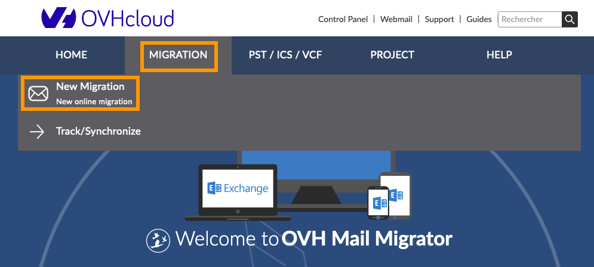
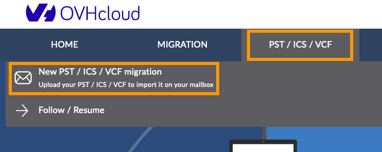
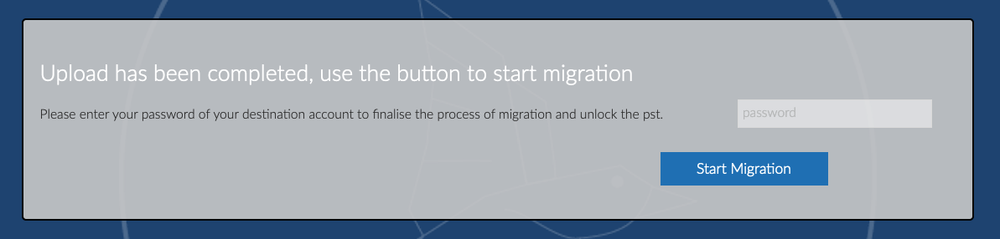

****Dernière mise à jour le 09/03/2020****

## Objectif

[OVH Mail Migrator](https://omm.ovh.net/){.external} (OMM) est un outil créé par OVHcloud. Il permet de migrer vos comptes e-mail d'un hébergeur à un autre. Le processus prend en charge différents types de contenus, tels que les e-mails, les contacts, les calendriers et les tâches, tant que ces derniers sont compatibles avec vos comptes e-mail OVHcloud. 

Ce guide décrit comment utiliser OMM pour importer les différents éléments de votre compte Gmail vers votre compte email OVHcloud.

**Apprenez à migrer votre compte Gmail vers un compte e-mail OVHcloud grâce à notre outil OMM.**

## Prérequis

- Disposer d'un service e-mail chez OVHcloud, tel qu'une [offre Exchange](https://www.ovh.com/fr/emails/){.external}, [E-mail Pro](https://www.ovh.com/fr/emails/email-pro/){.external} ou MX Plan (via l'offre MX Plan seule ou incluse dans une [offre d'hébergement web OVHcloud](https://www.ovh.com/fr/hebergement-web/){.external}).
- Disposer des identifiants relatifs aux comptes e-mail que vous souhaitez migrer (les comptes source).
- Disposer des identifiants relatifs aux comptes e-mail OVHcloud qui reçoivent les données migrées (les comptes de destination).

## En pratique

### Étape 1: migration des e-mails et dossiers

> [!primary]
> Pour que la migration soit possible, il faut activer le protocole IMAP sur votre compte Gmail. Pour cela, suivez le guide de Google
> [comment activer l'IMAP pour votre compte Gmail](https://support.google.com/mail/answer/7126229?hl=fr){.external}.

Une fois le protocole IMAP activé sur votre compte Gmail, rendez-vous sur [OMM](https://omm.ovh.net/){.external}.

Cliquez sur `Migration`{.action} puis `Nouvelle migration`{.action}.

{.thumbnail}

La fenêtre suivante apparait:

{.thumbnail}

Complétez les champs requis selon les indications des deux tableaux ci-dessous:

**Compte Source**

| Information            	| Description                                                                              	|
|------------------------	|------------------------------------------------------------------------------------------	|
| Type de serveur         	| Selectionnez **«IMAP»**  dans le menu déroulant.         									|
| URL du serveur          	| Saisissez **«imap.gmail.com»**.                       					 			  	|
| Login						| Renseignez votre adresse Gmail.															|
| Mot de passe				| Renseignez le mot de passe de votre adresse Gmail.										|

**Compte de destination**

| Information            	| Description                                                                              							|
|------------------------	|-------------------------------------------------------------------------------------------------------------------|
| Type de serveur         	| Selectionnez **«Hosted by OVH (Autodetect)»**  dans le menu déroulant.   											|
| URL du serveur          	| Le champ se complète automatiquement.                     					  		 							|
| Login						| Renseignez votre adresse e-mail OVHcloud.																			|
| Mot de passe				| Cliquez sur `détecter les paramètres`{.action} puis renseignez le mot de passe de votre adresse e-mail OVHcloud.	|

Dans la partie **«Options»**, cochez uniquement **«Mails»**, les autres options n'étant pas disponibles en IMAP. La migration des contacts et calendriers se fera aux étapes 2 et 3.

{.thumbnail}

Dans le cadre **«Information»**, vous pouvez renseignez une adresse e-mail sur laquelle vous serez notifié de l'avancement de la migration. Ce champ est facultatif. Cliquez ensuite sur `Démarer la migration`{.action}

{.thumbnail}

La fenêtre de suivi de migration (ci-dessous) s'affiche alors. Vous pouvez la laisser ouverte pour suivre la migration en direct ou fermer celle-ci, cela n'aura pas d'incidence sur la migration.

{.thumbnail}

> [!warning]
> Au lancement de la migration, vous pouvez rencontrez le message ci-dessous

{.thumbnail}

Dans ce cas de figure, rendez-vous dans la boite de réception de votre compte Gmail et vérifiez si vous avez reçu l'e-mail avec l'objet **«Alerte de sécurité critique»**. Il s'agit d'une mesure de sécurité mise en place par Gmail. Afin de résoudre cette situation, suivez le guide : [Comment autoriser les connexions moins sécurisées sur Gmail](https://docs.ovh.com/fr/microsoft-collaborative-solutions/migration-de-gmail-via-ovh-mail-migrator/securite-gmail){.external}

Après avoir **autorisé les «connexions moins sécurisées»** sur Gmail, vous pourrez relancer la migration.

### Étape 2: migration des calendriers

#### 2.1 récupérer une sauvegarde du calendrier sur Gmail

Pour importer votre calendrier vers votre compte OVHcloud, récupérez une sauvegarde de celui-ci depuis votre interface Gmail. Pour cela, suivez le guide officiel de Google :

[Comment exporter ses calendriers pour votre compte Gmail](https://support.google.com/calendar/answer/37111?hl=fr){.external}

Si vous avez plusieurs calendriers sur votre compte Gmail, vous téléchargerez un fichier d'archive à décompresser. Vous retrouverez chaque calendrier au format **.ics**.

#### 2.2 importer son calendrier via OMM

> [!primary]
> La migration des calendriers par OMM n'est compatible que vers les comptes Exchange.

Après avoir récupéré la sauvegarde de votre calendrier au format **.ics**, allez sur [OMM](https://omm.ovh.net/){.external}.

Dirigez-vous sur l'onglet `PST/ICS/VCF`{.action} en haut, puis cliquez sur `Nouvelle migration PST/ICS/VCF`{.action}.

{.thumbnail}

Complétez les champs demandés selon le tableau suivant puis cliquez sur `Démarrer la migration`{.action}:

| Information            	| Description                                                                              	|
|------------------------	|------------------------------------------------------------------------------------------	|
| Login                  	| Indiquez l'adresse e-mail OVHcloud vers laquelle vous migrez votre calendrier.           	|
| Mot de passe           	| Renseignez le mot de passe de l'adresse e-mail de destination.                          	|
| Email de communication 	| Renseignez une adresse e-mail qui servira à communiquer sur l'avancement de la migration et vous permettra de reprendre le téléchargement d'un fichier.	|

{.thumbnail}

 Cliquez sur `Choisir un fichier`{.action} pour récupérer, sur votre ordinateur, le fichier **.ics** de votre calendrier puis cliquez sur `Upload`{.action}.

{.thumbnail}

Renseignez alors le mot de passe de votre compte e-mail de destination puis cliquez sur `Démarrer la migration`{.action}.

{.thumbnail}

La fenêtre de suivi de migration (ci-dessous) s'affiche alors. Vous pouvez la laisser ouverte pour suivre la migration en direct ou fermer celle-ci, cela n'aura pas d'incidence sur la migration.

{.thumbnail}

### Étape 3: migration des contacts

> [!primary]
> La migration des contacts par OMM n'est compatible que vers les comptes Exchange.

Pour importer vos contacts vers votre compte OVHcloud, récupérez une sauvegarde de ces derniers depuis votre interface Gmail. Pour cela, suivez le guide officiel de Google :

[Comment exporter ses contacts pour votre compte Gmail](https://support.google.com/contacts/answer/7199294?hl=fr){.external}

> [!warning]
> L'export doit se faire au format vCard (**.vcf**) via l'interface Gmail. cette option vous est proposée à la fin de l'export.

{.thumbnail}

Complétez les champs demandés selon le tableau suivant puis cliquez sur `Démarrer la migration`{.action}:

| Information            	| Description                                                                              	|
|------------------------	|------------------------------------------------------------------------------------------	|
| Login                  	| Indiquez l'adresse e-mail OVHcloud vers laquelle vous migrez vos contacts.            	|
| Mot de passe           	| Renseignez le mot de passe de l'adresse e-mail de destination.                          	|
| Email de communication 	| Renseignez une adresse e-mail qui servira à communiquer sur l'avancement de la migration et vous permettra de reprendre le téléchargement d'un fichier.	|

{.thumbnail}

Cliquez sur `Choisir un fichier`{.action} pour récupérer, sur votre ordinateur, le fichier **.vcf** de vos contacts puis cliquez sur `Upload`{.action}.

{.thumbnail}

Renseignez alors le mot de passe de votre compte e-mail de destination puis cliquez sur `Démarrer la migration`{.action}.

{.thumbnail}

La fenêtre de suivi de migration s'affiche, vous pouvez laisser celle-ci ouverte pour suivre la migration en direct ou fermer celle-ci, cela n'aura pas d'incidence sur la migration.

{.thumbnail}

## Aller plus loin

[Comment autoriser les connexions moins sécurisées sur Gmail](https://docs.ovh.com/fr/microsoft-collaborative-solutions/migration-de-gmail-via-ovh-mail-migrator/securite-gmail){.external}.

Échangez avec notre communauté d'utilisateurs sur [https://community.ovh.com](https://community.ovh.com){.external}.
