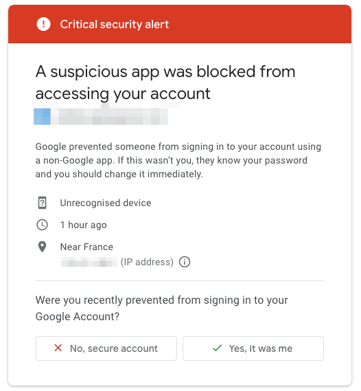
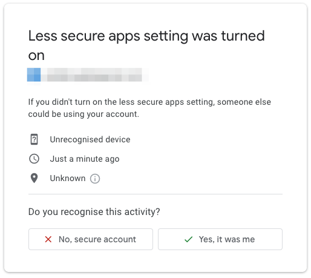
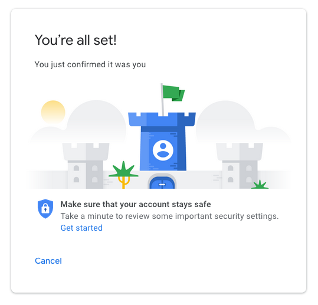

**Last updated 09th March 2020**

## Objective

This guide details how to enable the “authorise less secure apps” option on your Gmail account.

> [!primary] This documentation is a step linked to our guide on
> [Migrating a Gmail account to an OVHcloud email address via the OVH Mail Migrator.](https://docs.ovh.com/gb/en/microsoft-collaborative-solutions/migrate-gmail-via-ovh-mail-migrator){.external}

## Instructions

If you have received the email below with the subject **“Critical security alert**, click `View activity`{.action}.

{.thumbnail}

The message below will appear, listing details on the attempt to use a protocol outside of the Google application. Click `Yes, this was me`{.action}.

{.thumbnail}

The next window will inform you that in spite of this confirmation, the block will still be active. Click on the following link: [myaccount.google.com/lesssecureapps](https://myaccount.google.com/lesssecureapps){.external}

{.thumbnail}

Click on the toggle button to the right of “Allow less secure apps: OFF” (see below).

{.thumbnail}

You will receive a new email with the same subject — “Critical security alert”. click `View activity`{.action}.

{.thumbnail}

The purpose of this email is to check if it was you that turned on less secure app access. Click `Yes, this was me`{.action}.

{.thumbnail}

Once you have confirmed, the message below will show that your choice has been processed. You can now log in to your Gmail account outside of Google applications.

{.thumbnail}

## Go further

[Migrating a Gmail account to an OVHcloud email address via the OVH Mail Migrator](https://docs.ovh.com/gb/en/microsoft-collaborative-solutions/migrate-gmail-via-ovh-mail-migrator){.external}
