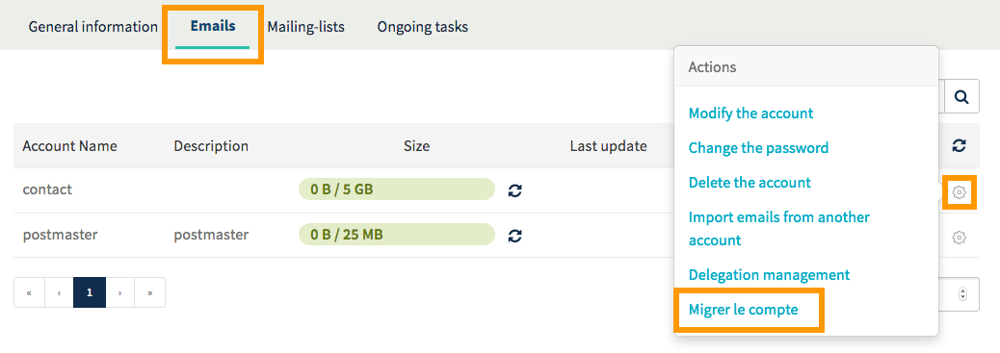
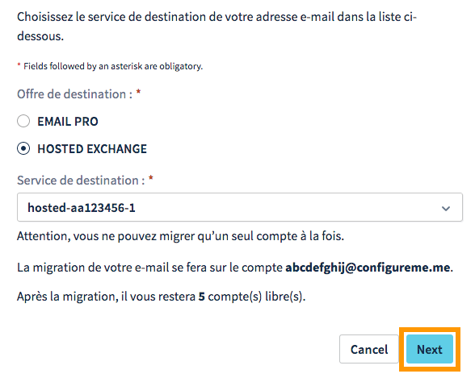
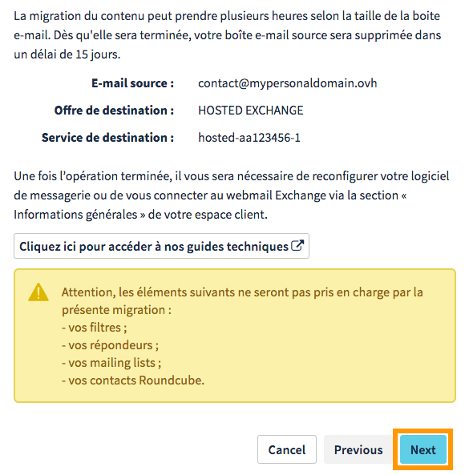
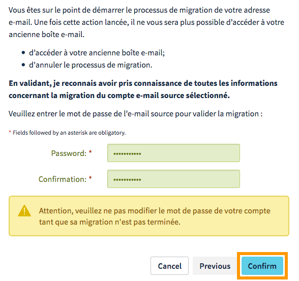

**Dernière mise à jour le 29/11/2017**

## Objectif

OVH propose plusieurs solutions e-mail : le MX Plan , vendu seul ou compris dans une offre d'hébergement web, E-mail Pro et Exchange. Ces dernières bénéficient de fonctionnalités propres et peuvent s'adapter à plusieurs usages. Vos besoins évoluent ? OVH met à votre disposition un outil de migration vous permettant de passer d'une solution à une autre.

**Apprenez comment migrer une adresse e-mail MX Plan vers un compte E-mail Pro ou Exchange.**

## Prérequis

- Disposer d'une adresse e-mail MX Plan (via l'offre MX Plan ou incluse dans une offre d'[hébergement web OVH](https://www.ovh.com/fr/hebergement-web/){.external}).
- Disposer d'un service [Hosted Exchange](https://www.ovh.com/fr/emails/hosted-exchange/){.external} ou [E-mail Pro](https://www.ovh.com/fr/emails/email-pro/){.external} avec au minimum un compte non configuré (qui apparaîtra sous la forme "@configureme.me").
- Ne pas avoir paramétré de redirection sur l'adresse e-mail MX Plan que vous souhaitez migrer.
- Être connecté à votre [espace client OVH](https://www.ovh.com/auth/?action=gotomanager){.external}.

## En pratique

### Étape 1 : délimiter votre projet

Les solutions E-mail Pro et Hosted Exchange disposent d'une base de fonctionnalités communes. Néanmoins, des différences subsistent dans les utilisations que vous pouvez avoir avec une offre plutôt qu'une autre. En choisissant une adresse Exchange, vous disposez de la totalité des fonctions collaboratives, comme la synchronisation du calendrier et des contacts. La solution E-mail Pro, quant à elle, en proposera quelques-unes mais celles-ci seront limitées à une utilisation via un webmail uniquement.

Avant de poursuivre, il est donc important de savoir vers quelle offre vous souhaitez migrer vos adresses e-mail MX Plan. Pour vous aider dans votre choix, consultez la page des [solutions e-mails professionnelles d'OVH](https://www.ovh.com/fr/emails/){.external} qui propose un comparatif détaillé des offres. Vous avez la possibilité de cumuler les solutions et donc d'utiliser pour un même nom de domaine un ou plusieurs comptes E-mail Pro et Exchange. Par ailleurs, si vous devez migrer plusieurs comptes, nous vous conseillons de mettre en place un plan de migration.

### Étape 2 : commander vos comptes E-mail Pro ou Exchange

Cette étape est facultative si :

- vous êtes déjà en possession de comptes ;
- vous disposez déjà d'un service Exchange ou E-mail Pro vers lequel vous effectuez cette migration.

Dans le cas contraire, pour réaliser la manipulation, connectez-vous à votre [espace client OVH](https://www.ovh.com/auth/?action=gotomanager){.external}, puis cliquez sur le bouton `Commander`{.action} dans la barre de services à gauche. Sélectionnez ensuite le service que vous voulez commander. Vous serez dirigé vers la page de commande. Suivez les différentes étapes, puis patientez jusqu'à l'installation effective du service. Un e-mail vous sera envoyé dès la fin de celle-ci.

### Étape 3 : réaliser une migration automatique

Afin que cette dernière se passe au mieux, vous devez avoir en votre possession quelques informations avant de l'effectuer. **Une fois la migration confirmée, vous ne pourrez plus accéder à votre ancienne adresse e-mail MX Plan ni annuler le processus de migration**.

De ce fait, nous vous conseillons vivement de :

- réaliser la migration à un horaire propice ;
- réaliser un export de votre carnet d'adresses pour les utilisateurs du webmail RoundCube. Vous pouvez vous aider de notre documentation : [Utilisation de RoundCube](https://docs.ovh.com/fr/emails/utilisation-roundcube/#exporter-votre-carnet-dadresses){.external}.

Même si vous ne pourrez plus accéder à votre adresse e-mail actuelle, les messages déjà réceptionnés ainsi que ceux reçus ne seront pas perdus et immédiatement accessibles depuis votre nouveau compte. Nous vous rappelons également que le délai de migration dépend de la quantité de contenu à migrer vers votre nouveau compte. Celui-ci peut varier de quelques minutes à plusieurs heures.

Une fois que vous êtes prêt, la migration peut se réaliser depuis deux interfaces :

- **celle de l'assistant de configuration Hosted Exchange** : peut être utilisée uniquement si vous venez de commander un service Hosted Exchange et que vous n'avez encore rien paramétré sur ce dernier ;
- **celle du MX Plan** : peut être utilisée dès que vous êtes en possession d'un service E-mail Pro ou Exchange (déjà configuré ou non).

#### Migration depuis l'assistant de configuration Hosted Exchange

Pour y accéder, sélectionnez dans l'[espace client OVH](https://www.ovh.com/auth/?action=gotomanager){.external} le service concerné dans la barre de services à gauche. L'assistant devrait apparaître et vous aider à la configuration de votre nouveau service Hosted Exchange. Durant ce processus, vous pourrez sélectionner les comptes e-mails MX Plan à migrer.

Si l'assistant de configuration ne s'affiche pas, les informations générales du service Hosted Exchange apparaîtront à la place. Dans ce cas, vous devrez réaliser la migration de vos comptes via l'interface MX Plan.

#### Migration depuis l'interface MX Plan

Pour réaliser la migration depuis cette interface, rendez-vous dans la section `E-mails`{.action} dans la barre de services à gauche de votre espace client OVH, puis sur le service portant le nom de domaine de vos adresses e-mail. Cliquez maintenant sur le logo en forme de roue dentée sur la ligne du compte e-mail concerné (également appelé compte source) puis sur `Migrer le compte`{.action}.

{.thumbnail}

Dans la fenêtre qui s'affiche, sélectionnez l'offre de destination (le choix que vous avez fait lorsque vous avez défini votre projet), puis le service de destination (que vous possédez déjà ou que vous venez de commander).

Si le service sélectionné ne possède pas de compte disponible pour la migration, un bouton `Commander des comptes`{.action} apparaîtra. Cliquez dessus, suivez les étapes de commande, puis patientez le temps que les comptes soient installés pour effectuer de nouveau la manipulation.

A contrario, si vous possédez déjà un compte, ce dernier apparaîtra dans le récapitulatif en bas de la fenêtre. Celui-ci correspond toujours à un compte non paramétré sur le service choisi. Cliquez sur `Suivant`{.action} pour poursuivre la manipulation.

{.thumbnail}

La page suivante affiche un récapitulatif des informations renseignées. Nous vous invitons à vérifier ces dernières, puis à cliquer sur `Suivant`{.action}.

{.thumbnail}

Sur la page qui s'affiche ensuite, prenez quelques instants pour lire les informations affichées, renseigner le mot de passe de l'adresse e-mail source (celle que vous voulez migrer), puis cliquez sur `Confirmer`{.action}. Cette manipulation sera à répéter autant de fois que nécessaire pour la migration d'autres comptes.

{.thumbnail}

### Étape 4 : vérifier ou modifier la configuration de votre domaine

À cette étape, vos adresse e-mail doivent avoir été migrées et être déjà fonctionnelles. De plus, nous vous invitons à vous assurer que la configuration de votre domaine est correcte en consultant votre espace client.

Pour cela, sélectionnez le service E-mail Pro ou Exchange concerné dans la barre de services à gauche, puis rendez-vous sur l'onglet `Domaines associés`{.action}. Dans le tableau qui s'affiche, la colonne "Diagnostic" vous permettra de voir si la configuration DNS est correcte. Une pastille rouge apparaîtra pour vous indiquer que la configuration doit être modifiée.

> [!primary]
>
> Si vous venez juste de réaliser la migration ou si vous venez de modifier un enregistrement DNS de votre domaine, il se peut que l’affichage dans l’[espace client OVH](https://www.ovh.com/auth/?action=gotomanager){.external} se mette à jour sous quelques heures.
>

Pour modifier la configuration, cliquez sur la pastille rouge et réalisez la manipulation demandée. Cette dernière nécessite un temps de propagation de 4 à 24 heures maximum avant d’être pleinement effective.

{.thumbnail}

### Étape 5 : utiliser vos adresses e-mail migrées

Il ne vous reste plus qu’à utiliser vos adresses e-mail migrées. Pour cela, OVH met à disposition un applicatif en ligne (une WebApp). Ce dernier est accessible à l’adresse [https://mail.ovh.net/](https://mail.ovh.net/){.external} où vous devrez y renseigner les identifiants relatifs à votre adresse e-mail.

Si vous aviez configuré l'un des comptes migrés sur un client de messagerie (comme Outlook), vous devrez de nouveau le configurer. Les informations de connexion au serveur OVH ont changé suite à la migration. Pour vous aider dans vos manipulations, consultez notre documentation depuis la section des guides consacrés à E-mail Pro : [https://docs.ovh.com/fr/emails-pro/](https://docs.ovh.com/fr/emails-pro/){.external} et celle dédiée à Hosted Exchange : [https://docs.ovh.com/fr/microsoft-collaborative-solutions/](https://docs.ovh.com/fr/microsoft-collaborative-solutions/){.external}. Si vous n'êtes pas en mesure de reconfigurer le compte dans l'immédiat, l'accès via l'applicatif en ligne est toujours possible.

> [!primary]
>
> Vous avez également la possibilité de migrer manuellement des adresses e-mail vers OVH en utilisant notre outil [OVH Mail Migrator (OMM)](https://omm.ovh.net/){.external}. Pour cela, vous devrez être en possession des informations (utilisateur, mot de passe, serveurs) de l'e-mail source et de destination pour réaliser une migration via cet outil. 
>

## Aller plus loin

[Utilisation de RoundCube](https://docs.ovh.com/fr/emails/utilisation-roundcube/){.external}

Échangez avec notre communauté d'utilisateurs sur [https://community.ovh.com](https://community.ovh.com){.external}.