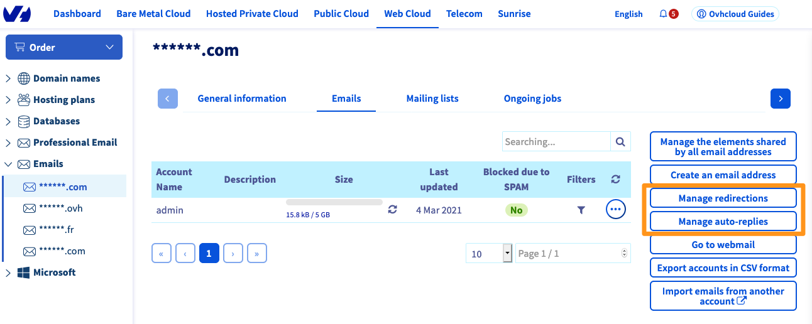
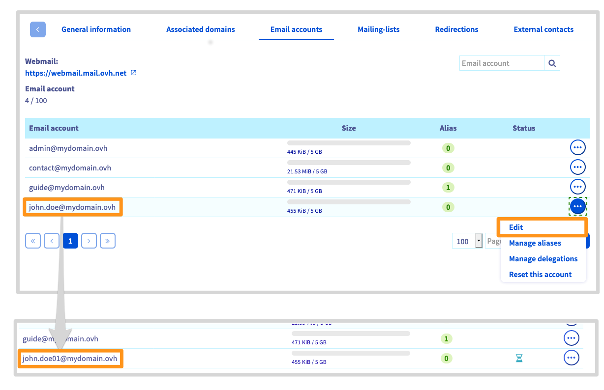
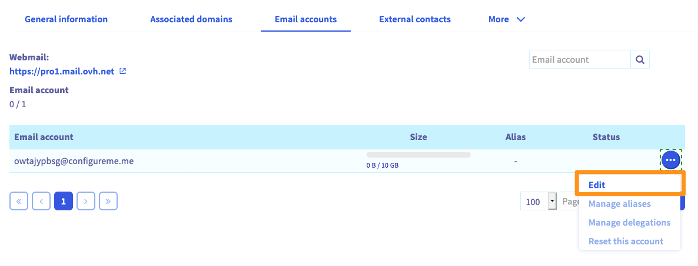
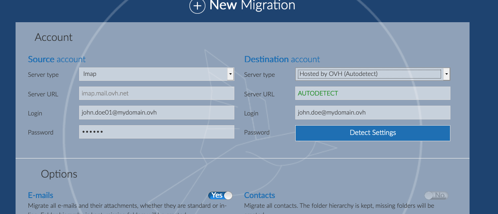
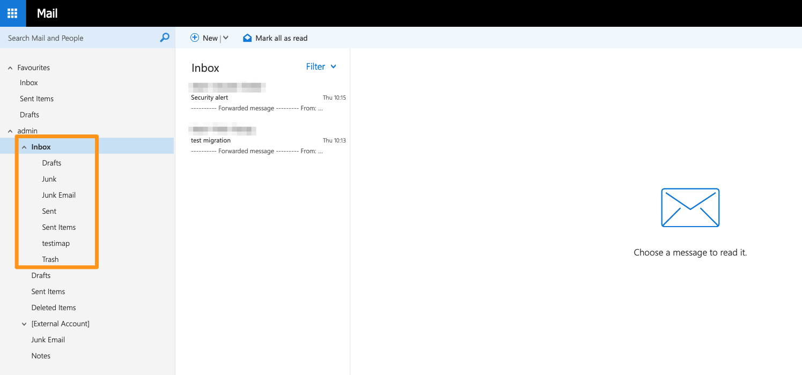

**Ostatnia aktualizacja z dnia 22-02-2022**

> [!primary]
> Tłumaczenie zostało wygenerowane automatycznie przez system naszego partnera SYSTRAN. W niektórych przypadkach mogą wystąpić nieprecyzyjne sformułowania, na przykład w tłumaczeniu nazw przycisków lub szczegółów technicznych. W przypadku jakichkolwiek wątpliwości zalecamy zapoznanie się z angielską/francuską wersją przewodnika. Jeśli chcesz przyczynić się do ulepszenia tłumaczenia, kliknij przycisk „Zaproponuj zmianę” na tej stronie.
> 

## Wprowadzenie

OVHcloud oferuje kilka rozwiązań poczty elektronicznej: MX Plan (sprzedawany samodzielnie lub zawarty w ofercie hostingu), E-mail Pro i Exchange. Korzystają one z własnych funkcji i mogą być dostosowane do wielu zastosowań. Twoje potrzeby zmieniają się? OVHcloud udostępnia Ci narzędzie migracji umożliwiające przejście z jednego rozwiązania na drugie.

**Dowiedz się, jak przenieść konto e-mail MX Plan na konto E-mail Pro lub Exchange.**

## Wymagania początkowe

- Posiadanie konta e-mail MX Plan (w ramach pakietu MX Plan lub zawartego w pakiecie [hostingowym OVHcloud](https://www.ovhcloud.com/pl/web-hosting/){.external})
- Posiadanie usługi [Exchange](https://www.ovhcloud.com/pl/emails/hosted-exchange/){.external} lub [E-mail Pro](https://www.ovhcloud.com/pl/emails/email-pro/){.external} z co najmniej jednym nieskonfigurowanym kontem (pojawiającym się w postaci "@configureme.me")
- **Nie skonfigurowałeś przekierowania na adres e-mail MX Plan, który chcesz przenieść.**
- Dostęp do [Panelu klienta OVHcloud](https://www.ovh.com/auth/?action=gotomanager&from=https://www.ovh.pl/&ovhSubsidiary=pl){.external}.

## W praktyce

### Etap 1: określenie ram projektu

Rozwiązania E-mail Pro i Exchange mają wspólną bazę funkcjonalności. Niemniej jednak nadal występują różnice w zależności od zastosowania. Wybierając adres Exchange, dysponujesz wszystkimi funkcjami do pracy zespołowej, takimi jak synchronizacja kalendarza i kontaktów. Niektóre z nich są dostępne w ofercie E-mail Pro, ale są one ograniczone do korzystania wyłącznie z poczty webmail.

Zanim przejdziesz dalej, ważne jest, aby wiedzieć, na jaką ofertę chcesz przenieść Twoje konta e-mail MX Plan. Aby pomóc w wyborze tej opcji, zapoznaj się ze stroną firmowych [rozwiązań poczty elektronicznej OVHcloud](https://www.ovhcloud.com/pl/emails/){.external}, na której znajdziesz szczegółowe porównanie ofert. Możesz łączyć rozwiązania i używać dla tej samej domeny jednego lub kilku kont E-mail Pro i Exchange. Jeśli chcesz migrować kilka kont, zalecamy wdrożenie planu migracji.

### Etap 2: zamów konta E-mail Pro lub Exchange

Ten etap jest opcjonalny, jeśli posiadasz już usługę Exchange lub E-mail Pro, do której chcesz przeprowadzić migrację.

W przeciwnym razie zaloguj się do [Panelu klienta OVHcloud](https://www.ovh.com/auth/?action=gotomanager&from=https://www.ovh.pl/&ovhSubsidiary=pl) i zamów usługę E-mail Pro lub Exchange. Postępuj zgodnie z kolejnymi instrukcjami, następnie zaczekaj aż usługa zostanie zainstalowana. Otrzymasz e-mail z końcem abonamentu.

> [!primary]
>
> Po zamówieniu konta zostaw go jako "@configureme.me". Nazwa konta zostanie zmieniona podczas migracji.
>

### Etap 3: Migracja

Przed rozpoczęciem migracji określ wersję programu MXPlan, z której chcesz wykonać migrację.

W tym celu zaloguj się do [Panelu klienta OVHcloud](https://www.ovh.com/auth/?action=gotomanager&from=https://www.ovh.pl/&ovhSubsidiary=pl){.external}, część `Web Cloud`{.action}. Kliknij `E-maile`{.action}, po czym wybierz odpowiednią usługę. Przejdź do wersji, którą posiadasz, odnosząc się do poniższej tabeli.

|Poprzednia wersja usługi MX Plan|Nowa wersja usługi MX Plan|
|---|---|
|{.thumbnail}  Oferta mieści się w sekcji "Abonament"|{.thumbnail} Odnajdziesz `Oznaczenie serwera` w polu "Podsumowanie", które rozpoczyna się od "mxplan-"|
|Przejdź do [Starszej wersji usługi MX Plan](#VersionHistoriqueMxplan)|Przejdź do [Nowej wersji usługi MX Plan](#NouvelleVersionMxplan)|

#### 3.1 Migracja historycznej oferty MXPlan 

> [!primary]
>
> Twoje konto OVHcloud musi być wcześniej kontaktem administracyjnym i technicznym z usługi E-mail Pro lub Exchange, do której możesz się przenieść.
>
> Aby uzyskać więcej informacji na temat zmian kontaktów, zapoznaj się z naszym przewodnikiem dotyczącym [zarządzania kontaktami swoich usług](../../customer/zarzadzanie_kontaktami/).
>

Migracja może zostać przeprowadzona z dwóch interfejsów: 

- **adres asystenta konfiguracji Hosted Exchange**, tylko jeśli zamówiłeś usługę Hosted Exchange i nie skonfigurowałeś jeszcze usługi Hosted Exchange;
- **adres MX Plan**, jeśli posiadasz usługę E-mail Pro lub Exchange (skonfigurowaną lub nie) oraz adres MX Plan, który chcesz przenieść.

> Przypominamy, że przed rozpoczęciem migracji upewnij się, że na serwerze MXplan nie ma **przekierowania** lub żadna **autoresponder**.
> {.thumbnail}

Kiedy wszystko jest gotowe, przejdź do opisu operacji w wybranym interfejsie. Przypominamy, że czas migracji zależy od ilości treści, które chcesz przenieść na nowe konto. Może się on różnić od kilku minut do kilku godzin.

> [!warning]
>
> Po potwierdzeniu migracji nie będziesz mógł uzyskać dostępu do starego konta e-mail MX Plan ani anulować procesu migracji. Zalecamy przeprowadzenie tej operacji w odpowiednim czasie.
>
> Nawet jeśli nie będziesz miał dostępu do Twojego aktualnego adresu e-mail, już odebrane wiadomości i otrzymane wiadomości nie zostaną utracone. Wszystkie konta będą natychmiast dostępne.
>

##### **Migracja z poziomu asystenta konfiguracji Exchange**

Aby się do niego zalogować, wybierz w [Panelu klienta](https://www.ovh.com/auth/?action=gotomanager&from=https://www.ovh.pl/&ovhSubsidiary=pl){.external} odpowiednią usługę. Należy pojawić się asystent, który pomoże Ci w skonfigurowaniu nowej usługi Exchange. Podczas tego procesu będziesz mógł wybrać konta e-mail MX Plan, które chcesz przenieść.

Jeśli asystent konfiguracji nie wyświetla się, wyświetlą się ogólne informacje o usłudze Exchange. W takim przypadku będziesz musiał przeprowadzić migrację Twoich kont za pomocą interfejsu MX Plan.

##### **Migracja z poziomu interfejsu MX Plan**

Aby przeprowadzić migrację w tym interfejsie, przejdź do sekcji `E-maile`{.action} Panelu klienta OVHcloud. Wybierz usługę noszącą nazwę domeny Twoich kont e-mail. Kliknij logo w kształcie koła zębatego na linii odpowiedniego konta e-mail (zwane również kontem źródłowym), a następnie kliknij `Migracja konta`{.action}.

{.thumbnail}

W oknie, które się wyświetla wybierz usługę docelową (do której chcesz przenieść adres) i kliknij `Dalej`{.action}. Jeśli posiada co najmniej jedno "wolne" konto (tj. jeszcze nie skonfigurowane), migracja zostanie przeprowadzona na jedno z tych kont. Zapoznaj się z informacjami, które się wyświetlą, zatwierdź je, następnie kliknij `Dalej`{.action}, aby kontynuować operację.

Jeśli nie posiadasz "wolnego" konta, pojawi się przycisk `Zamów konta`{.action}. Postępuj zgodnie z instrukcjami, następnie odczekaj, aż konta zostaną zainstalowane, aby ponownie przeprowadzić operację.

Następnie potwierdź hasło do źródłowego konta e-mail (które chcesz przenieść), następnie kliknij `Migracja`{.action}. Operacja ta zostanie powtórzona tyle razy, ile będzie to konieczne do migracji innych kont.

{.thumbnail}

#### 3.2 Przeniesienie nowej wersji MXPlan 

> [!warning]
>
> Jeśli właśnie zamówiłeś nową ofertę e-mail, przed rozpoczęciem migracji dodaj najpierw nazwę domeny do platformy e-mail.   - *Na przykład, aby przenieść konto "myemail@mydomain.ovh", należy dodać do swojej platformy nazwę domeny "mydomain.ovh".*
>
>Wybierz kartę `Powiązane domeny`{.action} na Twojej platformie, następnie kliknij `Dodaj domenę`{.action}. Po dodaniu domeny upewnij się, że w kolumnie `Status` znajduje się nazwa `OK`.
>
>{.thumbnail}
>
> Aby uzyskać więcej informacji na temat dodania domeny, sprawdź [przewodnik E-mail Pro](https://docs.ovh.com/pl/emails-pro/pierwsza-konfiguracja-email-pro/#etap-2-dodanie-domeny) lub [przewodnik Exchange](https://docs.ovh.com/pl/microsoft-collaborative-solutions/dodanie-domeny-exchange/).

Migracja MXPlan przebiega 3 etapach. **Zmień nazwę**, **Utwórz** i **Migracja**.

{.thumbnail}

1\. **Zmień nazwę** konta MXPlan, które chcesz przenieść, używając tymczasowej nazwy (na przykład: aby przenieść konto MX plan *john.smith@mydomain.ovh*, zmień nazwę konta na *john.smith01@mydomain.ovh*).

W zakładce `Konta e-mail`{.action} na Twojej platformie MX Plan kliknij przycisk `...`{.action}, a następnie `Zmień`{.action}.

{.thumbnail}

> [!primary]
>
> Modyfikacja konta nie jest natychmiastowa. Prosimy o cierpliwość do końca operacji, zanim przejdziesz do kolejnego etapu.

2\. **Utwórz** konto e-mail na nowym koncie w Twojej platformie E-mail Pro lub Exchange (w powyższym przykładzie utworzysz zatem *john.smith@mydomain.ovh* na nowej platformie).

W zakładce `Konta e-mail`{.action} na Twojej platformie E-mail Pro lub Exchange kliknij przycisk `...`{.action}, a następnie `Zmień`{.action}.

{.thumbnail}

3\. **Przenieś** konto MXPlan na konto nowej platformy za pomocą narzędzia [OMM](https://omm.ovh.net/) (OVH Mail Migrator).

Aby uzyskać więcej informacji na temat narzędzia OMM, zapoznaj się z naszym przewodnikiem [Migracja kont e-mail przez OVH Mail Migrator](../exchange-migracja-kont-e-mail-ovh-mail-migrator/).

{.thumbnail}

Czas migracji zależy od ilości treści, które chcesz przenieść na nowe konto. Może się on różnić od kilku minut do kilku godzin.

Po przeprowadzeniu migracji sprawdź, czy Twoje dane znajdują się na stronie WWW pod adresem <https://www.ovh.com/pl/mail/>

Po przeprowadzeniu migracji możesz zachować lub usunąć konto źródłowe, używając tymczasowej nazwy.

Jeśli chcesz go usunąć, przejdź do zakładki `Konta e-mail`{.action} MXPlan, kliknij przycisk `...`{.action}, a następnie  `Zresetuj to konto`{.action}.

### Etap 4: sprawdź lub zmodyfikuj konfigurację domeny

Na tym etapie Twoje konta e-mail muszą być migrowane i działać. Ze względów bezpieczeństwa sprawdź, czy konfiguracja Twojej domeny jest poprawna, sprawdzając w Panelu klienta.

W tym celu wybierz odpowiednią usługę E-mail Pro lub Exchange, następnie przejdź do zakładki Powiązane `domeny`{.action}. W tabeli, która się wyświetla, w kolumnie "Diagnostyka" możesz sprawdzić, czy konfiguracja DNS jest prawidłowa: czerwony przycisk pojawia się, jeśli konfiguracja wymaga zmiany.

> [!primary]
>
> Jeśli właśnie przeprowadziłeś migrację lub zmodyfikowałeś rekord DNS Twojej domeny, aktualizacja może potrwać kilka godzin, jeśli wyświetlenie się w [Panelu klienta OVHcloud](https://www.ovh.com/auth/?action=gotomanager&from=https://www.ovh.pl/&ovhSubsidiary=pl){.external}.
>

Aby zmienić konfigurację, kliknij czerwony przycisk i wykonaj żądaną operację. Efekty modyfikacji domeny staną się widoczne po upływie 4-24 godzin ze względu na niezbędny czas propagacji.

{.thumbnail}

### Etap 5: korzystać z migrowanych kont e-mail

Teraz możesz korzystać z migrowanych kont e-mail. W tym celu OVHcloud udostępnia aplikację online (_web app_) dostępną pod adresem <https://www.ovh.com/pl/mail/>. Wpisz dane dostępowe do Twojego konta e-mail.

Jeśli skonfigurowałeś jedno z kont przeniesionych na klienta poczty elektronicznej (np. Outlook), należy ponownie skonfigurować to konto. Dane do logowania do serwera OVHcloud zmieniły się po migracji. Aby pomóc Ci w przeprowadzeniu operacji, zapoznaj się z naszą dokumentacją w sekcjach przewodników dotyczących [E-mail Pro](../../emails-pro/) i [Hosted Exchange](../). Jeśli nie jesteś w stanie zmienić konfiguracji konta w tej chwili, dostęp przez aplikację online jest zawsze możliwy.

### Organizacja zawartości Twoich kont e-mail po migracji 

Podczas pierwszego logowania do nowego konta e-mail migrowane treści mogą być częściowo ukryte. Aby wyświetlić wszystkie elementy, w interfejsie Webmail kliknij przycisk "Przywozie" obok `Skrzynki odbiorczej`, aby wyświetlić podfoldery. Powinna pojawić się przeniesiona zawartość Twojego starego konta e-mail.

{.thumbnail}

Domyślne katalogi, takie jak "elementy wysłane" lub "kosz", są wyświetlane w języku angielskim ("Sent items" i "Trash"), z wyjątkiem utworzonych przez Ciebie katalogów.

Po przeprowadzeniu migracji sprawdź wszystkie foldery i podfoldery Twojego konta, aby upewnić się, że wszystkie elementy są dostępne.

### Migracja Ręczna

Możesz również ręcznie przenieść Twoje konta e-mail do nowej usługi e-mail OVHcloud używając tylko programu pocztowego. Skorzystaj z naszego przewodnika [Ręczna migracja Twojego konta e-mail](../../emails/przenoszenie-kont-e-mail/). Zalecamy jednak, abyś stosował tę metodę tylko wtedy, gdy podstawowe metody nie są możliwe.

## Sprawdź również

[Zarządzanie kontaktami swoich usług](../../customer/zarzadzanie_kontaktami/){.external}.

[Przewodniki E-mail Pro](../../emails-pro/){.external}.

[Przewodniki Exchange](../../microsoft-collaborative-solutions/){.external}.

Przyłącz się do społeczności naszych użytkowników na stronie <https://community.ovh.com/en/>.
