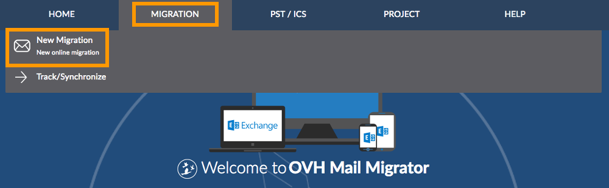
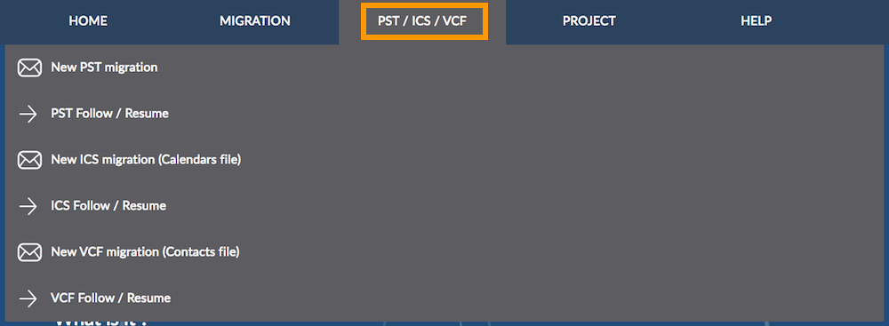
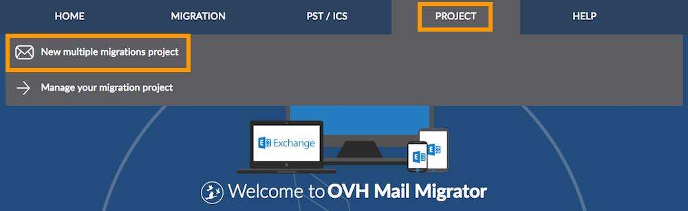

**Dernière mise à jour le 08/03/2018**

## Objectif

[OVH Mail Migrator](https://omm.ovh.net/){.external} est un outil créé par OVH. Il permet de migrer vos comptes e-mail vers vos adresses e-mail OVH. Le processus prend en charge différents types de contenus, tels que les e-mails, les contacts, les calendriers et les tâches, tant que ces derniers sont compatibles avec vos adresses e-mails.

**Apprenez à migrer vos comptes e-mail vers OVH grâce à notre outil OVH Mail Migrator.**

## Prérequis

- Disposer d'un service e-mail chez OVH, tel qu'une offre [Exchange](https://www.ovh.com/fr/emails/){.external}, [E-mail Pro](https://www.ovh.com/fr/emails/email-pro/){.external} ou MX Plan (via l'offre MX Plan ou incluse dans une offre d'[hébergement web OVH](https://www.ovh.com/fr/hebergement-web/){.external}).
- Disposer des identifiants relatifs aux comptes e-mail que vous souhaitez migrer (les comptes source).
- Disposer des identifiants relatifs aux comptes e-mail OVH qui reçoivent les données migrées (les comptes de destination).

## En pratique

[OVH Mail Migrator](https://omm.ovh.net/){.external} est accessible depuis la page <https://omm.ovh.net/>. Il gère trois types de migrations et permet de les suivre.

|Type de migration|Description|
|---|---|
|Migration unique|Migre le contenu d'une adresse e-mail vers une autre adresse e-mail. Cette solution est recommandée pour migrer une ou quelques adresses (les étapes doivent être répétées pour chaque adresse migrée).|
|Migration par fichier|Migre le contenu d'une adresse e-mail, récupéré au préalable dans un fichier, vers une autre adresse e-mail. Les formats PST, ICS et VCF sont ici pris en charge.|
|Migration multiple (mode projet)|Permet de gérer plusieurs migrations en un seul projet. Cette solution s'adresse aux personnes souhaitant migrer un nombre conséquent d'adresses.|

Poursuivez la lecture de cette documentation selon la migration la plus appropriée à votre projet.

### Réaliser une migration unique

Connecté à la page <https://omm.ovh.net/>, passez votre souris sur l'onglet `Migration`{.action} dans la barre de menu en haut de la page puis cliquez sur `Nouvelle migration`{.action}.

{.thumbnail}

Sur la page qui s'affiche, complétez maintenant les informations pour chaque partie.

- **Compte** : renseignez les informations du **compte source** et du **compte de destination**. Pour rappel, le contenu du **compte source** sera migré vers le **compte de destination**.

|Information|Description|
|---|---|
|Type de serveur|Sélectionnez le type de serveur correspondant à vos comptes. Si l'un d'eux est une adresse OVH, **Hosted by OVH (Autodetect)** peut vous permettre de compléter automatiquement des informations.|
|URL du serveur|Renseignez l'adresse du serveur où sont hébergés vos comptes. Ce champ peut être complété automatiquement lors du choix du type de serveur.|
|Login|Indiquez l'adresse e-mail complète de vos comptes.|
|Compte administrateur avec délégation|Ce champ apparaît uniquement avec certains types de serveurs.|
|Mot de passe|Renseignez le mot de passe de vos comptes.|

- **Options** : sélectionnez les éléments que vous souhaitez migrer. Certains contenus peuvent être indisponibles selon le type de serveur choisi auparavant.

- **Informations** : renseignez une adresse e-mail qui recevra des notifications quant à l'avancement de la migration.

Cliquez sur le bouton `Démarrer la migration`{.action} une fois les informations complétées. Si ces dernières sont correctes, le processus débutera.

La page qui apparaît alors détaille le suivi de la migration. Pensez à conserver l'`Identifiant de migration`{.action} affiché et patientez jusqu'à ce que le processus arrive à son terme ; ce délai est variable selon le nombre d'éléments à migrer. Si vous souhaitez accéder de nouveau à ce suivi, poursuivez vers la section « Suivre une migration unique » ci-dessous.

### Suivre une migration unique

Il existe deux chemins pour accéder au suivi d'une migration unique :

- depuis l'e-mail reçu vous notifiant que la migration a débuté ;
- depuis la page de l'outil <https://omm.ovh.net/>, en passant votre souris sur l'onglet `Migration`{.action} dans la barre de menu en haut de la page puis en cliquant sur `Suivre / Synchroniser`{.action}. Vous devrez renseigner alors l'`Identifiant de migration`{.action} ainsi que le `Compte source`{.action} concerné.

{.thumbnail}

La page qui s'affiche vous permet de suivre l'avancement de votre migration. Un message vous indique si le processus va débuter, est en cours ou est terminé. Selon cet état, plusieurs interactions sont possibles :

|Action|Description|
|---|---|
|Stopper le processus|Permet d'annuler la migration. Les éléments déjà migrés seront conservés sur le compte de destination.|
|Supprimer les éléments migrés|Permet de supprimer des éléments déjà migrés vers le compte de destination. Vous pouvez effacer des éléments à partir d'un point de synchronisation précis.|
|Synchroniser|Permet de récupérer des nouveaux éléments non migrés lors d'une précédente synchronisation entre le compte source et le compte de destination. Nous considérons cette action comme une migration des éléments manquants sur le compte de destination par rapport au compte source.|

### Réaliser une migration par fichier

Connecté à la page <https://omm.ovh.net/>, passez votre souris sur l'onglet `PST / ICS / VCF`{.action} dans la barre de menu en haut de la page puis, selon la migration que vous souhaitez réaliser, cliquez sur `Nouvelle migration PST`{.action}, `Nouvelle migration ICS`{.action} ou `Nouvelle migration VCF`{.action}.

Ici, vous devez être en possession du fichier comportant le contenu que vous souhaitez migrer.

{.thumbnail}

Sur la page qui s'affiche, complétez les informations du **compte de destination** puis cliquez sur le bouton `Démarrer la migration`{.action}. Pour rappel, le contenu du fichier PST, ICS ou VCF sera migré vers le **compte de destination**.

Si les informations renseignées sont correctes, vous serez invité à sélectionner le fichier sur votre ordinateur. Ensuite, appuyez sur le bouton `Upload`{.action} et patientez pendant le téléchargement ; ceci peut prendre un certain temps selon la taille du fichier. Vous pouvez consulter l'état d'avancement du téléchargement depuis la présente page.

Une fois le fichier téléchargé, renseignez de nouveau le mot de passe du **compte de destination** puis cliquez sur `Démarrer la migration`{.action}. Si les informations indiquées sont correctes, vous pourrez lancer la migration en appuyant de nouveau sur le bouton `Démarrer la migration`{.action}.

La page qui apparaît alors détaille le suivi de la migration. Pensez à conserver l'`Identifiant de migration`{.action} affiché et patientez jusqu'à ce que le processus arrive à son terme ; ce délai est variable selon le nombre d'éléments à migrer. Si vous souhaitez accéder de nouveau à ce suivi, poursuivez vers la section « Suivre une migration par fichier » ci-dessous.

### Suivre une migration par fichier

Il existe deux chemins pour accéder au suivi d'une migration par fichier PST, ICS ou VCF :

- depuis l'e-mail reçu vous notifiant que la migration a débuté ;

- depuis la page de l'outil <https://omm.ovh.net/>, en passant votre souris sur l'onglet `Migration`{.action} dans la barre de menu en haut de la page puis en cliquant sur `Suivre / Synchroniser`{.action}. Vous devrez renseigner alors l'`Identifiant de migration`{.action} ainsi que le `Compte de destination`{.action} concerné.

{.thumbnail}

La page qui s'affiche vous permet de suivre l'avancement de votre migration. Un message vous indique si le processus va débuter, est en cours ou est terminé. Selon cet état, plusieurs interactions sont possibles :

|Action|Description|
|---|---|
|Stopper le processus|Permet d'annuler la migration. Les éléments déjà migrés seront conservés sur le compte de destination.|
|Supprimer les éléments migrés|Permet de supprimer les éléments migrés vers le compte de destination.|

### Réaliser et suivre une migration multiple (mode projet)

Connecté à la page <https://omm.ovh.net/>, passez votre souris sur l'onglet `Projet`{.action} dans la barre de menu en haut de la page puis cliquez sur `Nouveau projet de migrations multiples`{.action}.

{.thumbnail}

Sur la page qui s'affiche, complétez les informations du **Nouveau projet** :

|Information|Description|
|---|---|
|Nom|Définissez un nom à votre projet de migration.|
|Mot de passe|Définissez un mot de passe à votre projet, afin de le gérer depuis l'outil OVH Mail Migrator.|
|E-mail|Renseignez une adresse e-mail qui recevra des notifications quant à l'avancement de votre projet de migration.|

Cliquez ensuite sur `Créer le projet`{.action}. La page qui apparaît alors vous permet de gérer et de suivre votre projet de migration. Pensez à conserver l'**identifiant du projet** affiché.

Vous pouvez à présent commencer vos migrations de comptes. Pour cela, plusieurs onglets sont accessibles :

|Onglet|Description|
|---|---|
|Continuer|Permet de suivre l'avancement des migrations de votre projet. Un bouton vous offre également la possibilité de mettre en attente et de reprendre des migrations.|
|Création multiple|Permet d'ajouter dans la file d'attente plusieurs migrations grâce à l'import d'un fichier (CSV ou Excel). Ce dernier doit respecter un formatage précis ; nous vous recommandons d'utiliser les modèles fournis.|
|Ajouter|Permet d'ajouter compte par compte des migrations dans la file d'attente. Vous pourrez cependant conserver les serveurs source et de destination en tant que valeur par défaut.|
|Options|Permet de personnaliser les éléments que l'outil OVH Mail Migrator doit migrer ainsi que le nombre de requêtes simultanées que l'outil peut effectuer lorsqu'il réalise les migrations.|
|Déconnexion|Permet de vous déconnecter de la page de suivi du projet ; cela vous offre la possibilité de vous identifier pour suivre un éventuel autre projet de migration.|

Si vous souhaitez accéder de nouveau au suivi de votre projet de migration, connectez-vous à la page <https://omm.ovh.net/>, passez votre souris sur l'onglet `Projet`{.action} dans la barre de menu en haut de la page, puis cliquez sur `Suivre un projet`{.action}. Vous devrez renseigner alors l'`Identifiant du projet de migration`{.action} ainsi que le `Mot de passe`{.action} associé à ce dernier.

## Aller plus loin

Échangez avec notre communauté d'utilisateurs sur <https://community.ovh.com>.