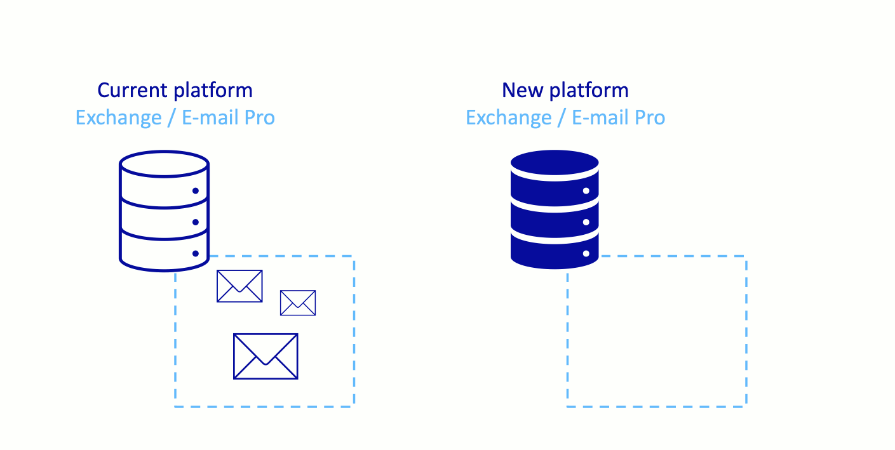
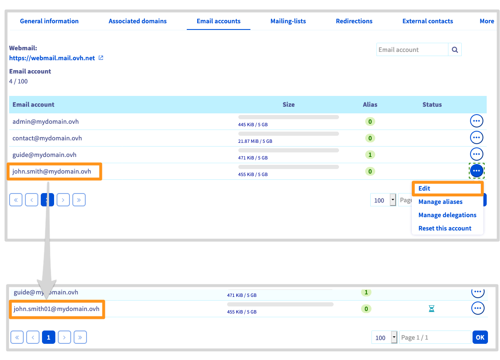
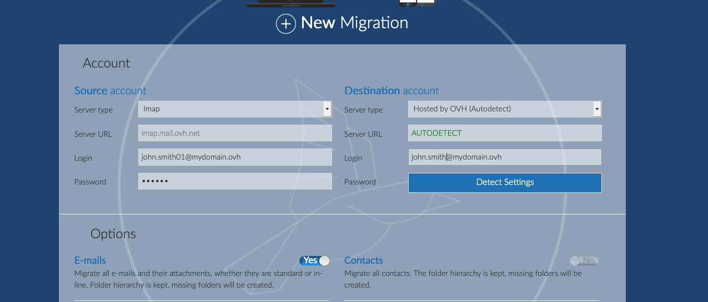

> [!primary]
> Questa traduzione è stata generata automaticamente dal nostro partner SYSTRAN. I contenuti potrebbero presentare imprecisioni, ad esempio la nomenclatura dei pulsanti o alcuni dettagli tecnici. In caso di dubbi consigliamo di fare riferimento alla versione inglese o francese della guida. Per aiutarci a migliorare questa traduzione, utilizza il pulsante "Modifica" di questa pagina.
>

**Ultimo aggiornamento: 21/10/2020**

## Obiettivo

Per migrare i tuoi indirizzi email presenti su una piattaforma Exchange o Email Pro su un'altra piattaforma Exchange, Email Pro o MX Plan. In questa guida trovi il processo di migrazione in due fasi:

1. **Configura la piattaforma di destinazione**
2. **Migrare gli account email** dalla piattaforma attuale verso la nuova.

{.thumbnail}

> [!primary]
>
> Per migrare una soluzione MX Plan verso una piattaforma Exchange o Email Pro, consulta la guida [Migrare un indirizzo email MX Plan verso un account Email Pro o Exchange](https://docs.ovh.com/it/microsoft-collaborative-solutions/migrazione-indirizzo-email-condiviso-verso-exchange/).
>

**Questa guida ti mostra come migrare gli indirizzi email da una piattaforma Exchange o Email Pro verso un'altra piattaforma Exchange o Email Pro.**

## Prerequisiti

- Disporre di una piattaforma **"sorgente"** con account [Exchange](https://www.ovhcloud.com/it/emails/hosted-exchange/){.external} o [Email Pro](https://www.ovhcloud.com/it/emails/email-pro/){.external} configurati
- Disporre di una piattaforma di **"destinazione"** con account [Exchange](https://www.ovhcloud.com/it/emails/hosted-exchange/){.external}, [Email Pro](https://www.ovhcloud.com/it/emails/email-pro/){.external} o MX Plan (inclusa nella soluzione MX Plan o in una soluzione di [hosting Web OVHcloud](https://www.ovhcloud.com/it/web-hosting/){.external}) Questa piattaforma deve disporre di account non configurati o disponibili per accogliere gli indirizzi email che devono essere migrati.
- Avere accesso allo [Spazio Cliente OVHcloud](https://www.ovh.com/auth/?action=gotomanager&from=https://www.ovh.it/&ovhSubsidiary=it){.external}

## Procedura

### Configura la piattaforma di destinazione

Se hai appena ordinato il nuovo servizio di posta, prima aggiungi il dominio alla tua piattaforma [Email Pro](https://docs.ovh.com/it/emails-pro/prima-configurazione/#step-2-aggiungi-il-dominio) o [Exchange](https://docs.ovh.com/it/microsoft-collaborative-solutions/aggiungere-dominio-su-exchange/). Se migrate verso una piattaforma MX Plan, con il dominio associato "fisso", potrete passare direttamente allo [step successivo](#accountsmigration).

> Seleziona la scheda `Domini associati`{.action} sulla tua piattaforma e clicca su `Aggiungi un dominio`{.action}. Configura il tuo dominio in **modo non autoritativo**. Una volta aggiunto il dominio, assicurati che la voce `OK` sia presente nella colonna `Stato`.
>
> {.thumbnail}
>
> Per maggiori informazioni sull'aggiunta di un dominio, consulta [la guida Email Pro](https://docs.ovh.com/it/emails-pro/prima-configurazione/#step-2-aggiungi-il-dominio) o [la guida Exchange](https://docs.ovh.com/it/microsoft-collaborative-solutions/aggiungere-dominio-su-exchange/).

### Migra gli account email 

La migrazione dei tuoi account email avverrà in 3 step principali: **Rinomina** l'account email originale, **crea** il nuovo account email e **migra** dalla piattaforma di origine alla nuova.

{.thumbnail}

> [!warning]
>
> Caso specifico:
>
> - Per migrare **un account Exchange** verso un account **Email Pro**, assicurati che i tuoi account email non superino i 10GB. Le funzioni collaborative, la sincronizzazione dei calendari e dei contatti non sono presenti su Email Pro e non possono essere migrati.
> - Se devi migrare **un account Exchange o Email Pro** verso un account **MX Plan**, assicurati che il tuo account email non superi i 5GB. Le funzioni collaborative, la sincronizzazione dei calendari e dei contatti non sono presenti su MX Plan e non possono essere migrati.

#### Rinomina

Rinomina l'account email da migrare con un nome provvisorio (ad esempio: per migrare l'account email *john.smith@mydomain.ovh*, rinominalo in *john.smith01@mydomain.ovh*).

Nella scheda `Account email`{.action} della tua piattaforma email, clicca sui tre puntini `...`{.action} e poi su `Modifica`{.action}.

{.thumbnail}

#### Crea

Crea il tuo indirizzo email sul nuovo account della tua piattaforma Email Pro, Exchange o MX Plan (prendendo l'esempio precedente, crei *john.smith@mydomain.ovh* sulla tua nuova piattaforma)

Nella scheda `Account email`{.action} della tua piattaforma, clicca sui tre puntini in corrispondenza dell'account `...`{.action}. e seleziona `Modifica`{.action}.

{.thumbnail}

#### Migrare

> [!warning]
>
> Verranno migrati solo i dati dei tuoi account email (email, contatti, calendari, regole della posta in arrivo, ecc...). Le funzionalità legate alla tua piattaforma dovranno essere ripristinate sulla nuova piattaforma:
>
> - [Alias](https://docs.ovh.com/it/microsoft-collaborative-solutions/email-alias/)
> - [Delega dei diritti](https://docs.ovh.com/it/microsoft-collaborative-solutions/exchange_2013_assegna_i_diritti_full_access_a_un_account/)
> - [Gruppi](https://docs.ovh.com/it/microsoft-collaborative-solutions/exchange_2013_utilizzo_dei_gruppi_mailing_list/)
> - Contatti esterni
> - [Firma](https://docs.ovh.com/it/microsoft-collaborative-solutions/exchange_2013_firma_automatica_-_disclaimer/)

Migra l'account email "sorgente" verso l'account della tua nuova piattaforma con l'aiuto del nostro tool [OMM](https://omm.ovh.net/) (OVH Mail Migrator).

> Se vuoi migrare più account email, ti consigliamo di utilizzare la modalità [Project](https://docs.ovh.com/it/microsoft-collaborative-solutions/migrazione-account-email-con-ovh-mail-migrator/#project) via [OMM](https://omm.ovh.net/Project/Create), per importare una tabella in formato CSV contenente le informazioni degli account email da migrare.

Per maggiori informazioni su OMM, consulta la guida [Migrare account email via OVH Mail Migrator](https://docs.ovh.com/it/microsoft-collaborative-solutions/migrazione-account-email-con-ovh-mail-migrator/).

{.thumbnail}

Il tempo di migrazione dipende dalla quantità di dati da migrare verso il nuovo account. che può variare da pochi minuti a diverse ore.

Una volta completata la migrazione, verifica di trovare tutti i tuoi elementi accedendo alla Webmail all'indirizzo Web <https://www.ovh.it/mail/>.

Una volta completata la migrazione, puoi conservare o eliminare l'account di origine con il nome provvisorio.

Per eliminarlo, seleziona la scheda `Account email`{.action} della tua piattaforma email originale, clicca sul pulsante`...`{.action} e poi su `Reimposta questo account `{.action}.

### Verifica o modifica la configurazione del tuo dominio

In questa fase, gli account email devono essere già migrati e funzionali. Per motivi di sicurezza, ti consigliamo di assicurarti che la configurazione del tuo dominio sia corretta consultando il tuo Spazio Cliente OVHcloud.

seleziona il tuo servizio Email Pro o Exchange e clicca sulla scheda `Domini associati`{.action}. Nella tabella che appare, la colonna "Diagnostica" ti permette di vedere se la configurazione DNS è corretta: se è necessario modificare la configurazione, appare una casellina rossa.

> [!primary]
>
> Se hai appena effettuato la migrazione o modificato un record DNS del tuo dominio, è possibile che l'aggiornamento della pagina nello [Spazio Cliente OVHcloud](https://www.ovh.com/auth/?action=gotomanager&from=https://www.ovh.it/&ovhSubsidiary=it){.external} richieda qualche ora.
>

Per modificare la configurazione, clicca sulla casellina rossa e esegui l'operazione. La propagazione delle modifiche potrebbe richiedere da 4 a 24 ore.

{.thumbnail}

### Utilizza i tuoi account email migrati

A questo punto non ti resta che utilizzare i tuoi account email migrati. OVHcloud mette a disposizione un'applicazione online (_Web app_) accessibile all'indirizzo <https://www.ovh.it/mail/>. inserendo le credenziali associate al tuo indirizzo email.

Se hai configurato uno degli account migrati su un client di posta (ad esempio: Outlook, Thunderbird), è necessario impostarlo di nuovo. Le informazioni di connessione al server OVHcloud sono cambiate in seguito alla migrazione.
 Per maggiori informazioni sulle operazioni da effettuare, consulta la nostra documentazione nelle sezioni delle guide dedicate a [Email Pro](https://docs.ovh.com/it/emails-pro/){.external} e [Hosted Exchange](https://docs.ovh.com/it/microsoft-collaborative-solutions/){.external}. Se non sei in grado di riconfigurare l'account nell'immediato, l'accesso tramite l'applicazione online è sempre possibile.

> [!primary]
>
> Inoltre, è possibile migrare manualmente indirizzi email verso OVHcloud utilizzando il nostro tool [OVH Mail Migrator (OMM)](https://omm.ovh.net/){.external}. Per farlo, è necessario disporre delle informazioni (utente, password, server) dell'email sorgente e dell'email di destinazione.
>

## Per saperne di più

[Gestire i contatti dei servizi](https://docs.ovh.com/it/customer/gestisci_i_tuoi_contatti/){.external} .

[Guides E-mail Pro](https://docs.ovh.com/it/emails-pro/){.external}.

[Guides Exchange](https://docs.ovh.com/it/microsoft-collaborative-solutions/){.external}.

Contatta la nostra Community di utenti all’indirizzo <https://community.ovh.com/en/>.
