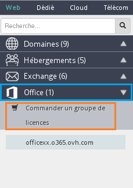
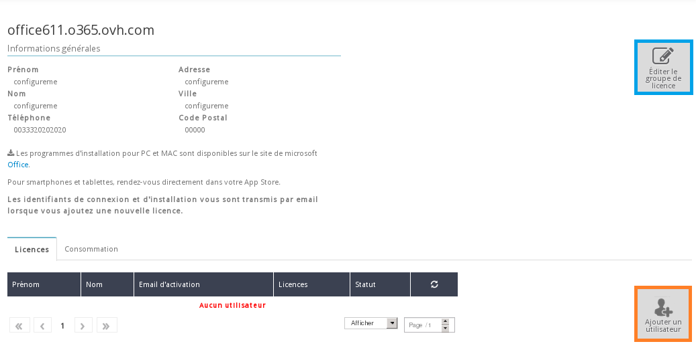
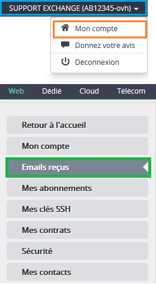

## Über OVH.com
Die Bestellung von Office 365 Lizenzen kann für deutsche Kunden nur über Ihr Kundencenter erfolgen. Kunden in Frankreich haben außerdem die Möglichkeit, Ihre Bestellung über die Webseite [OVH.com](https://www.ovh.com/fr/office-365-business) zu starten.
Bei der Bestellung von Office 365 Lizenzen über [OVH.com](https://www.ovh.com/fr/office-365-business) wird automatisch eine neue Lizenzgruppe erstellt.

Um Lizenzen zu einer bestehenden Gruppe hinzuzufügen, muss immer das Kundencenter verwendet werden.

Wenn Sie Office 365 bestellen (und eine Lizenzgruppe erstellen) möchten, klicken Sie auf folgenden Link: [OVH.com](https://www.ovh.com/fr/office-365-business)

- Klicken Sie dann auf "Commander".

{.thumbnail}
Im nächsten Schritt können Sie festlegen, wie viele Business oder Pro Plus Lizenzen Sie erwerben möchten. Klicken Sie dann erneut auf "Commander".

{.thumbnail}
Dan erscheint eine Zusammenfassung Ihrer Bestellung. Wenn alles korrekt ist, klicken Sie auf "Poursuivre".

{.thumbnail}

- Loggen Sie sich nun mit Ihrer Kundenkennung und dem dazugehörigen Passwort in Ihr Kundencenter ein. 

- Wenn Sie noch keine Kundenkennung haben, können Sie über Klick auf "Créez un compte" eine erstellen.

{.thumbnail}
Wenn Sie eingeloggt sind, müssen Sie die Verträge akzeptieren und auf "Confirmer et Payer" klicken, um zum Bestellschein zu gelangen.

Die Installation Ihres Service wird nur wenige Minuten in Anspruch nehmen. Wenn die Installation abgeschlossen ist, werden Sie per E-Mail benachrichtigt.

## Über das Kundencenter
Loggen Sie sich in Ihr [OVH Kundencenter](https://www.ovh.com/manager/web) ein.

{.thumbnail}

- Wählen Sie im Menü links unter "Microsoft" den Menüpunkt "Eine Office Lizenzgruppe bestellen" aus.

{.thumbnail}
Hier können Sie dann Typ und Anzahl der gewünschten Lizenzen festlegen:

- Office Business Lizenzen: Excel, Word, PowerPoint, Outlook, Note, Publisher.

- Office Pro Plus Lizenzen: Excel, Word, PowerPoint, Outlook, Access, Power BI.

Die Vorteile der Office Pro Plus Lizenz:

- Mit Pro Plus können Sie auch mehr als 300 Office Lizenzen in Ihrer Gruppe verwalten
- Bei Pro Plus stehen Ihnen auch Access und Power BI zur Verfügung

{.thumbnail}
Bei der Version MacOS sind folgende Programm nicht enthalten: Note und Publisher
Wenn Sie Typ und Anzahl der Lizenzen festgelegt haben, nehmen Sie bitte unsere AGB und die "Anlage Office" zur Kenntnis, setzen Sie dann ein Häkchen bei Ich habe die Verträge gelesen und akzeptiere diese. Anschließend können Sie auf Bestellschein erstellen klicken.

{.thumbnail}
Wenn der Bestellschein bezahlt wurde, dauert es bis zu 4 Stunden, bis Ihr Service verfügbar ist.

## 
Wenn Sie Änderungen an Ihrer Lizenzgruppe vornehmen möchten, klicken Sie auf "Die Lizenzgruppe bearbeiten".
Wenn eine Lizenzgruppe erstellt wurde und in Ihrem [OVH Kundencenter](https://www.ovh.com/manager/web) verfügbar ist, können Sie Ihre "Office 365" Lizenzen aktivieren.

Standardmäßig erscheint kein Benutzer, Sie müssen die Lizenzen manuell zuweisen. Wenn Sie eine Lizenz vergeben möchten, klicken Sie auf "Einen Benutzer hinzufügen".

{.thumbnail}
Nun müssen Sie einige Angaben machen:

- Vorname
- Name
- Login
- Verwendete Lizenz

Wenn Sie die Angaben bestätigt haben, steht die Lizenz dem gewünschten Benutzer innerhalb weniger Minuten zur Verfügung.

{.thumbnail}
Die Lizenz ist nun aktiv und wird im Kundencenter angezeigt.
Im Tab "Verbrauch" sehen Sie, wie veiel Lizenzen jeden Monat in Verwendung sind.

{.thumbnail}
Wenn Sie nun einen weiteren "Benutzer hinzufügen" möchten, brauchen Sie keine Veränderungen an der Lizenzgruppe vorzunehmen. Klicken Sie einfach erneut auf "Einen Benutzer hinzufügen". Die Abrechnung erfolgt automatisch jeden Monat auf Grundlage der im vorangegangen Monat verbrauchten Lizenzen.
Nach Vergabe der Lizenz wird eine Bestätigungs-E-Mail versendet. Diese können Sie jederzeit über den Menüpunkt "Mein Account" unter "Empfangene E-Mails" abrufen.

{.thumbnail}
In dieser E-Mail sind die Login-Daten für [Office](https://portal.office.com) angegeben, wo das Office-Paket heruntergeladen werden kann.

{.thumbnail}
Geben Sie auf der Seite von Office einfach diese Login-Daten ein.

{.thumbnail}
Dann können Sie durch Klick auf "Installieren" die .exe-Datei herunterladen, um die Installation Ihres Office-Pakets zu starten.

Im Menü Smartphone und Tablet" erfahren Sie, wie Sie Ihre Office-Suite auf diesen Geräten installieren.

{.thumbnail}

## Weiterführende Informationen

Für den Austausch mit unserer User Community gehen Sie auf <https://community.ovh.com/en/>.
