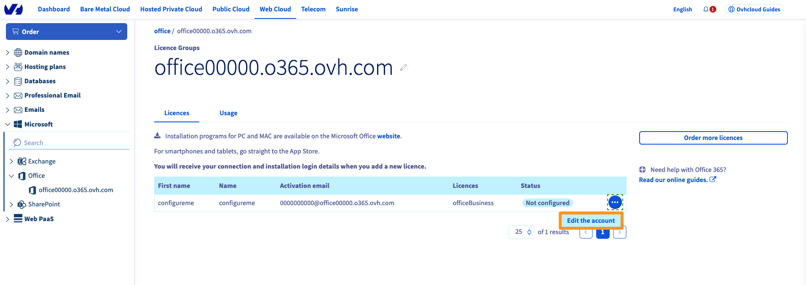
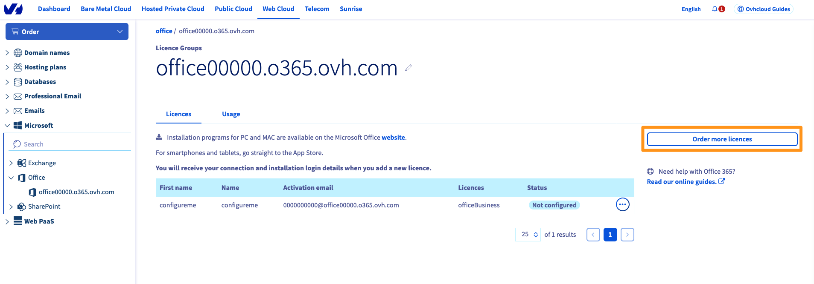

> [!primary]
> Esta traducción ha sido generada de forma automática por nuestro partner SYSTRAN. En algunos casos puede contener términos imprecisos, como en las etiquetas de los botones o los detalles técnicos. En caso de duda, le recomendamos que consulte la versión inglesa o francesa de la guía. Si quiere ayudarnos a mejorar esta traducción, por favor, utilice el botón «Contribuir» de esta página.
>

**Última actualización: 24/02/2022**

## Objetivo

Existen varias ventajas para contratar los productos OVHcloud **Microsoft 365 apps for business** o **Microsoft 365 apps for enterprise**. La facturación es mensual y puede instalar una licencia en 5 PC o Mac, 5 tablets y 5 smartphones.

Sus licencias Microsoft 365 se agrupan en un grupo, también llamado "Service". Un grupo de licencias Apps for business puede contener un máximo de 300 licencias, un grupo de licencias Apps for enterprise es ilimitado.

Esta es la lista de programas incluidos en la siguiente:

- Licencias Apps for business: Excel, Word, PowerPoint, Outlook, Note, Publisher.
- Licencias Apps para empresa: Excel, Word, PowerPoint, Outlook, Nota, Publisher, Access.

**Cómo contratar una licencia Microsoft 365 y administrarla desde el área de cliente de OVHcloud**

## Requisitos

- Estar conectado al [área de cliente de OVHcloud.](https://www.ovh.com/auth/?action=gotomanager&from=https://www.ovh.es/&ovhSubsidiary=es)

## Procedimiento

### Contratar una licencia

Acceda a nuestra web de [OVHcloud.com](https://www.ovhcloud.com/es-es/collaborative-tools/microsoft-365/){.external} y seleccione el apartado "Herramientas colaborativas" de nuestra sección "Web Cloud".

También puede contratar una licencia desde el [área de cliente de OVHcloud](https://www.ovh.com/auth/?action=gotomanager&from=https://www.ovh.es/&ovhSubsidiary=es). Una vez conectado, seleccione `Web Cloud`{.action} en la barra superior y haga clic en el botón `Contratar`{.action} y en `o365`{.action}.

- Elija entre los productos disponibles, es decir, "Apps for business" y "Apps for enterprise".
- Indique la frecuencia de renovación del grupo de licencias.
- Indique el número de licencias que desea y haga clic en `Contratar`{.action}.

Será redirigido a la página de contratación para validarla y abonarla.

### Activar la licencia

Una vez que haya contratado la licencia, deberá activarla desde el [área de cliente de OVHcloud](https://www.ovh.com/auth/?action=gotomanager&from=https://www.ovh.es/&ovhSubsidiary=es). En la sección `Web Cloud`, haga clic en `Microsoft`{.action} y seleccione `Office`{.action} y el grupo de licencias correspondiente.

Haga clic en el botón `...`{.action} delante de la licencia y, seguidamente, en `Editar la cuenta`{.action}.

{.thumbnail}

Introduzca la información relativa al usuario de la licencia, haga clic en `Siguiente`{.action} y luego en `Aceptar.`{.action}

{.thumbnail}

### Instalar la suite Microsoft 365 en su máquina

Una vez activada la licencia, recibirá un mensaje de correo electrónico en la dirección de correo electrónico de contacto de su cuenta de OVHcloud. También puede consultar este mensaje desde el [área de cliente de OVHcloud](https://www.ovh.com/auth/?action=gotomanager&from=https://www.ovh.es/&ovhSubsidiary=es), haciendo clic en su perfil en la esquina superior derecha y seleccionando el servicio de `correo electrónico`{.action} en la sección `Accesos rápidos`.

Este mensaje de correo electrónico incluye la información necesaria para descargar e instalar su suite Microsoft 365, es decir, la dirección de **correo electrónico de activación** y la **contraseña**.

>
> Si desea establecer usted mismo la contraseña, deberá hacerlo desde el área de cliente. En la sección `Web Cloud`, haga clic en `Microsoft`{.action} y seleccione el grupo de licencias correspondiente.
>
> Haga clic en el botón `...`{.action} a la derecha de la licencia correspondiente y, seguidamente, en `Cambiar la contraseña`{.action}.
>
>{.thumbnail}
>

Acceda a <https://portal.office.com/> y conéctese con la dirección de **correo electrónico de activación** y la **contraseña** previamente configuradas. Se abrirá una ventana en la que podrá descargar la suite Microsoft 365 de su equipo con las instrucciones de instalación.

{.thumbnail}

> [!primary]
>
> El usuario puede instalar la suite Microsoft 365 en 5 máquinas en Windows o macOS, en 5 tablets y 5 smartphones.
>

### Añadir una licencia a un grupo existente

Si quiere añadir una o más licencias al grupo de licencias existente, puede hacerlo desde el [área de cliente de OVHcloud](https://www.ovh.com/auth/?action=gotomanager&from=https://www.ovh.es/&ovhSubsidiary=es). En la sección `Web Cloud`, haga clic en `Microsoft`{.action} y seleccione `Office`{.action} y el grupo de licencias correspondiente.

Haga clic en el botón `Contratar más licencias`{.action} a la derecha. Indique el número y el tipo de licencias que quiere contratar.

{.thumbnail}

### Gestionar las suscripciones <a name="managesubscriptions">>

#### Eliminar una licencia en un grupo de licencias

En la pestaña `Licencias`{.action} de su grupo de licencias, haga clic en el botón `...`{.action} a la derecha de la licencia que desea dar de baja y haga clic en `Eliminar la cuenta`{.action}.

{.thumbnail}

> [!primary]
> El consumo del mes en curso se facturará al final del mismo.

#### Dar de baja el grupo de licencias

Para dar de baja su grupo de licencias Microsoft Office 365 CSP1, haga clic en su nombre en la esquina superior derecha del área de cliente de OVHcloud y seleccione el botón `Gestión de servicios`{.action}. Haga clic en el botón `...`{.action} a la derecha del grupo de licencias que desea dar de baja y, seguidamente, `Dar de baja`{.action}.< br>
Indique los motivos de su solicitud de baja y haga clic en `Aceptar`{.action}.

> [!primary]
> El consumo del mes en curso se facturará al final del mismo.

## Más información

[Utilizar el escritorio remoto con Microsoft 365 apps](https://docs.ovh.com/es/microsoft-collaborative-solutions/office365-proplus-escritorio-remoto/)

Interactúe con nuestra comunidad de usuarios en <https://community.ovh.com/en/>.
