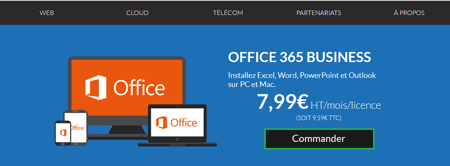
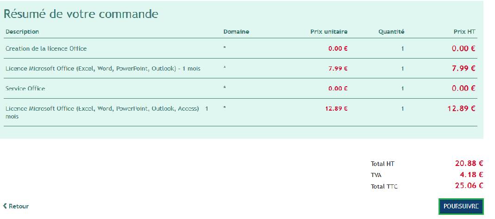
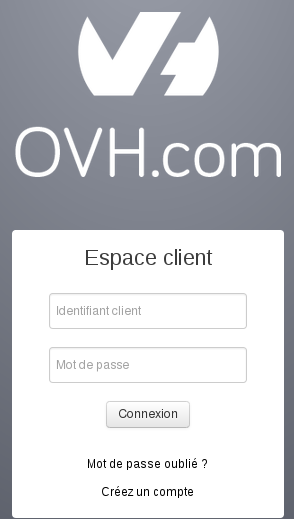
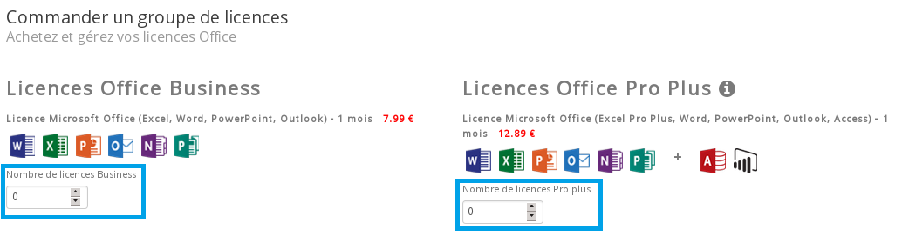
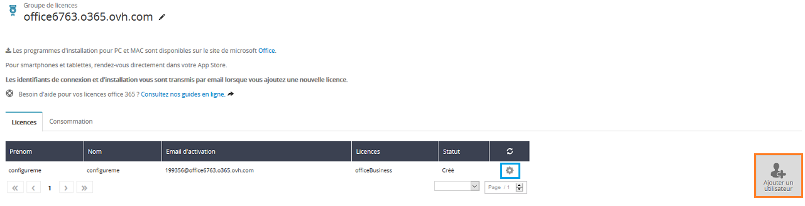
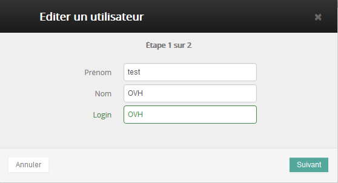

Il y a plusieurs avantages à souscrire à l'Office 365 Business ou Pro Plus. La facturation est mensuelle. Vous pouvez installer une licence sur 5 PC/Mac et 5 tablettes et 5 smartphones. Vous disposez constamment de mises à jour, y compris les mises à jour majeures.

Vos licences Office 365 sont regroupés dans un groupe de licences, aussi appelé "Service". Un groupe de licences Business peut contenir au maximum 300 licences, un groupe de licences Pro Plus est illimité.

## Commander des licences

### Depuis OVH.com

> [!success]
>
> La commande de licences Office 365 peut être réalisée depuis l'espace client
> et depuis le site OVH.com.
> 

La commande de licences Office 365 depuis [OVH.com](https://www.ovh.com/fr/office-365-business){.external} crée automatiquement un nouveau groupe de licence.

Si vous souhaitez ajouter des licences dans un groupe existant, il faut réaliser l'ajout depuis l'espace client.

Pour réaliser une commande Office365 (création d'un groupe de licence), cliquez sur le lien suivant : [OVH.com](https://www.ovh.com/fr/office-365-business){.external}

- Cliquez sur "Commander"

{.thumbnail}

Vous pourrez ensuite définir le nombre de licence Business ou Pro Plus dont vous avez besoin puis "Commander".

{.thumbnail}

Un résumé de votre commande sera alors affiché, cliquez ensuite sur "Poursuivre"

{.thumbnail}

- Connectez-vous grâce à votre couple identifiant (nic-handle) - mot de passe .
- Si vous n'avez pas encore d'identifiant client, cliquez sur "Créez un compte" .

Une fois connecté, vous devrez valider les contrats lié à l'offre Office 365 puis cliquez sur "Confirmer et Payer" afin d'accéder au bon de commande.

L'installation de votre service se fait sous quelques minutes. Un e-mail vous sera envoyé une fois le service installé.

### Depuis l'espace client
Connectez-vous à votre [espace client](https://www.ovh.com/manager/web){.external} à l'aide de votre couple identifiant (nic-handle) - mot de passe.

{.thumbnail}

- Sélectionnez le menu de gauche Microsoft puis dans le menu "Commander une plateforme" sélectionnez : O365.

{.thumbnail}

Vous pourrez à ce niveau choisir le type et le nombre de licences a commander :

- Licences Office Business : Excel, Word, PowerPoint, Outlook, Note, Publisher.
- Licences Office Pro Plus : Excel, Word, PowerPoint, Outlook, Access, Power BI.

Les avantages de la licence Office Pro Plus :

- Pro Plus permet d'avoir plus de 300 licences Office dans votre groupe
- Pro Plus inclut aussi Access et Power BI

{.thumbnail}

> [!alert]
>
> La version MacOS ne comprend pas les logiciels : Note et Publisher.
> 

Une fois votre type et le nombre de licences choisies, vous devrez valider les contrats OVH puis Générer le bon de commande

{.thumbnail}

Une fois le bon de commande réglé, le délai de réalisation peut aller jusqu'à 4h.

## Gerer un groupe de licences depuis l'espace client
Une fois le groupe de licences créé et disponible depuis votre [espace client](https://www.ovh.com/manager/web){.external}, vous pouvez activer vos licences "office 365".

Dans notre exemple nous avons déclaré un utilisateur dans notre groupe. Par défaut celui-ci est sous la forme "configureme"

{.thumbnail}

Certaines informations vous seront demandées afin de créer votre licence via la roue crantée à droite de l'utilisateur :

- Prénom
- Nom
- Login

Une fois validée, votre licence sera disponible sous quelques minutes.

{.thumbnail}

La licence est maintenant bien active, celle-ci apparait bien dans l'espace client. L'onglet "Consommation" vous permet de suivre mois par mois le nombre de licence consommées.

{.thumbnail}

Si vous souhaitez de nouveau "Ajouter un utilisateur", il n'est pas nécessaire de recréer un groupe de licences mais directement de cliquer à nouveau sur : "Ajouter un utilisateur".

Un e-mail a été envoyé, celui-ci est disponible en cliquant sur votre référence client puis le menu "Mon compte" puis "Emails reçus".

{.thumbnail}

Celui-ci contient les identifiants de connexion vers le site d'[Office](https://portal.office.com){.external} afin de télécharger l'installateur du pack office.

{.thumbnail}

Une fois sur le site d'office, saisissez les identifiants de connexion, ils sont indiqués dans l'e-mail reçu.

{.thumbnail}

Vous pourrez en cliquant sur "Installer" télécharger l'exécutable sur votre poste pour lancer l'installation de votre pack office.

Depuis le menu Téléphone et tablette" retrouvez comment installer la suite office sur votre périphérique.

{.thumbnail}

## Activer Office Attach
Si vous disposez d'un service Exchange, il est possible d'activer en un clic jusqu'à 25 licences O365. Vous disposez d'un mois gratuit pour l'ensemble des licences activées.

Pour activer une ou plusieurs licences, connectez-vous à votre espace client puis sélectionnez votre service Exchange. Dans l'onglet `Informations Générales`{.action} cliquez sur `Profitez de cette offre`{.action}

Il est aussi possible de réaliser cette action depuis la section `Comptes E-mail`{.action} en cliquant sur `Souscrire à Office 365`{.action}

{.thumbnail}

Vous pourrez ensuite choisir les comptes Exchange pour lesquels vous souhaitez activer une licence O365.

{.thumbnail}

Cliquez sur `Suivant`{.action} puis `Valider`{.action} pour finaliser l'activation.

Une fois la licence activée, celle-ci est en renouvellement automatique, sans action de votre part elle sera reconduite automatiquement au tarif indiqué sur [ovh.com](https://www.ovh.com/manager/web){.external}.