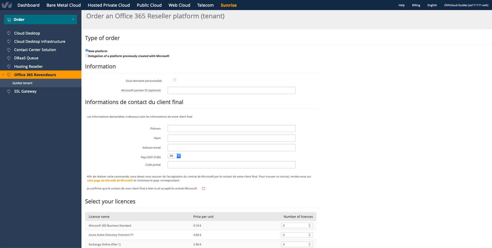

> [!primary]
> Tłumaczenie zostało wygenerowane automatycznie przez system naszego partnera SYSTRAN. W niektórych przypadkach mogą wystąpić nieprecyzyjne sformułowania, na przykład w tłumaczeniu nazw przycisków lub szczegółów technicznych. W przypadku jakichkolwiek wątpliwości zalecamy zapoznanie się z angielską/francuską wersją przewodnika. Jeśli chcesz przyczynić się do ulepszenia tłumaczenia, kliknij przycisk „Zaproponuj zmianę” na tej stronie.
>

**Ostatnia aktualizacja z dnia 17-01-2023**

## Wprowadzenie

Office 365 Resellerzy (CSP2) to usługa pozwalająca na korzystanie z różnych typów licencji Microsoft 365 w preferencyjnych cenach, dzięki czemu możesz je odsprzedać swoim klientom.

**Dowiedz się, jak zamówić i zarządzać usługą Office 365 Reseller (CSP2) w OVHcloud.**

## Wymagania początkowe

- Dostęp do [Panelu klienta OVHcloud](https://www.ovh.com/auth/?action=gotomanager&from=https://www.ovh.pl/&ovhSubsidiary=pl)
- Posiadanie [MPN ID](https://learn.microsoft.com/partner-center/mpn-create-a-partner-center-account) (Microsoft Partner Network IDentifier) 
- Bądź członkiem programu CSP (Cloud Solution Provider) Microsoft jako pośrednik reseller w regionie, w którym pracujesz (na przykład: "UE" dla Europy)

> [!warning]
>
> Od 01/07/2022 wszystkie usługi Office 365 Reseller (CSP2), które nie posiadają identyfikatora MPN ID zarejestrowanego w programie "CSP pośrednik reseller", są dezaktywowane przez Microsoft.
>
> Posiadanie identyfikatora MPN jest już obowiązkowe w przypadku każdego nowego zamówienia.
>

Jeśli nie posiadasz jeszcze identyfikatora MPN, możesz utworzyć taki numer (jeśli możesz spełnić warunki Microsoft), postępując zgodnie z oficjalną dokumentacją Microsoft ["Co to jest Microsoft Cloud Partner Program?"](https://docs.microsoft.com/partner-center/mpn-create-a-partner-center-account){.external}.

Aby zarejestrować się jako pośrednik reseller, zapoznaj się z dokumentacją Microsoft ["Zapisywanie się do programu Dostawca rozwiązań Cloud"](https://docs.microsoft.com/partner-center/enrolling-in-the-csp-program#enroll-as-an-indirect-reseller){.external}.

ID MPN pozwoli Ci uzyskać zwroty pieniężne z subskrypcji, które zamawiasz w Panelu klienta OVHcloud. Te zwroty podlegają zasadom zdefiniowanym przez Microsoft, w zależności od generowanych ilości subskrypcji.

## W praktyce

### Zamów usługę Office 365 Reseller

Aby zamówić usługę Office 365 Reseller, przejdź do [Panelu klienta OVHcloud](https://www.ovh.com/auth/?action=gotomanager&from=https://www.ovh.pl/&ovhSubsidiary=pl). Po zalogowaniu wybierz `Sunrise`{.action} na górnym pasku, a następnie kliknij `Office 365 Reseller`{.action}.

- *Nieobowiązkowo*: możesz zdefiniować **subdomenę** podczas tworzenia nowej platformy, zaznaczając odpowiednie pole (pod warunkiem podania dostępnych nazw).
- Wpisz wcześniej utworzony adres MPN ID firmy Microsoft.
- Uzupełnij dane kontaktowe klienta końcowego, są one wymagane, aby zdefiniować menedżera grupy licencji (*Tenant*), którą utworzysz.
- Na poniższej liście dodaj licencje, które chcesz dodać do swojej grupy.
- Kliknij na `Zamów`{.action}, aby sfinalizować.

> [!warning]
> Upewnij się, czy adres e-mail podany podczas tworzenia grupy licencji jest ważny, ponieważ grupa ta posłuży do otrzymywania informacji identyfikacyjnych na platformie Microsoft.
>

{.thumbnail}

> [!warning]
> W przypadku produktów licencjonowanych nie można zmienić *Tenant* Office 365 Resellerów z jednego identyfikatora klienta OVHcloud na inny. Należy zatrzymać subskrypcję oryginalnego konta OVHcloud i wykupić ten sam rodzaj licencji na nowym koncie OVHcloud.
> 

{.thumbnail}

### Zarządzaj usługą Office 365 Reseller

Po utworzeniu i udostępnieniu usługi Office 365, można nią zarządzać poprzez [Panel klienta OVHcloud](https://www.ovh.com/auth/?action=gotomanager&from=https://www.ovh.pl/&ovhSubsidiary=pl){.external}.

W tym celu przejdź do sekcji `Sunrise`{.action}. W menu po lewej stronie wybierz `Office 365 Reseller`{.action} i wybierz usługę.

Pojawiają się następujące informacje:

- **Nazwa wewnętrzna usługi**: wskazuje nazwę Twojej usługi. Jest to widoczne jedynie w Panelu klienta. Odpowiada on również *Tenant* (co zawiera Twoją grupę licencji) w firmie Microsoft.
- **Nazwa wyświetlania usługi**: pozwala na personalizację nazwy wyświetlacza w Panelu klienta.
- **Utworzony dnia**: wskazuje datę utworzenia usługi.
- **Portal administracyjny Microsoft**: link do portalu Office pozwalający na zarządzanie subskrypcjami.
- Hasło administratora *Tenant* Microsoft można zarządzać bezpośrednio w interfejsie Microsoft. Zapoznaj się z [dokumentacją Microsoft](https://support.microsoft.com/account-billing/reset-a-forgotten-microsoft-account-password-eff4f067-5042-c1a3-fe72-b04d60556c37).
- Zarządzanie dodatkowymi domenami odbywa się również w interfejsie administracyjnym Microsoft. Zapoznaj się z [dokumentacją Microsoft](https://support.microsoft.com/office/connect-your-domain-to-office-365-cd74b4fa-6d34-4669-9937-ed178ac84515).

{.thumbnail}

### Zarządzanie subskrypcjami

Zarządzanie subskrypcjami pozwala na zwiększenie lub anulowanie licencji przypisanych do grupy subskrypcji. Tabela pozwala wyświetlić szczegóły:

- **ID**: każdy rodzaj zamówionej licencji posiada unikalny identyfikator (ID).
- **Status**: odpowiada statusowi Twojej licencji.
- **Nazwa licencji**: wskazuje rodzaj licencji wykupionej.
- **Liczba licencji**: wskazuje liczbę dostępnych licencji.
- **Data utworzenia**: wskazuje datę utworzenia subskrypcji wybranego typu licencji.
- **Ostatnia aktualizacja**: wskazuje datę ostatniej aktualizacji (np. dodanie licencji) subskrypcji.

Ikona <i class="icons-pen"></i>  pozwala na zmianę całkowitej liczby licencji w abonamencie. Ikona <i class="icons-bin"></i>  pozwala na anulowanie subskrypcji oraz wszystkich licencji.

> [!primary]
>
> Specjalne warunki użytkowania zapewniane przez Microsoft muszą być przestrzegane w przypadku licencji edukacyjnych. Oficjalne dokumenty dostępne są [tutaj](https://www.microsoft.com/licensing/docs){.external} w zależności od języka i regionu.
>

{.thumbnail}

### Zarządzanie użytkownikami

Teraz, kiedy masz już wystarczającą liczbę licencji, musisz zarządzać użytkownikami, którzy będą z nich korzystać. Ta część odbywa się bezpośrednio z poziomu [portalu administracyjnego Microsoft](https://portal.office.com/Admin/Default.aspx){.external}.

Aby się zalogować, wpisz swój identyfikator klienta oraz hasło wysłane w e-mailu OVHcloud potwierdzającym instalację grupy licencji. Informacje te są wysyłane na adres podany podczas tworzenia grupy licencji.

## Sprawdź również

Dołącz do społeczności naszych użytkowników na stronie <https://community.ovh.com/en/>.
