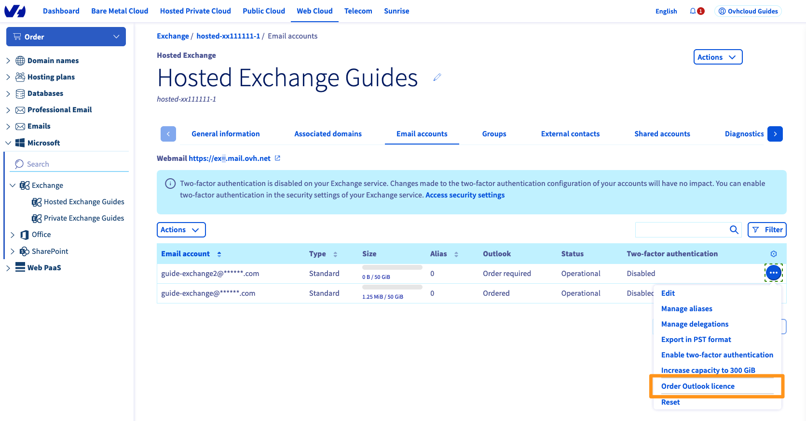
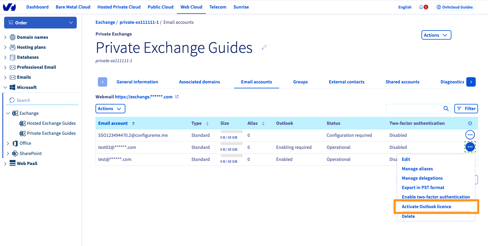
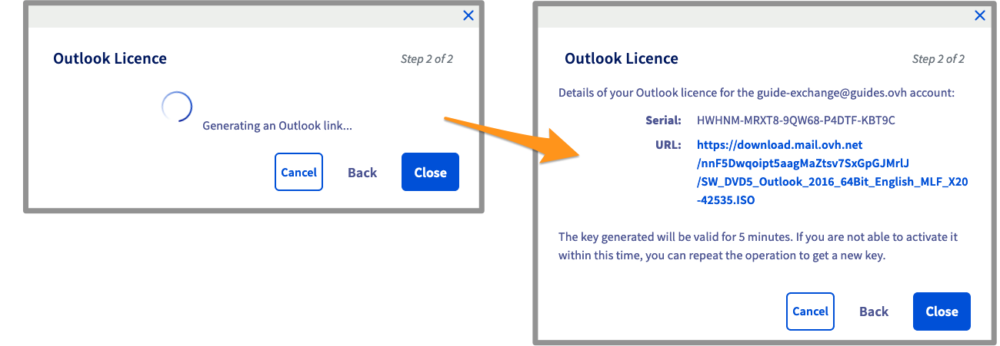

**Last updated 5th October 2022**

## Objective

With an Outlook licence you can use the Outlook email client to view and manage the emails in your Exchange account.

OVHcloud offers the Outlook licence for a monthly cost of €2 ex VAT. It will be linked to an OVHcloud Exchange account that you manage.

After subscribing, you can download the Outlook client as one of the following 3 versions:

- Outlook 2016 for Windows 32 bit
- Outlook 2016 for Windows 64 bit
- Outlook 2016 for MAC 64 bit

**This guide explains how to order an Outlook licence from your OVHcloud Exchange platform and how to activate it.**

## Instructions

### Ordering an Outlook licence

#### For a Hosted Exchange account

Log in to your [OVHcloud Control Panel](https://www.ovh.com/auth/?action=gotomanager&from=https://www.ovh.co.uk/&ovhSubsidiary=GB) and go to the `Web Cloud` section. Click `Microsoft`{.action}, then `Exchange`{.action}, and select the **Hosted Exchange** platform concerned.

Click on the `...`{.action} icon to the right of the account concerned, then on `Order an Outlook`{.action} licence.

{.thumbnail}

Set the renewal frequency for your Outlook licence, and confirm the conditions. Then click `Next`{.action}.

{.thumbnail}

Once you have verfied your order summary, use the `Pay`{.action} button to generate the purchase order. You will be redirected to a new page where you can pay for your order using the payment methods available to you.

You will need to wait a few moments for your Outlook licence to become available in the OVHcloud Control Panel.

#### For a Private Exchange account

Log in to your [OVHcloud Control Panel](https://www.ovh.com/auth/?action=gotomanager&from=https://www.ovh.co.uk/&ovhSubsidiary=GB) and go to the `Web Cloud` section. Click `Microsoft`{.action}, then `Exchange`{.action}, and select the **Private Exchange** platform concerned.

Click on the `...`{.action} icon to the right of the account concerned, then on `Activate Outlook licence`{.action}.

{.thumbnail}

A window will appear, asking you if you want to activate the Outlook licence on your Exchange account. Click `Confirm`{.action} to activate the licence for the account concerned.

{.thumbnail}

You will need to wait a few moments for your Outlook licence to become available in the OVHcloud Control Panel.

> [!primary]
>
> Your Outlook licence will be billed on your Private Exchange platform every month.
>

### Downloading and installing Outlook

You now need to download the appropriate Outlook installation file for your device.

In the management interface for your Exchange platform, click on the `...`{.action} icon to the right of the account concerned, then on `Use Outlook licence`{.action}.

Choose the version from the drop-down menu based on your operating system and language, then click `Next`{.action}.

{.thumbnail}

After a few moments, a download link is generated, along with a licence key needed to activate your Outlook installation.

{.thumbnail}

The downloaded file is in the .ISO format, i.e. a disk image. Start the installation and enter the licence key when prompted.

### Deleting the Outlook licence from your account

Log in to your [OVHcloud Control Panel](https://www.ovh.com/auth/?action=gotomanager&from=https://www.ovh.co.uk/&ovhSubsidiary=GB) and go to the `Web Cloud` section. Click `Microsoft`{.action}, then `Exchange`{.action}. Next, select the Exchange service concerned.

Click on the `...`{.action} icon to the right of the account concerned, then on `Delete Outlook licence`{.action}.

{.thumbnail}

Once you have confirmed, you are reminded that the licence will be permanently deleted on its expiry date.

## Go further

Join our community of users on <https://community.ovh.com/en/>.
