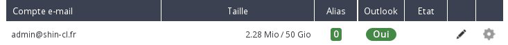

## Outlook Exchange 2013 licentie
OVH biedt u de officiële Outlook e-mail software voor 2 euro excl. btw per maand. Het zal worden gekoppeld aan een door u beheerd OVH Exchange 2013 account.

Deze software wordt geleverd in diverse versies, te downloaden vanaf het Web control panel:

- Outlook 2010, Windows 32 bits.
- Outlook 2010, Windows 64 bits.
- Outlook 2013, Windows 32 bits.
- Outlook 2013, Windows 64 bits.
- Outlook 2011, MAC 64 bits.

## In het geval van een Hosted Exchange platform
Ga naaar uw [control panel](https://www.ovh.com/manager/web/login/), klik op uw Exchange platform en dan op "E-mailaccounts".
U zult dan voor het Exchange adres waarvoor u de Outlook software wilt gebruiken een icon zien in de vorm van een winkelwagentje in de kolom: "Outlook".

Klik op het icon en het volgende scherm zal verschijnen:

{.thumbnail}

- Kies de software versie, de duur (maand of jaar) en ga dan verder met de volgende stap.

{.thumbnail}

- Klik na het overzicht van uw bestelling, op "Betalen" om de bestelbon aan te maken. U wordt doorgestuurd naar een OVH internetpagina, die het resultaat van uw bestelling en de beschikbare betalingsmethoden weergeeft.

{.thumbnail}

- Het kan maximaal twee uur duren voordat de Outlook downloadlink beschikbaar zal zijn.

{.thumbnail}

## In het geval van een Private Exchange platform
Ga naaar uw [control panel](https://www.ovh.com/manager/web/login/), klik op uw Exchange platform en dan op "E-mailaccounts".
Klik op het  icon voor het betreffende Exchange adres.

{.thumbnail}

- Vink het vakje "Outlook Licentie" aan.

Ga naar de volgende stap om de bestelling van de Outlook licentie te valideren. Er wordt geen bestelling gegenereerd, de facturatie (2 euro excl. btw per maand) wordt toegevoegd aan de maandelijkse verlenging van uw Private Exchange platform.

{.thumbnail}

## Algemene informatie
Ga naar uw Web control panel, klik op uw Exchange platform, tabje "E-mailaccounts".

U ziet in de "Outlook" kolom de knop "Ja". Klik hierop, zodat u de Outlook software versie en de taal kunt kiezen.

{.thumbnail}

- U weet niet welke Windows of MAC versie u heeft? Hier zijn de officiële Microsoft en Apple handleidingen:

- [Windows](http://windows.microsoft.com/fr-fr/windows/which-operating-system)
- [Mac](http://support.apple.com/fr-fr/HT1159)

{.thumbnail}

- Het genereren van de download URL.

{.thumbnail}
Klik vervolgens op de URL om het programma te downloaden. Vergeet niet om de beveiligingscode of het serienummer te noteren. Hier zal om gevraagd worden gedurende de software installatie.

-Er is geen beveiligingscode/serienummer vereist voor de installatie van Outlook 2011 op de MAC.

{.thumbnail}

## Algemene informatie
Het gedownloade bestand komt overeen met een .ISO, dwz een disk image. Het is niet bruikbaar in deze status en vereist het gebruik van een van deze solutions om de installatie van de Outlook software uit te voeren:

Virtual reader

Op het internet zijn er gratis virtual readers beschikbaar, zodat u gratis een reader kunt simuleren op uw computer.

Het is afdoende om vervolgens het .ISO-bestand te mounten op de virtual drive om het zichtbaar te maken op uw computer als u het een installatie disk laat lezen.

Brand het ISO-bestand

Als uw computer is voorzien van een CD/DVD-brander, kunt u met de juiste software het ISO-bestand branden. U wordt dan voorzien van een CD/DVD-installatie van Outlook.

- Vergeet niet om de installatie key op te halen tijdens het genereren van de download-URL.

- Dit verzoek betreft de installatie en valt buiten de support, het Exchange team kan u met dit soort verzoeken niet helpen.

