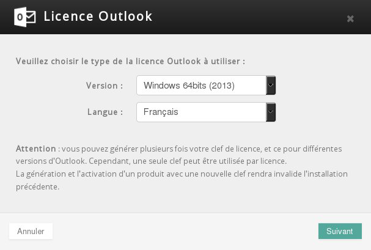

## Licencja Outlook Exchange 2013
OVH proponuje oficjalny program poczty elektronicznej Outlook w cenie 8 PLN netto/miesiąc. Będzie on przypisany do konta Exchange 2013 OVH, które posiadasz.

Program ten jest dostępny w różnych wersjach, które można pobrać z poziomu panelu klienta:

- Outlook 2010 dla Windows 32 bits.
- Outlook 2010 dla Windows 64 bits.
- Outlook 2013 dla Windows 32 bits.
- Outlook 2013 dla Windows 64 bits.
- Outlook 2011 dla MAC 64 bits.

## Przykład dla platformy Hosted Exchange
Przejdź do [panelu klienta](https://www.ovh.com/auth/?action=gotomanager&from=https://www.ovh.pl/&ovhSubsidiary=pl), kliknij na platformę Exchange i wybierz zakładkę "Konta E-mail".
Koło adresu Exchange, dla którego chcesz zamówić program Outlook, zobaczysz ikonkę w kształcie koszyka w kolumnie "Outlook".

Kliknij na tę ikonkę. Pojawi się takie okno:

{.thumbnail}

- Wybierz wersję programu, okres (na miesiąc lub na rok) i przejdź do kolejnego etapu.

{.thumbnail}

- Po podsumowaniu zamówienia skorzystaj z przycisku "Zapłać", aby wygenerować zamówienie. Zostaniesz przekierowany na stronę internetową OVH z informacjami o zamówieniu i dostępnymi sposobami płatności.

{.thumbnail}

- Link do pobrania programu Outlook zostanie udostępniony po minimum dwóch godzinach.

{.thumbnail}

## Przykład dla platformy Private Exchange
Przejdź do [panelu klienta](https://www.ovh.com/auth/?action=gotomanager&from=https://www.ovh.pl/&ovhSubsidiary=pl), kliknij na platformę Exchange i wybierz zakładkę "Konta E-mail".

- Kliknij na ikonkę  przy wybranym adresie Exchange.

{.thumbnail}

- Zaznacz pole "Licencja Outlook".

Przejdź do kolejnego etapu i zatwierdź zamówienie licencji Outlook. System nie wygeneruje zamówienia. Opłata (8 PLN netto miesięcznie) zostanie dodana do faktury za odnowienie platformy Private Exchange.

{.thumbnail}

## Informacje ogólne
Zaloguj się do panelu klienta, kliknij na platformę Exchange i wybierz zakładkę "Konta E-mail".

Obserwuj kolumnę "Outlook", przycisk "Tak". Kliknij na ten ostatni, aby wybrać wersję programu Outlook oraz język.

{.thumbnail}

- Nie znasz wersji swojego systemu Windows lub MAC? Poniżej znajdują się oficjalne przewodniki Microsoft i Apple:

- [Windows](http://windows.microsoft.com/en-gb/windows/which-operating-system)
- [Mac](http://support.apple.com/en-gb/HT1159)

{.thumbnail}

- Generowanie adresu do pobrania

{.thumbnail}
Następnie kliknij na URL, żeby rozpocząć pobieranie. Nie zapomnij zapisać klucza bezpieczeństwa (Serial). Będzie on wymagany podczas instalowania programu. 

- Klucz/Serial nie jest wymagany do instalacji programu Outlook 2011 dla systemu MAC.

{.thumbnail}

## Informacje ogólne
Pobrany plik odpowiada .ISO, czyli obrazowi dysku. W tym stanie nie jest on możliwy do wykorzystania. Należy skorzystać z jednego z tych rozwiązań, aby wykonać instalację programu Outlook: 

Wirtualny czytnik

Darmowe wirtualne czytniki są dostępne w Internecie i pozwalają na symulowanie czytnika na Twoim komputerze. 

Następnie należy zamontować plik .ISO an wirtualnym czytniku, żeby komputer uwierzył, że odczytuje dysk instalacyjny. 

Nagrywanie pliku .ISO

Jeśli Twój komputer posiada nagrywarkę CD/DVD, skorzystaj z oprogramowania do wgrania pliku .ISO. Będziesz posiadał CD/DVD instalacyjne z programem Outlook.

- Nie zapomnij o kluczu instalacyjnym pobranym podczas generowania adresu URL do pobrania pliku.

- Zespół Exchange nie będzie Ci mógł pomóc w zainstalowaniu licencji Outlook.

