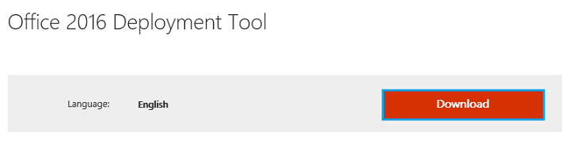

> [!warning]
>
> OVH met à votre disposition des services dont la configuration, la gestion et la responsabilité vous incombent. Il vous revient de ce fait d'en assurer le bon fonctionnement.
> 
> Nous mettons à votre disposition ce guide afin de vous accompagner au mieux sur des tâches courantes. Néanmoins, nous vous recommandons de faire appel à un prestataire spécialisé et/ou de contacter l'éditeur du service si vous éprouvez des difficultés. En effet, nous ne serons pas en mesure de vous fournir une assistance. Plus d'informations dans la section « Aller plus loin » de ce guide.
> 

## Configuration manuelle


> [!warning]
>
> Ce guide ne fonctionne pas avec la licence Office 365 Business mais uniquement pour la version ProPlus.
> 

L'installation d'une licence O365 ProPlus sur un ordinateur partagé en utilisant les services Bureau à distance (RDS) ne fonctionne pas sans un paramétrage spécifique.


{.thumbnail}

Si vous avez déjà réalisé l'installation de votre licence O365 Proplus, il est nécessaire de la désinstaller.

Une fois votre licence désinstallée, veuillez cliquer [ici](https://www.microsoft.com/en-us/download/details.aspx?id=49117){.external} afin de télécharger l'outil de déploiement Office 2016.


{.thumbnail}

Exécutez ensuite l'outil de déploiement sur votre serveur.


{.thumbnail}

Une fois l'outil de déploiement installé, vous devez modifier le fichier "configuration.xml"


{.thumbnail}

Éditez le fichier "configuration.xml" puis décommentez les lignes suivantes :

Display Level="None" AcceptEULA="True"
Property Name="SharedComputerLicensing" Value="1"

Si cette ligne n'existe pas, vous pouvez la copier/coller dans le fichier.

Vous pouvez enregistrer les modifications effectuées. Ouvrez ensuite un terminal powershell et exécutez ces deux commandes :

./setup.exe /download configuration.xml


{.thumbnail}

./setup.exe /configure configuration.xml


{.thumbnail}

Quand l'exécution de ces 2 commandes est terminée, vous pouvez ouvrir l'éditeur du registre "Regedit" puis suivre le chemin suivant :

HKEY\_LOCAL\_MACHINE\\SOFTWARE\\Microsoft\\Office\\ClickToRun\\Configuration

Vérifier la clé suivante :

SharedComputerLicensing

Sa valeur doit être à 1.

Si celle-ci n'existe pas, vous pouvez la créer.

Indiquez comme "données de la valeur" : 1 puis valider.


{.thumbnail}

Vous pouvez ensuite lancer une application de la suite O365, vous serez alors invité à saisir votre nom d'utilisateur et mot de passe.


{.thumbnail}

Vous pouvez maintenant utiliser votre suite O365 depuis votre ordinateur partagé en utilisant les services Bureau à distance (RDS).


{.thumbnail}


## Configuration via un script
Nous avons vu ci-dessus la configuration manuelle mais nous avons développé un script qui va réaliser ces différentes étapes automatiquement.

Voici le contenu du script :


```powershell
1. cd $env:TEMP
2. mkdir ovh-office -Force
3. cd ovh-office
4. rm *
5. $page = Invoke-WebRequest https://www.microsoft.com/en-us/download/confirmation.aspx?id=49117
6. $downloadLink = $page.Links | ?{$_.id -eq 'c50ef285-c6ea-c240-3cc4-6c9d27067d6c'}
7. $downloadLink = $downloadLink.href
8. Invoke-WebRequest $downloadLink -OutFile ODT2016.exe
9. .\ODT2016.exe /extract:./ /quiet
10. 
11. sleep 3
12. 
13. [xml]$configFile = Get-Content .\configuration.xml
14. $configFile.Configuration.InnerXml += '<Updates Enabled="TRUE" Channel="Current" /> <Property Name="AUTOACTIVATE" Value="1" />'
15. $configFile.Save("$env:TEMP\ovh-office\configuration.xml")
16. 
17. Write-Host "Starting download of files, this will take a few minutes"
18. .\setup.exe /download .\configuration.xml
19. Write-Host "Starting installation, this will take a while"
20. .\setup.exe /configure .\configuration.xml
21. 
22. if(-not (Test-Path HKLM:\SOFTWARE\Microsoft\Office\ClickToRun\Configuration))
23. {
24.     Write-Error "Failed to find the registry key, something went wrong. Stopping there"
25.     Pause
26. }
27. 
28. Set-ItemProperty -Path HKLM:\SOFTWARE\Microsoft\Office\ClickToRun\Configuration -Name SharedComputerLicensing -Value 1
```

Pour exécuter ce script copiez/collez l'intégralité du code dans un fichier de type ".ps1" puis exécutez le. Cela peut prendre plusieurs minutes.

Il est nécessaire de l'exécuter en tant qu'administrateur.

Une fois le script exécuté, vous pouvez lancer une application de la suite O365, vous serez alors invité à saisir votre utilisateur et mot de passe.


{.thumbnail}

Vous pouvez maintenant utiliser votre suite O365 depuis votre ordinateur partagé en utilisant les services Bureau à distance (RDS).


{.thumbnail}

## Aller plus loin

Échangez avec notre communauté d'utilisateurs sur <https://community.ovh.com>.