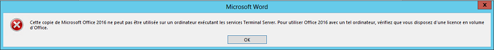
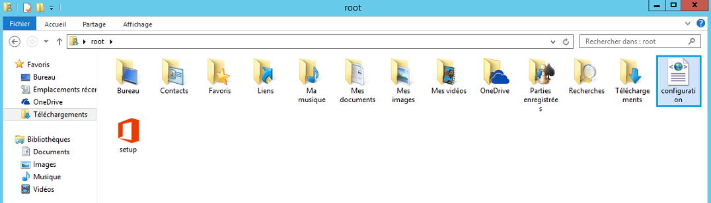
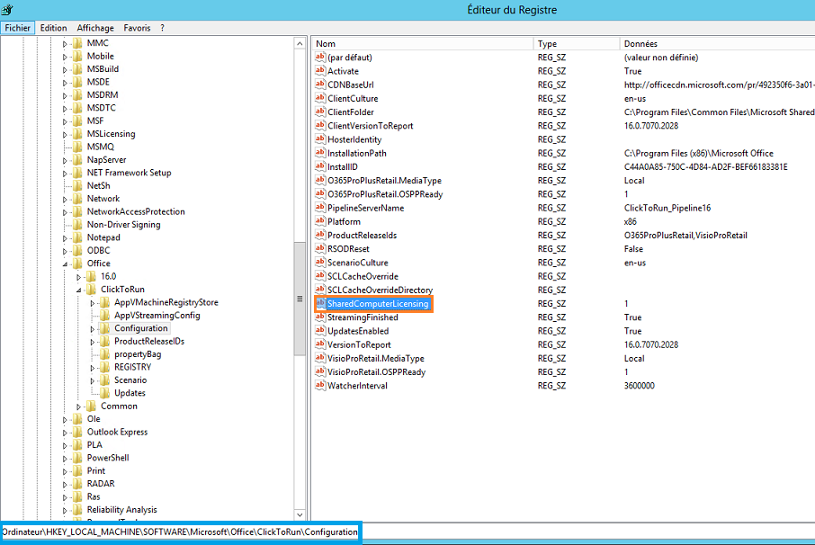

**Dernière mise à jour le 06/09/2021**

## Objectif

Vous souhaitez utiliser la suite logicielle présente dans le pack Microsoft 365 apps sur une machine distante ou partagée. Pour ce faire, il est nécessaire de suivre la procédure d'installation décrite dans ce guide.

**Découvrez comment installer et utiliser Microsoft 365 apps sur un bureau distant (RDS) ou un ordinateur partagé.**

## Prérequis

- Disposer d'une licence Microsoft 365 apps for entreprise (Anciennement Office 365 ProPlus)
- Utiliser Microsoft Windows via un bureau à distance (**R**emote **D**esktop **S**ervices)

> [!warning]
>
> La licence Microsoft 365 Apps for business est incompatible avec une utilisation via RDS et ordinateur partagé.
> 

## En pratique

Ce guide est basé sur les informations délivrées dans le guide Microsoft [Déployer Microsoft 365 Apps à l’aide des services Bureau à distance](https://docs.microsoft.com/fr-fr/deployoffice/deploy-microsoft-365-apps-remote-desktop-services).

> [!warning]
>
> OVHcloud met à votre disposition des services dont la configuration, la gestion et la responsabilité vous incombent. Il vous revient de ce fait d'en assurer le bon fonctionnement.
> 
> Nous mettons à votre disposition ce guide afin de vous accompagner au mieux sur des tâches courantes. Néanmoins, nous vous recommandons de faire appel à un [prestataire spécialisé](https://partner.ovhcloud.com/fr/) et/ou de contacter l'éditeur du service si vous éprouvez des difficultés. En effet, nous ne serons pas en mesure de vous fournir une assistance. Plus d'informations dans la section « Aller plus loin » de ce guide.
> 

### Méthode 1: Configuration manuelle

L'installation d'une offre Microsoft 365 Apps for entreprise sur un ordinateur partagé en utilisant les services Bureau à distance (RDS) ne fonctionne pas sans une configuration spécifique. Sans ce paramètrage, vous devriez obtenir le message suivant :

{.thumbnail}

> [!primary]
>
> Si vous avez déjà réalisé l'installation de votre licence Office 365 Proplus, il est nécessaire de la **désinstaller**.
>

- Une fois votre licence désinstallée, veuillez [cliquer ici](https://www.microsoft.com/en-us/download/details.aspx?id=49117){.external} afin de télécharger l'outil de déploiement Microsoft 365.


- **Exécutez** l'outil de déploiement sur votre machine.


- Modifiez le fichier `configuration.xml`.

{.thumbnail}

Éditez le fichier `configuration.xml`, puis décommentez les lignes suivantes :

```xml
Display Level="None" AcceptEULA="True"
Property Name="SharedComputerLicensing" Value="1"
```

Si ces lignes n'existent pas, vous pouvez les copier/coller dans le fichier.

- Enregistrez les modifications effectuées. Ouvrez ensuite un terminal powershell et exécutez ces deux commandes depuis le dossier où se trouve le fichier `configuration.xml`:

```powershell
./setup.exe /download configuration.xml
```

puis

```powershell
./setup.exe /configure configuration.xml
```
> [!primary]
>
> L'exécution de ces commandes peut prendre plusieurs minutes.

- Ouvrez l'éditeur du registre de windows en exécutant `Regedit`, puis suivre le chemin suivant :

```powershell
HKEY\_LOCAL\_MACHINE\\SOFTWARE\\Microsoft\\Office\\ClickToRun\\Configuration
```

- Vérifiez la clé suivante :

```powershell
SharedComputerLicensing
```
Assurez-vous que sa valeur est à `1`. Si cette clé n'existe pas, vous pouvez la créer.

{.thumbnail}

- Lancez une application de la suite Office 365, vous serez alors invité à saisir votre nom d'utilisateur et mot de passe.

{.thumbnail}

- Vous pouvez maintenant utiliser votre suite Office 365 depuis votre ordinateur partagé en utilisant les services Bureau à distance (RDS).


{.thumbnail}


## Aller plus loin

Échangez avec notre communauté d'utilisateurs sur <https://community.ovh.com>.
