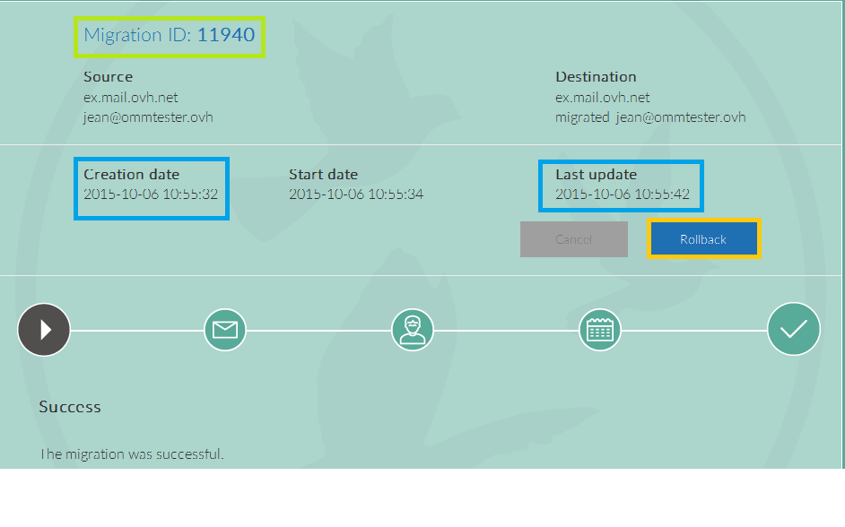

## Perform a migration

## Log in to the interface
Firstly, go to the [OVH Mail Migrator](https://omm.ovh.net) website.

- Select "New migration" to go to the next step.

{.thumbnail}

## Migration settings
You need to enter some information before launching the migration:

- 1.Source Exchange account information:
Server type: The Exchange account you are migrating must be based on a compatible Exchange solution (version 2010 or above) or Gmail*.
URL service: The URL for your Exchange server.
Login: Your Exchange account login (usually your full email address).
Password: Your Exchange account password.

To migrate from one email account to your Exchange solution:

Server type: choose Imap.
Service URL: ssl0.ovh.net
Login: Login for your email account: full email address
Password: The password for your email account.

- 2.Destination Exchange account information:
Server type: The type of OVH Exchange offer used.
URL service: The service URL (filled in automatically).
Login: Your Exchange login - usually your full email address.
Password: Your Exchange account password.

NB: You can only migrate to an Exchange version 2013 account or higher.

{.thumbnail}
*Migration from a Gmail account towards an exchange 2013 account or higher:

{.thumbnail}
you have to click on the Authorise Access button
A Gmail page opens so you can enter your password:

{.thumbnail}
If you're migrating from an Exchange service outside of OVH, you need to recreate the same email address in the [control panel](https://www.ovh.com/manager/web/login/). You will only be able to use it when your domain name's MX records have been updated and propagated. 

If you're migrating an OVH Exchange 2010 account towards OVH Exchange 2013 or higher, you will need to give your new account a different name and then rename it once you've deleted your old account (in order to completely delete the old 2010 account please contact [support](https://www.ovh.co.uk/support/contact-us/)).

- 3.Migration options:
You need to select the different elements that you want to migrate:
Emails: Emails, folder hierarchy is kept.
Calendars: Calendars 

linked to the account, events will be kept but event requests will not be recreated.
Contacts: Contacts 
added to the account.
Inbox rules: Rules 
defined in the account, you need Exchange 2010 or higher.
Contact groups: 
Contact groups created in the account.
Out of office settings: 
Rules defined in the out of office assistant.
Tasks: Tasks
setup in the account.

- 4.Completion:

To migrate from pop/imap towards Exchange, select "E-mails"

You can enter a "third party email" in order to get notifications about your migration.

{.thumbnail}
Once you've filled in this information, click on Start migration".

## Error: login/password/server
An error displays if you enter an incorrect login/password combination or server.

{.thumbnail}

## Migration status
The migration will be launched once you have created a task.

- You can track the progress of the migration.

The migration can take some time depending on the amount of data in your account and your internet connection.

Cancel: will cancel the next steps of the migration but will allow the current operation to complete.

{.thumbnail}

- Important: make a note of the task number (task ID) so you can find and track your account migration.

## Track the migration of my Exchange account
You can track the various stages of the migration of your account.

To do this, you will need:

- The task number (task ID) of the current migration: Migration task ID that you noted when you launched the migration task.
- your login for the source Exchange account (normally your full email address).

Fill in the required fields and click "Follow" to view migration status.

{.thumbnail}
In the new window, you will see the migration status. You can check which stage the migration is at or if it has completed.

- 1.Migration task ID.
- 2.Migration creation date.
- 3.Last migration update.
- 4.Rollback Lets you revert the account back to its original state (pre-migration).

{.thumbnail}

## Cancel
Cancel: will cancel the next steps of the migration but will allow the current operation to complete.
Example: your contacts are currently migrating. If you click "Cancel", your contacts will be fully migrated. However, if you requested the migration of your calendars, this operation will not be performed and the migration will terminate.

{.thumbnail}

## Rollback
Rollback: lets you revert the account back to its original state (pre-migration). This function is only available up to 48 hours after the migration has finished.

{.thumbnail}

