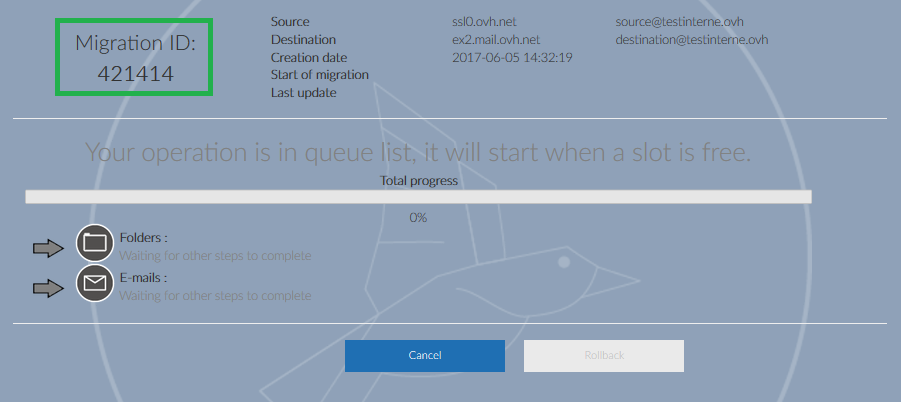
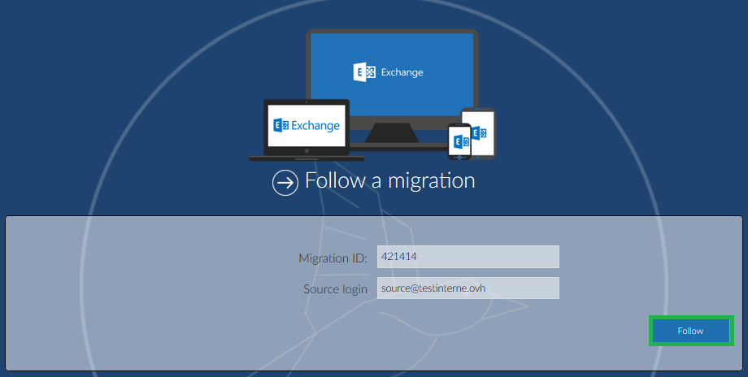

O OMM (OVH Mail Migrator) permite-lhe migrar o conteúdo da sua conta Exchange (e-mails, contactos, calendários, tarefas, etc.) sem que tenha de o exportar através de um ficheiro Outlook Data File (.pst), que pode ser um longo e complicado processo.

Primeiro, vá a: [OVH Mail Migrator](https://omm.ovh.net){.external}.

## Iniciar uma nova migracao
Clique em `Nova migração`{.action} para ir para o próximmo passo.

{.thumbnail}

### Conta de origem
Escolha o servidor e os detalhes do servidor de origem.

Se a conta de origem está alojada na OVH, pode escolher: **Hosted by OVH** (Autodetect). Deve introduzir o endereço de e-mail em questão e clicar em **Detect Settings**.

Vai depois ser pedido que introduza a password.

> [!primary]
>
> Por exemplo, migrar de um pacote MX Plan para um Email Pro:
> Server type: Hosted by OVH
> Login: O seu endereço de e-mail MX Plan
> Clique em Detect Settings
> Password: A password da conta de e-mail
> 

### Conta de destino

{.thumbnail}

Escolha o seu novo tipo de conta e introduza o seu endereço de e-mail e password. Os detalhes do servidor são preenchidos automaticamente.

> [!primary]
>
> Por exemplo, migrar de um pacote MX Plan para um Email Pro:
> Server type: Hosted by OVH
> Login: O seu endereço de e-mail MX Plan
> Clique em Detect Settings
> Password: A password da conta de e-mail Pro
> 

### Opcoes
Vai necessitar de selecionar os diferentes elementos que pretende migrar:

**Emails**: Emails, hierarquia de pastas é mantida.

**Calendars**: Calendário associado à sua conta, os eventos irão ser mantidos mas os pedidos para eventos não serão recriados.

**Contacts**: Os contactos adicionados na conta.

**Inbox rules**: Regras definidas na sua conta, necessita do Exchange 2010 ou superior.

**Contact groups**: Grupo de contactos criados na conta.

**Out of office settings**: Regras definidas no assistente "out of office".

**Tasks**: As tarefas configuradas na conta.

{.thumbnail}

### Terminar
Para migrar de uma conta POP/IMAP para um serviço Exchange, selecione "Emails".

Pode introduzir uma outra conta de e-mail se pretende receber notificações acerca da sua migração.

Após ter preenchido essa informação, clique em `Começar migração`{.action}.

Vai ser apresentado um caso caso introduza um login/password errado, ou errar no nome do servidor.

{.thumbnail}

A migração vai começar assim que criar a tarefa.

- Pode seguir o progresso da migração.

{.thumbnail}

> [!success]
>
> - 
> Importante! Tome nota do número da tarefa (task ID) para que possa encontrar e seguir a migração da sua conta.
> 
> 

## Importar um ficheiro PST
Possui um ficheiro do tipo .pst que deseja importar para a sua conta de e-mail. É possível a partir do menu `Migração PST`{.action}.

{.thumbnail}

Clique em `Iniciar a migração`{.action}

Deve de seguida selecionar o seu ficheiro PST a partir do menu `Explorar`{.action}

{.thumbnail}

Após o ficheiro .pst estar selecionado, será de novo solicitado que introduza a password da conta de destino antes de começar a migração.

Após a migração terminada, a identificação da migração será apresentada para que possa consultar o estado da sua migração.

## Seguir a migracao que esta em curso
Pode seguir as várias etapas da migração da sua conta.

Para efetuar esta verificação, necessita:

- O número da tarefa (task ID) da migração que está em curso (ver a etapa anterior)
- O endereço de e-mail de origem

Preencha os dados solicitados e clique `Follow`{.action} para verificar o estado da migração.

{.thumbnail}

Na nova janela, vai poder consultar o estado da migração. Pode ainda verificar em que etapa está a migração, ou se já foi concluída.

- 
    1. O task ID da migração.
- 
    1. Data de criação da migração.
- 
    1. A última atualização da migração.
- 
    1. `Rollback`{.action} permite-lhe reverter a sua conta ao seu estado original (antes da migração).

{.thumbnail}

### Cancelamento
**Cancel**: termina a atual operação mas cancela as próximas etapas.

- Por exemplo: Os seus contactos estão a ser migrados, e se clicar em "Cancel"*
- Iremos terminar a migração dos contactos, mas se pediu que os seus calendários fossem migrados,
- esta tarefa não será efetuada e a migração terminará.*

### Rollback
`Rollback`{.action} permite-lhe reverter a sua conta ao seu estado original (antes da migração) . Esta função apenas está disponível até 48h depois da migração ter terminado.