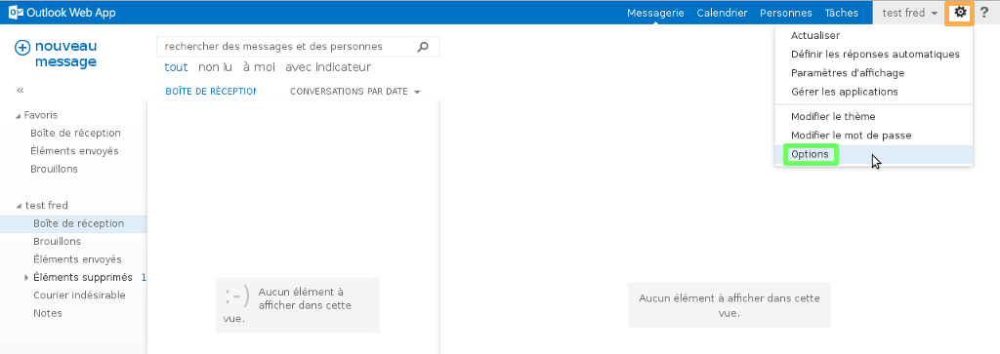
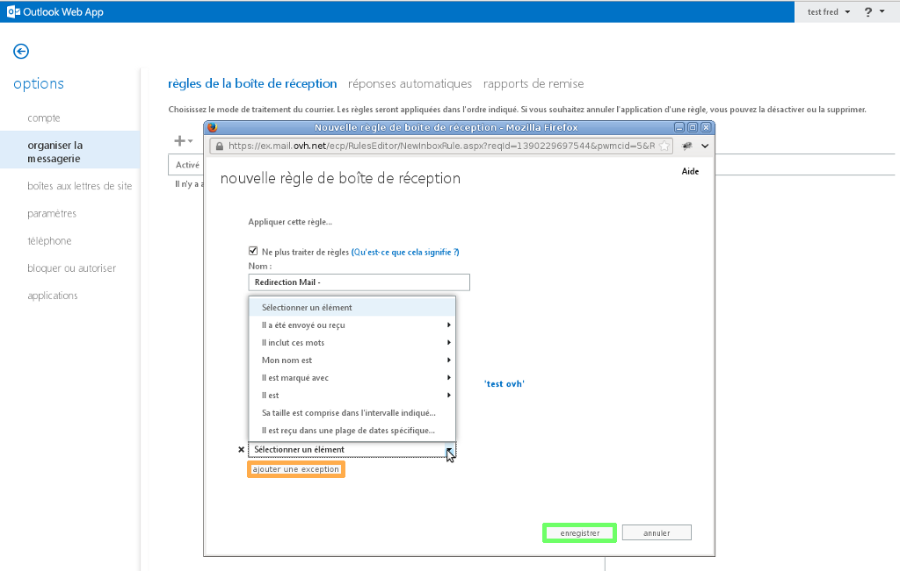

Voici un guide pour vous aider à mettre en place une redirection e-mail depuis l'interface du Webmail Exchange.

Cliquez [ici](https://www.ovh.com/fr/emails/hosted-exchange/guides/){.external} pour retrouver nos différents guides.

## Redirection e-mail - OWA

### Mise en place Partie 1
Voici comment ajouter votre redirection e-mail depuis l'interface du [Webmail
Exchange](https://ex.mail.ovh.net/owa/){.external}.

Identifiez-vous avec votre adresse e-mail entière et le mot de passe de votre compte e-mail.

Une fois connecté sélectionnez l'icône en forme d'engrenage, puis sélectionnez "Options".

{.thumbnail}

### Mise en place Partie 2
Sélectionnez ensuite l'onglet "organiser la messagerie" puis l'icône en forme de "+".

Sélectionnez l'option "Créer une règle pour les messages entrants" pour continuer.

{.thumbnail}

### Mise en place Partie 3
Une nouvelle interface apparaît.

Renseignez les champs demandés :

**Nom** :  le nom d'affichage de votre règle.

**Lorsque le message arrive et** :  filtre pour le message à rediriger.

**Effectuer les opérations suivantes** :  choix de l'opération à réaliser (redirection, suppression, déplacement...).

Cliquez sur "Sélectionner des personnes..." pour choisir vers qui rediriger les e-mails.

{.thumbnail}

### Mise en place Partie 4
Sélectionnez les contacts vers qui vous souhaitez rediriger vos e-mails.

Cliquez sur "Ok" pour valider votre choix.

{.thumbnail}

### Mise en place Partie 5
Vous avez la possibilité d'ajouter des exceptions, par exemple ne pas rediriger l'e-mail s'il a été reçu d'une adresse e-mail en particulier.

Finalisez votre règle en cliquant sur "enregistrer".

{.thumbnail}

### Mise en place Partie 6
Cliquez sur "oui" pour valider le message d'avertissement qui apparaît.

{.thumbnail}

### Mise en place Partie 7
Votre règle apparaît maintenant correctement.

Un résumé des options choisies s'affiche à droite.

À ce stade, vous pouvez supprimer la règle si elle n'a plus lieu d'être.

{.thumbnail}

## Filtre SPAM/Virus

### Mise en place d'une regle contre les spams/Virus
Voici un exemple de règle réalisable afin de filtrer les spams dans un dossier "Courrier indésirable".

La politique d'OVH fait en sorte de ne jamais supprimer vos spams, afin d'éviter les faux positifs.

Il sont cependant tagués comme tels.

Voici un exemple de règle qu'il est possible de mettre en place :

**Nom** :  le nom d'affichage de votre règle.

**Lorsque le message arrive et** :  "Il inclut ces mots dans l'objet..." ajoutez ensuite le terme "spam" ou "Virus"

**Effectuer les opérations suivantes** :  "Déplacer le message vers le dossier..." sélectionnez le dossier "Courrier indésirable"

{.thumbnail}