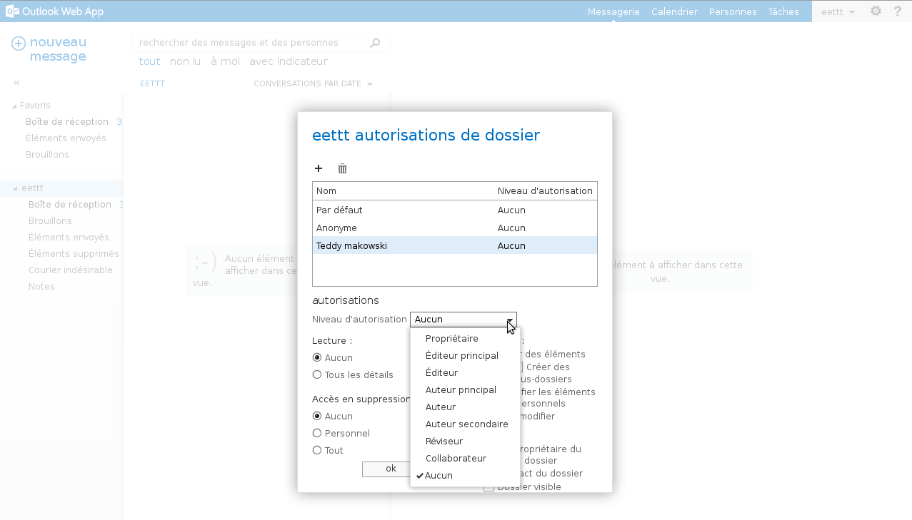

Deux choses sont à réaliser par le premier collaborateur pour partager un dossier. D'abord donner les autorisations de partage sur son compte e-mail. Puis donner les autorisations de partage sur le dossier en question. Le second collaborateur devra, quand à lui, récupérer le dossier en question. Les manipulations se réalisent dans le webmail Exchange

Cliquez [ici](https://www.ovh.com/fr/emails/hosted-exchange-2013/documents/){.external} pour retrouver nos différents guides.

## Point de vue de l'utilisateur qui partage le dossier

### Autorisations de partage boite e-mail Partie 1
D'abord, donnez les autorisations de partage sur votre boite e-mail. Pour cela, réalisez un clic droit sur le nom de la boîte e-mail et cliquez sur "autorisations". Une nouvelle fenêtre apparaît.

En haut à droite de l'interface, "eettt" est le nom notre premier utilisateur

{.thumbnail}

### Autorisations de partage boite e-mail Partie 2
Cliquez sur le  **+**  afin d'ajouter un collaborateur qui recevra le partage du compte e-mail. Une nouvelle interface apparaît ensuite.

{.thumbnail}

### Autorisations de partage boite e-mail Partie 3
Ajoutez l'utilisateur comme cela est décrit dans les 3 étapes ci-contre, puis cliquez sur "ajouter".

{.thumbnail}

### Autorisations de partage boite e-mail Partie 4
Ensuite, donnez à cet utilisateur les droits nécessaires, par exemple éditeur principal.

Validez en cliquant sur le bouton  "ok".

{.thumbnail}

### Mise en place autorisations de partage sur le dossier
Donnez maintenant les droits sur un dossier, en l'occurrence le dossier "Eléments envoyés"

De la même manière que précédemment, cliquez droit sur le dossier "Eléments envoyés" puis

cliquez sur "autorisations"

Il vous est possible de réaliser la manipulation avec le dossier de votre choix.

Vous devrez réaliser les mêmes manipulations que précédemment, à savoir ajouter un collaborateur puis lui donner des droits nécessaires sur le dossier en question.

{.thumbnail}

## Point de vue de l'utilisateur qui recoit le dossier partage

### Recuperation du dossier partage Partie 1
Sur le [Webmail Exchange](https://ex.mail.ovh.net/owa/){.external} du second utilisateur, ajoutez le dossier partagé.

Réalisez un clic droit sur votre compte e-mail, puis sélectionnez "ajouter un dossier partagé".

{.thumbnail}

### Recuperation du dossier partage Partie 2
Renseignez le compte de l'utilisateur ayant réalisé le partage du dossier.

{.thumbnail}

### Recuperation du dossier partage Partie 3
Notre dossier "Eléments envoyés" apparaît maintenant correctement dans [OWA](https://ex.mail.ovh.net/owa/){.external}.

{.thumbnail}