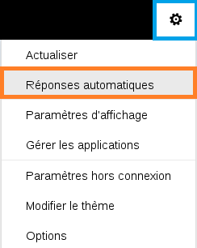
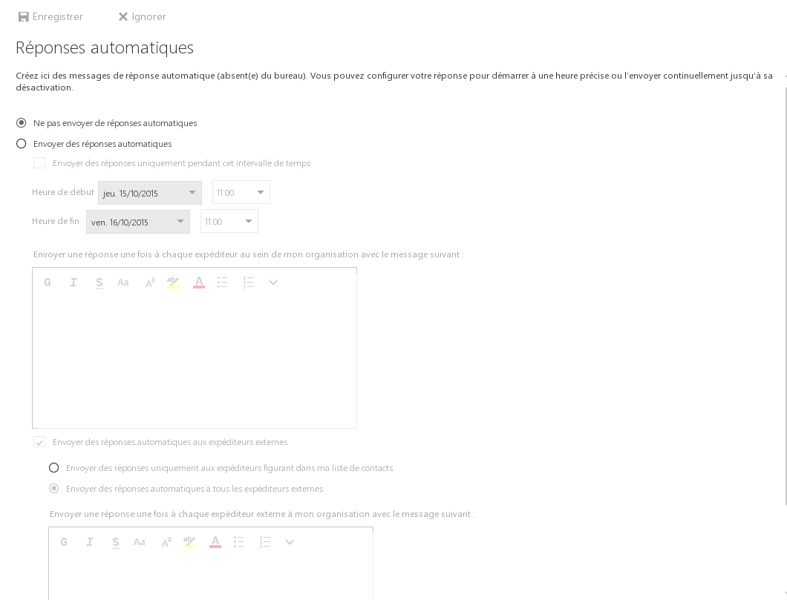
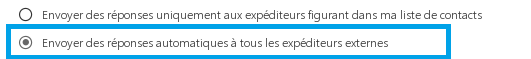

## Informazioni generali
Questa funzionalità ti permette di creare risposte automatiche per quando sei assente o per necessità particolari.

## Come fai a creare una risposta automatica?

## Impostazione
Una volta connesso al tuo account Exchange dall'interfaccia [Outlook Web App (OWA)](https://ex.mail.ovh.net/owa/), accedi a questa funzionalità cliccando sul tasto "Impostazioni" (simbolo della rotella dell'ingranaggio) e poi "Risposte automatiche".

In alternativa, clicca su "Impostazioni", "Opzioni", "Posta", "Risposte automatiche".

{.thumbnail}
Accedi a questa interfaccia:

Clicca su "Invia risposte automatiche" e definisci, se necessario, l'intervallo orario durante il quale verranno inviate le risposte automatiche.

Utilizza l'editor di testo disponibile per personalizzare il tuo messaggio (dimensione, carattere, inserimento di link, ecc...).

{.thumbnail}

## Tipologie di risposte
Puoi impostare diverse tipologie di risposte automatiche:

- solo ai mittenti della tua organizzazione

Le risposte automatiche saranno inviate solo agli utenti Exchange della tua piattaforma Exchange.

- ai mittenti interni ed esterni alla tua organizzazione

Puoi, ad esempio, decidere di inviare una risposta automatica specifica alle persone che fanno parte della tua organizzazione (i tuoi colleghi) e un'altra risposta alle persone esterne alla tua organizzazione (i tuoi clienti, i tuoi amici, ecc...).

{.thumbnail}

## Informazioni aggiuntive
Una volta attivata una risposta automatica, riceverai le email che ti vengono inviate normalmente, nella posta in arrivo.

Se definisci un intervallo orario per l'attivazione delle risposte automatiche, nella barra blu in alto della pagina apparirà un nuovo tasto, con cui puoi eventualmente disattivare questa funzionalità.

{.thumbnail}
Attenzione: per evitare lo Spam, la risposta automatica viene inviata una sola volta a ogni mittente.

