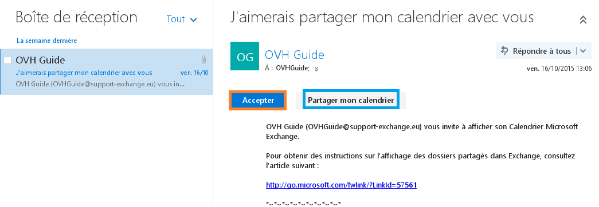
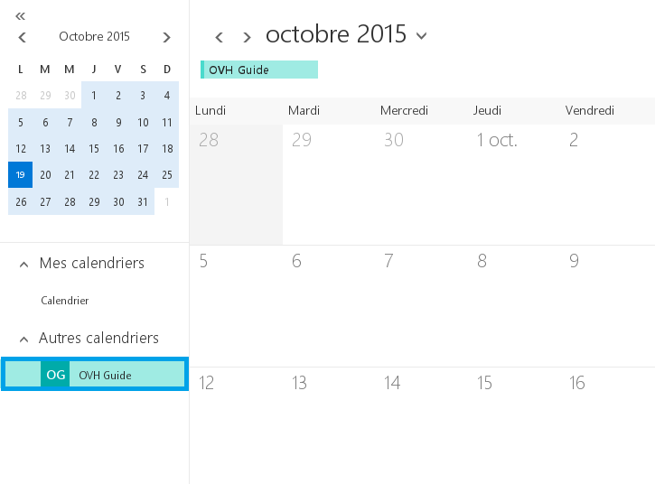

## Zezwolenie na współdzielenie kalendarza - etap 2
Udostępnianie zostanie wykonane z konta ovhguide@support-exchange.eu na konto ovhguide2@support-exchange.eu.
W niebieskim menu w górnej części wybierz "Kalendarz".

{.thumbnail}
Następnie w lewej części wybierz prawym kliknięciem kalendarz główny.
W naszym przykładzie chodzi o kalendarz z niebieską ikoną.

Kliknij na "Udostępnianie kalendarza".

{.thumbnail}

## Zezwolenie na współdzielenie kalendarza - etap 2
W części "Udostępnij:  wpisz użytkownika, z którym chcesz współdzielić kalendarz. Użytkownik ten mus mieć konto Exchange w tej samej domenie. 

Po dodaniu użytkownika wybierz uprawnienia dla niego.

Aby potwierdzić operację, kliknij na "Wyślij".

{.thumbnail}

## Pobieranie kalendarza poprzez e-mail z potwierdzeniem
Po zalogowaniu do [Webmail Exchange](https://ex.mail.ovh.net/owa) zobaczysz e-mail od osoby, która udostępnia kalendarz.

- Możesz potwierdzić współdzielenie kalendarza w otrzymanej wiadomości.

- Możesz współdzielić swój kalendarz z inną osobą wysyłając jej zaproszenie.

{.thumbnail}

## Pobieranie współdzielonego kalendarza w OWA
W sekcji "Kalendarz" w interfejsie OWA pojawi się współdzielony kalendarz.

Chodzi o kalendarza konta ovhguide@support-exchange.eu, który jest dostępny z poziomu konta ovhguide2@support-exchange.eu.

{.thumbnail}

