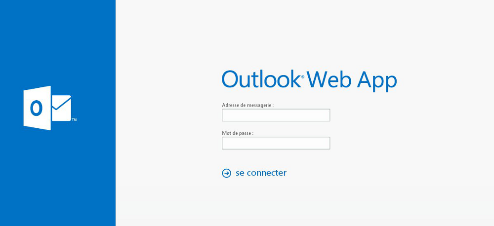
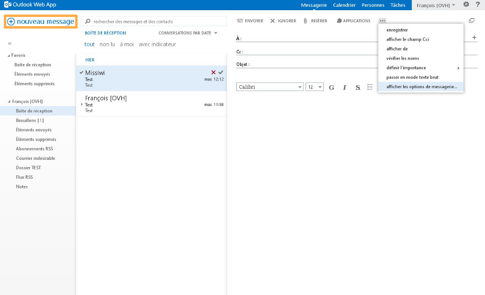
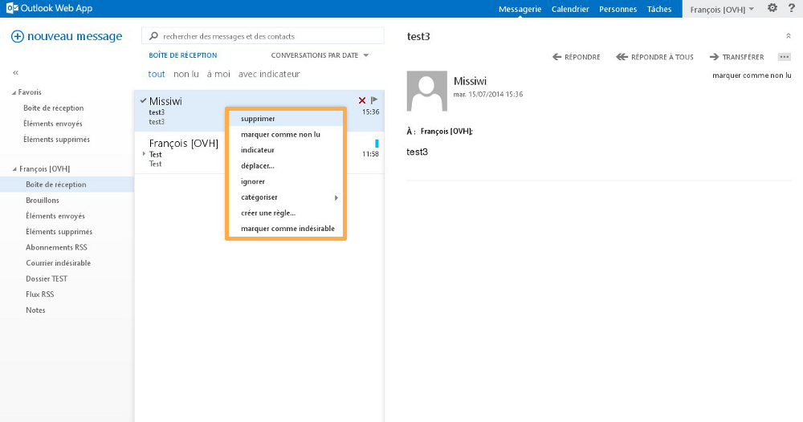
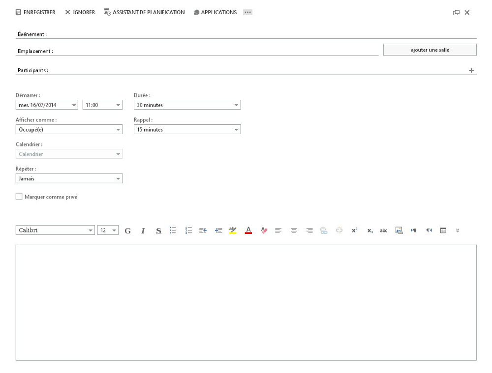

## Kas yra Outlook Web App (OWA)?
OWA – tai Exchange 2013 žiniatinklio paštas (webmail). Šioje sąsajoje jūs galite tikrinti ir naudoti Exchange paskyrą, taip pat naudotis kitomis funkcijomis, susietomis per paprastą interneto puslapį.  

Ši sąsaja labai naudinga, jeigu neturite el. pašto programos, tinkamos Exchange paskyrai konfigūruoti ir naudoti.

## Kaip ir kur prisijungti prie OWA?
El. pašto adresas atitinka visą Exchange adresą, kurį norite naudoti. 

Slaptažodis atitinka jūsų  [žiniatinklio kliento paskyroje](https://www.ovh.com/manager/web/login.html) sukurtą slaptažodį, kurį nurodėte Exchange adreso sukūrimo metu.

Hosted Exchange 2013:[https://ex.mail.ovh.net](https://ex.mail.ovh.net)

Private Exchange 2013: Prieigos URL priklauso nuo jūsų serverio host pavadinimo, kurį nurodėte paslaugos kūrimo metu.

{.thumbnail}

## Papildoma informacija
Pirmą kartą jungiantis prie OWA, jums reikės apibrėžti savo laiko zoną.

{.thumbnail}

## Pranešimai
Pranešimų mygtukas jums leidžia skelbti savo el. pašto dėžutę. 

Kairiajame stulpelyje rasite naujų pranešimų kūrimo mygtuką, taip pat sisteminius katalogus ar kitus asmeniniam naudojimui pritaikytus katalogus (mūsų atveju, tai "TESTAVIMO katalogas")

Ženklas «  mygtuko "Naujas pranešimas" apačioje jums leidžia paslėpti visą šį stulpelį (išskyrus "Naujas pranešimas").

{.thumbnail}

## Naujas pranešimas
Jūs galite, pavyzdžiui, pridėti priedą prie savo el. laiško, naudoti [papildomas aplikacijas](http://office.microsoft.com/fr-fr/store/applications-pour-outlook-FX102825292.aspx?app=outlook.exe), susietas su OWA, taip pat įjungti patvirtinimą apie el. laiško gavimą ar perskaitymą.

Jums taip pat pateikiamos paprastos turinio redagavimo parinktys (formato, dydžio, spalvos ir t.t.).

Papildoma informacija
Per OWA pridedamų priedų dydis ribojamas iki 35 MB. ActiveSync sinchronizavimo aplikacija priedų dydį riboja iki 10 MB (ypatingai su ActiveSync suderinamuose išmaniuosiuose telefonuose). Naudojant suderinamą el. pašto programą (pavyzdžiui, Outlook), maksimalus leidžiamas priedo dydis: 100 MB.

{.thumbnail}

## Sisteminiai katalogai ir asmeniniam naudojimui pritaikyti katalogai
Pagal nutylėjimą, jūs matysite šiuos sisteminius katalogus:

- Gautų pranešimų dėžutė
- Juodraščiai
- Išsiųsti pranešimai
- Ištrinti pranešimai
- RSS prenumerata
- Nepageidaujami pranešimai
- RSS srautas
- Pastabos

Sisteminio katalogo pavadinimas negali būti pakeistas, šio katalogo negalima nei perkelti, nei ištrinti. Tai nustatytos taisyklės, kurių negalima keisti.

Dešiniuoju pelės mygtuku pažymėję savo Exchange paskyros paskelbimo pavadinimą arba katalogą, matysite įvairias galimas parinktis: 

Sukurti katalogą: katalogas sukuriamas dešiniojo pelės mygtuko paspaudimo vietoje. Mūsų atveju, katalogas bus sukurtas kitų sisteminių katalogų lygmeniu. 

Pervadinti: pervadinamas asmeniniam naudojimui pritaikytas katalogas.

Trinti: trinamas asmeniniam naudojimui pritaikytas katalogas.

Išvalyti: išvalomas sisteminis ar asmeniniam naudojimui pritaikytas katalogas. Visas turinys bus perkeltas į "Ištrinti pranešimai"

Pridėti prie favoritų: pasirinktas katalogas įtraukiamas į "Favoritai". 

Perkelti: pasirinktas asmeniniam naudojimui pritaikytas katalogas perkeliamas į kitą katalogą. 

Pažymėti viską kaip perskaityta: visi kataloge esantys neperskaityti el. laiškai pažymimi kaip perskaityti.  

Pridėti bendrai naudojamą katalogą: pridedama prieiga prie kito jūsų Exchange platformos naudotojo katalogo, kurį galėsite bendrai naudoti (ši parinktis neprieinama  dešiniuoju pelės mygtuku pažymėjus sisteminį ar asmeniniam naudojimui pritaikytą katalogą).

Leidimai: galimybė suteikti kitam jūsų Exchange platformos naudotojui prieigą prie pasirinkto sisteminio ar asmeniniam naudojimui pritaikyto katalogo. Suteikus leidimą, naudotojas, su kuriuo dalijamasi, turi naudoti aukščiau aprašytą funkciją  (Pridėti bendrai naudojamą katalogą) per savo Exchange paskyros OWA sąsają.

{.thumbnail}

## Katalogo turinys
Tai pasirinkto katalogo turinio skelbimas. Mūsų atveju, tai pasirinktas sisteminis katalogas "Gautų pranešimų dėžutė". Matome du testinius el. laiškus. 

Šio stulpelio viršuje matysite paieškos laukelį, kuriame rasite el. laiškus bei kontaktus, taip pat įvairias rūšiavimo parinktis: 

Pokalbiai pagal datą: jūs galite valdyti el. laiškų skelbimą naudodamiesi įvairiomis rūšiavimo sistemomis (pagal datą, gavėją, žymėjimą, dydį ir t.t.)

Visi: skelbiami visi el. laiškai.

Neperskaityti: skelbiami tik neperskaityti el. laiškai.

Man adresuoti: skelbiami el. laiškai, kurie buvo adresuoti tik jums.

Su rodikliu: el. laiškai rodomi tik su rodikliu (⚐ simbolis el. laiško pavadinimo pabaigoje).

{.thumbnail}

## El. pašto parinktis
Jums taip pat prieinamos skirtingos parinktys, spragtelėjus el. laišką dešiniuoju pelės mygtuku: 

Trinti: trinamas pasirinktas el. laiškas.

Pažymėti kaip perskaitytus: pažymėtas el. laiškas pažymimas kaip perskaitytas.

Pažymėti kaip atliktus: ši parinktis pasirodys tik tokiu atveju, jeigu el. laiškas prieš tai buvo pažymėtas rodikliu (⚐), todėl el. laiškas gali būti pažymėtas kaip atliktas. 

Perkelti: pasirinktas el. laiškas perkeliamas į specifinį katalogą.

Ignoruoti: pasirinktas el. laiškas ir susieti pokalbiai ignoruojami. El. laiškas ir pokalbiai bus perkelti į sistemini katalogą "Ištrinti pranešimai". Visi būsimi el. laiškai, siunčiami šiam pokalbiui pratęsti, bus automatiškai perkeliami į sisteminį katalogą "Ištrinti pranešimai".

Nustatyti kategoriją: nustatoma pasirinkto el. pašto kategoriją, priskiriant spalvą. Jūs taip pat galite valdyti savo kategorijas ir keisti naudojamas spalvas. 

Sukurti taisyklę: sukuriama gautų pranešimų dėžutės taisyklė ir nustatoma, kaip jūsų Exchange paskyra apdoros būsimus gautus pranešimus.

Pažymėti kaip nepageidaujamus: pasirinktas el. laiškas ir jo siuntėjas žymimi kaip nepageidaujami. Toks el. laiškas bus automatiškai perkeltas į sisteminį katalogą "Nepageidaujami pranešimai". Jūs galite matyti patvirtintų ar užblokuotų naudotojų sąrašą skiltyje "Nustatymai" (žymima krumpliaračiu), "Parinktys", "Blokuoti ar autorizuoti".

{.thumbnail}

## El. laiško turinys
Čia paskelbiamas jūsų pasirinkto el. laiško turinys, el. laiško siuntėjo profilio nuotrauka, el. laiško gavimo data ir valandai bei įvairios papildomos parinktys:

Atsakyti: atsakyti el. laiško siuntėjui.

Atsakyti visiems: atsakyti visiems asmenims, gavusiems el. paštą arba esantiems "Kam" laukelyje.  

Persiųsti: persiųsti visą el. laišką, įskaitant priedą. 

Daugiau veiksmų (žymima « ... »): galimybė skelbti papildomas parinktis.

{.thumbnail}

## Papildomos parinktys:
Atsakyti gyvai: ši parinktis dar neprieinama. Ši funkcija bus įgyvendinta artimiausiu metu, pasirodžius Lync aplikacijai. 

Atsakyti visiems gyvai: ši parinktis dar neprieinama. Ši funkcija bus įgyvendinta artimiausiu metu, pasirodžius Lync aplikacijai. 

Trinti: trinamas pasirinktas el. paštas.

Nustatyti kategoriją: nustatoma pasirinkto el. pašto kategoriją, priskiriant spalvą. Jūs taip pat galite valdyti savo kategorijas ir keisti naudojamas spalvas.

Pažymėti kaip nepageidaujamus: pasirinktas el. laiškas ir jo siuntėjas žymimi kaip nepageidaujami. Toks el. laiškas bus automatiškai perkeltas į sisteminį katalogą "Nepageidaujami pranešimai". Jūs galite matyti patvirtintų ar užblokuotų naudotojų sąrašą skiltyje "Nustatymai" (žymima krumpliaračiu), "Parinktys", "Blokuoti ar autorizuoti".

Atidaryti atskirame lange: pasirinktas el. laiškas atidaromas naujame lange.

Spausdinti: pasirinktas el. laiškas atidaromas naujame lange, kad galėtumėte iš karto jį atspausdinti. 

Sukurti taisyklę: sukuriama gautų pranešimų dėžutės taisyklė ir nustatoma, kaip jūsų Exchange paskyra apdoros būsimus gautus pranešimus.

Skelbti pranešimo detales: paskelbkite pasirinkto el. laiško antraštę. Ši parinktis jums leidžia stebėti el. laiško nueitą kelią (naudojamą serverį, datą, valandą ir t.t.) tol, kol šis el. laiškas pasiekė mūsų serverius. Tam tikrais atvejais mūsų techninė pagalba jūsų paprašys naudoti šią parinktį, jei reikia atlikti diagnostiką.

{.thumbnail}

## Bendra informacija
Mygtukas "Kalendorius" jums leidžia peržiūrėti, valdyti ar kurti savo kalendorius. Šioje skiltyje jums taip pat suteikiama prieiga prie bendrinamų kalendorių arba galėsite inicijuoti kalendorių bendrinimą.

Šiame gide paaiškinta, kaip naudotis šia funkcija:

{.thumbnail}

## Naujas įvykis
Šis mygtukas jums leidžia įtraukti įvykį į savo ar bendrai naudojamą kalendorių.

Kaip ir naujo el. laiško kūrimas, įvykio, įtraukiamo į pasirinktą kalendorių, turinys gali būti redaguojamas naudojantis įvairiomis turinio redagavimo parinktimis.

{.thumbnail}

## Bendra informacija
Mygtukas "Asmenys" jums leidžia skelbti kontaktus, kurti kontaktus ar kontaktų katalogus, susietus su jūsų Exchange paskyra. 

Kairėje esančiame stulpelyje jūs rasite visus su jūsų Exchange paskyra susietus kontaktus, taip pat su Exchange platforma susietus kontaktus (arba globalią adresų knygutę) bei resursų paskyrų adresus:

{.thumbnail}

## Naujas kontaktas
Šis mygtukas jums leis skurti naują kontaktą arba naują kontaktų grupę.

{.thumbnail}

## Kontakto duomenys
Kuriant naują kontaktą, jums bus pasiūlyta pridėti papildomą šio kontakto informaciją: vardą, pavardę, telefono numerį ir t.t.

{.thumbnail}

## Kontaktų grupė
Kuriant kontaktų grupę, jums bus pasiūlyta pridėti naujus narius. Tai el. pašto adresai, įtraukti į jūsų adresų knygutę, arba išoriniai adresai, kuriuos galite įvesti rankiniu būdu. 

Vėliau galėsite nuspręsti, ar siųsti el. laišką jūsų kontaktų grupei. E. laiškas bus persiųstas visiems nariams, kuriuos jūs pridėjote.

{.thumbnail}

## Papildoma informacija
OWA jums neleis inicijuoti kontaktų bendrinimo. Šiam veiksmui atlikti, jums reikės suderinamos el. pašto programos, pavyzdžiui, Outlook. Prašome naudotis šiuo gidu: 

## Bendra informacija
Mygtukas Užduotys jums leidžia kurti, valdyti ir skelbti užduotis, susietas su jūsų Exchange paskyra. 

Viduriniame stulpelyje bus paskelbtas pasirinkto užduoties katalogo turinyje, o dešiniajame stulpelyje matysite bus detaliai aprašyta jūsų pasirinkta užduotis.

{.thumbnail}

## Nauja užduotis
Šis mygtukas jums leidžia kurti naują užduotį pasirinktų užduočių kataloge, pasirinkti jos temą, atlikimo terminą ir pridėti kitą papildomą informaciją (tema, atlikimo terminas, atlikimas procentais ir t.t.).

{.thumbnail}

## Užduočių katalogas
Kairiajame stulpelyje matysite visus užduočių katalogus. Jūs galite dešiniuoju pelės mygtuku pasirinkti meniu "Mano užduotys" ir sukurti asmeniniam naudojimui pritaikytą užduočių katalogą.

{.thumbnail}

## Papildoma informacija
OWA jums neleis inicijuoti užduočių bendrinimo. Šiam veiksmui atlikti reikia suderinamos el. pašto programos, pavyzdžiui, Outlook.

## Parinktys
Šis mygtukas jums suteikia prieigą prie šių parinkčių: 

- Keisti: keisti jūsų Exchange paskyros profilio nuotrauką.

- Atidaryti el. pašto dėžutę: šiam veiksmui atlikti naudokitės gidu:

- Atsijungti: Exchange paskyros atjungimas ir  OWA identifikavimo puslapio skelbimas.

{.thumbnail}

## Profilio nuotrauka
Paspauskite mygtuką "Peržiūrėti" ir savo kompiuteryje pasirinkite nuotrauką savo profiliui.

{.thumbnail}

## Parinktys
Čia jūs turite prieigą prie bendrų jūsų Exchange paskyros nustatymų ir papildomų parinkčių. Patikslinkime čia:

Atnaujinti informaciją: Exchange paskyros informacijos atnaujinimas. Jeigu jums siunčiamas el. laiškas, naudokite šį mygtuką, kad atnaujintumėte gavimą.

Apibrėžti automatinius nustatymus: automatinių atsakymų (arba atsakiklio) diegimas jūsų Exchange paskyrai.

Paskelbimo nustatymai: OWA sąsajos paskelbimo nustatymų keitimas. El. laiškų valdymas, el. pašto pokalbių nustatymai, el. laiško skaitymo langelio skelbimas, OWA light versijos paskelbimas, Microsoft signalai.

Valdyti aplikacijas: šioje skiltyje jūs galėsite valdyti ar pridėti prie OWA papildomas aplikacijas (ar įskiepius). Tam tikras aplikacijas mūsų administratoriai įdiegė pagal nutylėjimą, todėl jos negali būti pašalintos.

Nustatymai neprisijungus: įjungiama ar išjungiama prieiga prie jūsų Exchange paskyros, jei nesate prie jos prisijungę. Ši parinktis labai naudinga, jei norite peržiūrėti savo Exchange paskyrą, bet negalite prisijungti prie interneto.

Keisti temą: keičiama OWA tema bei spalvos.

Keisti slaptažodį: keisti jūsų Exchange paskyros slaptažodį. Šiam veiksmui atlikti jūs taip pat galite naudoti savo  [žiniatinklio kliento sąsają](https://www.ovh.com/manager/web/login.html).

Parinktys: skelbiamos papildomos jūsų Exchange paskyros parinktys. Jos bus patikslintos kitoje skiltyje. 

Pagalba (klaustuko formos piktograma): Microsoft pagalba.

{.thumbnail}

## Papildomos jūsų Exchange paskyros parinktys
Šioje skiltyje rasite šias parinktis:

Paskyra: čia matysite bendrą informaciją apie savo Exchange paskyrą. Jūs taip pat galėsite keisti savo Exchange paskyros slaptažodį ir tam tikrą informaciją. 

- Papildoma informacija: galimybė keisti vardą, pavadvę, Exchange paskelbimo pavadinimą bei adresą tik jūsų [žiniatinklio kliento sąsajoje](https://www.ovh.com/manager/web/login.html).

Organizuoti pranešimus: čia jūs galite apibrėžti gautų pranešimų dėžutės taisykles, automatinius atsakymus ir peržiūrėti siuntimo ataskaitas savo Exchange paskyrai.

Interneto svetainės el. laiškų dėžutė: ši parinktis dar neprieinama. Ši funkcija bus įgyvendinta artimiausiu metu, pasirodžius Lync aplikacijai. 

Nustatymai: kiti jūsų pranešimų bei jų paskelbimo nustatymai, pranešimų parinktys, kalendoriai, regioninės parinktys, Exchange paskyros slaptažodžio keitimas.

Telefonas: čia jūs galite peržiūrėtu periferinius įrenginius, kuriuose sukonfigūruota jūsų Exchange paskyra. Jūs galite pašalinti periferinį įrenginį iš sąrašo, pridėti iš naujo nuotoliniu būdu arba užblokuoti.

Blokuoti ar autorizuoti: čia jūs galite valdyti patvirtintus ar užblokuotus el. laiškų siuntėjus ar gavėjus. Jeigu jums atrodo, kad el. laiškas nepageidaujamas, šio laiško siuntėjas bus užblokuotas ir  perkeltas į šią skiltį.

Aplikacija: čia jūs galite pridėti papildomas aplikacijas (ar įskiepius) prie savo OWA sąsajos. Tam tikras aplikacijas mūsų administratoriai įdiegė pagal nutylėjimą, todėl jos negali būti pašalintos. 

Papildoma informacija: [lStore Office](http://office.microsoft.com/fr-fr/store/applications-pour-outlook-FX102825292.aspx?app=outlook.exe) rasite papildomas aplikacijas. Visos aplikacijos negalės būti pridėtos pagal nutylėjimą.  Tam tikroms aplikacijoms reikės administratoriaus autorizavimo.  Jei norite įdiegti aplikaciją, kuriai reikia administratoriaus leidimo, jūs galite susisiekti su mūsų Exchange pagalba ir mes išnagrinėsime jūsų užklausą.

{.thumbnail}

