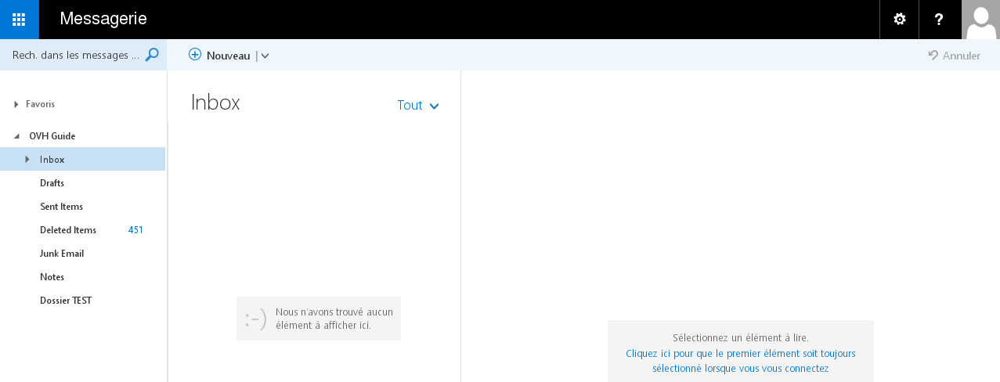
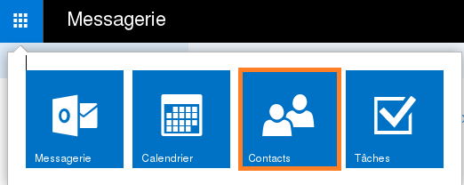
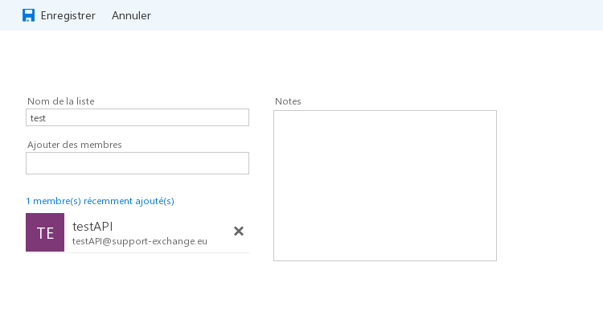
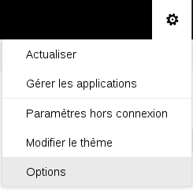
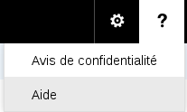

## Mikä Outlook Web App (OWA) on?
OWA on Exchange-selainpostikäyttöliittymä. Tämä mahdollistaa Exchange-tilin käyttämisen pelkkää www-selainta käyttäen.

OWA on erityisen hyödyllinen silloin, mikäli sinulla ei ole erillistä sähköpostiohjelmaa ladattuna.

## Mistä ja miten OWA-käyttöliittymään kirjautuminen onnistuu?
Sisäänkirjautumisessa käytettävä sähköpostiosoite on täysi Exchange-osoite.

Salasana on se, minkä teit [Web-hallintapaneelin](https://www.ovh.com/manager/web/login.html) kautta.

Hosted Exchange:[https://ex.mail.ovh.net](https://ex.mail.ovh.net)

Private Exchange: Kirjautumisosoite riippuu asiakkaan palvelimen osoitteesta. Tämä osoite näkyy myös hallintapaneelissa.

{.thumbnail}

## Lisätietoja
Kun kirjaudut ensimmäisen kerran sisään OWAan, sinun täytyy asettaa oikea aikavyöhyke.

{.thumbnail}

## Viestin kirjoitus
Kun olet kirjautunut sisään, näet postilaatikkosi sisällön.

Voit mennä takaisin postilaatikkoosi milloin tahansa klikkaamalla Kalenteri-, Henkilöt- tai Tehtävät-linkeistä yläreunasta.

{.thumbnail}
Kirjoittaaksesi uuden postin, klikkaa ”uusi posti”.

{.thumbnail}
Jos klikkaat mustaa alaspäin olevaa nuolta, saat esiin kaksi vaihtoehtoa:

- Sähköpostiviesti
- Kalenteritapahtuma

{.thumbnail}
Vasemmalla puolella näet järjestelmäkansiot ja mahdolliset personoidut kansiot (esimerkiksi ”TEST Folder” tässä esimerkissä).

{.thumbnail}

## Uusi viesti
Voit lisätä liitetiedoston sähköpostiisi esimerkiksi käyttämällä OWA-[laajennuksia](http://store.office.com/en-gb/appshome.aspx?productgroup=Outlook&CorrelationId=ec5df993-123e-48e2-894a-6286c39317d7). 

Voit myös muokata sähköpostin sisältöä (fontti, fonttikoko, väri, jne.).

Huomioitavaa Liitetiedoston maksimikoko OWAssa on rajoitettu 35 megatavuun. Synkronointisovellus ActiveSyncin liitetiedostorajoitus on 10 MB (huomioitavaa lähinnä ActiveSync-yhteensopivilla puhelimilla). Voit lähettää jopa 100 MB kokoisia liitetiedostoja käyttäen yhteensopivaa sähköpostisovellusta, esimerkiksi Outlookia.

{.thumbnail}

## Järjestelmäkansiot ja personoidut kansiot
Näet seuraavat kansiot postilaatikossasi oletuksena:

- Saapuneet
- Luonnokset
- Lähetetyt
- Poistetut
- Huomautukset
- Roskaposti

{.thumbnail}
Järjestelmäkansioita ei voi uudelleennimetä, siirtää tai poistaa. Ne ovat kiinteitä, ja ei-muokattavia.

Kun klikkaat hiiren oikealla Exchange-tilisi nimeä tai kansiota, saat näkyviin erilaisia vaihtoehtoja:

Luo uusi kansio: luo nimensä mukaisesti uuden kansion samalle tasolle missä esimerkiksi Saapuneet-kansio on.

Nimeä uudelleen: nimeää hakemiston uudelleen.

Poista: poistaa hakemiston.

Tyhjä kansio: poistaa kansion. Kaikki sisältö siirretään ”Poistetut”-kansioon.

Lisää suosikkeihin: lisää valitut hakemistot ”Suosikit”-kansioon.

Siirrä: kansion siirto toiseen kansioon.

Merkitse kaikki luetuiksi: merkkaa kaikki viestit luetuiksi.

Lisää jaettu kansio: pääsy kansioon, jonka joku toinen Exchange-palvelusi käyttäjä on jakanut kanssasi. Tätä ominaisuutta ei voi käyttää järjestelmäkansioille.

Käyttöoikeudet: käyttöoikeuksien määrittely järjestelmä- tai kustomoidulle kansiolle toiselle käyttäjälle, joka käyttää samaa Exchange-alustaa kuin sinä. Kun olet määritellyt käyttöoikeuden, toisen käyttäjän täytyy klikata valintaa Lisää jaettu kansio hänen oman OWA-käyttöliittymän kautta.

## Kansion sisältö
Tässä listataan valitun kansion sisältö. Esimerkissämme on valittu ”Saapuneet”-kansio. Se sisältää kaksi testisähköpostia.

Löydät yläpuolelta hakupalkin jonka avulla voit hakea sähköposteja tai vaikkapa yhteystietoja

Kaikki: näyttää kaikki sähköpostit.

Lukematta: näyttää vain lukemattomat sähköpostit.

Minulle: näyttää vain ne postit, jotka on lähetetty suoraan sinulle.

Merkitty: näyttää vain ne sähköpostit, jotka on merkitty tähän tarkoitukseen varatulla symbolilla (⚐ otsikon jälkeen).

Lajitteluperuste mahdollistaa sähköpostien lajittelun eri kategorioittain (päivämäärä, kohdeosoite, koko, jne.).

{.thumbnail}

## Sähköpostin eri vaihtoehdot
Kun klikkaat saapunutta postia hiiren oikealla napilla, saat esiin seuraavat vaihtoehdot:

Vastaa: vastaus sähköpostiin.

Vastaa kaikille: vastaa niille kaikille joiden osoite on ”Vastaanottaja”- ja ”Kopio”-kentissä.

Lähetä edelleen: lähettää valitun sähköpostin edelleen.

Poista: poistaa valitun sähköpostin.

Arkistoi: arkistoi sähköpostin ”Luonnokset”-kansioon. Voit muokata tämän kansion nimen haluamaksesi.

Merkitse lukemattomaksi: merkkaa sähköpostin lukemattomaksi.

Kiinnitä: kiinnittää sähköpostin näkyviin postilaatikon yläreunaan. Voit poistaa kiinnityksen myöhemmin.

Merkitse: merkkaa sähköpostit. Mikäli viesti on merkattu jo aiemmin, klikattava valinta on ”Merkitse valmiiksi”.

Merkitse roskapostiksi: merkkaa viestin ja lähettäjän epämieluisaksi. Sähköposti siirretään automaattisesti ”Roskaposti”-kansioon. Näet listan hyväksytyistä tai spämmereiksi merkityistä lähettäjistä klikkaamalla oikeassa yläkulmassa olevaa hammasrattaan kuvaketta, jonka jälkeen ”Asetukset”.

Ohita: ohittaa valitut sähköpostit ja keskustelut. Sähköposti ja keskustelu siirretään ”Poistetut”-kansioon. Myös tulevat sähköpostit samasta viestiketjusta siirretään automaattisesti ”Poistetut”-kansioon”.

Siirrä: siirtää valitun sähköpostin johonkin toiseen kansioon.

Luokittele: merkkaa sähköpostin värillä sen luokittelemiseksi. Voit myös hallinnoida omia luokkia, sekä muuttaa värejä.

Luo sääntö: luo säännön johon perustuen Exchange-järjestelmä käsittelee tulevia sähköposteja.

{.thumbnail}

## Sähköpostin sisältö
Tässä osiossa näet valitun viestin sisällön, lähettäjän profiilikuvan, viestin aikaleiman sekä lisäasetuksia:

Vastaa kaikille: vastaus kaikille ”Vastaanottaja”-kentässä näkyviin osoitteisiin.

Lisää toimintoja (avautuu klikkaamalla alaspäin olevaa ˅-merkkiä):

{.thumbnail}

## Lisävalinnat:
Vastaa: répondre à la dernière personne ayant répondu à l'e-mail.

Vastaa kaikille: répondre à toutes les personnes qui ont reçu l'e-mail et présentes dans le champ « À ».

Lähetä edelleen: lähettää valitun sähköpostin edelleen.

Vastaa kaikille kokouksen kautta: luo kutsun ryhmätapaamiseen.

Vastaa pikaviestillä: tämä ominaisuus ei ole vielä saatavilla. Ominaisuus tulee käyttöön pian, Lync-sovelluksen lanseerauksen yhteydessä.

Vastaa kaikille pikaviestillä: ks. yllä.

Poista: poistaa valitun viestin.

Poista kaikki viestit lähettäjältä eero.esimerkki@verkkotunnus.fi: poistaa kaikki viestit samalta lähettäjältä.

Merkitse roskapostiksi: merkkaa viestin ja lähettäjän epämieluisaksi. Sähköposti siirretään automaattisesti ”Roskaposti”-kansioon. Näet listan hyväksytyistä tai spämmereiksi merkityistä lähettäjistä klikkaamalla oikeassa yläkulmassa olevaa hammasrattaan kuvaketta, jonka jälkeen ”Asetukset” ja lopuksi ”Estä tai salli”.

Merkitse lukemattomaksi: merkkaa sähköpostin lukemattomaksi.

Merkitse: merkkaa sähköpostin punaisella lipulla. Jos sähköposti oli jo ennestään merkittynä, tällöin näkyvä valinta on ”Merkitse valmiiksi”.

Tulosta: lähettää sähköpostin tai viestiketjun tulostettavaksi oletustulostimelle.

Näytä viestin tiedot: näyttää valitun viestin otsaketiedot. Tämä valinta mahdollistaa sähköpostin teknisten tietojen tarkastelun (aikaleima, käytetyt palvelimet, lähettäjän täydellinen osoite, lähettäjän postipalvelimen palvelinsovellustiedot, jne.). Tekninen tukemme tarvii näitä tietoja mahdollisessa sähköpostin kulkemisen ongelmatilanteessa.

Avaa erillisessä ikkunassa: avaa viestin erillisessä selainikkunassa.

{.thumbnail}

## Yleistä
”Kalenteri”-painike mahdollistaa kalenterimerkintöjen hallinnoinnin tai luomisen. Tämä osio mahdollistaa myös pääsyn jaettuun kalenteriin, tai oman kalenterin jakamisen.

{.thumbnail}

## Uusi tapahtuma
Tämä painike mahdollistaa uudden kalenteritapahtuman lisäämisen kalenteriin, tai jaettuun kalenteriin.

Kuten sähköpostinkin osalta, myös kalenteritapahtumaa on mahdollista muokata eri asetuksien osalta.

{.thumbnail}

## Yleistä
”Henkilöt”-painike mahdollistaa yhteystietojen tai yhteystietoluettelun tarkastelun ja luomisen.

{.thumbnail}
Näet vasemman puolen pystyvalikosta Exchange-tilin yhteystiedot, Exchange-alustan yhteystiedot (sekä osoitekirjan) ja osoitteet resurssitileillä.

{.thumbnail}

## Uusi tapahtuma
Tämä painike mahdollistaa uuden yhteystiedon tai yhteystietoluettelon luomisen.

{.thumbnail}
Kontaktin tiedot

Kun luot uuden yhteystiedon näet sille määriteltäviä osa-alueita kuten etu- ja sukunimi, sähköposti, puhelinnumero, jne.

{.thumbnail}

## Yhteystietoluettelo
Kun luot yhteystietoluettelon, voit lisätä yhteystietoja siihen. Voit lisätä sähköpostiosoitteita omasta osoitekirjastasi, tai täysin ulkopuolisia osoitteita manuaalisesti.

Voit myös lähettää sähköpostin yhteystietoluettelollesi. Sähköposti lähetetään kaikille ryhmään lisätyille jäsenille (= sähköpostiosoitteille).

{.thumbnail}

## Lisätietoa
OWA ei mahdollista yhteystietojen jakamista. Sinun täytyy käyttää tähän suunniteltua sähköpostiasiakasohjelmaa, esimerkiksi Outlookia.

## Yleistä
Tehtävät mahdollistaa tehtävien luonnin, tarkastelun ja muun hallinnoinnin.

Keskimmäinen pystyvalikko näyttää valitun tehtävän sisällön ja oikeanpuolimmaisin valikko näyttää tehtävän yksityiskohdat.

{.thumbnail}

## Uusi tehtävä
Tämä painike mahdollistaa niin uuden tehtävän luomisen valittuun tehtäväkansioon kuin myös tehtävän otsikon ja määräpäivän valitsemisen. Voit määritellä lisäksi valmistusprosentin, toistopäivät, kokonaistyömäärän, jne.

{.thumbnail}

## Tehtäväkansio
Kaikki tehtäväkansiot listataan vasemmanpulimmaisessa pystyvalikossa. Voit myös klikata hiiren oikealla”Omat tehtävät” -osiota valikosta luodaksesi haluamasi tehtäväkansion.

{.thumbnail}

## Lisätietoa
OWA ei mahdollista tehtävien jakamista. Sinun täytyy käyttää yhteensopivaa sähköpostiasiakasohjelmaa, esimerkiksi Outlookia.

## Asetukset
Tämä painike (oikeanpuolimmaisin yläkulma) mahdollistaa seuraavien asetuksien säädön:

- Vaihda: Exchange-tilin profiilikuvan vaihto.

- Avaa toinen postilaatikko

- Kirjaudu ulos: kirjautuu ulos Exchange-tililtä ja näyttää OWA-kirjautumissivun.

{.thumbnail}

## Profiilikuva
Klikkaa ”Vaihda” vaihtaaksesi profiilikuvasi omalla koneellasi olevaan valokuvaan.

## Asetukset
Tästä osiosta löydät Exchange-tilin yleisiä asetuksia sekä lisäasetuksia. Niitä ovat:

Päivitä: päivittää Exchange-tilin. Jos joku lähettää sinulle sähköpostia, voit käyttää tätä toimintoa virkistääksesi postilaatikon.

Hallinnoi sovelluksia: mahdollistaa OWA-lisäosien lisäämisen sekä niiden hallinnoinnin. Jotkin lisäosat ovat asennettuna oletuksena järjestelmänvalvojiemme toimesta, eikä niitä voi poistaa.

Offline-asetukset: mahdollistaa pääsyn Exchange-tilille kun verkkoyhteys ei ole käytettävissä.

Vaihda teema: vaihtaa teeman ja OWA-tilin värit.

Asetukset: näyttää lisäasetukset Exchange-tilillesi. Tästä tarkemmin seuraavassa osiossa.

{.thumbnail}
”Apua” (kysymysmerkkikuvake): Microsoftin oma ohja

{.thumbnail}

## Exchange-tilin lisäasetukset
Löydät täältä osiosta seuraavat asetukset:

Yleinen: Exchange-tilin ja OWA-käyttöliittymän yleisasetukset. Tätä kautta voit vaihtaa myös tilisi salasanan ja muita yksityiskohtia.

- Huomautus: voit vaihtaa nimesi, näyttönmesi ja Exchange-osoitteesi vain [Web-hallintapaneelin](https://www.ovh.com/manager/web/login.html) kautta.

Sähköposti: postilaatikkoasetusten muutos, automaattivastaukset ja Exchange-tilin välitystiedot.

Kalenteri: kalenteriasetusten vaihto: esimerkiksi ulkoasu, muistutukset, jne.

{.thumbnail}

## Lisätietoa
Voit ladata OWAn laajennuksia [Office-kaupasta](https://store.office.com/fi/appshome.aspx?productgroup=Outlook&CorrelationId=ec5df993-123e-48e2-894a-6286c39317d7). Kaikkia sovelluksia ei voi lisätä automaattisesti asiakkaan toimesta. Jotkin laajennukset vaativat järjestelmänvalvojatason oikeuksia. Mikäli haluat asentaa laajennuksen joka vaatii järjestelmänvalvojan oikeuksia, ole hyvä ja ota yhteys tukeemme jotta voimme katsoa tarkastaa, onko laajennuksen asennus mahdollista.

