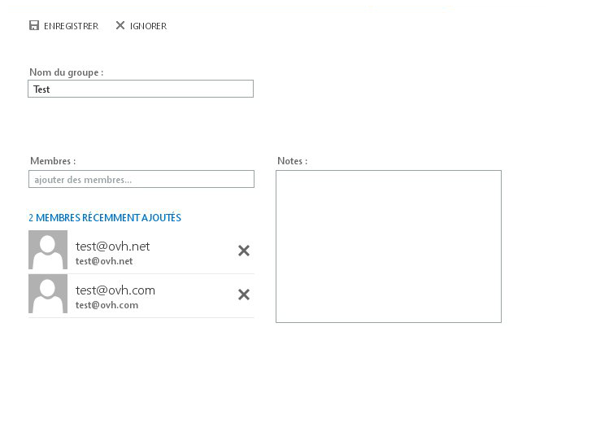
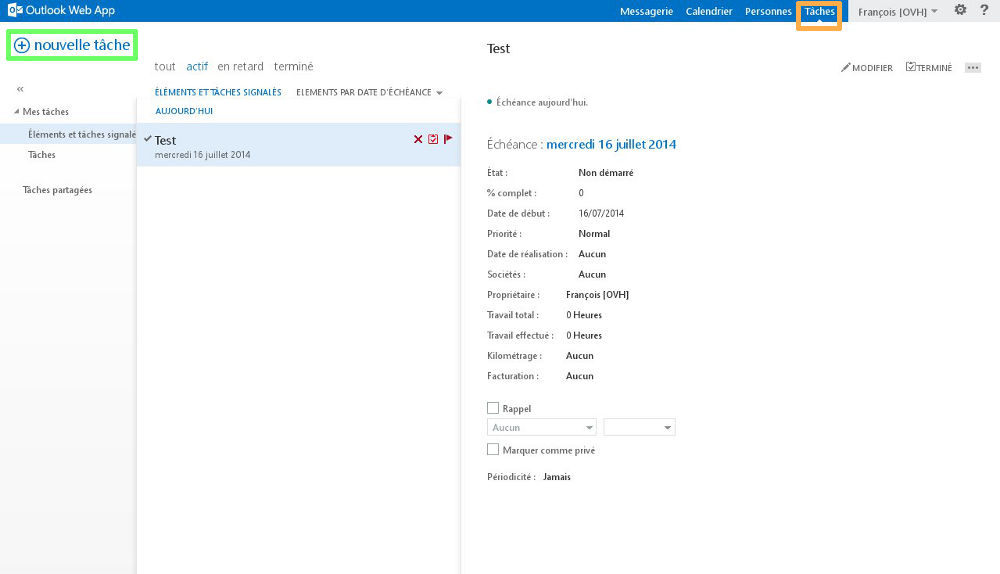

**O que é o Outlook Web App (OWA)?**

OWA corresponde ao webmail Exchange. Esta interface permite-lhe consultar e utilizar a sua conta Exchange bem como as diversas funcionalidades associadas a partir de uma página Web clássica.

Esta interface é muito prática se não dispuser de um software de e-mails compatível com a configuração e utilização de uma conta Exchange.

**Onde e como me posso ligar ao OWA?**

O endereço do OWA corresponde ao endereço Exchange completo que deseja consultar.

A password corresponde aquela que definiu aquando da criação do endereço Exchange no seu [Espaço Cliente web](https://www.ovh.com/manager/web/login.html).

Oferta Hosted Exchange:

- [https://ex.mail.ovh.net](https://ex.mail.ovh.net)
- [https://ex2.mail.ovh.net](https://ex2.mail.ovh.net)
- [https://ex3.mail.ovh.net](https://ex3.mail.ovh.net)

Oferta Private Exchange: O URL de acesso dependerá do nome do host do seu servidor definido na criação do serviço.

{.thumbnail}

Aquando da primeira ligação ao OWA será necessário definir o seu fuso horário.

{.thumbnail}

## Outlook Web App 2016

### E-mails
De forma padrão, e aquando da sua ligação, a secção de E-mails é apresentada.

Se navegar numa outra secção: Calendário, Contactos, Trabalhos, é possível voltar à secção E-mails.

Basta clicar no quadrado azul no canto superior esquerdo para ter acesso às diferentes secções.

{.thumbnail}
Para a criação de novas mensagens: queira clicar em "Novo"

{.thumbnail}
Se clicar na flecha preta terá 2 opções:

- E-mail eletrónico

- Evento de calendário

{.thumbnail}
Na coluna da esquerda encontrará as pastas do sistema e outras pastas personalizadas ("Pasta TEST" no nosso exemplo).

{.thumbnail}

#### Nova mensagem
Poderá, por exemplo, introduzir um anexo ao seu e-mail, utilizar [aplicações suplementares](http://office.microsoft.com/fr-fr/store/applications-pour-outlook-FX102825292.aspx?app=outlook.exe) associadas ao OWA, ou ainda ativar alertas de receção e leitura.

Encontrará igualmente as opções clássicas de edição de conteúdo (tamanho, cor, etc..).

Informações complementares 
O tamanho de um anexo através OWA está limitado a 35 MB. A aplicação da sincronização ActiveSync impõe uma limitação de 10 MB nos anexos (principalmente nos smartphones compatíveis com ActiveSync). Ao utilizar um software de e-mails compatível (Outlook por exemplo), o tamanho de um anexo é de 100 MB máximo.

{.thumbnail}

#### As pastas de sistema de pastas personalizadas
De forma padrão, as pastas de sistema que observará serão:

- Caixa de receção
- Lixeira
- Itens enviados
- Itens eliminados
- SPAM (correio indesejado)
- Fluxo RSS
- Notas

{.thumbnail}
Uma pasta de sistema não pode ser renomeada, movida ou eliminada. Tratam-se de regras fixas e não parametrizáveis.

Ao efetuar um clique direito no nome de apresentação da sua conta Exchange ou numa pasta, ser-lhe-ão propostas várias opções:

Criar uma pasta: crie uma pasta no diretorio onde o clique direito foi efetuado. No nosso exemplo a pasta será criada ao mesmo nível que as outras pastas de sistema.

Renomear: renomeia uma pasta personalizada.

Eliminar: elimina uma pasta personalizada.

Esvaziar pasta: esvazia uma pasta de sistema ou personalizada. Todo o conteúdo será transferido para os "Itens eliminados"

Adicionar aos favoritos: adiciona a pasta seleciona na parte "Favoritos".

Mover: move a pasta personalizada selecionada para uma outra pasta.

Marcar tudo como lido: marca todos os e-mails não lidos de uma pasta como lidos.

Adicionar uma pasta partilhada: adiciona o acesso a uma pasta que um outro utilizador da sua plataforma Exchange partilhou consigo (esta opção não aparece quando efetua um clique direito numa pasta de sistema ou pasta personalizada).

Autorizações: permite dar autorizações de acesso a um outro utilizador da sua plataforma Exchange à pasta de sistema ou pasta personalizada seleciona. Quando as autorizações são atribuídas, o utilizador com o qual partilhou deverá efetuar o procedimento descrito anteriormente (Adicionar uma pasta partilhada) através do OWA da sua conta Exchange.

#### O conteúdo de uma pasta
Trata aqui da apresentação do conteúdo da pasta escolhida. No nosso exemplo, é a pasta sistema "Caixa de receção" que é selecionado. Esta contém dois e-mails de teste.

Encontrará no topo dessa coluna um motor de pesquisa para encontrar esses e-mails ou contactos, bem como diferentes opções de categorização:

Todas: apresentação de todos os e-mails.

Não lidas: apresenta unicamente os e-mails não lidos.

Para mim: apresenta unicamente os e-mails que lhe serão diretamente endereçados.

Com o indicador: apresenta unicamente os e-mails com um indicador (símbolo ⚐ ao lado do título do e-mail).

Triado por permite-lhe gerir a apresentação dos e-mails pelos diferentes sistemas de triagem (Data, Destinatário, Tamanho, etc...).

{.thumbnail}

#### Opção de e-mail
Veja igualmente as diferentes opções disponíveis quando efetua um clique direito num e-mail:

Responder: Permite responder ao último remetente.

Responder a todos: Permite responder a todas as pessoas incluídas no campo Para e cc.

Transferir: Transfere o e-mail para outra caixa de e-mail.

Eliminar: Elimina o e-mail selecionado.

Arquivar: Arquiva o e-mail numa pasta "Arquivos". É possível personalizar o nome dessa pasta.

Marcar como não lido: Marca como não lido o e-mail selecionado.

Afixar: Coloca o e-mail em primeiro lugar na caixa de e-mail. Se o elemento estiver afixado, a opção no menu será "Remover (para desafixar)".

Marcar como terminado: Esta opção somente aparece quando um indicador (⚐) foi colocado no e.-mail e permite marcá-lo então como terminado.

Marcar como lixo: Marca como indesejado o e-mail selecionado e o seu retemente. O e-mail será automaticamente colocado na pasta sistema "Spam (Correio indesejado). Poderá encontrar a lista dos utilizadores aprovados ou bloqueados na secção "Parâmetros" (simbolizado com a roda dentada), "Opções", "contas", "Bloquear ou autorizar".

Ignorar: Ignora o e-mail selecionado e a conversa associada. O e-mail e a conversação serão então colocados na pasta de sistema "Elementos eliminados". Os futuros e-mails serão enviados nesta conversação serão automaticamente colocados na pasta de sistema "Elementos eliminados".

Mover: Move o e-mail selecionado numa pasta específica.

Categorizar: Categoriza o e-mail selecionado ao associar-lhe uma cor. É igualmente possível gerir as suas categorias e modificar as cores utilizadas.

Criar uma regra: Cria uma regra de caixa de receção e determina o comportamento que a sua conta Exchange adotará no tratamento de futuros e-mails recebidos.

{.thumbnail}

#### O conteúdo de um e-mail
Encontrará aqui a apresentação do conteúdo do e-mail escolhido, a foto do perfil do remetente do e-mail, a data e hora da receção do e-mail e diferentes opções suplementares:

Responder a todos: Responde a todas as pessoas que receberam o e-mail e estão presentes no campo "Para».

Mais ações (representado por «v») : Permite apresentar as opções suplementares.

{.thumbnail}

#### Opção de e-mail
Veja igualmente as diferentes opções disponíveis quando efetua um clique direito num e-mail:

Responder: Permite responder ao último remetente.

Responder a todos: Permite responder a todas as pessoas incluídas no campo Para e cc.

Transferir: Transfere o e-mail para outra caixa de e-mail.

Responder a todos por reunião: Cria um pedido de reunião sujeito à aceitação por parte das diferentes pessoas envolvidas.

Responder por mensagens instantânea: Esta opção não está de momento disponível. Trata-se de uma funcionalidade que será implementada com a chegada da aplicação Lync.

Responder a todos por mensagem instantânea: Esta opção não está de momento disponível. Trata-se de uma funcionalidade que será implementada com a chegada da aplicação Lync.

Eliminar: Elimina o e-mail selecionado.

Eliminar todas as mensagens de: elimina todos os e-mails de um remetente.

Marcar como lixo: Marca como indesejado o e-mail selecionado e o seu retemente. O e-mail será automaticamente colocado na pasta sistema "Spam (Correio indesejado). Poderá encontrar a lista dos utilizadores aprovados ou bloqueados na secção "Parâmetros" (simbolizado com a roda dentada), "Opções", "contas", "Bloquear ou autorizar".

Marcar como não lido: Marca como não lido o e-mail selecionado.

Imprimir: Abre o e-mail selecionado numa janela suplementar a fim de permitir que lance um pedido de impressão.

Ver detalhes da mensagem: Apresenta os cabeçalhos do e-mail selecionado. Esta opção permite-lhe observar o caminho percorrido por um e-mail (servidor utilizado, data, hora, etc..) até chegar aos nossos servidores. O nosso suporte técnico pedirá este elemento para efetuar diagnósticos.

Abrir numa janela separada: Abre o e-mail selecionado numa janela separada.

{.thumbnail}

### Calendário

#### Generalidades
O botão "Calendário" permite-lhe consultar, gerir ou criar calendários. Esta secção permite-lhe igualmente aceder aos calendários partilhados ou de iniciar partilhas de calendários.

{.thumbnail}

#### Novo
Este botão permite-lhe adicionar um evento no seu calendário ou num calendário partilhado.

Tal como quando escreve um novo e-mail, encontrará várias opções associadas à edição do conteúdo do evento que pretende adicionar ao calendário selecionado.

{.thumbnail}

### Contactos

#### Generalidades
O botão "Contactos" permite-lhe apresentar os contactos e permite-lhe criar contactos ou pastas de contactos associados à sua conta Exchange.

{.thumbnail}
É na coluna à esquerda que encontrará os contactos associados à sua conta Exchange mas igualmente os contactos associados à plataforma Exchange (ou ao diretório de contactos global) bem como os endereços das contas de recursos na seção "Anuário".

{.thumbnail}

#### Novo
Este botão permite-lhe criar um novo contacto ou um lista de contactos.

{.thumbnail}
Dados do contacto:

A criação de um novo contacto propõe-lhe que adicione informações complementares tais como o nome, apelido, telefone, etc...

{.thumbnail}

#### Grupo de contacto
A criação de um grupo de contactos propõe-lhe a adição de membros. Tratam-se de endereços de e-mail associados à sua lista de contactos ou endereços ext4ernos que poderá adicional manualmente.
Poderá de seguida enviar um e-mail ao seu grupo de contactos. O e-mail será depois distribuído ao conjunto dos membros que anteriormente adicionou.

{.thumbnail}

#### Informações complementares
O OWA não permite que inicie a partilha de contactos. Terá de efetuar essa partilha através de um software compaatível (Outlook por exemplo).

### Tarefas

#### Generalidades
O botão Tarefas permite-lhe criar, gerir e apresentar as tarefas associadas à sua conta Exchange.

A coluna do meio apresentará o conteúdo da pasta da tarefa escolhida e a coluna à direita os detalhes da tarefa escolhida.

{.thumbnail}

#### Nova tarefa
Este botão permite-lhe criar uma nova tarefa na pasta das tarefas selecionadas, de escolher o seu assunto, a sua conclusão e de adicionar detalhes suplementares tais como sujeito, a data de conclusão, a percentagem concluída, etc...

{.thumbnail}

#### Pasta tarefas
Pode observar na coluna à esquerda o conjunto das pastas de tarefas. Poderá ainda, se desejar e com um clique direito no menu "As minhas tarefas", criar uma pasta de tarefas personalizada.

{.thumbnail}

#### Informações complementares
O OWA não permite que inicie a partilha de tarefas. Terá de efetuar essa partilha através de um software compaatível (Outlook por exemplo).

### Opções
Este botão permite-lhe aceder às seguintes opções:

- Alterar: Modifica a foto de perfil da sua conta Exchange.

- Abrir outra caixa de correio...: consulte o seguinte guia:

- Terminar sessão: Desliga a sua conta Exchange e apresenta a página de autenticação do OWA.

{.thumbnail}

#### Foto de perfil
Clique no botão "Modificar" e depois escolha no seu computador a foto apresentar no seu perfil.

#### Opções
Aceda aqui aos parâmetros gerais da sua conta Exchange e às opções suplementares. As opções são:

Atualizar: atualiza a conta Exchange. Se por exemplo uma pessoa lhe envia um e-mail, utilize esse botão para atualizar a receção/envio de e-mails.

Gerir as aplicações: Esta seção permite-lhe gerir ou adicionar ao OWA aplicações suplementares (ou plugins). Certas aplicações são instadas de forma padrão pelos nossos administradores e não poderão ser eliminados.

Parâmetros offline: Ativa ou desativa o acesso à sua conta Exchange em modo offline. Esta opção é prática se deseja consultar a sua conta Exchange mesmo quando não dispõe de acesso à Internet.

Modificar o tema: Modifica o tema e as coras do OWA.

Opções: Apresenta as opções suplementares da sua conta Exchange. Detalharemos as mesmas na seção seguinte.

{.thumbnail}
« Ajuda » (representado pelo ícone "ponto de interrogação"): Ajuda Microsoft.

{.thumbnail}

#### Opções suplementares da sua conta Exchange
Encontrará nesta seção as seguintes opções>:

Geral: pode consultar aqui as informações gerais da sua conta Exchange e da interface OWA. Poderá igualmente modificar a password da sua conta Exchange e tem ainda a possibilidade de modificar certas informações.

- Informação complementar: A modificação do nome, apelido, nome a ser apresentado e o endereço Exchange somente podeao ser alterados a partir do seu [Espaço Cliente Web](https://www.ovh.com/manager/web/login.html).

Correio: Defina aqui as regras da caixa de e-mail, as respostas automáticas e consulte os relatórios associados à sua conta Exchange.

Calendário: Poderá modificar aqui as várias opções do seu calendário, tais como: notificações, lembretes...

{.thumbnail}

#### Integração de uma imagem
A sua imagem deverá estar alojada online e acessível a partir de um browser.
Um copiar/colar da imagem armazenada localmente no seu computador não funcionará.
No menu "Options" como indicado em baixo, clique no menu "Correio" e aceda depois a "Disposição" e no final clique em "Assinatura eletrónica".

Abra o seu browser e introduza o endereço da sua imagem (ex: www.oseudominio.com/nome-image,)

Clique na sua imagem e efetue um copiar/colocar no quadrado da assinatura.

{.thumbnail}
Veja uma imagem colada na secção assinatura. É possível que a "redimensione" ao clicar diretamente na imagem.

{.thumbnail}
Selecione a opção: "Adicionar automaticamente a minha assinatura às mensagens que envio"

#### Informações complementares
[A "office Store"](https://store.office.com/fr) permite-lhe encontrar aplicações suplementares. Todas as aplicações não poderão, de forma padrão, ser adicionadas. Algumas delas requerem autorização do administrador. Se deseja instalar uma aplicação que requer a autorização de um administrador queira contactar o nosso suporte Exchange para que possamos analisar o seu pedido.

## Outlook Web App 2013

### Mensagens
O botão Mensagens permite-lhe apresentar a sua caixa de e-mail Exchange. 

Encontra no menu à esquerda o botão de criação de novos e-mails bem como as pastas do sistema ou outras pastas personalizadas ("Pasta TEST" no nosso exemplo).

O sinal «  ao lado de "Nova mensagem" permite-lhe ocultar toda a coluna (exceto "Nova mensagem").

{.thumbnail}

#### Nova mensagem
Poderá, por exemplo, adicionar um anexo ao seu e-mai,l utilizar [aplicações suplementares](http://office.microsoft.com/fr-fr/store/applications-pour-outlook-FX102825292.aspx?app=outlook.exe) associados ao OWA, ou ainda ativar o aviso de receção ou de leitura.

Encontra igualmente as opções clássicas de edição de conteúdo (tamanho, cor, etc..).

Informações complementares 
O tamanho de um anexo via OWA está limitado a 35MB. A aplicação de sincronização ActiveSync impõe uma limitação de 10 MB nos anexos (principalmente nos smartphones compatíveis com o ActiveSync). Ao utilizar um software de e-mails compatível (o Outlook por exemplo), o tamanho do anexo é de 100 MB no máximo.

{.thumbnail}

#### As pastas do sistema e pastas personalizadas
De forma padrão queira ver as pastas de sistemas que irá consultar:

- Caixa de receção
- Rascunhos
- Elementos enviados
- Elementos eliminados
- Subscrições RSS
- SPAM
- Fluxos RSS
- Notas

Uma pasta de sistema não pode ser renomeada, movida ou eliminada. Tratam-se de regras fixas e não modificáveis.

Ao realizar um clique direito no nome de apresentação da sua conta Exchange ou numa pasta serão propostas várias opções:

Criar uma pasta: cria uma pasta onde o clique direito foi efetuado. No nosso exemplo a pasta será criada ao mesmo nível que as outras pastas de sistema.

Renomear: renomear uma pasta personalizada.

Eliminar: eliminar uma pasta personalizada.

Limpar: limpar uma pasta de sistema ou personalizada. Toido o conteúdo será transferido para os "Elementos eliminados"

Adicionar aos favoritos: adiciona a pasta selecionada na parte "Favoritos".

Mover: mover a pasta selecionada para uma outra pasta.

Marcar tudo como lido: marca todos os e-mails não lidos como lidos.

Adicionar uma pasta partilhada: adiciona o acesso a uma pasta que um outro utilizador da sua plataforma Exchange partilhou consigo (esta opção não aparece quando efetua um clique direito num pasta de sistema ou personalizada).

Autorizações: permite dar autorizações de acesso a um outro utilizador da sua plataforma Exchange a uma pasta de sistema ou personalizada que foi selecionada. Quando as autorizações são atribuídas, o utilizador com o qual partilha é efetuada deve utilizar a função descrita anteriormente (Adicionar uma pasta partilhada) através do OWA da sua conta Exchange.

{.thumbnail}

#### O conteúdo de uma pasta
Trata-se da apresentação do conteúdo da pasta selecionada. No nosso exemplo trata-se da pasta do sistema "Caixa de receção" que foi selecionada. Esta contém dois e-mails de teste.

Encontra no topo dessa coluna um motor de pesquisa para encontrar os e-mails ou os contactos bem como diferentes opções de classe:

Conversas por data: permite-lhe gerir a apresentação dos e-mails por diversos sistemas de triagem (Data, Destinatário, Marca, Tamanho, etc...).

Todos: apresenta todos os e-mails.

Não lidas: apresenta unicamente os e-mails não lidas.

Para mim: apresenta unicamente os e-mails que lhe foram endereçados diretamente.

Com indicador: apresenta unicamente os e-mails com um indicador (símbolo ⚐ no inicio do titulo do e-mail).

{.thumbnail}

#### Opção do e-mail
Veja igualmente as diferentes opções disponíveis aquando de um clique direito no e-mail:

Eliminar: elimina o e-mail selecionado.

Marcar como lido: marca como lido o e-mail selecionado.

Marcar como terminado: esta opção somente aparece quando foi colocado no e-mail um indicador (⚐) e que o permite marcar como terminado.

Mover: mover a pasta selecionada para uma outra pasta.

Ignorar: ignora o e-mail selecionado e a conversa associada. O e-mail e a conversão serão colocados na pasta de sistema "Elementos eliminados". Os futuros e-mails para esta mesma conversação serão colocados automaticamente na pasta de sistema "Elementos eliminados".

Categorizar: categoriza o e-mail selecionado ao associá-lo a uma cor. É possível gerir as suas categorias e modificar as cores utilizadas.

Criar uma regra: cria uma regra de caixa de receção e determina o comportamento que a sua conta Exchange adotará para o tratamento de futuros e-mails recebidos.

Marcar como SPAM: marca como não desejado o e-mail selecionado e o seu remetente. O e-mail é colocado automaticamente na pasta de sistema "SPAM". Poderá recuperar a lista dos utilizadores aprovados ou bloqueados na parte "Parâmetros" (simbolizado pela roda dentada), "Opções", "Bloquear ou autorizar".

{.thumbnail}

#### O conteúdo de um e-mail
Encontra aqui a apresentação do conteúdo do e-mail escolhido, a foto de perfil do retemente do e-mail, a data e hora da receção do e-mail e algumas opções suplementares.

Responder: responde ao remetente do e-mail.

Responder a todos: responde a todas as pessoas que receberam o e-mail e estão presentes no campo « À ».

Transferir: transfere o e-mail na íntegra, anexos incluídos.

Mais ações (representado por « ... »): permite apresentar as opções suplementares.

{.thumbnail}

#### Opções suplementares:
Responde por mensagem instantânea: esta opção ainda não se encontra disponível. Trata-se de uma funcionalidade que estará em breve disponível com a chegada da aplicação Lync.

Responder a todos por mensagem instantânea: esta opção ainda não se encontra disponível. Trata-se de uma funcionalidade que estará em breve disponível com a chegada da aplicação Lync.

Eliminar: elimina o e-mail selecionado.

Categorizar: categoriza o e-mail selecionado ao associá-lo a uma cor. É possível gerir as suas categorias e modificar as cores utilizadas.

Marcar como SPAM: marca como não desejado o e-mail selecionado e o seu remetente. O e-mail é colocado automaticamente na pasta de sistema "SPAM". Poderá recuperar a lista dos utilizadores aprovados ou bloqueados na parte "Parâmetros" (simbolizado pela roda dentada), "Opções", "Bloquear ou autorizar".

Abrir numa janela separada: abre o e-mail selecionado numa janela suplementar.

Imprimir: abre o e-mail selecionado numa janela suplementar para que possa efetuar o pedido de impressão.

Criar uma regra: cria uma regra de caixa de receção e determina o comportamento que a sua conta Exchange adotará para o tratamento de futuros e-mails recebidos.

Apresentar os detalhes da mensagem: apresenta o cabeçalho do e-mail selecionado. Esta opção permite-lhe observar o caminho que o e-mail fez para chegar aos nossos servidores (servidor utilizado, data, hora, etc..). O nosso suporte técnico poderá pedir-lhe estes detalhes em alguns diangósticos.

{.thumbnail}

### Calendário

#### Generalidades
O botão "Calendário" permite-le consultar, gerir ou criar os seus calendários. Esta secção permite-lhe igualmente aceder aos calendários partilhados ou dar inicio à partilha de calendários.

Têm à sua disposição um guia para esta última funcionalidade:

{.thumbnail}

#### Novo evento
Este botão permite-lhe adicionar um evento ao seu calendário ou ao calendário partilhado.

Tudo como se escrevesse um novo e-mail, ou seja, encontrará diversas opções associadas à edição do conteúido do evento a adicionar ao calendário associado.

{.thumbnail}

### Pessoas

#### Generalidades
O botão "Pessoas" permite-lhe apresentar os contactos ou criar contactos ou pastas de contactos associadas à sua conta Exchange.

É na coluna à esquerda que irá encontrar os contactos associados à sua conta Exchange mas igualmente os contactos associados à plataforma Exchange (ou à lista de endereços global) bem como os endereços das contas de recursos:

{.thumbnail}

#### Novo
Este botão permite-lhe adicionar um novo contacto ou um novo grupo de contactos.

{.thumbnail}

#### Dados do contacto
A criação de um novo contacto propõe-lhe que adicione informações complementares como o nome, apelido, o número de telefone, etc...

{.thumbnail}

#### Grupo de contacto
A criação de um grupo de contacto propõe-lhe adicionar membros ao mesmo. Tratam-se de endereços de e-mails associados à sua lista de endereços ou a endereços externos que deseje adicionar manualmente.

Poderá de seguida decidir enviar um e-mail ao seu grupo de contactos. O e-mail será distribuído ao conjunto dos membros que adicionou anteriormente.

{.thumbnail}

#### Informações complementares
O OWA não permite iniciar partilha de contactos. Deverá utilizar um software compatível (O Outlook, por exemplo) para que possa efetuar a partilha. Queira consultar o seguinte guia:

### Trabalhos

#### Generalidades
O botão Trabalhos permite-lhe criar, gerir e apresentar os trabalhos associados à sua conta Exchange.

A coluna do meio apresentará o conteúdo da pasta de trabalhos escolhida e a coluna à direita apresenta os detalhes do trabalho selecionado.

{.thumbnail}

#### Novo trabalho
Este botão permite que crie um novo trabalho na pasta de trabalhos selecionados, escolher o seu sujeito, a sua maturidade e adicionar detalhes suplementares como o assunto, a data de inicio, a percentagem de avanço, etc...

{.thumbnail}

#### Pasta trabalhos
Poderá consultar na coluna à esquerda o conjunto das pastas de trabalhos. Poderá efetuar um clique direito no menu "Os meus trabalhos" para criar uma pasta de trabalhos personalizadas.

{.thumbnail}

#### Informações complementares
O OWA não permite iniciar partilha de trabalhos. Deverá utilizar um software compatível (O Outlook, por exemplo) para que possa efetuar essa ação.

### Opções
Esse botão permite-lhe aceder às seguintes opções:

- Modificar: modifica a foto de perfil da sua conta Exchange.

- Abrir uma caixa de receção: consulte o seguinte guia para realizar essa ação:

- Desligar: desligue a conta Exchange e apresenta a página de autenticação do OWA.

{.thumbnail}

#### Foto de perfil
Clique no botão "Procurar" e depois escolha a sua pasta de fotos a apresentar no seu perfil.

{.thumbnail}

#### Opções
Queira aceder aqui aos parâmetros gerais da sua conta Exchange e às opções suplementares. Vamos detalhá-las:

Atualizar: atualiza a conta Exchange. Para saber se alguém lhe enviou um e-mail queira utilizar esse botão. Ele irá atualizar a caixa de e-mail.

Definir respostas automáticas: implementar respostas automática para a sua conta Exchange.

Parâmetros de apresentação: modificação dos parâmetros de apresentação da interface OWA. Disposição dos e-mails, parâmetros de conversas de e-mails, apresentação do painel de leitura do e-mail, ativação da versão light do OWA, sinalização Microsoft.

Gerir as aplicações: esta secção permite-lhe gerir e adicionar ao OWA aplicações suplementares (plugins). Certas aplicações são instaladas de forma padrão pelos nossos administradores e não podem ser eliminadas.

Parâmetros offline: ativa ou desativa o acesso à sua conta Exchange em modo offline. Esta opção é prática caso deseje consultar a sua conta Exchange mesmo quando não se pode ligar à Internet.

Modificar o tema: modifica o tema e as cores do OWA.

Modificar a password: modifica a password da sua conta Exchange. Poderá utilizar igualmente o [espaço cliente web](https://www.ovh.com/manager/web/login.html) para esta ação.

Opções: apresenta as opções suplementares da sua conta Exchange. Iremos detalhar essas opções na seçcão a seguir.

«Ajuda » (representado pelo ícone em forma de ponto de interrogação): Ajuda Microsoft.

{.thumbnail}

#### Opções suplementares da sua conta Exchange.
Encontra nesta secção as seguintes opções:

Conta: pode consultar aqui as informações gerais da sua conta Exchange. Poderá igualmente modificar a password da sua conta Exchange e terá a possibilidade de modificar certas informações.

- Informação complementar: a modificação do nome, apelido, nome a apresentar e o endereço Exchange poderá unicamente ser efetuado no seu [espaço cliente web](https://www.ovh.com/manager/web/login.html).

Organizar os e-mails: defina aqui as regras da caixa de receção, as respostas automáticas e consulte os relatórios associados à sua conta Exchange.

Caixas de correio local: esta opção ainda não se encontra disponível. Trata-se de uma funcionalidade que estará em breve disponível com a chegada da aplicação Lync.

Parâmetros: outros parâmetros do seu endereço de e-mail e a sua apresentação, opções de mensagens, calendários, opções regionais, modificação da password da conta Exchange.

Telefone: consulte aqui os periféricos portáteis onde a sua conta Exchange está configurada. Poderá ainda eliminar um periférico da lista, reinicializá-lo por completo à distância ou bloqueá-lo.

Bloquear ou autorizar: pode gerir aqui os remetentes ou destinatários dos e-mails autorizados ou bloqueados. Quando considera um e-mail como SPAM, o remetente do e-mail será bloqueado e será colocado nesta secção.

Aplicação: adicione aqui aplicações suplementares (plugins) ao seu OWA. Certas aplicações são instaladas de forma padrão pelos nossos administradores e não podem ser eliminadas.

Informações complementares: [l'Office Store](http://office.microsoft.com/fr-fr/store/applications-pour-outlook-FX102825292.aspx?app=outlook.exe) permite-lhe recuperar as aplicações suplementares. Todas as aplicações não serão adicionadas de forma padrão. Algumas delas podem necessitar de permissões de administrador. Se desejar instalar uma aplicação que requeira autorização de administrador, queira contactar o nosso suporte Exchange para que possamos analisar o seu pedido.

{.thumbnail}