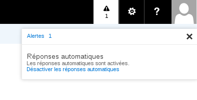

## Overview
This feature enables you to set up automatic replies for when you're away on holiday, or for any other reason.

## How do you set up an automatic reply?

## Set up
Once you're logged in to the Exchange interface via the [Outlook Web App (OWA)](https://ex.mail.ovh.net/owa/), you can access this feature via the [blue "Settings"  button (the gear symbol) and then  "Set automatic replies" .

You can also access it via: "Settings", "Options", "Mail", "Automatic Replies".

{.thumbnail}
You will then see the following interface:

Click on "Send automatic replies"and define, if necessary, the time period during which the automatic replies will be sent.

You have access to a content editor to create the format of your message (size, font, hyperlink, etc.).

{.thumbnail}

## Response types
You can set up various types of automatic replies (or responses):

 - For senders within your organisation only.

Automatic replies will only be sent to Exchange users on your Exchange platform.

And/or

- for senders within and outside your organisation.

You can, for example, choose to send a particular automatic reply to people in your organisation (your colleagues) and a different reply for people outside your organisation (clients, friends, etc.).

{.thumbnail}

## Additional information
When automatic replies are enabled, you receive emails as normal in your inbox.

When you define a time period for your automatic replies, a new button will appear on the blue strip at the very top of the interface.

You can disable  "automatic replies"  using this button.

{.thumbnail}

- Please note: to avoid spamming, the automatic reply is sent only once to each sender.

