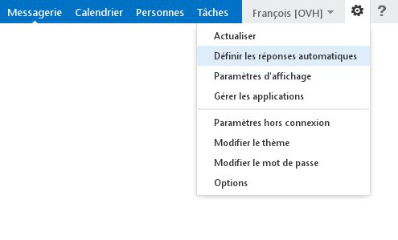
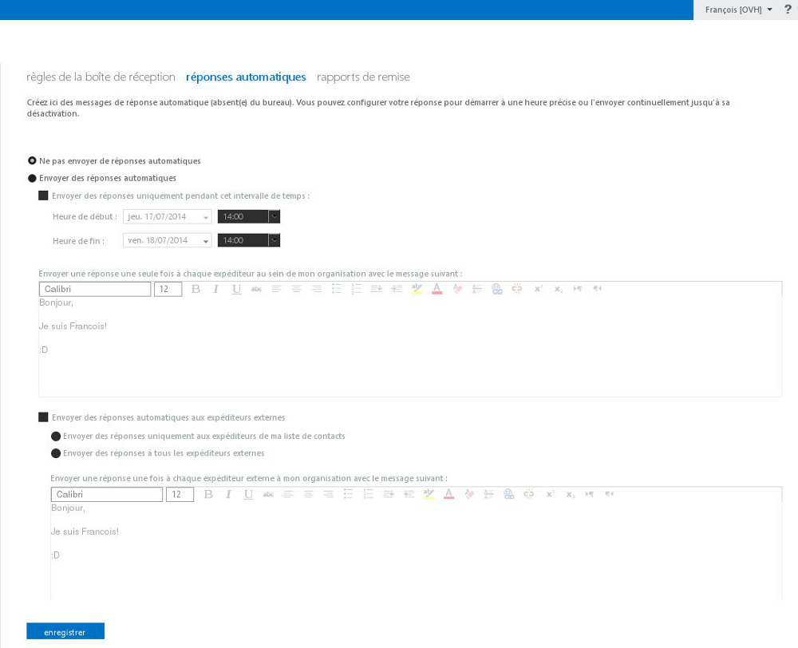
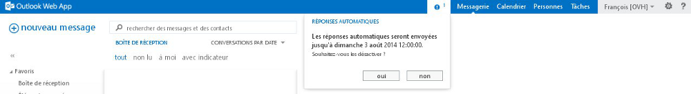

Cette fonctionnalité vous permettra de créer des répondeurs en cas d'absence ou des réponses automatiques pour des besoins particuliers.

## Mise en place sur Outlook Web Application 2016

Pour créer un répondeur, connectez-vous à votre compte Exchange par l'interface [Outlook Web App (OWA)](https://ex.mail.ovh.net/owa/), vous trouverez cette fonctionnalité par le bouton "Paramètres" (représenté par la roue dentée) puis  "Réponses automatiques".

Il vous est possible d'y accéder autrement via : "Paramètres", "Options", "Courrier",  "Réponses automatiques".

{.thumbnail}
Vous accédez alors à l'interface suivante : 

Cliquez sur le bouton radio "Envoyer des réponses automatiques" et définissez, si besoin, le créneau horaire durant lequel les réponses automatiques seront envoyées.

Un éditeur de contenu est à votre disposition pour la mise en forme de votre message (taille, police, insertion de lien, etc.).

{.thumbnail}

Vous pouvez définir plusieurs types de réponses automatiques (ou répondeurs) :

- Uniquement vers les expéditeurs de votre organisation.

Les réponses automatiques seront uniquement délivrées aux utilisateurs Exchange de votre plate-forme Exchange.

Et/ou

- Vers les expéditeurs de votre organisation et les expéditeurs externes à votre organisation.

Vous pouvez par exemple décider d'envoyer une réponse automatique spécifique aux personnes de votre organisation (vos collègues) et une toute autre réponse pour les personnes extérieures à votre organisation (vos clients, vos amis, etc.).

{.thumbnail}

Lorsqu'une réponse automatique est activée, le mail qui vous est envoyé est reçu normalement et transmis dans votre boite de réception.

Lorsque vous définissez un créneau horaire pour l'activation des réponses automatiques, un nouveau bouton apparaît dans le bandeau bleu en haut de page. 

Celui-ci vous propose la désactivation de la fonctionnalité "réponses automatiques".

{.thumbnail}

- Attention : pour éviter le spam, la réponse automatique est envoyée une seul fois à chaque expéditeur.

## Mise en place sur Outlook Web Application 2013

Pour créer un répondeur, connectez-vous à votre compte Exchange par l'interface [Outlook Web App (OWA)](https://ex.mail.ovh.net/owa/){.external}, vous accéderez à cette fonctionnalité par le bouton "Paramètres" (représenté par la roue dentée) puis  "Définir les réponses automatiques".

Il vous est possible d'y accéder autrement via : "Options", "Organiser la messagerie" puis l'onglet "Réponses automatiques".

{.thumbnail}

Vous accédez alors à l'interface suivante :

Cliquez sur le bouton radio "Envoyer des réponses automatiques" et définissez, si besoin, le créneau horaire durant lequel les réponses automatiques seront envoyées.

Un éditeur de contenu est à votre disposition pour la mise en forme de votre message (taille, police, insertion de lien, etc.).

{.thumbnail}

Vous pouvez définir plusieurs types de réponses automatiques (ou répondeurs) :

- Uniquement vers les expéditeurs de votre organisation.

Les réponses automatiques seront uniquement délivrées aux utilisateurs Exchange de votre plate-forme Exchange.

Et/ou

- Vers les expéditeurs de votre organisation et les expéditeurs externes à votre organisation.

Vous pouvez par exemple décider d'envoyer une réponse automatique spécifique aux personnes de votre organisation (vos collègues) et une toute autre réponse pour les personnes extérieures à votre organisation (vos clients, vos amis, etc.).

{.thumbnail}

Lorsqu'une réponse automatique est activée, le mail qui vous est envoyé est reçu normalement et transmis dans votre boite de réception.

Lorsque vous définissez un créneau horaire pour l'activation des réponses automatiques, un nouveau bouton apparaît dans le bandeau bleu en haut de page.

Celui-ci vous propose la désactivation de la fonctionnalité "réponses automatiques".

{.thumbnail}

> [!success]
>
> Attention : pour éviter le spam, la réponse automatique est envoyée une seul fois à chaque expéditeur.
> 