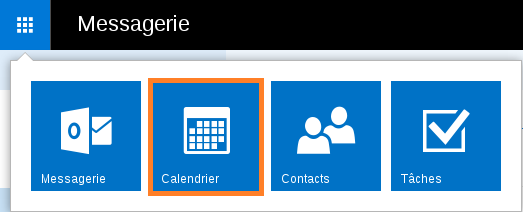
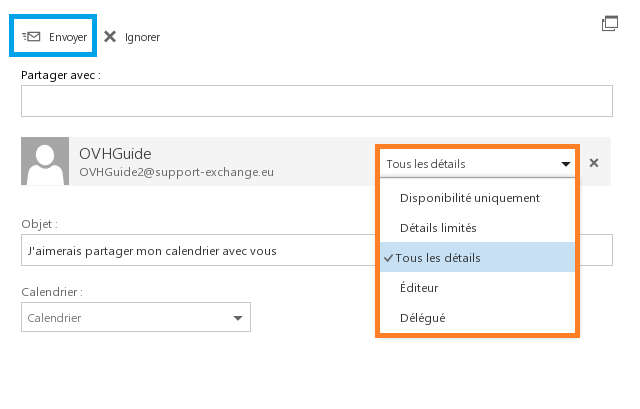

## Step 1: Authorise calendar sharing
This calendar is to be shared from the ovhguide@support-exchange.eu account to ovhguide2@support-exchange.eu.
Go to the blue menu in the top left-hand corner and select  "Calendar" .

{.thumbnail}
Once you are in this interface, on the left-hand side, right click on the main calendar. In our example, this is the calendar next to the blue rectangle. 

Then click on "share calendar".

{.thumbnail}

## Step 2: Authorise calendar sharing
In the "Share with:" field enter the email address of the user you want to share your calendar with. This user must have an exchange account on the same domain. 

Once the user has been added, you can select the permissions you wish to give them.

To confirm your request to share calendars, just click on "Send".

{.thumbnail}

## Retrieve the shared calendar via the confirmation email
Log in to[OWA](https://ex.mail.ovh.net/owa), You will see an email in your inbox from the user that has shared their calendar with you.

- You can confirm sharing the calendar from this email. 
- You can share your calendar with the person who sent the invitation.

{.thumbnail}

## Retrieve the shared calendar via OWA
From the "Calender" the shared calendar will now be availble from your OWA interface. 

It is indeed the ovhguide@support-exchange.eu account which is available from ovhguide2@support-exchange.eu account.

{.thumbnail}

