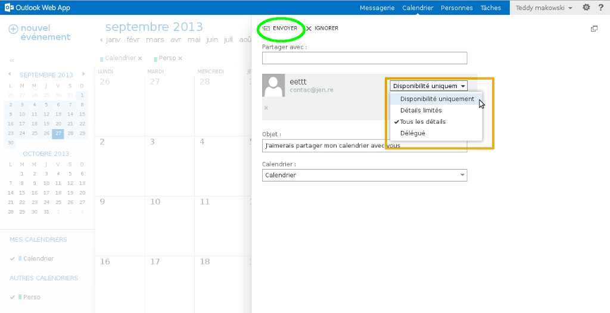
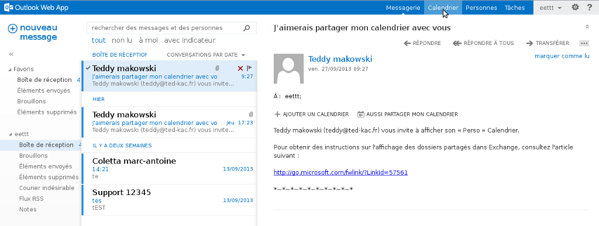
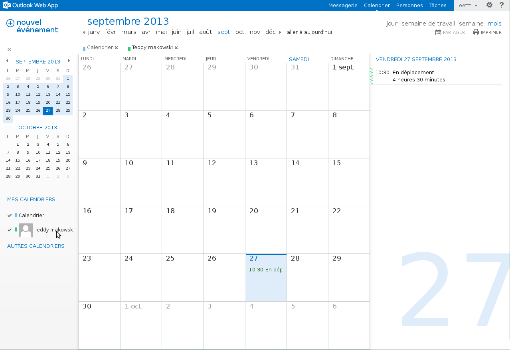

## Mise en place sur Outlook Web Application 2016

### Point de vue de l'utilisateur qui partage le calendrier

#### Étape 1
Ce partage sera réalisé depuis le compte : [ovhguide@support-exchange.eu](mailto:ovhguide@support-exchange.eu){.external} vers [ovhguide2@support-exchange.eu](mailto:ovhguide2@support-exchange.eu){.external}. Sélectionnez le menu bleu dans le coin supérieur gauche, puis "Calendrier".

{.thumbnail}

Une fois sur cette interface, dans la partie de gauche, sélectionnez via un clic droit le calendrier principal. Dans notre exemple, il s'agit du calendrier avec l'icône bleue. Cliquez ensuite sur "partager le calendrier".

{.thumbnail}

#### Étape 2
Dans "Partager avec" :  renseignez le collaborateur avec qui vous souhaitez lancer le partage de votre calendrier. Ce collaborateur doit obligatoirement avoir un compte exchange sur le même domaine.

Une fois l'utilisateur ajouté, vous pouvez choisir les droits à lui appliquer. Pour valider votre demande de partage de calendrier, il suffit de cliquer sur "Envoyer".

{.thumbnail}

### Point de vue de l'utilisateur qui reçoit le calendrier partage

Une fois connecté sur le [Webmail Exchange](https://ex.mail.ovh.net/owa){.external}, vous verrez un e-mail de la part de la personne ayant partagé avec vous le calendrier.

- Vous pouvez valider le partage du calendrier depuis l'e-mail reçu.
- Vous pouvez partager votre calendrier avec la personne ayant envoyer l'invitation de partage.

{.thumbnail}

Depuis la section "Calendrier" le calendrier partagé sera à présent disponible depuis votre interface OWA.

Il s'agit bien du calendrier du compte [ovhguide@support-exchange.eu](mailto:ovhguide@support-exchange.eu){.external} qui est présent depuis le compte [ovhguide2@support-exchange.eu](mailto:ovhguide2@support-exchange.eu){.external}.

{.thumbnail}

## Mise en place sur Outlook Web Application 2013

### Point de vue de l'utilisateur qui partage le calendrier

#### Partie 1
Dans le menu bleu du haut, sélectionnez "Calendrier".

Une fois sur cette interface, dans la partie de gauche, sélectionnez via un clic droit le calendrier principal. Dans notre exemple, il s'agit du calendrier avec l'icône bleue. Cliquez ensuite sur "partager le calendrier".

{.thumbnail}

Attention : seul le calendrier principal peut-être partagé. Les droits propriétaires ne peuvent être ajoutés au calendrier que depuis un client lourd de messagerie type Outlook. (Les versions 2007, 2010, 2013 sont compatibles en Exchange. La version 2003, quant à elle, sera compatible qu'en POP/IMAP.)

#### Partie 2
Dans "Partager avec : " renseignez le collaborateur avec qui vous souhaitez lancer le partage de votre calendrier.

Une fois l'utilisateur ajouté, vous pouvez choisir les droits à lui appliquer.

Pour valider votre demande de partage de calendrier, il suffit de cliquer sur "Envoyer".

{.thumbnail}

### Point de vue de l'utilisateur qui reçoit le calendrier partage

Une fois connecté sur le [Webmail Exchange](https://ex.mail.ovh.net/owa){.external}, vous verrez un e-mail de la part de la personne ayant partagé avec vous le calendrier.

Vous pouvez valider le partage du calendrier depuis l'e-mail reçu.

{.thumbnail}

En cliquant sur calendrier, vous accédez à cette interface.

Via un clic droit, vous aurez la possibilité dans la partie gauche d'ouvrir un calendrier qui a été partagé avec vous. Sélectionnez donc "ouvrir le calendrier". Renseignez le contact qui a partagé avec vous le calendrier, et validez en cliquant sur "ouvrir".

{.thumbnail}

Le calendrier partagé sera à présent disponible depuis votre interface OWA.

{.thumbnail}