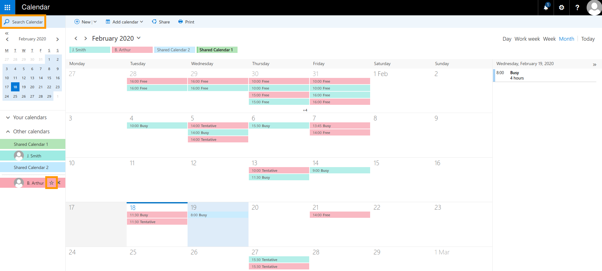

**Ultimo aggiornamento: 19/02/2020**

## Obiettivo

La funzionalità Exchange ti consente di fornire l’accesso ai tuoi calendari ad altre persone.

**Questa guida ti mostra come condividere e recuperare i tuoi calendari tramite Outlook Web App (OWA).**

## Prerequisiti

- Disporre di una [soluzione Exchange OVHcloud](https://www.ovh.it/emails/hosted-exchange/) attiva
- Avere accesso all’account Exchange (indirizzo email e password)

## Procedura

### Step 1: seleziona un calendario da condividere

Per prima cosa, accedi al tuo account Exchange tramite la [Webmail OVHcloud](https://www.ovh.it/mail/). Per aprire l’interfaccia “Calendario”, clicca su “App Launcher” in alto a sinistra e seleziona l’icona a forma di `Calendario`{.action}.

{.thumbnail}

A sinistra visualizzi la lista dei calendari disponibili sul tuo account. Dal menu contestuale, clicca con il tasto destro su uno dei calendari e poi seleziona `Permessi di condivisione`{.action}.

{.thumbnail}

### Step 2: invita e autorizza gli utenti ad accedere al tuo calendario

Nella nuova finestra, aggiungi gli utenti con cui condividere il tuo calendario. Inizia a digitare per visualizzare i suggerimenti di contatto. Inserisci un indirizzo email completo oppure utilizza la `Directory di ricerca`{.action}. 

{.thumbnail}

Qui di seguito, è possibile indicare l’oggetto dell’email che verrà inviata per accettare la condivisione del calendario.

{.thumbnail}

Per ciascun utente, puoi specificare le autorizzazioni di accesso:

|Nome|Descrizione|
|---|---|
|Solo disponibilità|Mostra le disponibilità ma nessun dettaglio riguardante gli eventi del calendario.|
|Dettagli limitati|Mostra le disponibilità, i titoli e le posizioni degli eventi.|
|Dettagli completi|Mostra tutti i dettagli degli eventi.|
|Editor|Consente di modificare il tuo calendario.|
|Delega|Consente di modificare il tuo calendario e di condividerlo in un secondo momento.|

Ricorda che per i contatti esterni, saranno disponibili solo le prime tre opzioni. Quando hai finito di aggiungere i destinatari, clicca su `Invia`{.action} per confermare l’operazione. A questo punto, gli inviti alla condivisione saranno inviati.

### Step 3: recupera un calendario condiviso

È possibile accettare gli inviti alla condivisione di un calendario direttamente dall’email di conferma, cliccando sul pulsante blu `Accetta`{.action}.

{.thumbnail}

Il calendario condiviso sarà disponibile nell’interfaccia “Calendario” di questo account, sotto alla voce “Altri Calendari”.

> [!primary]
>
Generalmente, è possibile condividere calendari con utenti esterni, ma potrebbero esserci problemi di compatibilità a seconda del client di posta elettronica o del servizio Web utilizzato. Per maggiori informazioni consulta la [documentazione ufficiale di Microsoft](http://go.microsoft.com/fwlink/?LinkId=57561).
>

### Modifica le autorizzazioni di accesso al calendario

È possibile modificare le autorizzazioni esistenti sulla condivisione dei calendari oppure revocarne gli accessi. Per farlo, apri la rubrica “Calendario”, clicca con il tasto destro nel calendario interessato e seleziona `Autorizzazioni..`{.action} dal menu contestuale. Nella nuova finestra, elimina semplicemente gli utenti dalla lista oppure modifica le loro autorizzazioni. Infine clicca su `Salva`{.action} per confermare l’operazione.

{.thumbnail}

### Usa i calendari tramite OWA

Ecco un esempio della rubrica “Calendario” di OWA contenente vari calendari:

{.thumbnail}

Cliccando su un calendario della lista, è possibile visualizzarlo o nasconderlo. Inoltre puoi utilizzare il campo di ricerca per aggiungere calendari di disponibilità dei membri della tua azienda. Una volta completata l’operazione, è possibile aggiungerli ai “Preferiti”, cliccando sull’icona a forma di stella.

## Per saperne di più 

[Guida all’utilizzo di Outlook Web App](https://docs.ovh.com/it/microsoft-collaborative-solutions/exchange_2016_guida_allutilizzo_di_outlook_web_app/)

[Condividi una cartella con la Webmail OWA](https://docs.ovh.com/it/microsoft-collaborative-solutions/exchange_2016_condividi_una_cartella_con_la_webmail_owa/)

[Utilizzo dei gruppi (mailing list)](https://docs.ovh.com/it/microsoft-collaborative-solutions/exchange_2013_utilizzo_dei_gruppi_mailing_list/)

Contatta la nostra Community di utenti all’indirizzo <https://community.ovh.com/en/>.