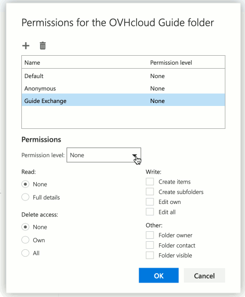
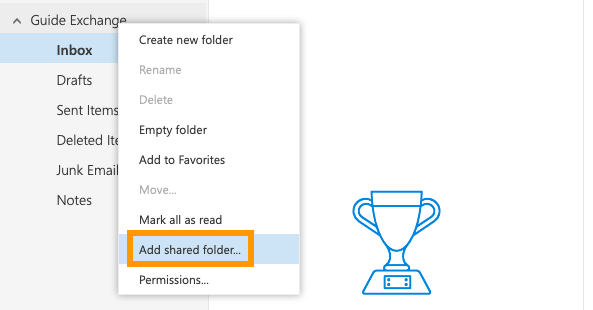

**Last updated 7th April 2020**

## Objective

It is not always appropriate to delegate the usage of an entire email account. The Exchange folder sharing feature allows you to grant other users access to selected folders in your account by assigning very specific permissions.

**This guide explains how to share folders and define their access permissions using the Outlook Web App (OWA).**

> [!primary]
>
> Although this guide will refer to our Exchange services, you can follow the instructions for [Email Pro](https://www.ovh.co.uk/emails/email-pro) accounts as well.
>

## Requirements

- an [OVHcloud Exchange solution](https://www.ovh.co.uk/emails/hosted-exchange) already set up
- access to your Exchange account (email address and password)

## Instructions

### Step 1: Defining access permissions to a folder

Log in to your Exchange account via the [OVHcloud webmail](https://www.ovh.co.uk/mail). Right-click on the folder to be shared and select `Permissions...`{.action} from the context menu.

{.thumbnail}

In the next interface, add a user first by clicking on the `+`{.action} icon. Start typing to display suggestions from your contacts, enter a full email address or use the search option via `Search directory`{.action}.

There are sets of pre-defined permissions ("Permission level") to choose from. It is easiest to select one of these roles first, for example "Author", to see which permissions it will grant. Then, customise them according to your needs by modifying the checkboxes.

{.thumbnail}

#### Permission details

- **Read**

|Permission|Description|
|---|---|
|None|The user cannot see the content of the folder.|
|Full details|The user can see the content of the folder.|

- **Delete access**

|Permission|Description|
|---|---|
|None|The user cannot delete any items.|
|Own|The user can delete self-created items.|
|All|The user can delete any item in the folder.|

- **Write**

|Permission|Description|
|---|---|
|Create items|The user can create new items in the folder.|
|Create subfolders|The user can create new subfolders inside the shared folder.|
|Edit own|The user can edit self-created items.|
|Edit all|The user can edit any item in the folder.|

- **Other**

|Permission|Description|
|---|---|
|Folder owner|The user has the same permissions on this folder as the owner (all permissions).|
|Folder contact|The user will receive notifications and requests concerning the folder (status changes, permission requests, error messages).|
|Folder visible|The folder will appear in the user's account.|

> [!primary]
>**Subfolders**
> 
> - Subfolders created in a shared folder will automatically inherit the parent folder's permissions. If you grant new permissions on a folder and its subfolder(s) are to be shared as well, permissions have to be set **for each subfolder**.
> 
> - If you share a **subfolder** of an existing folder that itself has no permissions set, make sure to tick at least "Folder visible" on the **parent folder**. Without it, the subfolder will not appear in the other user's account. (The user will not be able to see the parent folder's content, unless you also grant the "Read" permission.)
> 
> - Users will not be able to delete subfolders they did not create themselves.
> 
> - Users with the permission "Folder owner" on a subfolder can rename it and grant permissions to it.
>

### Step 2: Retrieving a shared folder

{.thumbnail}

Log in to your Exchange account via the [OVHcloud webmail](https://www.ovh.co.uk/mail). Right-click on your account name in the left-hand navigation and select `Add shared folder...`{.action} from the context menu. In the new window, provide the account name from which a folder was shared. Start typing to display suggestions from your contacts, enter a full email address or use the search option via `Search directory`{.action}. Confirm by clicking on `Add`{.action}. The new shared folder will immediately appear underneath your other folders.

## Go further

[Using the Outlook Web App with an Exchange account](../exchange_2016_outlook_web_app_user_guide)

[Delegating permissions on an Exchange account](../exchange_2013_how_to_grant_full_access_permissions_for_an_account)

[Sharing calendars in OWA](../exchange_2016_how_to_share_calendars_via_owa)

Join our community of users on <https://community.ovh.com/en/>.
