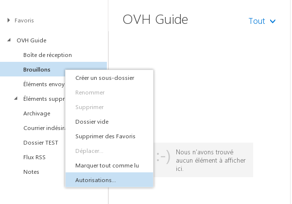
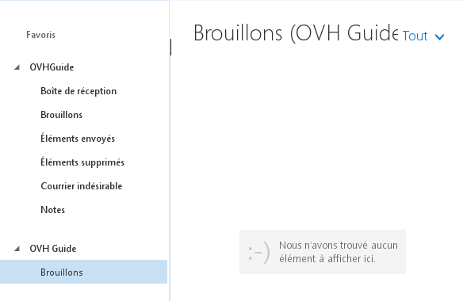

## Asignar permisos a la cuenta de correo, etapa 1
En nuestro ejemplo, la cuenta «ovhguide@support-exchange.eu» compartirá una carpeta con la cuenta «ovhguide2@support-exchange.eu».
En primer lugar, deberá otorgar los permisos correspondientes a su cuenta de correo.
Para ello, haga clic con el botón derecho en el nombre de la cuenta de correo y seleccione «Permisos».

{.thumbnail}

## Asignar permisos a la cuenta de correo, etapa 2
Haga clic en «+» para añadir al usuario con el que desee compartir la carpeta.
Aparecerá una nueva ventana.

{.thumbnail}

## Asignar permisos a la cuenta de correo, etapa 3
Añada al usuario como se muestra en las tres etapas de la imagen y, a continuación, haga clic en «Agregar».

{.thumbnail}

## Asignar permisos a la cuenta de correo, etapa 4
A continuación, conceda a ese usuario los permisos necesarios: 

Por ejemplo, desea que el usuario «ovhguide2@support-exchange.eu» tan solo acceda a la carpeta «Borradores» de la bandeja de entrada de «ovhguide@support-exchange.eu».

Permisos: 

Nivel de permiso: «Ninguna»
Deberá marcar la opción: «Carpeta visible»

Tan solo se concederán permisos sobre esa carpeta en concreto. 

Haga clic en «Aceptar» para validar los cambios.

{.thumbnail}

## Asignar permisos a la carpeta
Ahora debe configurar los permisos de una carpeta. En este caso, configuraremos los permisos de la carpeta «Borradores». 

El procedimiento es el mismo que para editar los permisos de la cuenta de correo. Haga clic con el botón derecho en la carpeta «Borradores» y, a continuación, en «Permisos». 

Puede realizar esta operación con la carpeta que desee. 

A continuación, deberá repetir las operaciones anteriores, es decir, añadir un usuario y luego asignarle los permisos necesarios a la carpeta correspondiente.

Puede añadir distintos permisos: Propietario, Editor, Autor, Colaborador, etc.

{.thumbnail}

## Acceder a la carpeta compartida, etapa 1
El usuario al que se le hayan asignado los permisos deberá añadir la carpeta compartida en el webmail [Outlook Web App (OWA)](https://ex.mail.ovh.net/owa/).

Haga clic con el botón derecho en su cuenta de correo y seleccione «Agregar carpeta compartida...».

{.thumbnail}

## Acceder a la carpeta compartida, etapa 2
Introduzca la cuenta del usuario que haya compartido la carpeta.

## Acceder a la carpeta compartida, etapa 3
La carpeta compartida «Borradores» deberá aparecer correctamente en [OWA](https://ex.mail.ovh.net/owa/).

{.thumbnail}

