**¿Qué es Outlook Web App (OWA)?**

Outlook Web App (OWA) es el webmail para Exchange. Con OWA podrá consultar y utilizar su cuenta Exchange y sus diversas funcionalidades desde una página de internet.

Esta interfaz es muy práctica si no tiene un cliente de correo de escritorio compatible para configurar y utilizar su cuenta Exchange.

**¿Dónde y cómo conectarse a OWA?**

La dirección de correo corresponderá a la dirección Exchange completa que usted desee consultar. 

La contraseña será la misma que definió durante la creación de su dirección Exchange en su [área de cliente](https://www.ovh.com/manager/web/login.html).

Para el servicio Hosted Exchange:

- [https://ex.mail.ovh.net](https://ex.mail.ovh.net).
- [https://ex2.mail.ovh.net](https://ex2.mail.ovh.net).
- [https://ex3.mail.ovh.net](https://ex3.mail.ovh.net).

Para el servicio Private Exchange: La URL de acceso dependerá del nombre de host de su servidor que haya indicado al crear el servicio.

{.thumbnail}

Cuando se conecte a OWA por primera vez, deberá configurar su zona horaria.

{.thumbnail}

## Outlook Web App 2016

### Correo
Al conectarse, accede por defecto a la sección de Correo. 

Si está navegando en otra sección (Calendario, Contactos, Tareas) podrá volver en cualquier momento a la sección de Correo. 

Haga clic en el cuadrado azul situado en la esquina superior izquierda para acceder a las distintas secciones.

{.thumbnail}
Para crear un nuevo mensaje, haga clic en «Nuevo».

{.thumbnail}
Si hace clic en la flecha negra, podrá acceder a dos opciones: 

- Mensaje de correo electrónico. 

- Evento de calendario.

{.thumbnail}
En la columna de la izquierda se muestran las carpetas del sistema y las carpetas personalizadas (en el ejemplo de la imagen, «Dossier TEST»).

{.thumbnail}

#### Correo nuevo
Para adjuntar archivos a su mensaje, puede utilizar las [aplicaciones adicionales](https://store.office.com/appshome.aspx?productgroup=Outlook&ui=es-ES&rs=es-ES&ad=ES) para OWA o activar la confirmación de entrega o de lectura.

Asimismo, encontrará las opciones tradicionales de edición de contenidos (fuente, tamaño, color, etc.).

Más información

En OWA, el tamaño de los archivos adjuntos está limitado a 35 MB. La aplicación de sincronización ActiveSync tiene una limitación de 10 MB para los archivos adjuntos (principalmente en los smartphones compatibles con ActiveSync). Utilizando un cliente de escritorio compatible (por ejemplo, Outlook) el tamaño máximo de los archivos adjuntos es de 100 MB.

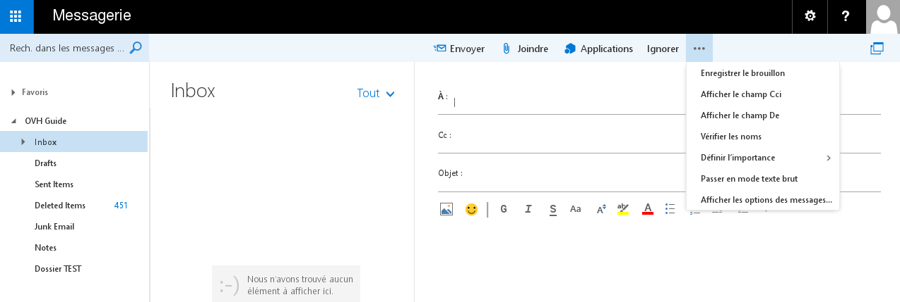{.thumbnail}

#### Carpetas del sistema y carpetas personalizadas
Las carpetas por defecto del sistema que podrá ver son las siguientes:

- Bandeja de entrada
- Borradores
- Elementos enviados
- Elementos eliminados
- Fuentes RSS
- Correo no deseado
- Notas

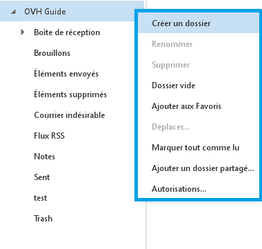{.thumbnail}
No es posible renombrar, mover o eliminar las carpetas del sistema. Estas se rigen por reglas fijas y no modificables.

Haciendo clic derecho en el nombre de su cuenta Exchange o en una carpeta, aparecerán las siguientes opciones:

Crear carpeta nueva: Crea una carpeta en la ubicación en la que haya hecho clic derecho. En el ejemplo de la imagen se creará al mismo nivel que las demás carpetas del sistema.

Cambiar nombre: Renombra una carpeta personalizada.

Eliminar: Elimina una carpeta personalizada.

Vaciar carpeta: Vacía una carpeta del sistema o personalizada. Todo su contenido se trasladará a «Elementos eliminados». 

Agregar a favoritos: Añade la carpeta seleccionada a la zona «Favoritos». 

Mover: Traslada la carpeta personalizada seleccionada a otra carpeta.

Marcar todos como leídos: Marca todos los mensajes no leídos de una carpeta como leídos.

Agregar carpeta compartida: Crea el acceso a una carpeta que otro usuario de la misma plataforma Exchange haya compartido con usted (esta opción no aparece al hacer clic derecho en una carpeta del sistema o personalizada).

Permisos: Permite autorizar a otro usuario de la misma plataforma Exchange para que acceda a la carpeta del sistema o personalizada que haya seleccionado. Una vez concedidos los permisos, el usuario con el que se ha compartido la carpeta debe utilizar la funcionalidad anterior («Agregar carpeta compartida») de su cuenta Exchange con OWA.

#### Contenido de una carpeta
En la imagen puede ver cómo se muestra el contenido de la carpeta seleccionada. En este caso se trata de la carpeta del sistema «Bandeja de entrada», que contiene dos mensajes de prueba.

En la parte superior de esta columna encontrará un campo de búsqueda de mensajes de correo o contactos, así como varias opciones de clasificación: 

Todos: Muestra todos los mensajes.

Sin leer: Solo muestra los mensajes no leídos.

Para mí: Solo muestra los mensajes directamente dirigidos a usted.

Marcados: Solo muestra los mensajes con un indicador (símbolo ⚐ al final del asunto del mensaje).

Ordenar por Permite cambiar el orden en el que aparecen los mensajes: por fecha, destinatario, marcados, tamaño, etc.

{.thumbnail}

#### Opciones del mensaje
A continuación, se describen las distintas opciones disponibles al hacer clic derecho en un mensaje: 

Responder: Permite responder al último remitente.

Responder a todos: Permite responder a todas las personas incluidas en los campos A y CC.  

Reenviar: Transfiere el correo a otra cuenta de correo. 

Eliminar: Elimina el mensaje seleccionado.

Archivar: Archiva el correo en una carpeta llamada Archivo. Puede personalizar el nombre de esta carpeta. 

Marcar como no leído: Marca como no leído el mensaje seleccionado.

Anclar: Ancla el mensaje de correo en la cuenta de correo. Si el elemento está anclado, la opción en el menú será «Desanclar». 

Marcar como completado: Esta opción solo aparece cuando el mensaje se ha marcado previamente para seguimiento (indicador ⚐ al final del asunto) y permite marcarlo como finalizado.

Marcar como no deseado: Marca como no deseados el mensaje seleccionado y su remitente. El mensaje se mueve automáticamente a la carpeta del sistema «Correo no deseado». En «Configuración» (icono con forma de engranaje) > «Opciones» > «Cuentas» > «Bloquear o permitir» puede ver la lista de usuarios bloqueados o autorizados.

Ignorar: Ignora el mensaje seleccionado y la conversación asociada. Tanto el mensaje como la conversación se trasladan a la carpeta del sistema «Elementos eliminados» y los futuros mensajes recibidos de esa misma conversación se moverán automáticamente a la carpeta del sistema «Elementos eliminados».

Mover: Mueve el mensaje seleccionado a una carpeta específica.

Categorizar: Asigna una categoría al mensaje seleccionado asociándole un color. Es posible modificar las categorías y cambiar los colores utilizados.

Crear regla: Crea una regla para la bandeja de entrada y determina el comportamiento que adoptará la cuenta Exchange para gestionar los futuros mensajes de correo recibidos.

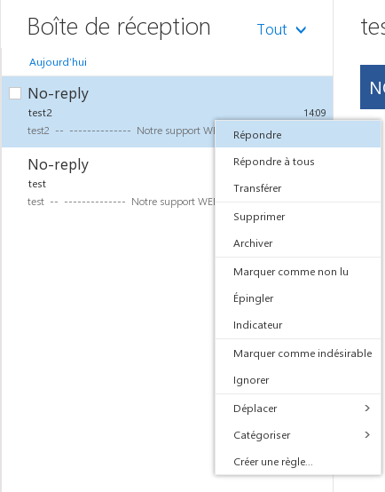{.thumbnail}

#### Contenido de un mensaje
En la imagen puede ver cómo se muestra el contenido del mensaje seleccionado, la fotografía del remitente del mensaje, la fecha y hora de recepción del mensaje y otras opciones que se detallan a continuación: 

Responder a todos: Responder a todas las personas que han recibido el mensaje y aparecen en el campo «Para:»

Más acciones (representado por «v»): Permite mostrar las acciones adicionales.

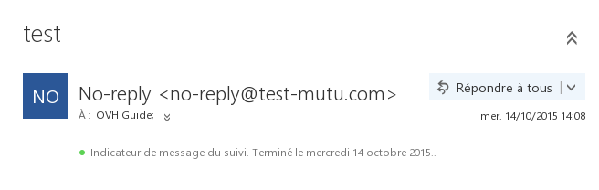{.thumbnail}

#### Más acciones:
Responder: Permite responder a la última persona que haya respondido al mensaje. 

Responder a todos: Permite responder a todas las personas que han recibido el correo y las incluidas en los campos A y CC.  

Reenviar: Transfiere el correo a otra cuenta de correo.

Responder a todos con una reunión: Crea una solicitud de reunión pendiente de aceptación por parte de las diferentes personas invitadas.

Responder por MI: La opción de responder por mensaje instantáneo aún no está disponible. Esta funcionalidad se activará próximamente con la llegada de la aplicación Lync.

Responder a todos por MI: La opción de responder a todos por mensaje instantáneo aún no está disponible. Esta funcionalidad se activará próximamente con la llegada de la aplicación Lync.

Eliminar: Elimina el mensaje seleccionado. 

Eliminar todos los mensajes de: Elimina todos los mensajes de un remitente. 

Marcar como no deseado: Marca como no deseados el mensaje seleccionado y su remitente. El mensaje se mueve automáticamente a la carpeta del sistema «Correo no deseado». En «Configuración» (icono con forma de engranaje) > «Opciones» > «Cuentas» > «Bloquear o permitir» puede ver la lista de usuarios bloqueados o autorizados.

Marcar como no leído: Marca como no leído el mensaje seleccionado.

Imprimir: Abre el mensaje seleccionado en una nueva ventana desde donde podrá imprimirlo.

Ver detalles de mensaje: Muestra la cabecera del mensaje seleccionado. Esta opción permite ver el camino recorrido por un mensaje (servidor utilizado, fecha, hora, etc.) hasta que llega a nuestros servidores. Nuestro soporte técnico podría pedirle que le facilitara la cabecera del mensaje para realizar determinados diagnósticos.

Abrir en una ventana independiente: Abre el mensaje seleccionado en una nueva ventana.

{.thumbnail}

### Calendario

#### Introducción
El menú «Calendario» permite consultar, gestionar o crear calendarios. También permite acceder a los calendarios compartidos o compartir calendarios propios.

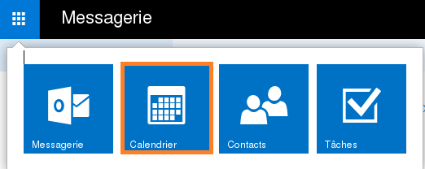{.thumbnail}

#### Nuevo
Con el botón «Nuevo», situado en la columna izquierda, puede añadir un evento a su calendario o a un calendario compartido.

Al igual que para redactar un nuevo mensaje de correo, aparecerán diversas opciones relacionadas con la edición del contenido del evento que se añadirá posteriormente al calendario seleccionado.

{.thumbnail}

### Contactos

#### Introducción
El menú «Contactos» muestra los contactos y permite crear nuevos contactos o carpetas de contactos asociados a la cuenta Exchange.

{.thumbnail}
En la columna izquierda podrá ver los contactos de su cuenta Exchange, seguidos de los contactos de la plataforma Exchange (o libreta global de direcciones), así como las direcciones de las cuentas de recursos en la sección «Directorio».

{.thumbnail}

#### Nuevo
Este botón le permite crear un nuevo contacto o grupo de contactos.

{.thumbnail}
Crear contacto 

Al crear un nuevo contacto, podrá indicar su nombre, apellidos, teléfono, etc.

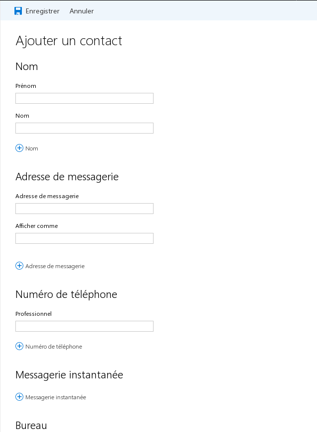{.thumbnail}

#### Crear grupo
Si crea un grupo de contactos, podrá añadir miembros al grupo indicando su dirección de correo. Puede buscar las direcciones entre los contactos o en el directorio, o introducir direcciones externas manualmente. 

A continuación, puede enviar un mensaje al grupo de contactos. El mensaje se distribuirá por correo electrónico a todos los miembros que haya añadido anteriormente.

{.thumbnail}

#### Más información
OWA no permite compartir contactos. Para ello deberá utilizar un cliente de correo compatible (Outlook, por ejemplo).

### Tareas

#### Introducción
El menú «Tareas» permite crear, gestionar y mostrar las tareas asociadas a la cuenta Exchange.

La columna central muestra el contenido de la carpeta de tareas seleccionada y la columna derecha, los detalles de la tarea seleccionada.

{.thumbnail}

#### Nuevo
Este botón permite crear una nueva tarea en la carpeta de tareas seleccionada, indicar su asunto, la fecha de vencimiento y añadir detalles como el asunto, la fecha de vencimiento, el porcentaje completado, etc.

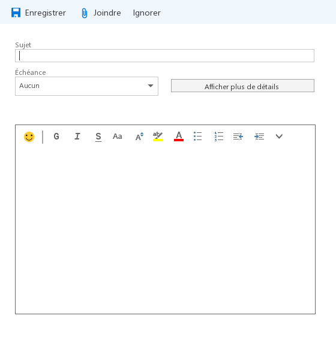{.thumbnail}

#### Carpeta de tareas
En la columna izquierda puede ver todas las carpetas de tareas. 

Para crear una carpeta personalizada, haga clic derecho en «Mis tareas» y seleccione «Crear carpeta nueva».

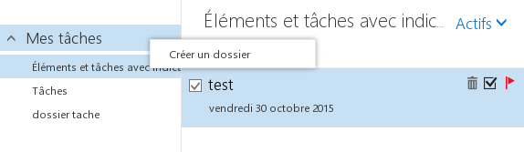{.thumbnail}

#### Más información
OWA no permite compartir tareas. Para ello deberá utilizar un cliente de correo compatible (Outlook, por ejemplo).

### Opciones
Haciendo clic en el nombre de visualización de la cuenta puede acceder a las siguientes opciones: 

- Cambiar: Cambia la foto de perfil de la cuenta Exchange. 

- Abrir otro buzón: Para más información sobre esta opción, consulte la guía específica: 

- Cerrar sesión: Desconecta la cuenta Exchange y muestra la página de inicio de sesión de OWA.

{.thumbnail}

#### Imagen de perfil
Haga clic en el botón «Cambiar» y seleccione en su equipo la foto que quiere mostrar en el perfil.

#### Opciones
Haciendo clic en el icono con forma de engranaje accederá a los ajustes de configuración general de la cuenta Exchange y a las opciones adicionales. A continuación, detallamos los posibles ajustes de configuración:

Actualizar: Actualiza la cuenta Exchange. Por ejemplo, si una persona le envía un mensaje, utilice este botón para forzar la recepción.

Administrar aplicaciones: Permite gestionar o añadir a OWA aplicaciones adicionales (plugins). Algunas aplicaciones han sido instaladas por defecto por nuestros administradores y no pueden eliminarse.

Configuración sin conexión: Activa o desactiva el acceso sin conexión a la cuenta Exchange. Esta opción es práctica si desea consultar su cuenta Exchange sin estar conectado a internet.

Cambiar tema: Permite cambiar el tema y los colores de OWA.

Opciones: Muestra las opciones adicionales de la cuenta Exchange, que se detallan en el siguiente apartado.

{.thumbnail}
Ayuda: Representado por el icono con forma de interrogación, abre una página con el sistema de ayuda de Microsoft.

{.thumbnail}

### Más opciones adicionales de la cuenta Exchange
En esta sección podrá acceder a las siguientes opciones: 

General: En esta sección se muestra la información general de su cuenta Exchange y de la interfaz OWA. También puede modificar la contraseña de su cuenta Exchange, así como determinados datos. 

- Información adicional: Tan solo podrá modificar su nombre, apellidos, nombre para mostrar y dirección de Exchange desde su [área de cliente web](https://www.ovh.com/manager/web/login.html). 

Correo: En esta sección puede definir las reglas de su bandeja de entrada, las respuestas automáticas y consultar los informes de su cuenta Exchange. 

Calendario: Esta sección le permite modificar varias opciones de su calendario como las notificaciones, los recordatorios, etc.

{.thumbnail}

En la [Tienda Office ](https://store.office.com/es) podrá acceder a las aplicaciones adicionales. No podrá añadir todas las aplicaciones por defecto, ya que algunas de estas requieren permisos de administrador. Si desea instalar una aplicación que requiere permiso de administrador, puede ponerse en contacto con el soporte de Exchange para que estudie su solicitud.

## Outlook Web App 2013

### Correo
El menú «Correo» muestra su buzón de correo Exchange.

En la columna izquierda encontrará el botón para crear nuevos mensajes, seguido de las carpetas del sistema y otras carpetas personalizadas (en el ejemplo de la imagen, «Dossier TEST»).

El símbolo << situado bajo el botón «Correo nuevo» permite ocultar toda la columna excepto el botón «Correo nuevo».

{.thumbnail}

#### Correo nuevo
Puede adjuntar archivos a su mensaje, utilizar [aplicaciones](https://store.office.com/appshome.aspx?productgroup=Outlook&ui=es-ES&rs=es-ES&ad=ES) adicionales para OWA o activar la confirmación de entrega o de lectura.

Asimismo, encontrará las opciones tradicionales de edición de contenidos (fuente, tamaño, color, etc.).

Más información
En OWA, el tamaño de los archivos adjuntos está limitado a 35 MB. La aplicación de sincronización ActiveSync tiene una limitación de 10 MB para los archivos adjuntos (principalmente en los smartphones compatibles con ActiveSync). Utilizando un cliente de escritorio compatible (por ejemplo, Outlook, el tamaño máximo de los archivos adjuntos es de 100 MB.

{.thumbnail}

#### Carpetas del sistema y carpetas personalizadas
Las carpetas por defecto del sistema que podrá ver son las siguientes:

- Inbox: Bandeja de entrada
- Drafts: Borradores
- Sent Items: Enviados
- Deleted Items: Eliminados
- Fuentes RSS
- Junk Email: Correo no deseado
- Notes: Notas

No es posible renombrar, mover o eliminar las carpetas del sistema. Estas se rigen por reglas fijas y no modificables.

Haciendo clic derecho en el nombre de su cuenta Exchange o en una carpeta, aparecerán las siguientes opciones:

crear carpeta nueva: Crea una carpeta en la ubicación en la que haya hecho clic derecho. En el ejemplo de la imagen se creará al mismo nivel que las demás carpetas del sistema.

cambiar nombre: Renombra una carpeta personalizada.

eliminar: Elimina una carpeta personalizada.

vaciar: Vacía una carpeta del sistema o personalizada. Todo su contenido se trasladará a «Trash».

agregar a favoritos: Añade la carpeta seleccionada a la zona «Favoritos». 

mover: Traslada la carpeta personalizada seleccionada a otra carpeta.

marcar todos como leídos: Marca todos los mensajes no leídos de una carpeta como leídos.

agregar carpeta compartida: Crea el acceso a una carpeta que otro usuario de la misma plataforma Exchange haya compartido con usted (esta opción no aparece al hacer clic derecho en una carpeta del sistema o personalizada).

permisos: Permite autorizar a otro usuario de la misma plataforma Exchange para que acceda a la carpeta del sistema o personalizada que haya seleccionado. Una vez concedidos los permisos, el usuario con el que se ha compartido la carpeta debe utilizar la funcionalidad anterior («agregar carpeta compartida») de su cuenta Exchange con OWA.

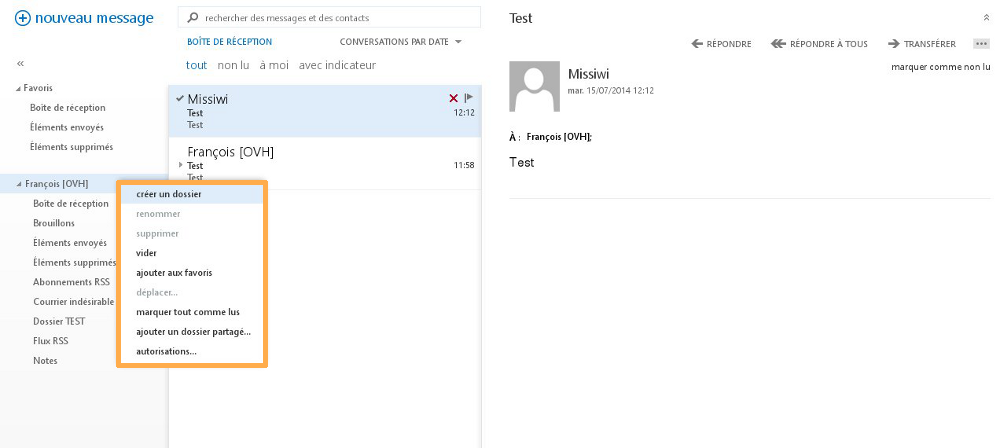{.thumbnail}

#### Contenido de una carpeta
En la imagen puede ver cómo se muestra el contenido de la carpeta seleccionada. En este caso se trata de la carpeta del sistema «Inbox», que contiene dos mensajes de prueba.

En la parte superior de esta columna encontrará un campo de búsqueda de mensajes de correo o contactos, así como varias opciones de clasificación: 

CONVERSACIONES POR FECHA: Permite cambiar el orden en que aparecen los mensajes: por fecha, remitente, marcados, tamaño, etc.).

todo: Muestra todos los mensajes.

no leídos: Solo muestra los mensajes no leídos.

para mí: Solo muestra los mensajes directamente dirigidos a usted.

marcados: Solo muestra los mensajes con un indicador (símbolo ⚐ al final del asunto del mensaje).

{.thumbnail}

#### Opciones del mensaje
A continuación se describen las distintas opciones disponibles al hacer clic derecho en un mensaje: 

eliminar: Elimina el mensaje seleccionado.

marcar como no leído: Marca como leído el mensaje seleccionado.

marcar: Permite marcar un mensaje para seguimiento.

marcar como completado: Esta opción solo aparece cuando el mensaje se ha marcado previamente para seguimiento (indicador ⚐ al final del asunto) y permite marcarlo como finalizado.

mover: Traslada el mensaje seleccionado a una carpeta específica.

ignorar: Ignora el mensaje seleccionado y la conversación asociada. Tanto el mensaje como la conversación se trasladan a la carpeta del sistema «Deleted Items» y los futuros emails recibidos de esa misma conversación se moverán automáticamente a la carpeta del sistema «Deleted Items».

categorizar: Asigna una categoría al mensaje seleccionado asociándole un color. Es posible modificar las categorías y cambiar los colores utilizados.

crear regla: Crea una regla para la bandeja de entrada y determina el comportamiento que adoptará la cuenta Exchange para gestionar los futuros emails recibidos.

marcar como no deseado: Marca como no deseados el mensaje seleccionado y su remitente. El mensaje se mueve automáticamente a la carpeta del sistema «Junk Email». En «Configuración» (icono con forma de engranaje) > «Opciones» > «bloquear o permitir» puede ver la lista de usuarios bloqueados o autorizados.

{.thumbnail}

#### Contenido de un mensaje
En la imagen puede ver cómo se muestra el contenido del mensaje seleccionado, la fotografía del remitente del mensaje, la fecha y hora de recepción del mensaje y otras opciones que se detallan a continuación:

RESPONDER: Responder al remitente del mensaje.

RESPONDER A TODOS: Responder a todas las personas que han recibido el mensaje y aparecen en el campo «Para:».

REENVIAR: Transfiere todo el contenido del mensaje, incluidos los archivos adjuntos.

Más acciones (representado por «...»): Permite mostrar las acciones adicionales.

{.thumbnail}

#### Más acciones
responder por MI: La opción de responder por mensaje instantáneo aún no está disponible. Esta funcionalidad se activará próximamente con la llegada de la aplicación Lync.

responder a todos por MI: La opción de responder a todos por mensaje instantáneo aún no está disponible. Esta funcionalidad se activará próximamente con la llegada de la aplicación Lync.

eliminar: Elimina el mensaje seleccionado.

categorizar: Asigna una categoría al mensaje seleccionado asociándole un color. Es posible modificar las categorías y cambiar los colores utilizados.

marcar como no deseado: Marca como no deseados el mensaje seleccionado y su remitente. El mensaje se mueve automáticamente a la carpeta del sistema «Junk Email». En «Configuración» (icono con forma de engranaje) > «Opciones» > «bloquear o permitir» puede ver la lista de usuarios bloqueados o autorizados.

abrir en una ventana independiente: Abre el mensaje seleccionado en una nueva ventana.

imprimir: Abre el mensaje seleccionado en una nueva ventana desde donde podrá imprimirlo.

crear regla: Crea una regla para la bandeja de entrada y determina el comportamiento que adoptará la cuenta Exchange para gestionar los futuros emails recibidos.

ver detalles del mensaje: Muestra la cabecera del mensaje seleccionado. Esta opción permite ver el camino recorrido por un email (servidor utilizado, fecha, hora, etc.) hasta que llega a nuestros servidores. Nuestro soporte técnico podría pedirle que le facilitara la cabecera del mensaje para realizar determinados diagnósticos.

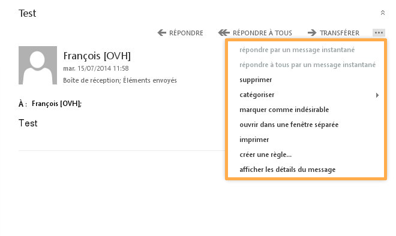{.thumbnail}

### Calendario

#### Introducción
El menú «Calendario» permite consultar, gestionar o crear calendarios. También permite acceder a los calendarios compartidos o compartir calendarios propios.

Para más información sobre esta última funcionalidad, consulte la guía específica:

- 

{.thumbnail}

#### Nuevo evento
Con el botón «nuevo evento», situado en la columna izquierda, puede añadir un evento a su calendario o a un calendario compartido.

Al igual que para redactar un nuevo mensaje de correo, aparecerán diversas opciones relacionadas con la edición del contenido del evento que se añadirá posteriormente al calendario seleccionado.

{.thumbnail}

### Contactos

#### Introducción
El menú «Contactos» muestra los contactos y permite crear nuevos contactos o carpetas de contactos asociados a la cuenta Exchange.

En la columna izquierda podrá ver los contactos de su cuenta Exchange, seguidos de los contactos de la plataforma Exchange (o libreta global de direcciones), así como las direcciones de las cuentas de recursos.

{.thumbnail}

#### Nuevo
El botón «nuevo» permite crear un nuevo contacto o grupo de contactos.

{.thumbnail}

#### Crear contacto
Al crear un nuevo contacto, podrá indicar su nombre, apellidos, teléfono...

{.thumbnail}

#### Crear grupo
Si crea un grupo de contactos, podrá añadir miembros al grupo indicando su dirección de correo. Puede buscar las direcciones entre los contactos o en el directorio, o introducir direcciones externas manualmente.

A continuación, puede enviar un mensaje al grupo de contactos. El mensaje se distribuirá por correo electrónico a todos los miembros que haya añadido anteriormente.

{.thumbnail}

#### Más información
OWA no permite compartir contactos. Para ello deberá utilizar un cliente de correo compatible (como Outlook).

Consulte la siguiente guía: 

- 

### Tareas

#### Introducción
El menú «Tareas» permite crear, gestionar y mostrar las tareas asociadas a la cuenta Exchange.

La columna central muestra el contenido de la carpeta de tareas seleccionada y la columna derecha, los detalles de la tarea seleccionada.

{.thumbnail}

#### Nueva tarea
El botón «nueva tarea» permite crear una nueva tarea en la carpeta de tareas seleccionada, indicar su asunto, la fecha de vencimiento y añadir detalles como la fecha de inicio, el estado, el porcentaje de progreso...

{.thumbnail}

#### Carpetas de tareas
En la columna izquierda puede ver todas las carpetas de tareas. 

Para crear una carpeta personalizada, haga clic derecho en «Mis tareas» y seleccione «crear carpeta nueva».

{.thumbnail}

#### Más información
OWA no permite compartir tareas. Para ello deberá utilizar un cliente de correo compatible (como Outlook).

### Opciones
Haciendo clic en el nombre de visualización de la cuenta, puede acceder a las siguientes opciones:

cambiar: Cambia la foto de perfil de la cuenta Exchange.

Abrir otro buzón: Para más información sobre esta opción, consulte la guía específica: 

- 

Cerrar sesión: Desconecta la cuenta Exchange y muestra la página de inicio de sesión de OWA.

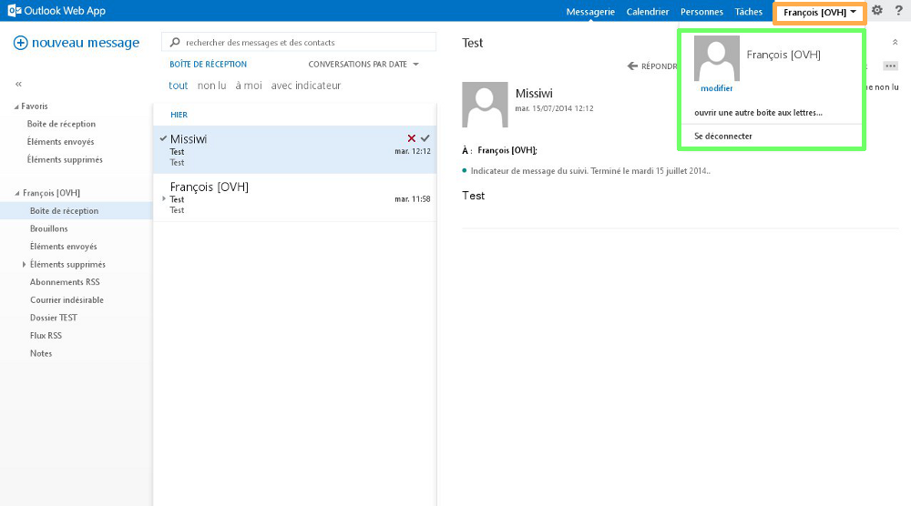{.thumbnail}

#### Imagen de perfil
Haga clic en el botón «seleccionar foto» y elija en su equipo la foto que quiere mostrar en su perfil.

{.thumbnail}

#### Opciones
Haciendo clic en el icono con forma de engranaje accederá a los ajustes de configuración general de la cuenta Exchange y a las opciones adicionales. A continuación detallamos los posibles ajustes de configuración:

Actualizar: Actualiza la cuenta Exchange. Por ejemplo, si una persona le envía un mensaje, utilice este botón para forzar la recepción.

Establecer respuestas automáticas: Activa los mensajes de respuesta  automática (contestador) para la cuenta Exchange.

- 

Configuración de pantalla: Permite cambiar la configuración de la interfaz OWA: diseño de la lista de mensajes, de las conversaciones, del panel de lectura de los mensajes, activación de la versión ligera de OWA y envío de informes a Microsoft.

Administrar aplicaciones: Permite gestionar o añadir a OWA aplicaciones adicionales (plugins). Algunas aplicaciones han sido instaladas por defecto por nuestros administradores y no pueden eliminarse.

Configuración sin conexión: Activa o desactiva el acceso sin conexión a la cuenta Exchange. Esta opción es práctica si desea consultar su cuenta Exchange sin estar conectado a internet.

Cambiar tema: Permite cambiar el tema y los colores de OWA.

Cambiar contraseña: Permite cambiar la contraseña de la cuenta Exchange. También es posible cambiar la contraseña desde el [área de cliente web](https://www.ovh.com/manager/web/login.html).

Opciones: Muestra las opciones adicionales de la cuenta Exchange, que se detallan en el siguiente apartado.

Ayuda: Representado por el icono con forma de interrogación, abre una página con el sistema de ayuda de Microsoft.

{.thumbnail}

### Más opciones de la cuenta Exchange
Haciendo clic en «Opciones», se abren las siguientes opciones:

cuenta: En esta pantalla podrá ver la información general de la cuenta Exchange. También podrá cambiar la contraseña de la cuenta exchange y editar la información del perfil (tenga en cuenta que algunos datos, como nombre, apellidos, nombre para mostrar y dirección Exchange solo pueden cambiarse desde el [área de cliente web](https://www.ovh.com/manager/web/login.html).

organizar correo electrónico: Aquí puede indicar las reglas de la bandeja de entrada y las respuestas automáticas y consultar los informes de entrega asociados a su cuenta Exchange.

buzones del sitio: Esta opción aún no está disponible. La funcionalidad se activará próximamente con la llegada de la aplicación Lync.

configuración: Más opciones de configuración del correo, los mensajes, los calendarios, las opciones regionales y cambio de la contraseña de la cuenta Exchange.

teléfono: Aquí puede ver los dispositivos móviles en los que ha configurado su cuenta Exchange. Puede eliminar un dispositivo de la lista, eliminar de forma remota los datos o bloquearlo.

bloquear o permitir: Aquí puede administrar los remitentes o destinatarios de los mensajes autorizados o bloqueados. Cuando marque un mensaje como correo no deseado, su remitente se bloqueará y aparecerá en esta sección.

aplicaciones: Aquí puede añadir aplicaciones (plugins) para su OWA. Algunas aplicaciones han sido instaladas por defecto por nuestros administradores y no pueden eliminarse. En la [tienda de aplicaciones para Office](https://store.office.com/appshome.aspx?productgroup=Outlook&ui=es-ES&rs=es-ES&ad=ES) encontrará todas las aplicaciones adicionales. No todas las aplicaciones pueden añadirse por defecto; para algunas es necesario tener permisos de administrador. Si quiere instalar una aplicación que requiere permisos de administrador, contacte con nuestro soporte para que podamos estudiar su solicitud.

{.thumbnail}

En determinadas condiciones, podemos encargarnos de realizar ciertas intervenciones relacionadas con su servicio Exchange a través de una intervención de pago.

En esta guía puede consultar las distintas intervenciones que puede realizar OVH:

- 

Para solicitar una intervención de pago, consulte la guía anterior para conocer el procedimiento a seguir.

{.thumbnail}