**Qu'est-ce qu'Outlook Web App (OWA) ?**

**OWA**  correspond au webmail Exchange. Cette interface vous permettra de consulter et utiliser votre compte Exchange ainsi que les diverses fonctionnalités associées depuis une page Internet classique.

Cette interface est très pratique si vous ne possédez pas de logiciel de messagerie compatible pour la configuration et l'utilisation d'un compte Exchange.

**Où et comment se connecter à OWA ?**

L'adresse de messagerie correspondra à l'adresse Exchange complète que vous souhaitez consulter.

Le mot de passe correspondra à celui définit lors de la création de l'adresse Exchange dans votre [espace client web](https://www.ovh.com/manager/web/login.html){.external}.

**Offre Hosted Exchange** :

En fonction de votre version Exchange vous aurez 3 possibilités :

- [https://ex.mail.ovh.net](https://ex.mail.ovh.net){.external}
- [https://ex2.mail.ovh.net](https://ex2.mail.ovh.net){.external}
- [https://ex3.mail.ovh.net](https://ex2.mail.ovh.net){.external}

**Offre Private Exchange** :  

L'URL d'accès dépendra du nom d'hôte de votre serveur, définie à la création du service.

{.thumbnail}

Lorsque vous vous connecterez pour la première fois à  **OWA**  il sera nécessaire de définir votre fuseau horaire.

{.thumbnail}

## Outlook Web App 2016 et ultérieur

### Interface et fonctionnalites

#### Messagerie
Par défaut une fois connecté, la section messagerie est accessible.

Si vous naviguez dans une autre section : Calendrier, Contacts, Taches, il est possible à tout moment de se replacer dans la section messagerie.

Il faut cliquer sur le carré bleu en haut à gauche afin d'avoir accès aux différentes sections.

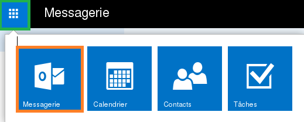{.thumbnail}

Pour la création de nouveaux messages : veuillez cliquer sur "nouveau"

{.thumbnail}

Si vous cliquez sur la flèche noire 2 options seront proposées :

- Message électronique
- Événement de calendrier

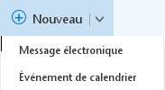{.thumbnail}

Dans la colonne de gauche vous trouverez les dossiers systèmes ou autres dossiers personnalisés (*"Dossier TEST"* dans notre exemple).

{.thumbnail}

#### Nouveau message
Vous pourrez par exemple insérer une pièce jointe à votre e-mail, utiliser [des applications supplémentaires](http://office.microsoft.com/fr-fr/store/applications-pour-outlook-FX102825292.aspx?app=outlook.exe){.external} liées à **OWA** , ou encore activer l'accusé de réception ou l'accusé de lecture.

Vous trouverez également les options classiques d'édition de contenu (police, taille, couleur, etc...).

**Informations complémentaires** La taille d'une pièce jointe via  **OWA**  est limitée à  **25 Mo** . L'application de synchronisation ActiveSync imposera une limitation de  **10 Mo**  sur les pièces jointes (principalement sur les smartphones compatibles ActiveSync). En utilisant un logiciel de messagerie compatible (Outlook par exemple), la taille d'une pièce jointe est de  **100 Mo**  au maximum.

{.thumbnail}

#### Les dossiers systeme et dossiers personnalises
Par défaut, voici les dossiers système que vous observerez :

- Boîte de réception
- Brouillons
- Éléments envoyés
- Éléments supprimés
- Courrier indésirable
- Flux RSS
- Notes

{.thumbnail}

**Un dossier système ne peut être renommé, déplacé ou supprimé. Il s'agit de règles fixées et non modifiables.**

En réalisant un  **clic droit**  sur le nom d'affichage de votre compte Exchange ou sur un dossier, diverses options vous seront proposées :

**Créer un dossier** :  crée un dossier à l'endroit où le clic droit a été effectué. Dans notre exemple le dossier sera créé au même niveau que les autres dossiers système.

**Renommer** :  renomme un dossier personnalisé.

**Supprimer** :  supprime un dossier personnalisé.

**Dossier Vide** :  vide un dossier système ou personnalisé. Tout le contenu sera alors transféré dans "Éléments supprimés"

**Ajouter aux favoris** :  ajoute le dossier sélectionné dans la partie "Favoris".

**Déplacer** :  déplace le dossier personnalisé sélectionné dans un autre dossier.

**Marquer tout comme lu** :  marque tous les e-mails non lus d'un dossier en lus.

**Ajouter un dossier partagé** :  ajoute l'accès à un dossier qu'un autre utilisateur de votre plate-forme Exchange a partagé avec vous (cette option n'apparaît pas lors d'un clic droit sur un dossier système ou personnalisé).

**Autorisations** :  permet de donner des autorisations d'accès à un autre utilisateur de votre plate-forme Exchange sur le dossier système, ou personnaliser qui a été sélectionné. Lorsque les autorisations sont attribuées, l'utilisateur avec qui le partage a été lancé doit utiliser la fonctionnalité décrite précédemment (*Ajouter un dossier partagé*) à travers l'OWA de son compte Exchange.

#### Le contenu d'un dossier
Il s'agit ici de l'affichage du contenu du dossier choisi. Dans notre exemple, c'est le dossier système "Boîte de réception" qui est sélectionné. Celui-ci contient deux e-mails de test.

Vous trouverez en haut de cette colonne  **un moteur de recherche**  pour retrouver des e-mails ou des contacts ainsi que différentes options de classement :

**Tout** :  affiche tous les e-mails.

**Non lu** :  affiche uniquement les e-mails non lus.

**À moi** :  affiche uniquement les e-mails qui vous sont adressés directement.

**Avec indicateur** :  affiche uniquement les e-mails avec un indicateur (symbole ⚐ au bout du titre de l'e-mail).

**Trier par**  vous permet de gérer l'affichage des e-mails par divers systèmes de tri (Date, Destinataire, Marqué, Taille, etc...).

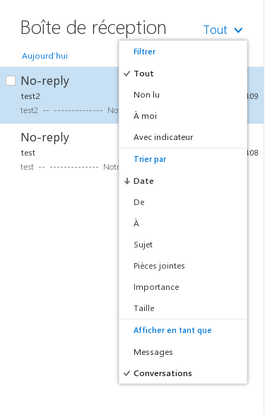{.thumbnail}

Voici également les différentes options disponibles lors d'un clic droit sur un e-mail :

**Répondre** :  permet de répondre au dernier expéditeur.

**Répondre à tous** :  permet de répondre à toutes les personnes incluent dans le champ A et cc.

**Transférer** :  Transfert le mail à une autre boîte e-mail.

**Supprimer** :  supprime l'e-mail sélectionné.

**Archiver** :  Archive le mail dans un dossier "Archivage". Il est possible de personnaliser le nom de ce dossier.

**Marquer comme non lu** :  marque comme non lu l'e-mail sélectionné.

**Épingler** :  épingle le mail en premier dans la boîte e-mail. Si l'élément est épinglé, l'option dans le menu sera : Détacher.

**Marquer comme terminé** :  cette option n'apparaît que lorsqu'un indicateur (⚐)  a été placé sur l'e-mail auparavant et permet donc de le marquer comme terminé.

**Marquer comme indésirable** :  marque comme indésirable l'e-mail sélectionné et son expéditeur. L'e-mail est alors placé automatiquement dans le dossier système "Courrier indésirable". Vous pouvez retrouver la liste des utilisateurs approuvés ou bloqués, dans la partie "Paramètres" (symbolisé par la roue dentée), "Options", "comptes", "Bloquer ou autoriser".

**Ignorer** :  ignore l'e-mail sélectionné et la conversation associée. L'e-mail et la conversation seront  alors placés dans le dossier système "Éléments supprimés". Les futurs e-mails envoyés pour cette même conversation seront automatiquement placés dans le dossier système "Éléments supprimés".

**Déplacer** :  déplace l'e-mail sélectionné dans un dossier spécifique.

**Catégoriser** :  catégorise l'e-mail sélectionné en lui associant une couleur. Il est également possible de gérer vos catégories et modifier les couleurs utilisées.

**Créer une règle** :  crée une règle de boîte de réception et détermine le comportement que votre compte Exchange adoptera pour le traitement de futurs e-mails reçus.

{.thumbnail}

#### Le contenu d'un e-mail
Vous trouverez ici l'affichage du contenu de l'e-mail choisi, la photo du profil de l'expéditeur de l'e-mail, la date et l'heure de la réception de l'e-mail et différentes options supplémentaires:

**Répondre à tous** :  répondre à toutes les personnes qui ont reçu l'e-mail et présentes dans le champ « À ».

**Plus d'actions (représenté par « v »)** :  permet d'afficher les options supplémentaires.

{.thumbnail}

**Répondre** :  répondre à la dernière personne ayant répondu à l'e-mail.

**Répondre à tous** :  répondre à toutes les personnes qui ont reçu l'e-mail et présentes dans le champ « À ».

**Transférer** :  Transfert le mail à une autre boîte e-mail.

**Répondre à tous par réunion:**  Crée une demande de réunion soumise à acceptation de la parts des différentes personnes concernées.

**Répondre par un message instantané** :  cette option n'est pour le moment pas disponible. Il s'agit d'une fonctionnalité qui sera mise en place prochainement avec l'arrivée de l'application Lync.

**Répondre à tous par un message instantané** :  cette option n'est pour le moment pas disponible. Il s'agit d'une fonctionnalité qui sera mise en place prochainement avec l'arrivée de l'application Lync.

**Supprimer** :  supprime l'e-mail sélectionné.

**Supprimer tous les messages de** :  supprime tous les e-mails d'un expéditeur.

**Marquer comme indésirable** :  marque comme indésirable l'e-mail sélectionné et son expéditeur. L'e-mail est alors placé automatiquement dans le dossier système « Courrier indésirable ». Vous pouvez retrouver la liste des utilisateurs approuvés ou bloqués, dans la partie « Paramètres » (symbolisée par la roue dentée), « Options », « Bloquer ou autoriser ».

**Marquer comme non lu** :  marque comme non lu l'e-mail sélectionné.

**Imprimer** :  ouvre l'e-mail sélectionné dans une fenêtre supplémentaire afin de vous permettre de  lancer une impression par la suite.

**Afficher les détails du message** :  affichez l'en-tête de l'e-mail sélectionné. Cette option vous permettra d'observer le chemin emprunté par un e-mail (serveur utilisé, date, heure, etc...) jusqu'à son arrivée sur nos serveurs. Notre support technique vous demandera dans certains cas d'utiliser cette option pour établir des diagnostics particuliers.

**Ouvrir dans une autre fenêtre** :  ouvre l'e-mail sélectionné dans une fenêtre supplémentaire.

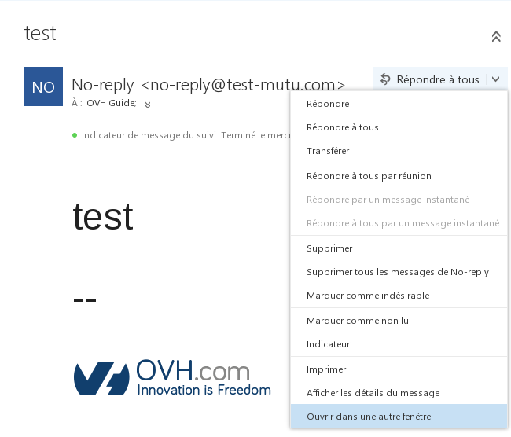{.thumbnail}

### Calendrier

#### Généralité
Le bouton "Calendrier" vous permettra de consulter, gérer ou créer vos calendriers. Cette section vous permettra également d'accéder aux calendriers partagés ou d'initier des partages de calendriers.

{.thumbnail}

#### Nouveau
Ce bouton vous permettra d'ajouter un événement sur votre calendrier ou sur un calendrier partagé.

Tout comme l'écriture d'un nouvel e-mail, vous trouverez diverses options liées à l'édition du contenu de l'événement ajouté au calendrier sélectionné.

{.thumbnail}

### Contacts

#### Généralité
Le bouton "Contacts" vous permettra d'afficher les contacts et de créer des contacts ou dossiers de contacts liés à votre compte Exchange.

{.thumbnail}

C'est dans la colonne de gauche que vous trouverez les contacts liés à votre compte Exchange mais également les contacts liés à la plate-forme Exchange (ou carnet d'adresses global) ainsi que les adresses des comptes de ressources dans la section "Annuaire".

{.thumbnail}

#### Nouveau
Ce bouton vous permettra de créer un nouveau contact ou une liste de contact.

{.thumbnail}

Données du contact :

La création d'un nouveau contact vous proposera d'ajouter à celui-ci des informations complémentaires comme le nom, le prénom, le téléphone, etc...

{.thumbnail}

La création d'un groupe de contacts vous proposera d'ajouter des membres à celui-ci. Il s'agira d'adresses e-mail liées à votre carnet d'adresses ou d'adresses externes que vous pourrez saisir manuellement. Vous pourrez ensuite décider d'envoyer un e-mail à votre groupe de contact. L'e-mail sera alors distribué à l'ensemble des membres que vous aurez précédemment ajouté.

{.thumbnail}

OWA ne vous permettra pas d'initier des partages de contacts. Un logiciel de messagerie compatible (Outlook par exemple) sera nécessaire pour cette action.

### Taches

#### Généralité
Le bouton Tâches vous permettra de créer, gérer et afficher les tâches liées à votre compte Exchange.

La colonne du milieu affichera le contenu du dossier de tâche choisi et la colonne de droite les détails de la tâche choisie.

{.thumbnail}

#### Nouvelle tache
Ce bouton vous permettra de créer une nouvelle tâche dans le dossier de tâches sélectionné, de choisir son sujet, son échéance et d'ajouter des détails supplémentaires comme le sujet, la date d'échéance, le pourcentage d'avancement, etc...

{.thumbnail}

Vous observerez dans la colonne de gauche l'ensemble des dossiers de tâches. Vous pourrez d'ailleurs effectuer un  **clic droit**  sur le menu "Mes tâches" afin de créer un dossier de tâches  personnalisé.

{.thumbnail}

OWA ne vous permettra pas d'initier des partages de tâches. Un logiciel de messagerie compatible (Outlook par exemple) sera nécessaire pour cette action.

### Nom d'affichage

#### Options
Ce bouton vous permettra d'accéder aux options suivantes :

- Modifier : modifie la photo de profil de votre compte Exchange.
- Ouvrir une boîte aux lettres : référez-vous au guide disponible pour réaliser cette action :
- Se déconnecter : déconnecte le compte Exchange et affiche la page d'authentification d'OWA.

{.thumbnail}

Cliquez sur le bouton "Modifier" puis choisissez sur votre ordinateur la photo à afficher pour votre profil.

### Parametres

#### Options
Vous accédez ici aux paramètres généraux de votre compte Exchange et aux options supplémentaires. Détaillons celles-ci:

Actualiser : actualise le compte Exchange. Si par exemple une personne vous envoie un e-mail, utilisez ce bouton pour rafraîchir la réception.

Gérer les applications : cette section vous permettra de gérer ou d'ajouter à OWA des applications supplémentaires (ou plugins). Certaines applications sont installées par défaut par nos administrateurs et ne pourront pas être supprimés.

Paramètres hors connexion : active ou désactive l'accès à votre compte Exchange en mode hors connexion. Cette option est pratique si vous souhaitez consulter votre compte Exchange même si vous ne pouvez pas vous connecter à Internet.

Modifier le thème : modifie le thème et les couleurs d'OWA.

Options : affiche les options supplémentaires de votre compte Exchange. Nous détaillerons celles-ci dans la section suivante.

{.thumbnail}

**« Aide »**  (représenté par l'icône en forme de point d'interrogation) : Aide Microsoft.

{.thumbnail}

Vous trouverez dans cette section les options suivantes:

Général : vous observerez ici les informations générales de votre compte Exchange et interface OWA. Vous pourrez également modifier le mot de passe de votre compte Exchange et aurez la possibilité de modifier certaines informations.

- Information complémentaire : la modification du nom, prénom, nom d'affichage et de l'adresse Exchange pourra uniquement être réalisée depuis votre [espace client
web](https://www.ovh.com/manager/web/login.html){.external} .

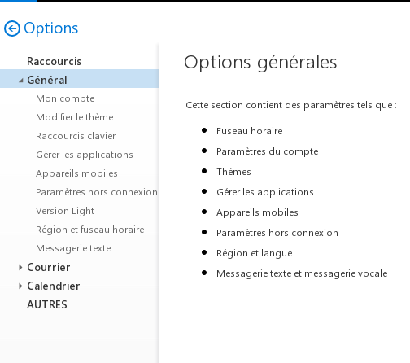{.thumbnail}

### Signature

#### Integration d'une image

> [!success]
>
> Votre image doit être hébergée en ligne et accessible depuis un navigateur internet.
> Un glissé/déposé depuis une image stockée en local sur votre poste ne pourra fonctionner.
> 

Depuis le menu "Options" comme indiqué ci-dessus, dépliez le menu "Courrier" puis "Disposition" puis "Signature électronique".

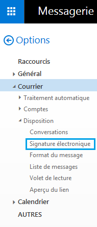{.thumbnail}

Ouvrez votre navigateur internet puis saisissez l'adresse de votre image (ex: www.votredomaine.com/nom-image)

- Cliquez sur votre image et réalisez un clique droit puis "copiez l'image".
- Depuis le menu signature électronique, réaliser un clique droit "coller".

Voici une image copier/coller dans la section signature.

{.thumbnail}

Cochez la case : "Ajouter automatiquement ma signature aux messages que j'envoie"

#### Informations complementaires
[L'office Store](https://store.office.com/fr){.external} vous permettra de trouver les applications supplémentaires. Toutes les applications ne pourront pas être ajoutées par défaut. Certaines d'entres elle nécessiteront des autorisations administrateur. Si vous souhaitez installer une application qui requiert des autorisations administrateur, veuillez prendre contact avec notre support Exchange afin que nous puissions analyser votre requête.

## Outlook Web App 2013

### Interface et fonctionnalites

#### Messagerie
Le bouton Messagerie vous permet d'afficher votre boîte e-mail Exchange.

Vous trouverez dans la colonne de gauche le bouton de création de nouveaux messages ainsi que les dossiers systèmes ou autres dossiers personnalisés (*"Dossier TEST"* dans notre exemple).

Le signe  **« **  en dessous du bouton *"Nouveau message"* vous permettra de masquer toute cette colonne (hormis *"Nouveau message"*).

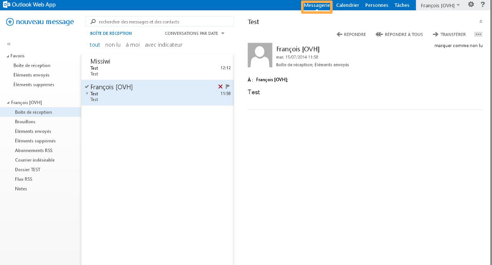{.thumbnail}

#### Nouveau Message
Vous pourrez par exemple insérer une pièce jointe à votre e-mail, utiliser [des applications supplémentaires](http://office.microsoft.com/fr-fr/store/applications-pour-outlook-FX102825292.aspx?app=outlook.exe){.external} liées à **OWA** , ou encore activer l'accusé de réception ou l'accusé de lecture.

Vous trouverez également les options classiques d'édition de contenu (police, taille, couleur, etc...).

**Informations complémentaires ** La taille d'une pièce jointe via  **OWA**  est limitée à  **35Mo** . L'application de synchronisation ActiveSync imposera une limitation de  **10 Mo**  sur les pièces jointes (principalement sur les smartphones compatibles ActiveSync). En utilisant un logiciel de messagerie compatible (Outlook par exemple), la taille d'une pièce jointe est de  **100 Mo**  au maximum.

{.thumbnail}

#### Les dossiers systeme et dossiers personnalises
Par défaut, voici les dossiers système que vous observerez :

- Boîte de réception
- Brouillons
- Éléments envoyés
- Éléments supprimés
- Abonnements RSS
- Courrier indésirable
- Flux RSS
- Notes

**clic droit**  sur le nom d'affichage de votre compte Exchange ou sur un dossier, diverses options vous seront proposées :

**Créer un dossier :**  crée un dossier à l'endroit où le clic droit a été effectué. Dans notre exemple le dossier sera créé au même niveau que les autres dossiers système.

**Renommer :**  renomme un dossier personnalisé.

**Supprimer :**  supprime un dossier personnalisé.

**Vider :**  vide un dossier système ou personnalisé. Tout le contenu sera alors transféré dans "Éléments supprimés"

**Ajouter aux favoris :**  ajoute le dossier sélectionné dans la partie "Favoris".

**Déplacer :**  déplace le dossier personnalisé sélectionné dans un autre dossier.

**Marquer tout comme lu :**  marque tous les e-mails non lus d'un dossier en lus.

**Ajouter un dossier partagé :**  ajoute l'accès à un dossier qu'un autre utilisateur de votre plate-forme Exchange a partagé avec vous (cette option n'apparaît pas lors d'un clic droit sur un dossier système ou personnalisé).

**Autorisations :**  permet de donner des autorisations d'accès à un autre utilisateur de votre plate-forme Exchange sur le dossier système ou personnalisé qui a été sélectionné. Lorsque les autorisations sont attribuées, l'utilisateur avec qui le partage a été lancé doit utiliser la fonctionnalité décrite précédemment (*Ajouter un dossier partagé*) à travers l'OWA de son compte Exchange.

{.thumbnail}

#### Le contenu d'un dossier
Il s'agit ici de l'affichage du contenu du dossier choisi. Dans notre exemple, c'est le dossier système "Boîte de réception" qui est sélectionné. Celui-ci contient deux e-mails de test.

Vous trouverez en haut de cette colonne  **un moteur de recherche**  pour retrouver des e-mails ou des contacts ainsi que différentes options de classement :

**Conversations par date :**  vous permet de gérer l'affichage des e-mails par divers systèmes de tris (Date, Destinataire, Marqué, Taille, etc...).

**Tout :**  affiche tous les e-mails.

**Non lu :**  affiche uniquement les e-mails non lus.

**À moi :**  affiche uniquement les e-mails qui vous sont adressés directement.

**Avec indicateur :**  affiche uniquement les e-mails avec un indicateur (symbole ⚐ au bout du titre de l'e-mail).

{.thumbnail}

Voici également les différentes options disponibles lors d'un clic droit sur un e-mail :

**Supprimer :**  supprime l'e-mail sélectionné.

**Marquer comme lu :**  marque comme lu l'e-mail sélectionné.

**Marquer comme terminé :**  cette option n'apparaît que lorsqu'un indicateur (⚐)  a été placé sur l'e-mail auparavant et permet donc de le marquer comme terminé.

**Déplacer :**  déplace l'e-mail sélectionné dans un dossier spécifique.

**Ignorer :**  ignore l'e-mail sélectionné et la conversation associée. L'e-mail et la conversation seront  alors placés dans le dossier système "Éléments supprimés". Les futurs e-mails envoyés pour cette même conversation seront automatiquement placés dans le dossier système "Éléments supprimés".

**Catégoriser :**  catégorise l'e-mail sélectionné en lui associant une couleur. Il est également possible de gérer vos catégories et modifier les couleurs utilisées.

**Créer une règle :**  crée une règle de boîte de réception et détermine le comportement que votre compte Exchange adoptera pour le traitement de futurs e-mails reçus.

**Marquer comme indésirable :**  marque comme indésirable l'e-mail sélectionné et son expéditeur. L'e-mail est alors placé automatiquement dans le dossier système "Courrier indésirable". Vous pouvez retrouver la liste des utilisateurs approuvés ou bloqués, dans la partie "Paramètres" (symbolisé par la roue dentée), "Options", "Bloquer ou autoriser".

{.thumbnail}

#### Le contenu d'un e-mail
Vous trouverez ici l'affichage du contenu de l'e-mail choisi, la photo du profil de l'expéditeur de l'e-mail, la date et l'heure de la réception de l'e-mail et différentes options supplémentaires:

**Répondre :**  répondre à l'expéditeur de l'e-mail.

**Répondre à tous :**  répondre à toutes les personnes qui ont reçu l'e-mail et présentes dans le champ « À ».

**Transférer :**  transfert l'e-mail dans son entièreté, pièce jointe y comprise.

**Plus d'actions (représenté par « ... ») :**  permet d'afficher les options supplémentaires.

{.thumbnail}

**Répondre par un message instantané :**  cette option n'est pour le moment pas disponible. Il s'agit d'une fonctionnalité qui sera mise en place prochainement avec l'arrivée de l'application Lync.

**Répondre à tous par un message instantané :**  cette option n'est pour le moment pas disponible. Il s'agit d'une fonctionnalité qui sera mise en place prochainement avec l'arrivée de l'application Lync.

**Supprimer :**  supprime l'e-mail sélectionné.

**Catégoriser :**  catégorise l'e-mail sélectionné en lui associant une couleur. Il est également possible de gérer vos catégories et modifier les couleurs utilisées.

**Marquer comme indésirable :**  marque comme indésirable l'e-mail sélectionné et son expéditeur. L'e-mail est alors placé automatiquement dans le dossier système « Courrier indésirable ». Vous pouvez retrouver la liste des utilisateurs approuvés ou bloqués, dans la partie « Paramètres » (symbolisé par la roue dentée), « Options », « Bloquer ou autoriser ».

**Ouvrir dans une fenêtre séparée :**  ouvre l'e-mail sélectionné dans une fenêtre supplémentaire.

**Imprimer :**  ouvre l'e-mail sélectionné dans une fenêtre supplémentaire afin de vous permettre de  lancer une impression par la suite.

**Créer une règle :**   crée une règle de boîte de réception et détermine le comportement que votre compte Exchange adoptera pour le traitement de futurs e-mails reçus.

**Afficher les détails du message :**  affichez l'en-tête de l'e-mail sélectionné. Cette option vous permettra d'observer le chemin emprunté par un e-mail (serveur utilisé, date, heure, etc...) jusqu'à son arrivée sur nos serveurs. Notre support technique vous demandera dans certain cas d'utiliser cette option pour établir des diagnostics particuliers.

{.thumbnail}

### Calendrier

#### Généralité
Le bouton "Calendrier" vous permettra de consulter, gérer ou créer vos calendriers. Cette section vous permettra également d'accéder aux calendriers partagés ou d'initier des partages de calendriers.

Notre guide d'utilisation est à votre disposition pour cette dernière fonctionnalité : {.ref}

{.thumbnail}

#### Nouvel evenement
Ce bouton vous permettra d'ajouter un événement sur votre calendrier ou sur un calendrier partagé.

Tout comme l'écriture d'un nouvel e-mail, vous trouverez diverses options liées à l'édition du contenu de l'événement ajouté au calendrier sélectionné.

{.thumbnail}

### Personnes

#### Généralité
Le bouton "Personnes" vous permettra d'afficher les contacts et de créer des contacts ou dossiers de contacts liés à votre compte Exchange.

C'est dans la colonne de gauche que vous trouverez les contacts liés à votre compte Exchange mais également les contacts liés à la plate-forme Exchange (ou carnet d'adresse global) ainsi que les adresses des comptes de ressources :

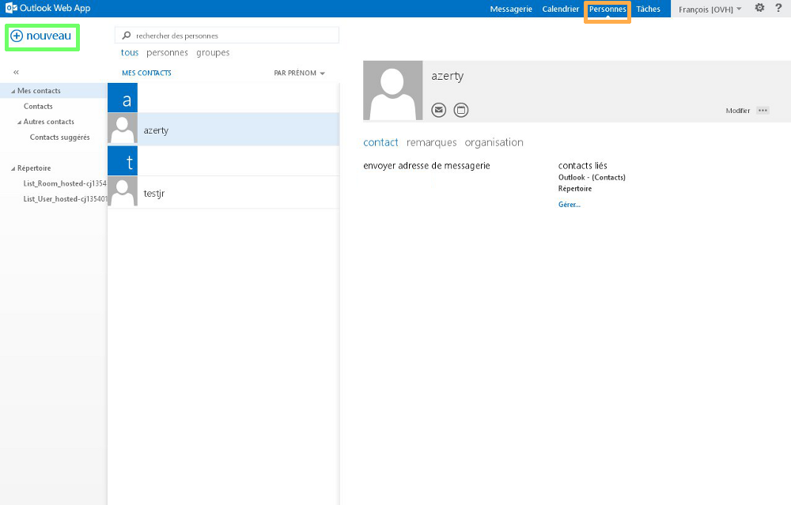{.thumbnail}

#### Nouveau
Ce bouton vous permettra de créer un nouveau contact ou un nouveau groupe de contact.

{.thumbnail}

La création d'un nouveau contact vous proposera d'ajouter à celui-ci des informations complémentaires comme le nom, le prénom, le téléphone, etc...

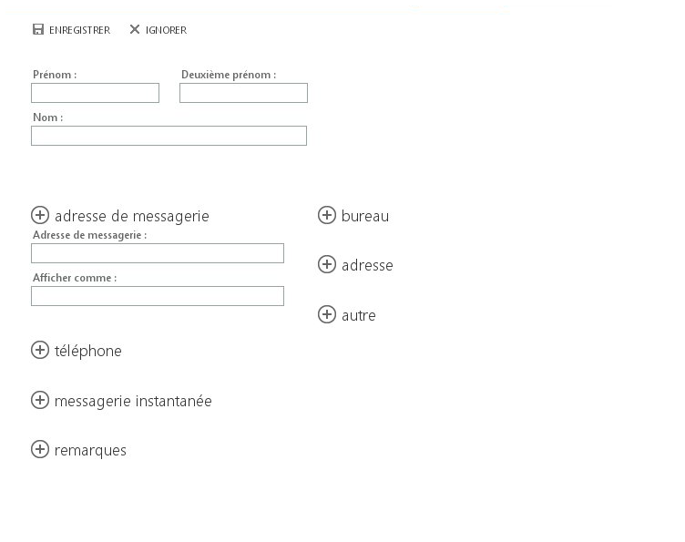{.thumbnail}

La création d'un groupe de contact vous proposera d'ajouter des membres à celui-ci. Il s'agira d'adresses e-mail liées à votre carnet d'adresses ou d'adresses externes que vous pourrez saisir manuellement.

Vous pourrez ensuite décider d'envoyer un e-mail à votre groupe de contact. L'e-mail sera alors distribué à l'ensemble des membres que vous aurez précédemment ajouté.

{.thumbnail}

OWA ne vous permettra pas d'initier des partages de contacts. Un logiciel de messagerie compatible (Outlook par exemple) sera nécessaire pour cette action. Veuillez-vous référer au guide suivant : {.ref}

### Taches

#### Généralité
Le bouton Tâches vous permettra de créer, gérer et afficher les tâches liées à votre compte Exchange.

La colonne du milieu affichera le contenu du dossier de tâche choisi et la colonne de droite les détails de la tâche choisie.

{.thumbnail}

#### Nouvelle tache
Ce bouton vous permettra de créer une nouvelle tâche dans le dossier de tâches sélectionné, de choisir son sujet, son échéance et d'ajouter des détails supplémentaires comme le sujet, la date d'échéance, le pourcentage d'avancement, etc...

{.thumbnail}

Vous observerez dans la colonne de gauche l'ensemble des dossiers de tâches. Vous pourrez d'ailleurs effectuer un  **clic droit**  sur le menu "Mes tâches" afin de créer un dossier de tâches  personnalisé.

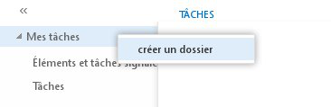{.thumbnail}

OWA ne vous permettra pas d'initier des partages de tâches. Un logiciel de messagerie compatible (Outlook par exemple) sera nécessaire pour cette action.

### Nom d'affichage

#### Options
Ce bouton vous permettra d'accéder aux options suivantes :

- Modifier : modifie la photo de profil de votre compte Exchange.
- Ouvrir une boîte aux lettres : référez-vous au guide disponible pour réaliser cette action :
- Se déconnecter : déconnecte le compte Exchange et affiche la page d'authentification d'OWA.

{.thumbnail}

Cliquez sur le bouton "Parcourir" puis choisissez sur votre ordinateur la photo à afficher pour votre profil.

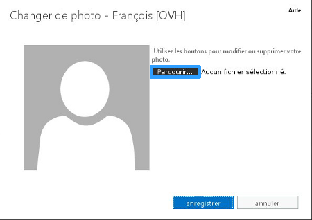{.thumbnail}

### Parametres

#### Options
Vous accédez ici aux paramètres généraux de votre compte Exchange et aux options supplémentaires. Détaillons celles-ci:

Actualiser : actualise le compte Exchange. Si par exemple une personne vous envoie un e-mail, utilisez ce bouton pour rafraîchir la réception.

Définir les réponses automatiques : mise en place des réponses automatiques (ou répondeur) pour votre compte Exchange.

[Un guide est disponible ici]({legacy}1248){.ref}

Paramètres d'affichage : modification des paramètres d'affichage de l'interface OWA. Disposition des e-mails, paramètres des conversations e-mail, affichage du volet de lecture e-mail, activation de la version light d'OWA, signalisation Microsoft.

Gérer les applications : cette section vous permettra de gérer ou d'ajouter à OWA des applications supplémentaires (ou plugins). Certaines applications sont installées par défaut par nos administrateurs et ne pourront pas être supprimés.

Paramètres hors connexion : active ou désactive l'accès à votre compte Exchange en mode hors connexion. Cette option est pratique si vous souhaitez consulter votre compte Exchange même si vous ne pouvez pas vous connecter à Internet.

Modifier le thème : modifie le thème et les couleurs d'OWA.

Modifier le mot de passe : modifie le mot de passe de votre compte Exchange. Vous pouvez également utiliser votre [espace client web](https://www.ovh.com/manager/web/login.html){.external} pour cette action.

Options : affiche les options supplémentaires de votre compte Exchange. Nous détaillerons celles-ci dans la section suivante.

**« Aide »**  (représenté par l'icône en forme de point d'interrogation) : Aide Microsoft.

{.thumbnail}

Vous trouverez dans cette section les options suivantes:

Compte : vous observerez ici les informations générales de votre compte Exchange. Vous pourrez également modifier le mot de passe de votre compte Exchange et aurez la possibilité de modifier certaines informations.

- Information complémentaire : la modification du nom, prénom, nom d'affichage et de l'adresse Exchange pourra uniquement être réalisée depuis votre [espace client
web](https://www.ovh.com/manager/web/login.html){.external} .

{.thumbnail}
