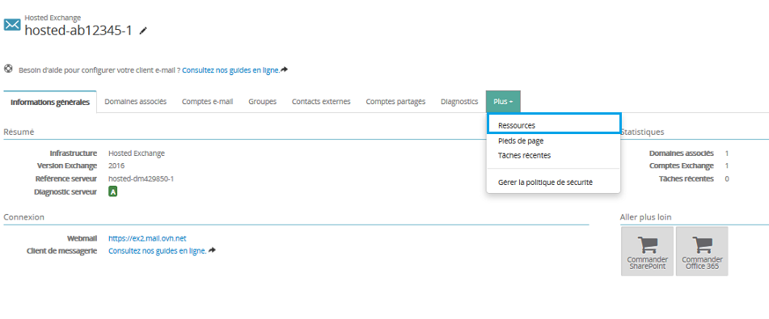
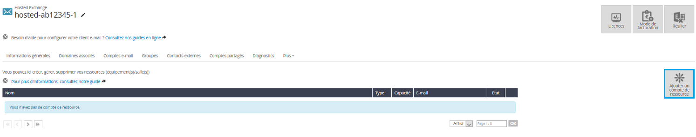
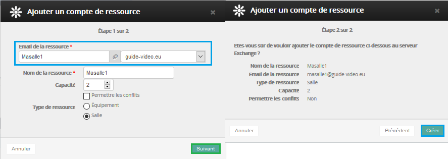
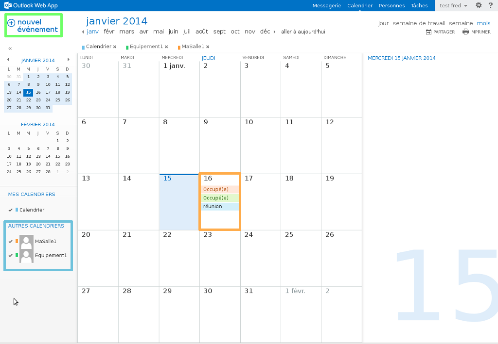

Accessible depuis Outlook, la fonction comptes de ressource vous permet de planifier les besoins de vos collaborateurs. Deux types de ressources sont disponibles : "Salle" ou "Équipement".

Vous devez avoir accès à votre [Espace client](https://www.ovh.com/manager/web/login.html){.external}.

Cliquez [ici](https://www.ovh.com/fr/emails/hosted-exchange-2013/documents/){.external} pour retrouver nos différents guides.

## Ajouter un compte de ressource

### Création de la ressource Partie 1
Afin de créer votre ressource, connectez-vous à votre [Espace client](https://www.ovh.com/manager/web/login.html){.external}.

Sélectionnez votre offre Exchange dans "Plateforme".

Choisissez l'onglet "Comptes de ressource" puis "Ajouter un compte de ressource".

{.thumbnail}

{.thumbnail}

### Création de la ressource Partie 2
Renseignez les champs demandés :

**E-mail de la ressource** :  choisissez l'adresse e-mail de la ressource. *Il ne doit pas s'agir d'une adresse e-mail existante.*

**Nom de la ressource** :  indiquez le nom d'affichage désiré pour la ressource.

**Capacité** :  à titre informatif, indiquez la taille de votre ressource.

**Permettre les conflits** :  si cette case est cochée alors il n'y aura pas de message d'avertissement lorsqu'un utilisateur essaie de réserver une salle ou un équipement alors qu'un événement utilise déjà la ressource.

**Type de la ressource** :  deux types de ressources sont disponibles : "Salle" ou "Équipement".

Cliquez sur "Suivant" pour accéder à l'étape 2 puis finalisez l'opération en cliquant sur "Créer".

{.thumbnail}

### Création de la ressource Partie 3
Une fois vos ressources créées, il vous est possible de les modifier ou de les supprimer.

On retrouve un tableau récapitulatif avec le nom de la ressource, son type (équipement ou salle), sa capacité ou encore le mail de votre ressource.

Les comptes de ressource étant activés, vous verrez dans la suite de ce guide comment les utiliser.

{.thumbnail}

## Visualiser la ressource via OWA

### Calendrier d'une ressource Partie 1
Voici comment visualiser le calendrier d'une ressource via OWA.

Rendez-vous sur le [Webmail Exchange](https://ex.mail.ovh.net/owa/){.external}.

Identifiez-vous avec votre adresse e-mail entière et le mot de passe de votre compte e-mail.

Sélectionnez ensuite l'onglet "Calendrier", faites un clic droit sur "AUTRES CALENDRIERS" puis choisissez "Ouvrir le calendrier".

{.thumbnail}

### Calendrier d'une ressource Partie 2
Renseignez le nom de votre ressource. Le serveur Exchange la repère automatiquement car elle fait partie de la GAL (Global address list).

Sélectionnez "Ouvrir" pour finaliser l'opération.

{.thumbnail}

### Calendrier d'une ressource Partie 3
Les calendriers des ressources créées sont à présent visibles dans l'interface OWA.

On remarque en haut à gauche un bouton "nouvel événement". Vous aurez la possibilité de le sélectionner afin de créer un événement pour vos collaborateurs.

{.thumbnail}

## Utiliser la ressource OWA

### Gestion d'une ressource Partie 1
Nous allons dans un premier temps créer un événement en utilisant nos ressources précédemment créées.

Pour cela, dans la partie "Calendrier", sélectionnez "nouvel événement".

L'interface ci-contre apparaît.

Renseignez les champs demandés :

**Événement** :  le nom désiré pour votre événement.

**Emplacement** :  vous pouvez à présent ajouter votre ressource de type "Salle" à ce niveau.

**Participants** :  ajoutez ici vos collaborateurs et les ressources de type "équipement".

**Démarrer** :  indiquez ici le début de votre événement.

**Durée** :  vous pouvez dans ce champ indiquer la durée de votre événement.

**Afficher comme** :  définit le statut que vous souhaitez voir apparaître sur le calendrier.

**Rappel** :  définit quand le rappel de l'événement doit avoir lieu.

**Répéter** :  définit la périodicité de votre événement.

Sélectionnez "Envoyer" afin de finaliser l'ajout de votre événement.

{.thumbnail}

### Gestion d'une ressource Partie 2
L'événement "réunion" a été accepté par la ressource "MaSalle1" de type salle, et la ressource "Equipement1" de type équipement.

Une demande de réponse par mail ayant été demandée, vous êtes notifié de l'acceptation ou du refus de votre demande.

{.thumbnail}

### Gestion d'une ressource Partie 3
Depuis l'interface de calendrier, il vous est possible de visualiser le statut des ressources.

On peut voir que suite à l'événement ajouté, le statut des ressources est actuellement "Occupé(e)".

{.thumbnail}

### Gestion d'une ressource Partie 4
On ajoute un nouvel événement à la même date que le précédent.

De la même manière nous sommes notifiés de l'acceptation ou du refus de la demande.

Pour notre second événement "discours" la ressource "MaSalle1" a refusé l'événement en raison de conflits. Un événement étant déjà prévu à cette date et n'ayant pas autorisé les conflits sur cette ressource, il refuse donc notre demande d'événement.

La ressource "Equipement1" a accepté l'événement. Un événement est déjà prévu à cette date mais la gestion des conflits est désactivée sur cette ressource, il accepte donc notre demande d'événement.

{.thumbnail}