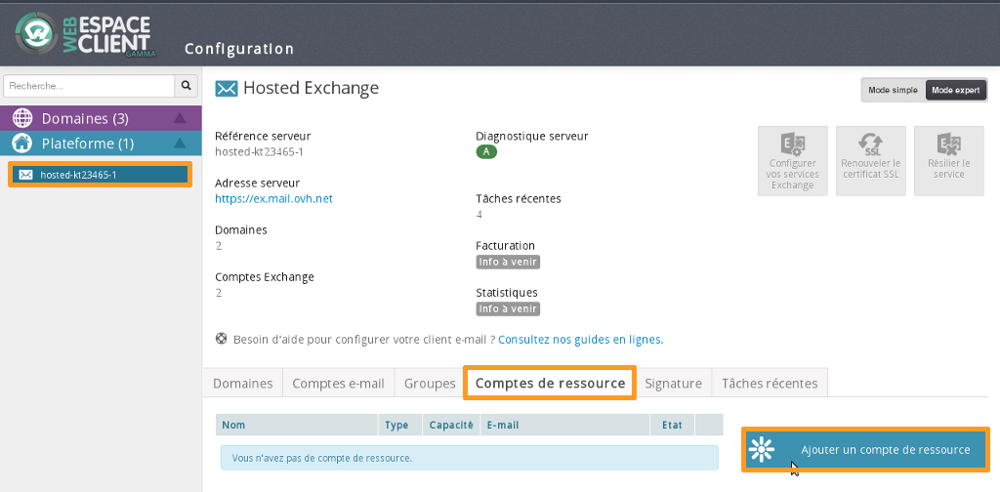
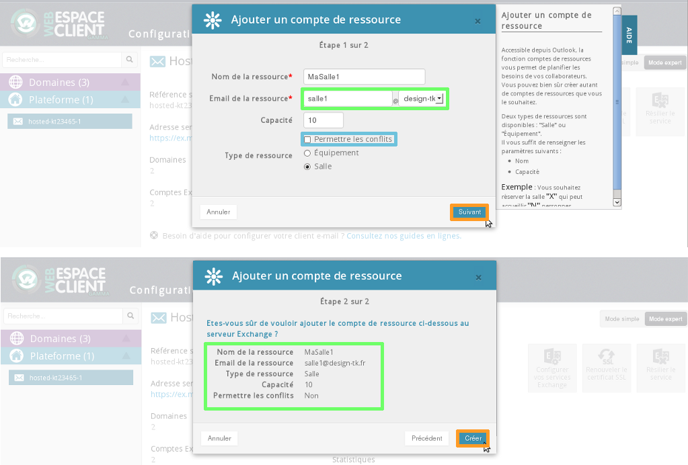
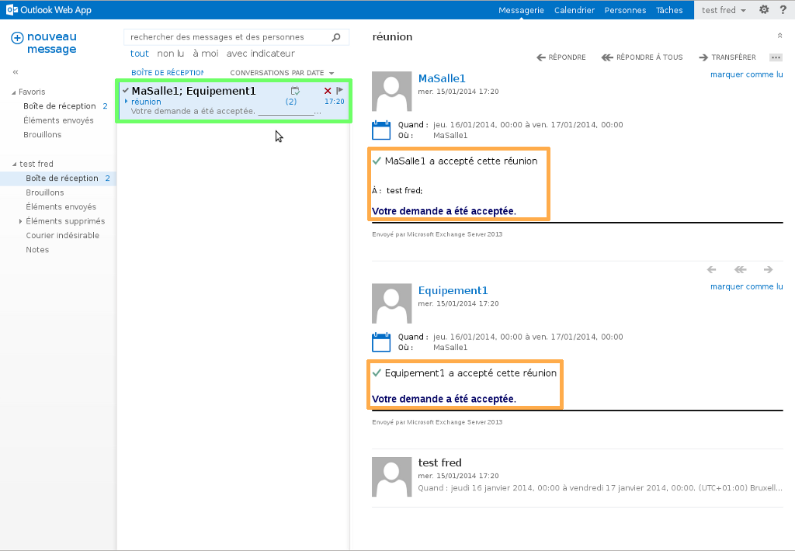

## Tworzenie zasobu - część 1
Aby utworzyć zasób, zaloguj się do [panelu klienta](https://www.ovh.com/manager/web/login.html).

Wybierz ofertę Exchange w zakładce "Platforma".

Wybierz zakładkę "Konta zasobów" i "Dodaj konto zasobów".

Należy wybrać "Tryb expert" z prawej strony w panelu klienta.

{.thumbnail}

## Tworzenie zasobu - część 2
Wypełnij wymagane pola:

Nazwa zasobu:  wpisz wybraną nazwę dla zasobu.

E-mail zasobu:  wybierz e-mail zasobu. Nie musi to być istniejący adres e-mail.

Rozmiar:  wskaż rozmiar zasobu.

Zezwalaj na konflikty:  jeśli to pole jest zaznaczone nie otrzymasz wiadomości z ostrzeżeniem, jeśli inny użytkownik będzie próbował zarezerwować salę lub sprzęt w sytuacji, gdy zasoby będą już wykorzystywane. 

Rodzaj zasobu:  dostępne są dwa rodzaje zasobów: "Sala" lub "Sprzęt".

Kliknij na "Dalej", aby przejść do kolejnego etapu. Zakończ operację klikając na "Załóż".

{.thumbnail}

## Tworzenie zasobu - część 3
Po utworzeniu zasobów możesz je modyfikować lub je usuwać. 

Pojawi się tabela porównawcza z nazwą zasobu, jego rodzajem (sprzęt lub sala), rozmiarem i e-mailem.

{.thumbnail}

## Kalendarz zasobu - część 1
Poniżej opisujemy, jak wyświetlić kalendarz zasobu poprzez OWA.

Przejdź na stronę [Webmail Exchange](https://ex.mail.ovh.net/owa/).

Zaloguj się podając adres e-mail i hasło do tego konta.

Wybierz zakładkę "Kalendarz", kliknij prawym przyciskiem na "INNE KALENDARZE" i wybierz "Otwórz kalendarz".

{.thumbnail}

## Kalendarz zasobu - część 2
Wpisz nazwę zasobu. Serwer Exchange automatycznie ją odnajdzie, ponieważ jest ona częścią GAL (Global address list).

Wybierz"Otwórz", aby zakończyć operację.

{.thumbnail}

## Kalendarz zasobu - część 3
kalendarze utworzonych zasobów są teraz widoczne w interfejsie OWA.

W górnej lewej części znajduje się przycisk "nowe wydarzenie". Masz możliwość wyboru tego przycisku do utworzenia wydarzenia dla swoich współpracowników.

{.thumbnail}

## Zarządzanie zasobem - część 1
W pierwszej kolejności utworzymy wydarzenie korzystając z wcześniej utworzonych zasobów.

W części "Kalendarz", wybierz "nowe wydarzenie".

Pojawi się interfejs.

Wypełnij wymagane pola:

Wydarzenie:  nazwa wydarzenia.

Lokalizacja:  na tym poziomie możesz dodać zasoby typu "Sala".

Uczestnicy:  dodaj współpracowników i zasoby typu "Sprzęt"

Rozpoczęcie:  wskaż rozpoczęcie wydarzenia.

Czas trwania:  w tym polu możesz wskazać czas trwania wydarzenia.

Wyświetlaj jako:  definiuje status pojawiający się w kalendarzu.

Przypomnienie:  definiuje, kiedy ma się pojawić przypomnienie o wydarzeniu. 

Powtarzaj:  definiuje częstotliwość wydarzenia.

Wybierz "Wyślij", aby dokończyć dodawanie wydarzenia.

{.thumbnail}

## Zarządzanie zasobem - część 2
Wydarzenie "zebranie" zostało zaakceptowane przez zasób "MojaSala1" i "Sprzęt1".

Przesłano prośbę o odpowiedź na e-mail. Zostaniesz powiadomiony o akceptacji lub odrzuceniu zlecenia.

{.thumbnail}

## Zarządzanie zasobem - część 3
W interfejsie kalendarza możesz wyświetlić status zasobów.

{.thumbnail}

## Zarządzanie zasobem - część 4
Dodajemy nowe wydarzenie z taką samą datą, jak poprzednie.

Otrzymujemy informację o akceptacji lub odrzuceniu zlecenia.

W przypadku drugiego wydarzenia zasób "MojaSala1" odrzucił wydarzenie z powodu konfliktu. Zasób ten nie zezwala na konflikty. 

Zasób "Sprzęt1" zaakceptował wydarzenie, ponieważ funkcja zarządzania konfliktami jest wyłączona dla tego zasobu.

{.thumbnail}

