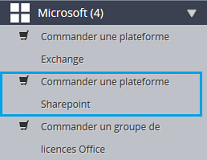
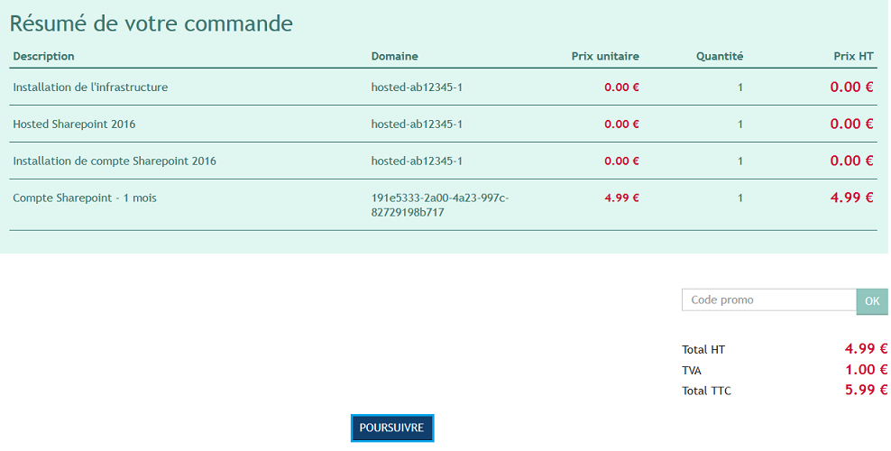
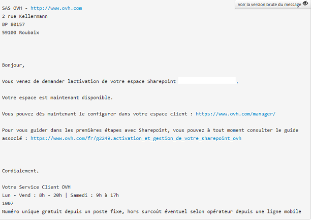

## 
Wymagania: Należy posiadać usługę Exchange Hosted 2013 lub 2016.
Zaloguj się do [panelu klienta OVH](https://www.ovh.com/manager/web/login/).

W menu po lewej stronie wybierz Microsoft i kliknij na Zamów platformę Sharepoint.

{.thumbnail}
Zostaniesz poproszony o wybranie serwera Hosted Exchange oraz o wskazanie istniejącego w ramach tej usługi adresu e-mail. 

Następnie kliknij na Uruchom zlecenie aktywacji.

{.thumbnail}
Zostaniesz przekierowany na naszą stronę, aby dokończyć zamówienie.

{.thumbnail}
Kliknij na Dalej, aby potwierdzić regulaminy związane z usługą Sharepoint i uzyskać zamówienie. 

Usługa Sharepoint zostanie włączona w ciągu maksymalnie 4 godzin od zaakceptowania płatności i przekazania zamówienia do realizacji.

## 
Twoja usługa jest już dostępna. Należy ją teraz aktywować. 

Przesłaliśmy do Ciebie e-mail z informacją, że możesz już aktywować usługę:
Konfiguracja usługi Microsoft SharePoint

E-mail ten jest również dostępny w panelu klienta w sekcji: Moje konto i Otrzymane e-maile .

E-mail ten wygląda tak:

{.thumbnail}

## Dokończenie aktywacji
W panelu klienta wybierz w menu z lewej strony sekcję Microsoft i Sharepoint

{.thumbnail}
Na tym poziomie należy zdefiniować url usługi Sharepoint. Adres ten zostanie sprawdzony. Jeśli będzie dostępny, będziesz mógł zatwierdzić ten etap.

{.thumbnail}
Po zatwierdzeniu adresu url należy poczekać na dokończenie aktywacji. Aktywacja może zająć 4 godziny.

## 
Usługą Sharepoint zarządza się z poziomu panelu klienta OVH (menu Microsoft i Sharepoint).

{.thumbnail}
W zakładce Informacje ogólne:

- Nazwa Twojej usługi i przypisany serwer Exchange. 

- Dostęp: Odnajdziesz tu url swojej usługi i serwer Exchange przypisany do usługi Sharepoint.

- Parametry: Odnajdziesz tu wszystkie informacje dotyczące swojej przestrzeni dyskowej.

{.thumbnail}
W zakładce Użytkownicy:

- Przywróć uprawnienia administratora: Opcja ta pozwala na przywrócenie uprawnień administratora danemu użytkownikowi w przypadku wykonania nieprawidłowej operacji w interfejsie Sharepoint.

Domyślnie konto wpisane podczas składania zamówienia to klasyczny użytkownik. Można je zmienić na Administratora za pomocą koła zębatego z prawej strony konta.

W tym samym menu można również zmienić hasło do logowania. 

Jeśli chcesz dodać użytkownika Sharepoint, kliknij na koło zębate z prawej strony konta Exchange i Włącz usługę Sharepoint.

Spowoduje to zamówienie nowej licencji.

{.thumbnail}
Jeśli chcesz korzystać z usługi Sharepoint tylko w trybie do odczytu, nie musisz włączać nowego użytkownika. Domyślnie pozostałe konta Exchange powiązane z platformą mogą łączyć się w trybie do odczytu.

