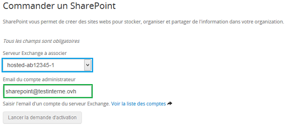
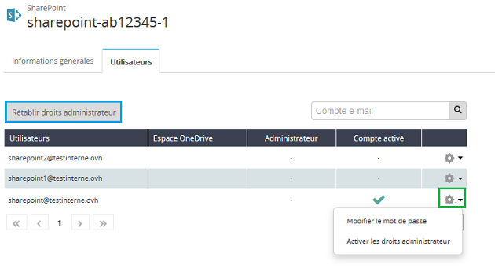

## 
Prerequisites: you must have a Hosted Exchange 2013 or 2016 service.
Go to your control panel via this link: [OVH control panel](https://www.ovh.com/manager/web/login/). 

Once you are in, select Microsoft in the left-hand menu and click on Order a Sharepoint platform.

{.thumbnail}
You will then be prompted to choose the relevant Hosted Exchange server and enter an email address which already exists on this service. 

Then send the activation request

{.thumbnail}
You will then be redirected to our website to complete your order.

{.thumbnail}
Click Continue to validate the SharePoint contracts and get your purchase order. 

Once this is settled, your SharePoint service will be delivered in under four hours.

## 
Your service is available, but you must enable it. 

You will be sent an email confirming that the activation is available:
Configure your Microsoft SharePoint service!

You can find this email in your control panel in: My account then My received emails.

Here is a preview of the email:

{.thumbnail}

## Finish activation
You can finish activating your service in your customer account. Select Microsoft and then SharePoint in the left-hand column.

{.thumbnail}
You then have to enter your SharePoint url. This will then be verified and you can confirm this step.

{.thumbnail}
Once the url is validated, you must wait for the activation to complete. This could take up to 4 hours.

## 
You can manage your SharePoint service from your OVH customer account, from the Microsoft > SharePoint menu.

{.thumbnail}
From the general information tab:

- Your service reference and the associated Exchange server. 

- Access: you can find the url for your service and the Exchange server linked to your SharePoint. 

- Quotas: you can find information on your storage space.

{.thumbnail}
From the Users tab:

- Restore administrator rights: this means you can restore a user's administrator rights if they have been wrongly configured in the SharePoint interface.

By default the account entered during the ordering process is for a regular user. You can switch to an administrator account from the cogwheel to the right of the account. 

You can also modify the login password from this same menu. 

If you want to add an additional SharePoint user, click on the cogwheel to the right of the relevant Exchange account and enable SharePoint.

This means you will have to subscribe to a new licence.

{.thumbnail}
If you want to use SharePoint in read-only mode, you don't have to enable a new user. By default the remaining Exchange accounts linked to the platform can log in in read-only mode.

