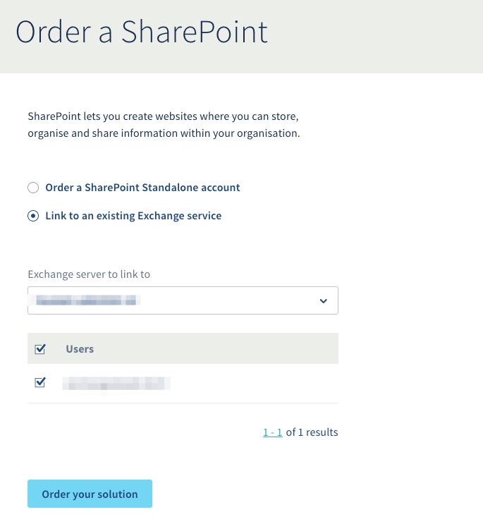
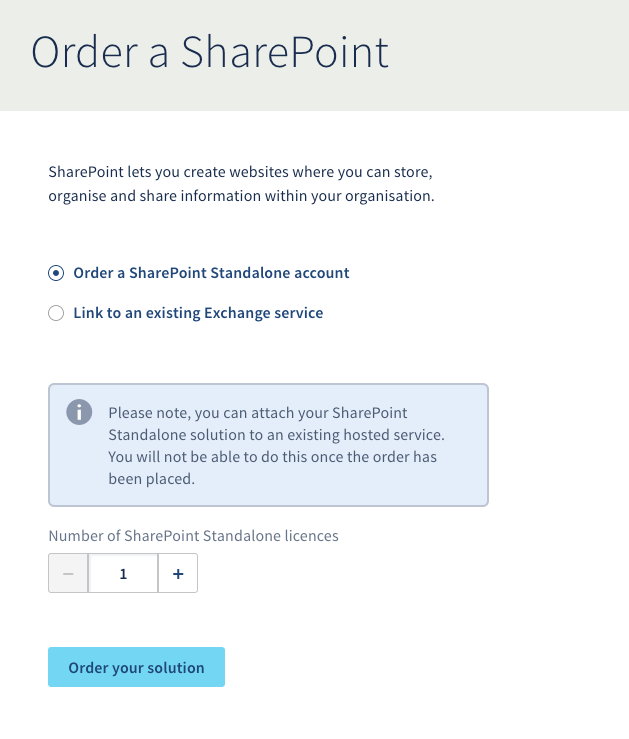
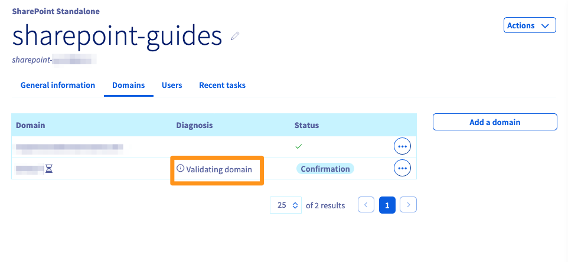
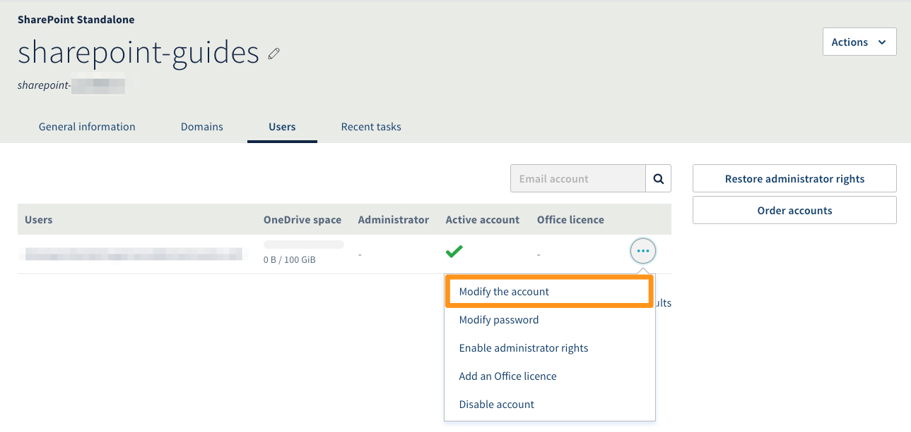
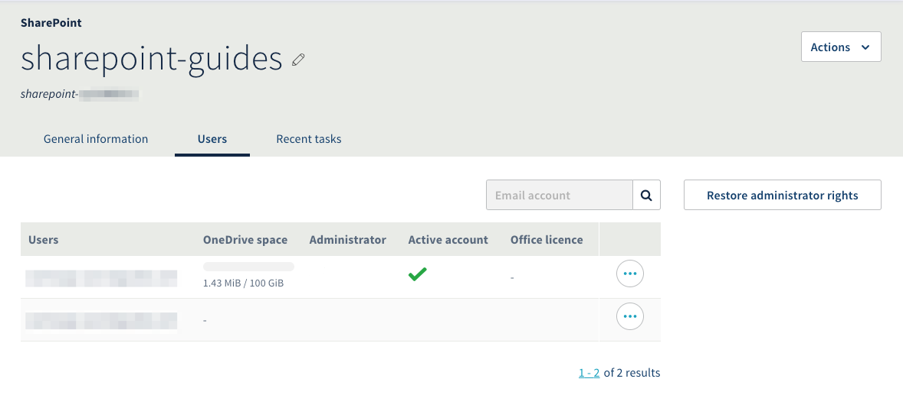
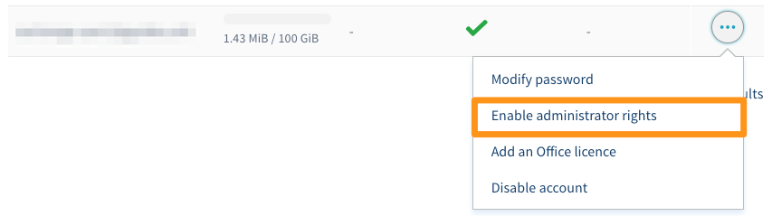
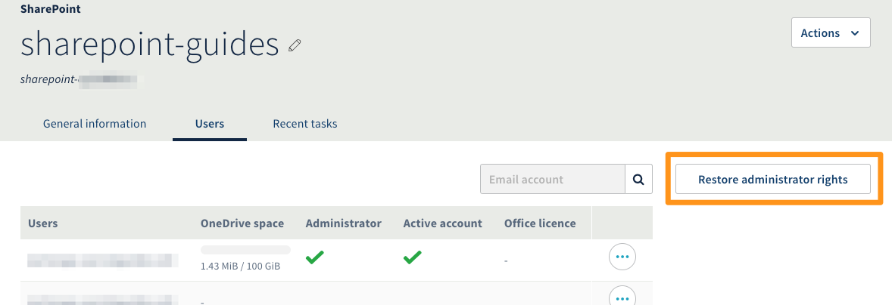

**Última actualización: 15/4/2020**

## Objetivo

Los planes SharePoint permiten disfrutar de un espacio de almacenamiento compartido para el trabajo colaborativo.

**Esta guía explica cómo contratar y configurar una plataforma SharePoint.**

## Requisitos

- Haber iniciado sesión en el [área de cliente de OVHcloud](https://www.ovh.com/auth/?action=gotomanager).
- Haberse suscrito a una plataforma [Hosted Exchange](https://www.ovh.es/emails/hosted-exchange/){.external} para la contratación de una plataforma SharePoint asociada.

## Procedimiento

### 1. Contratar una plataforma SharePoint

Inicie sesión en el [área de cliente de OVHcloud](https://www.ovh.com/auth/?action=gotomanager) y acceda al apartado «Web». En la barra de servicios a la izquierda, haga clic en `Contratar`{.action} y, seguidamente, en `SharePoint`{.action}.

Podrá elegir entre dos plataformas:

| SharePoint asociada                                                                                                                      	| SharePoint independiente                                                                                                                                                                       	|
|-----------------------------------------------------------------------------------------------------------------------------------------	|---------------------------------------------------------------------------------------------------------------------------------------------------------------------------------------------	|
| {.thumbnail}                                                                        	| {.thumbnail}                                                                                                                            	|
| Si dispone de una plataforma Hosted Exchange en el área de cliente, puede asociar sus cuentas a una plataforma SharePoint. Seleccione las cuentas a las que quiere asociar una licencia de SharePoint. 	| Si no dispone de una plataforma Exchange Hosted de OVHcloud o si desea una plataforma SharePoint independiente, contrate una plataforma SharePoint Standalone.  Especifique el número de licencias en función del número de usuarios.	|

A continuación, haga clic en `Contratar el servicio`{.action} para completar el pedido.

### 2. Activar la plataforma SharePoint

Una vez validado y pagado el pedido, recibirá (en la dirección de correo electrónico de referencia del área de cliente) un mensaje de correo electrónico en el que se le confirmará que la plataforma está lista para configurar.

Para consultar este mensaje de correo electrónico, conéctese al [área de cliente de OVHcloud](https://www.ovh.com/auth/?action=gotomanager), haga clic en su perfil en la parte superior derecha y luego en sus iniciales. Acceda a la pestaña `Mensajes recibidos`{.action} y busque el mensaje de correo electrónico con el siguiente asunto:

> **\[xx-11111-ovh] ¡Configurar su servicio SharePoint de Microsoft!**

Para comenzar con la configuración, acceda al apartado `Web` del área de cliente. En la barra de servicios a la izquierda, haga clic en `Microsoft`{.action}, luego en `SharePoint`{.action} y, por último, seleccione la plataforma SharePoint correspondiente.

Especifique el nombre de su plataforma en la casilla «URL de SharePoint» y haga clic en `Confirmar la URL`{.action}.

{.thumbnail}  

> [!warning]
>
> Tras la validación, ya no se puede cambiar el nombre de la plataforma.

### 3. Configuración de la plataforma SharePoint

Inicie sesión en el [área de cliente de OVHcloud](https://www.ovh.com/auth/?action=gotomanager) y acceda al apartado `Web`. En la barra de servicios a la izquierda, haga clic en `Microsoft`{.action}, luego en `SharePoint`{.action} y, por último, seleccione la plataforma SharePoint correspondiente.

#### **SharePoint independiente**

Esta plataforma es independiente. Se le debe asociar primeramente un nombre de dominio antes de configurar los usuarios.

##### ***Añadir un dominio***

Acceda a la pestaña `Dominios` y haga clic en `Añadir un dominio`{.action}. Seleccione un dominio disponible en el área de cliente o especifique un nombre de dominio externo que gestione. 

- Si selecciona un nombre de dominio en su área de cliente, se validará automáticamente y solo tendrá que configurar sus usuarios.
 
- Si selecciona un nombre de dominio externo, deberá añadir un registro CNAME en la zona DNS del nombre de dominio para validarlo en la plataforma SharePoint. Es posible acceder al registro CNAME que se debe introducir haciendo clic en el icono de información junto a «Validación de dominio en curso», como se muestra a continuación.

{.thumbnail}

##### ***Configurar un usuario***

Acceda a la pestaña `Usuario`, haga clic en `...`{.action} a la derecha de la cuenta y seleccione `Editar la cuenta`{.action}

{.thumbnail} 

Se abrirá una ventana. Introduzca la información del usuario y haga clic en `Validar`{.action}.

Para obtener los permisos de administrador en la plataforma SharePoint, vuelva a hacer clic en `...`{.action} a la derecha de la cuenta y seleccione `Activar los permisos de administrador`{.action}.

#### **SharePoint asociada**

Como su nombre indica, esta plataforma está asociada a la plataforma Exchange que seleccionó cuando realizó su pedido, por lo que no es necesario asociar un nombre de dominio.

##### ***Configurar un usuario***

Acceda a la pestaña `Usuarios` de la plataforma para ver todas las cuentas Exchange que pueden beneficiarse de una licencia de SharePoint.

{.thumbnail} 

Una columna `Cuenta activada` indica si la cuenta de la plataforma Exchange tiene una licencia SharePoint. 

> [!primary]
>
> Para activar una licencia en una cuenta, haga clic en `...`{.action} a la derecha de la cuenta y seleccione `Activar SharePoint`{.action}.

Por defecto, una cuenta con una licencia no tiene permisos de administrador. Para activarlos, haga clic en `...`{.action} a la derecha de la cuenta y luego en `Activar los permisos de administrador`{.action}.

{.thumbnail} 

#### **Restablecer los permisos de administrador**

En ambos tipos de plataformas SharePoint, encontrará el botón `Restaurar los permisos de administrador`{.action} en la pestaña `Usuario`. Este botón permite configurar los permisos de administrador de la plataforma en caso de que se realice alguna manipulación incorrecta en la interfaz de SharePoint.

{.thumbnail}

## Más información

Interactúe con nuestra comunidad de usuarios en <https://community.ovh.com/en/>.