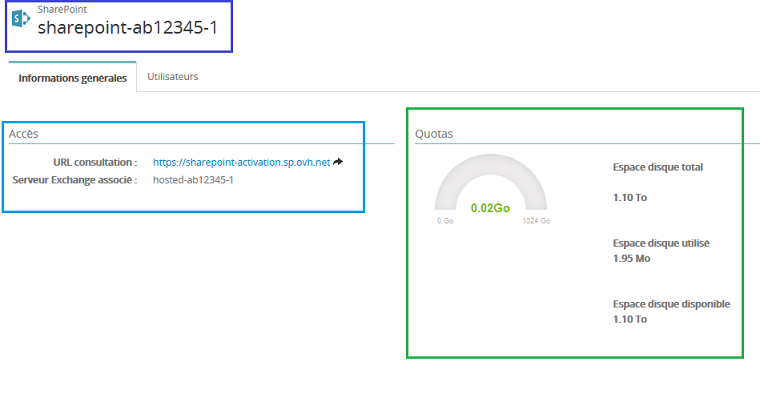
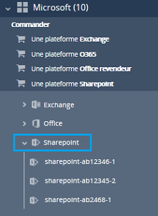
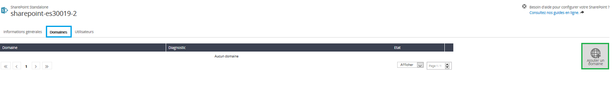
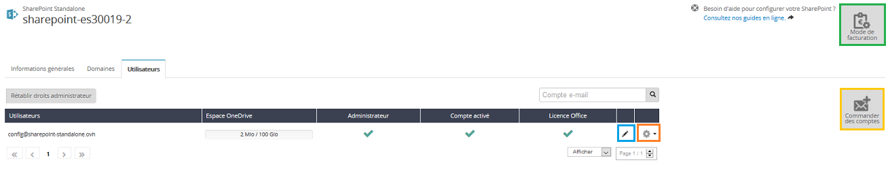
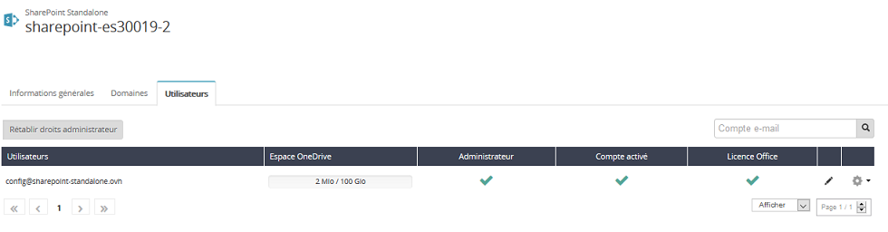

## Commande de votre service Sharepoint
Rendez-vous sur l'espace client via ce lien : [Espace client OVH](https://www.ovh.com/manager/web/login/){.external}.

Une fois connecté, sélectionnez dans la colonne de gauche le menu **Microsoft**  puis cliquez sur  **Commander une plateforme Sharepoint** .

{.thumbnail}

- Si vous n'avez pas de service Exchange Hosted OVH, vous pourrez lancer la commande de votre Sharepoint directement.
- Si vous avez sur votre espace client un service Hosted Exchange, vous pourrez l'associer à votre Sharepoint.

Cliquez ensuite sur  **Lancer la demande d'activation**

{.thumbnail}

Vous serez alors redirigé vers notre site pour finaliser votre commande.

{.thumbnail}

Cliquez sur Poursuivre afin de valider les contrats liés à Sharepoint et obtenir votre bon de commande.

Une fois réglé, la livraison de votre service Sharepoint se fait sous un délai maximal de 4 heures.

## Activation de votre service Sharepoint
Votre service est disponible, il est nécessaire de l'activer.

Un mail vous est envoyé confirmant que l'activation est disponible : **Configurer votre service Microsoft SharePoint !**

Vous pouvez retrouver cet e-mail depuis votre espace client dans la section : **Mon compte**  puis  **Mes e-mails reçus** .

Voici un aperçu de l'e-mail :

{.thumbnail}

### Finalisation de l'activation
La finalisation de l'activation se fait depuis votre espace client sélectionnez dans la colonne de gauche le menu  **Microsoft**  puis Sharepoint.

{.thumbnail}

A ce niveau vous devez définir l'url de votre Sharepoint. Une vérification est réalisée, si celle-ci est disponible vous pourrez valider  cette étape.

{.thumbnail}

Une fois l'url validée, il faut patienter que l'activation se finalise. Cela peut prendre jusqu'à 4 heures.

## Gestion de votre Sharepoint

### Sharepoint associe a un service Exchange
La gestion de votre service Sharepoint se fait depuis l'espace client OVH, depuis le menu  **Microsoft**  puis  **Sharepoint** .

{.thumbnail}

Depuis l'onglet  **Informations générales**  :

- La référence de votre service et le serveur Exchange associé.
- Accès : vous pouvez retrouver l'url de votre service et le serveur Exchange associé à votre Sharepoint.
- Quotas : vous pourrez retrouver toutes les informations concernant votre espace de stockage.

{.thumbnail}

Depuis l'onglet  **Utilisateurs**  :

- Rétablir les droits administrateur : permet de remettre en place les droits administrateur à un utilisateur en cas de mauvaise manipulation depuis l'interface Sharepoint.

Par défaut le compte saisi lors de la commande est un utilisateur classique. Il est possible de le passer en Administrateur depuis la roue crantée à droite du compte.

Il est aussi possible de modifier le mot de passe de connexion depuis ce même menu.

Si vous souhaitez ajouter un utilisateur Sharepoint supplémentaire, cliquez sur la roue crantée à droite du compte Exchange concerné puis Activer sharepoint.

Cela entraine une souscription d'une nouvelle licence.

{.thumbnail}

### Sharepoint Standalone
La gestion de votre service Sharepoint se fait depuis l'espace client OVH, depuis le menu  **Microsoft**  puis  **Sharepoint** .

{.thumbnail}

Depuis l'onglet  **Informations générales**  :

- La référence de votre service : il sera indiqué "Sharepoint Standalone". Cela signifie que votre service Sharepoint n'est pas associé à une plateforme Exchange.
- Accès : vous pouvez retrouver l'url de votre service.
- Quotas : vous pourrez retrouver toutes les informations concernant votre espace de stockage.

Depuis l'onglet  **Domaines**  :

Vous pouvez depuis cette section gérer les domaines associés à votre service Sharepoint. Par défaut aucun domaine n'est présent.

Il est nécessaire d'en ajouter un afin de réaliser la configuration du nom de l'utilisateur Sharepoint.

{.thumbnail}

Si votre domaine n'est pas géré sur le même identifiant que le service Sharepoint, une demande de vérification par "CNAME" sera réalisée.

Il sera nécessaire dans ce cas de créer un champ de type "CNAME" dans la zone dns de votre domaine afin de valider l'ajout de celui-ci.

Depuis l'onglet  **Utilisateurs**  :

{.thumbnail}

- Rétablir les droits administrateur : permet de remettre en place les droits administrateur à un utilisateur en cas de mauvaise manipulation depuis l'interface Sharepoint.

Par défaut il n'y a aucun utilisateur administrateur. Il est possible de le passer en Administrateur depuis la roue crantée à droite du compte.

- Le stylo noir à droite du compte permet de parsonnaliser l'utilisateur Sharepoint

Vous souhaitez ajouter un ou plusieurs utilisateurs ?

Cliquez sur le bouton : **"Commander des comptes"**

- L'icône **"Mode de facturation"** vous permet de gérer vos utilisateurs et de sélectionner les utilisateurs dont le compte sharepoint ne doit pas être renouvelé.

La roue crantée permet :

- de modifier le mot de passe lié à l'utilisateur Sharepoint.
- d'ajouter ou retirer les droits administrateur.
- d'activer les webb app Office

{.thumbnail}

Votre sharepoint standalone est maintenant configuré.