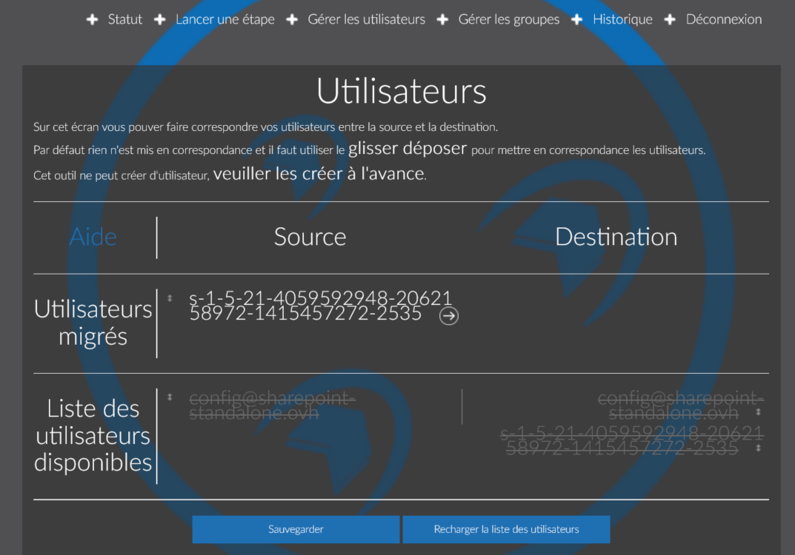
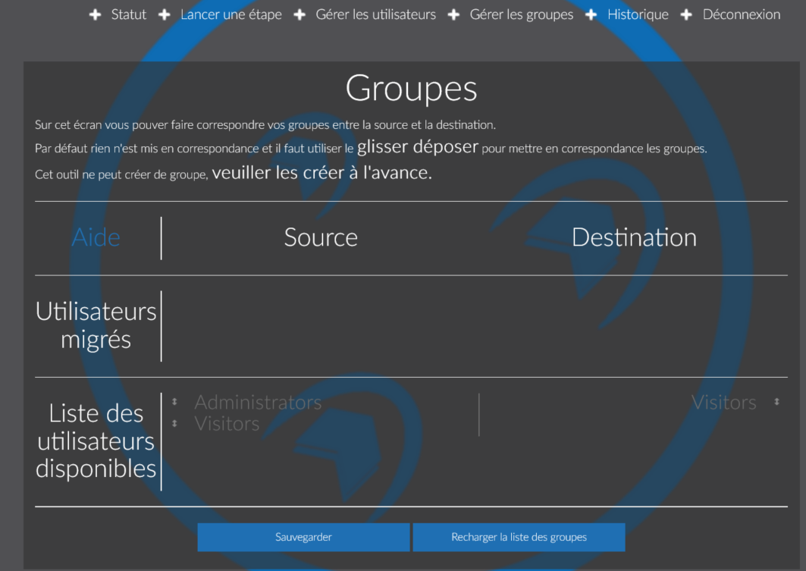

L'outil OSM vous permet de rapatrier le contenu de votre Sharepoint externe vers OVHcloud. La migration se déroule en 3 étapes :

- Le contenu
- Les données
- La personnalisation 

## Prérequis
Certains prérequis sont nécessaires afin que la migration se passe au mieux. Les voici :

- Version Sharepoint source 2010, 2013
- Méthode d'authentification (donnée par l'administrateur de votre Sharepoint)
- Sharepoint source accessible en ligne (en http ou https)
- Avoir un Sharepoint chez OVH
- Créer ses comptes Sharepoint chez OVH
- Se loguer au moins une fois sur le Sharepoint OVHcloud avant de démarrer la migration

## Preparation

### Création du projet
Dans un premier temps, rendez-vous sur le site : [OVH Sharepoint Migrator](https://osm.ovh.net/){.external}.

- Sélectionnez " Prêt pour votre migration? " pour accéder à l'étape suivante.

{.thumbnail}

Vous devez créer un nouveau projet afin de pouvoir le suivre par la suite :

- Nom : *Choisissez un nom pour votre projet.*
- Mot de passe : *Définissez un mot de passe personnalisé*

### Renseignement des informations
Tout d'abord, il faut renseigner les informations de votre Sharepoint (source).

{.thumbnail}

- URL du site : *url d'accès a votre Sharepoint.*
- Méthode d'authentification : *l'administrateur de vote sharepoint doit vous fournir cette information.*
- Domaine/Realm (peut être laissé vide) : *Nom de domaine associé a votre Sharepoint.*
- Login : *nom de l'utilisateur à migrer.*
- Mot de passe : *mot de passe de l'utilisateur à migrer.*

Ensuite celles de votre Sharepoint OVHcloud (destination)

{.thumbnail}

Sur la page suivante vous aurez un récapitulatif des informations que vous avez renseignées. Vous devez renseigner aussi une adresse e-mail qui permettra de récupérer le mot de passe de votre projet en cas d'oubli ou de perte. Vous recevrez sur cette adresse la confirmation de la création de votre projet.

### Correspondance des utilisateurs
Certains noms d'utilisateurs que vous souhaitez migrer peuvent être différents entre la source et destination de Sharepoint. Sur cette partie vous pouvez les faire correspondre pour que les droits soient correctement appliqués.

{.thumbnail}

### Correspondance des groupes
Comme précédemment cette partie vous permet de faire correspondre les groupes source et destination afin d'appliquer les paramétrages automatiquement.

{.thumbnail}

## Lancer la migration
Maintenant que tout est prêt, la migration peut commencer. Cliquez sur "Lancer une étape".

Vous aurez alors le choix de commencer la première étape "Pré requis".

{.thumbnail}

Une fois celle-ci terminée, vous pourrez lancer les étapes suivantes.

## Suivre la migration
Pour suivre la migration de votre Sharepoint allez sur  [OVH Sharepoint Migrator](https://osm.ovh.net/){.external}. Puis sélectionnez "Gérer votre projet", il ne restera plus qu'à renseigner l'identifiant de votre projet (envoyé par e-mail) et son mot de passe.