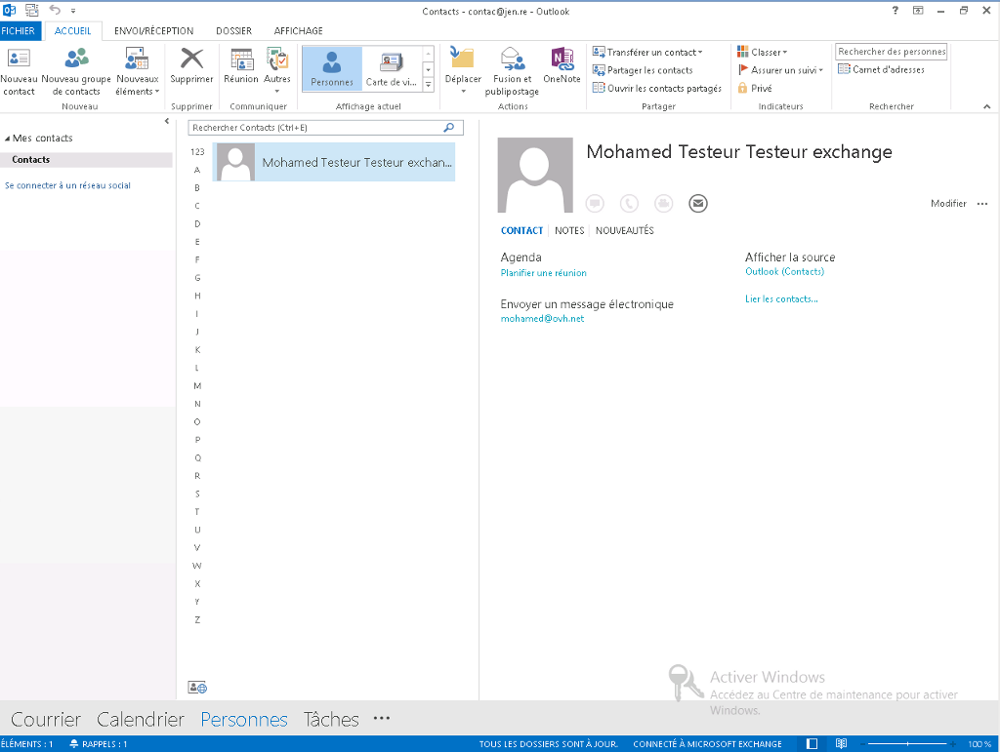
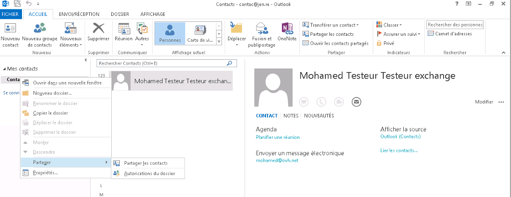
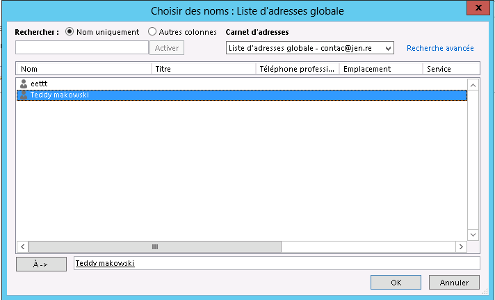
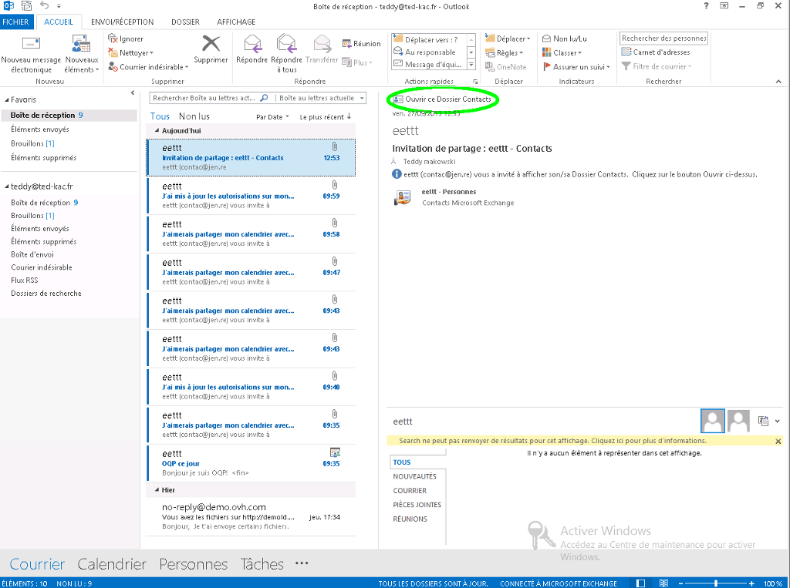
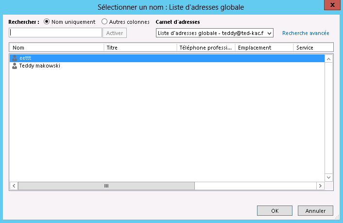

Nous allons voir ensemble comment réaliser le partage d'un contact via Outlook 2013, à noter qu'il n'est pas possible de réaliser ce type de partage via le Webmail Exchange.

Cliquez [ici](https://www.ovh.com/fr/emails/hosted-exchange-2013/documents/){.external} pour retrouver nos différents guides.

> [!warning]
>
> OVH met à votre disposition des services dont la configuration, la gestion et la responsabilité vous incombent. Il vous revient de ce fait d'en assurer le bon fonctionnement.
> 
> Nous mettons à votre disposition ce guide afin de vous accompagner au mieux sur des tâches courantes. Néanmoins, nous vous recommandons de faire appel à un prestataire spécialisé et/ou de contacter l'éditeur du service si vous éprouvez des difficultés. En effet, nous ne serons pas en mesure de vous fournir une assistance. Plus d'informations dans la section « Aller plus loin » de ce guide.
> 

## Point de vue de l'utilisateur qui partage un contact

### Mise en place des droits sur le dossier de contacts Partie 1
Connectez-vous à Outlook 2013 avec le compte e-mail qui doit partager le contact. Vous accédez ensuite au contact présent sur ce compte dans l'onglet "Personne".

{.thumbnail}

### Mise en place des droits sur le dossier de contacts Partie 2
Tout d'abord, donnez des droits à l'utilisateur qui va recevoir les contacts.

Sélectionnez "Autorisations du dossier".

{.thumbnail}

### Mise en place des droits sur le dossier de contacts Partie 3
Modifiez le Niveau d'autorisation de l'utilisateur. Notre exemple, "Teddy".

{.thumbnail}

### Partage du dossier Contacts Partie 1
Réalisez ensuite le partage du dossier Contacts.

Sur le dossier de Contacts réalisez un clic droit et sélectionnez "Partager les contacts".

{.thumbnail}

### Partage du dossier Contacts Partie 2
Sélectionnez l'utilisateur qui va recevoir le partage de contact.

Dans notre cas, c'est le second utilisateur "Teddy".

{.thumbnail}

### Partage du dossier Contacts Partie 3
Outlook 2013 va automatiquement générer un e-mail de partage de contacts.

{.thumbnail}

### Partage du dossier Contacts Partie 4
Il vous suffit de finaliser l'action en confirmant le partage du dossier Contacts avec l'utilisateur souhaité.

{.thumbnail}

> [!success]
>
> - 
> Cette méthode de partage concerne des droits de type Relecteur. Si
> vous souhaitez indiquer des droits personnalisés, il faut une fois le
> partage validé, modifier les autorisations (voir : Mise en place des
> droits sur le dossier de contacts Partie 3).
> 
> 

## Point de vue de l'utilisateur qui recoit un contact partage

### Methode 1
Deux façons de récupérer le contact partagé

Soit directement via l'e-mail reçu. Il vous suffit de sélectionner "Ouvrir ce Dossier Contacts".

{.thumbnail}

### Methode 2 Partie 1
Soit via le gestionnaire de contacts intitulé "Personnes" sur Outlook 2013.

Sur le dossier "Contacts partagés" sélectionnez "Ouvrir les contacts partagés" via un clic droit.

{.thumbnail}

### Methode 2 Partie 2
Dans le carnet d'adresse globale sélectionnez l'utilisateur qui partage le contact avec vous.

Validez ensuite une fois l'utilisateur sélectionné.

{.thumbnail}

### Methode 2 Partie 3
Le dossier de Contacts partagés apparaît maintenant correctement.

{.thumbnail}

## Aller plus loin

Échangez avec notre communauté d'utilisateurs sur <https://community.ovh.com>.