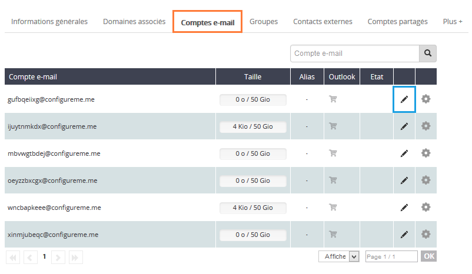
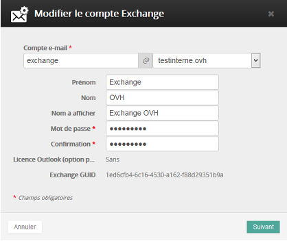
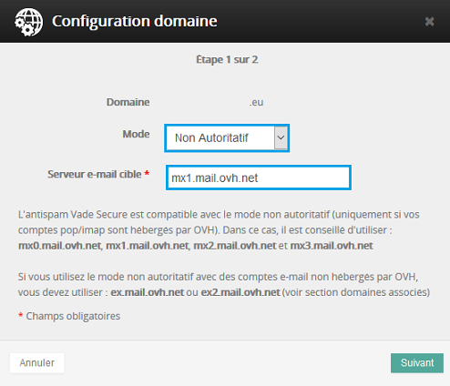

Vous souhaitez utiliser simultanément vos services  **Exchange**  et **l'offre Mutualisée OVH** .

Nous allons voir ensemble les différentes étapes afin que vos services soient actifs et fonctionnels. *Vous devrez avoir accès à votre espace client afin de suivre les étapes de ce guide.*

Cliquez [ici](https://www.ovh.com/fr/emails/hosted-exchange/guides/){.external} pour retrouver nos différents guides.

## Mise en place

### Étape 1 &#58; Acces au service.
Rendez-vous sur l'espace client via ce lien : [Espace client OVH](https://www.ovh.com/manager/web/login.html){.external}

Une fois connecté, vous avez accès à cette interface :

** Dans notre cas, il s'agit d'une offre Hosted*

Dans la colonne de gauche, dans plateforme, sélectionnez l'offre Hosted (dans notre cas hosted-ab12345-1).

Voici les différentes fonctionnalités directement accessibles :

- Informations Générales
- Domaines associés
- Comptes e-mail
- Groupes : [Un guide est disponible ici]({legacy}1258){.ref}
- Contacts externes
- Comptes partagés

Depuis l'onglet "Plus+" :

- Ressources : [Un guide est disponible ici]({legacy}1325){.ref}
- Pied de page : [Un guide est disponible ici]({legacy}1330){.ref}
- Tâches récentes
- Gestion de la politique de sécurité

{.thumbnail}

### Étape 2 &#58; Ajout du domaine.
Lors de la sélection de votre plateforme Exchange, une pop-up s'ouvre de manière automatique afin de lier votre domaine à votre service Exchange.

Sélectionnez le domaine dans la liste, si celui-ci est enregistré chez OVH.

Si le domaine est déposé ailleurs, ou s'il s'agit d'un sous-domaine, vous pouvez le renseigner manuellement.

**ATTENTION** Si vous ne possédez pas de domaine, un lien dans le pop-up vous permettra de réaliser la commande d'un nom de domaine.

Pour la configuration d'un domaine externe (non hébergé par OVH), il vous est demandé, dans l'espace client, l'ajout d'un champ de type CNAME sur un sous-domaine de votre domaine.

[Un guide est disponible ici]({legacy}1519){.ref}

Sélectionnez "Suivant" pour accéder à l'étape suivante.

{.thumbnail}

### Étape 3 &#58; Configuration du domaine.
Lors de cette étape, 2 actions vous seront proposées :

- Avec les DNS OVH :

Cochez "Configurer automatiquement le SRV" si le  **domaine est géré sur le même identifiant OVH que votre plateforme Exchange** .

*Le champ SRV sert à configurer automatiquement votre logiciel de messagerie. Obligatoire avec outlook 2016*

Cochez l'option "Configurer automatiquement les MX". Cette action est nécessaire pour recevoir vos e-mail via votre service Exchange.  Cela implique que vos serveurs mails seront automatiquement modifiés.

- Si vous ne souhaitez pas modifier vos serveurs de réception : laisser décoché cette option, vous pourrez depuis l'onglet "Domaines associés" cliquer sur le diagnostic MX en rouge et valider la modification.

{.thumbnail}

- Sans les DNS OVH :

vous devrez  **configurer manuellement le champ SRV**  sur votre domaine :

Le SRV se compose d'un sous-domaine :  **_autodiscover._tcp.votre-domaine.com.**

- Vous devrez indiquer les informations ci-dessous :

|Informations|Description|
|---|---|
|La priorité|0|
|Le poids|0|
|Le port|443|
|La cible offre Hosted|ex.mail.ovh.net ou ex2.mail.ovh.net|
|La cible offre Private|Votre-nom-d-hôte|

> [!success]
>
> Pour la cohabitation d'un service Exchange et un service e-mail pop/imap
> hébergé par OVH (MXplan) Vous pouvez maintenant utiliser les MX antispam
> Exchange avec le mode non autoritatif afin de bénéficier de l'antispam sur la
> totalité de vos comptes e-mails.
> 

> [!success]
>
> Pour toutes commandes réalisées depuis le 26/04/2016, le serveur MX pour la
> cohabitation Exchange et e-mail pop/imap non hébergé par OVH, il faut utiliser
> ex2.mail.ovh.net.
> 

Concernant les serveurs de réception (MX), il faudra manuellement les modifier depuis la zone DNS de votre domaine :

|Offres|Champs|
|---|---|
|Offre Hosted sans antispam (mode non autoritatif)|ex.mail.ovh.net ou ex2.mail.ovh.net|
|Offre Hosted avec antispam (mode autoritatif/non autoritatif : Exchange + mxplan)|mx0.mail.ovh.net, mx1.mail.ovh.net, mx2.mail.ovh.net, mx3.mail.ovh.net|

Si vous avez coché la configuration automatique des MX (nécessaire pour la réception des e-mails) et que vous devez passer en mode non autoritatif (compatibilité avec un service e-mail pop/imap) : *Il faudra environ 4 à 24 heures afin que ces modifications soient appliquées.*

Sélectionnez "Suivant" puis "Valider" pour finaliser l'opération.

### Étape 4 &#58; Configuration des comptes.
Sélectionnez ensuite l'onglet "Compte e-mail". Les comptes se présentent sous la forme suivante : [gufbqeiixg@configureme.me](mailto:gufbqeiixg@configureme.me){.external}.

Pour le(s) configurer il faut cliquer sur le stylo noir à droite du compte.

*« Si vous supprimez l'un de vos comptes e-mail, il réapparaîtra après quelques minutes sous la forme d'un compte vierge. Celui-ci, est toujours soumis à facturation.* *Pour supprimer définitivement ce compte* :

- Rendez-vous dans l'onglet "Mode de facturation"
- Cocher "Aucun" et "valider"

{.thumbnail}

Voici l'interface disponible via le bouton "Configuration" :

**Mot de passe**

Les mots de passe doivent respecter les exigences minimales suivantes :

- Ne pas contenir tout ou partie du nom du compte de l'utilisateur
- Avoir une longueur d'au moins 8 caractères
- Contenir des caractères de trois des quatre catégories suivantes :
Caractères majuscules de l'alphabet (A à Z) Caractères minuscules de l'alphabet (a à z) Chiffres de la base 10 (0 à 9) Caractères non alphabétiques (par exemple: !, $, #, %)

{.thumbnail}

## Rappel

### Configuration Mx a utiliser &#58;
Vous devez ajouter cette configuration :

Votre nom de domaine doit être déclaré en non autoritatif depuis le manager V6.

Cela se réalise soit à l'ajout du domaine sur le service Exchange dans le manager V6. Soit dans le menu « Microsoft » sélectionnez votre offre  **Hosted**  ou  **Private** . Puis dans « Domaines associés »cliquez sur la roue crantée puis configuration et modifiez son type vers  «  Non Autoritatif  »

Rappel des champs MX :

|Offres|Champs|
|---|---|
|Offre Hosted sans antispam (mode non autoritatif)|ex.mail.ovh.net ou ex2.mail.ovh.net|
|Offre Hosted avec antispam (mode autoritatif/non autoritatif : Exchange + mxplan)|mx0.mail.ovh.net, mx1.mail.ovh.net, mx2.mail.ovh.net, mx3.mail.ovh.net|

### Configuration du Mx relay&#58;
Si vous désirez renseigner un serveur mail externe afin d'utiliser l'offre Exchange et votre propre serveur, il vous est possible de le faire directement dans l'espace client grâce  au  **Mx relay** .

Pour le domaine concerné, cliquez sur la roue crantée puis configuration dans l'onglet Domaines associés. Votre domaine devra être sélectionné en mode : non-autoritatif

- Si vous souhaitez utiliser l'offre e-mail mutualisé OVH en complément de l'offre Exchange, vous devrez renseigner le serveur cible : mx1.mail.ovh.net
- Il vous est aussi possible de renseigner votre propre serveur e-mail externe.

{.thumbnail}

> [!success]
>
> - 
> L'antispam Vade Secure est maintenant compatible avec le mode non
> autoritatif.
> - 
> Si vous utilisez une offre Private vous devez configurer la zone DNS
> de votre domaine avec comme champ MX les mx antispam indiqué plus
> haut dans ce guide .
> 
> 