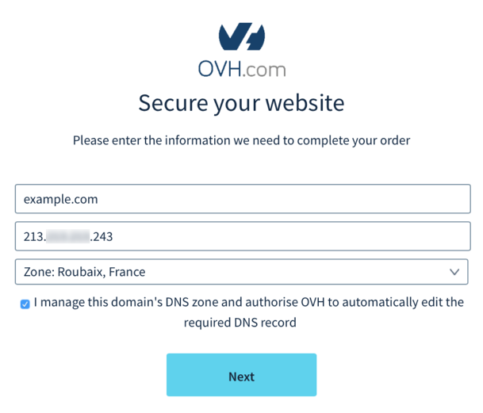

## Overview

### Requirements

> [!primary]
>
> - 
> You must have an active domain or subdomain.
> - 
> You must have DNS zone access for the domain.
> 
> 

## Order
- To order our SSL Gateway solution, [click here](https://www.ovh.co.uk/ssl-gateway){.external}.
- Choose your solution, then click `Activate now`{.action} or `Order`{.action}.

{.thumbnail}

- Enter your active domain or subdomain, then click `Next`{.action}.

{.thumbnail}

> [!warning]
>
> - 
> Free solution:
> 
> Only third level domains (www.example.org) are authorised.
> - 
> Advanced and Enterprise Solutions:
> 
> Fourth level domains (blog.france.example.org) and higher are authorised.
> 

Our system will then automatically detect your site’s IP address(es) configured on your domain or subdomain.

- If you use several IPs, select one.
- Choose the geographic zone of your SSL Gateway service
- If the DNS zone of this domain or subdomain is managed by your OVH account, tick the correct box so that we can automatically modify its configuration to point to your SSL Gateway.
- Click `Order`{.action}.

{.thumbnail}

> [!primary]
>
> If you use several IP addresses for your website, you will need to choose a single IP address for the order.
> You can then add up to 2 additional IPs in your control panel, if you are using the Advanced solution.
> 

- Then review and confirm your purchase order.

## Configuring your DNS zone
If you have not ticked the automatic modification box once your purchase order has been validated, you will receive an email requesting that you point your domain or subdomain to OVH servers within three days.

> [!warning]
>
> If you do not modify your DNS zone within 3 days, your order will be cancelled.
> 

- 

> [!faq]
>
> Scenario 1: your DNS zone is managed by OVH-hosted DNS servers.
>> 
>>     - If you are an administrative or technical contact for this DNS zone, you will need to modify this in your control panel.
>>     - If you are not a contact for this DNS zone, you will need to contact the person managing it in order to modify it.
>

> [!primary]
>
> Guide available:
> - 
> How to edit my DNS zone.
> 
> 

- 

> [!faq]
>
> Scenario 2: your DNS zone is not managed by OVH-hosted DNS servers.
>> 
>>     - In this case, you can simply modify the IP in your DNS zone by going to your service provider’s interface, or your dedicated server’s interface.
>

Once your modification has been processed by our infrastructure, you will receive a confirmation email.

> [!warning]
>
> Any modifications made to your DNS zone can take up to 24 hours to propagate, depending on how often your ISP updates its cached records.
> 