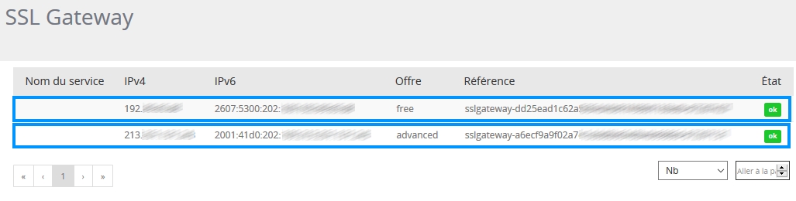
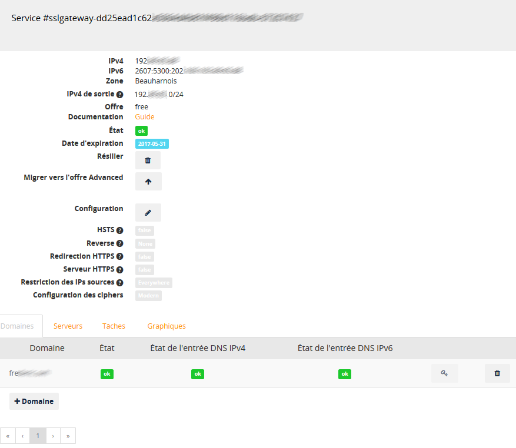
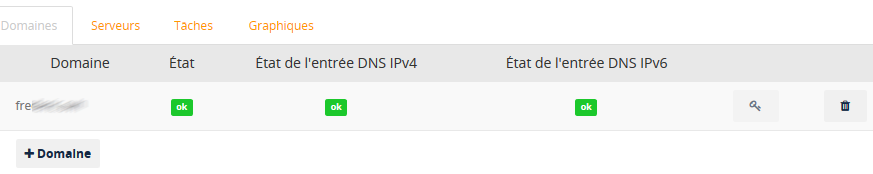
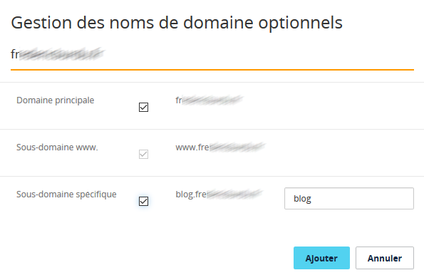
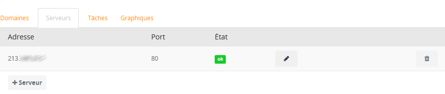
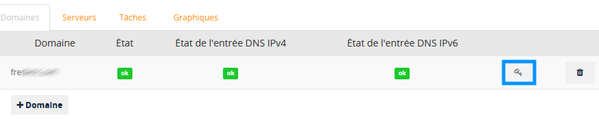

## Overview

### Requirements

- Order placed for the SSL Gateway service.
- Access to the Sunrise Control Panel.

## Use
We will now explain how to use your SSL Gateway service

### Configuring the service
Log in to [your control panel](https://www.ovh.com/manager){.external}.
Then click on the `Sunrise`{.action} section.

{.thumbnail}

Then click on `SSL Gateway`{.action} to view the service.

{.thumbnail}

Select the solution that you wish to configure.

{.thumbnail}

You will then land on the page for managing your solution.

{.thumbnail}


|Option|Description|
|---|---|
|IPv4|IPv4 address of the OVH gateway you would like to point to|
|IPv6|IPv6 address of the OVH gateway you would like to point to|
|Zone|Geographic zone of your SSL Gateway IP address|
|Outgoing IPv4|OVH IPv4 addresses that will connect to your server|
|Solution|Solution subscription type|
|Documentation|Link to this user guide|
|Status|Your SSL Gateway service status|
|Expiry date|Expiry date for your SSL Gateway service|
|Cancel|Cancellation request button for your SSL Gateway service|
|Upgrade to Advanced solution|Allows you to upgrade from the Free solution to the Advanced solution|
|Configuration|Button that allows you to edit the configuration of your SSL Gateway service|
|HSTS [[1]](#id5){.note-ref #id1}|Requires the browser to make all future connections to your website in HTTPS|
|Reverse|Allows you to put a host name on your SSL Gateway IP address|
|HTTPS Redirection [[2]](#id6){.note-ref #id2}|Redirects the visitor to the HTTPS version of your site when they access it in HTTP|
|HTTPS Server [[3]](#id7){.note-ref #id3}|Enables HTTPS between the SSL Gateway server and your server|
|Source IP restriction|If this field is filled in, only the IPs or networks listed can connect to the SSL Gateway|
|Cipher configuration [[4]](#id8){.note-ref #id4}|Allows you to choose a security level for your SSL/TLS certificate|

> [!primary]
>
> [[1]](#){.note-ref #id5} - ([1](#id1){.fn-backref}) 
> <cite>More information on HSTS.</cite>
> 
> [[2]](#){.note-ref #id6} - ([1](#id2){.fn-backref}) 
> <cite>Once you have checked that your site is running smoothly with HTTPS protocol, you can redirect all HTTP traffic to HTTPS. We would still recommend that you wait 24 hours after pointing your domain to the SSL Gateway solution before redirecting the traffic, so that visitors to your website definitely have the new functional DNS configuration.</cite>
> 
> [[3]](#){.note-ref #id7} - ([1](#id3){.fn-backref}) 
> <cite>Allows the connection to be secured end to end. The SSL Gateway server will connect to your server on the standard HTTPS 443 port. Please note that your server needs to be SSL/TLS certified in order to enable this option. Without this, your website will not function. However, you do not need to renew this certification for your server.</cite>
> 
> [[4]](#){.note-ref #id8} - ([1](#id4){.fn-backref}) 
> <cite>The highest level will offer the best protection, but it may not work on older browsers.</cite>
>

[For more information on cipher](https://en.wikipedia.org/wiki/Cipher){.external}.

### Configuring the domain
The following block includes 4 tabs:

- **Domains**
- **Servers**
- **Tasks**
- **Graphs**

{.thumbnail}

The **"Domains"** tab allows you to add and delete your domains and subdomains connected to your SSL Gateway.

Click `+ Domain`{.action} to add a domain or subdomain.

If you are using a **"Free"** solution you will only be able to have one **domain**, as well as its **“www” subdomain** and a second **subdomain of your choice**:

|Name|URL|
|---|---|
|Domain|example.com|
|Subdomain|www.example.com|
|Subdomain of your choice|blog.example.com|

> [!warning]
>
> - Free solution: only third level domains (www.example.org) are authorised.
>

Select your choice, then click `Add`{.action} to validate.

{.thumbnail}

If you are using an **"Advanced"** solution you will be able to add any active domain or subdomain.

> [!primary]
> 
> - Advanced solution: fourth level domains (blog.uk.example.org) and higher are authorised.
> 

Select your choice, then click `Add`{.action} to validate.

{.thumbnail}

> [!warning]
>
> Whenever a domain or subdomain is added, you will receive an email prompting you to point it to the SSL Gateway IP within 3 days.
> This operation is required in order to validate the creation of the SSL/TLS certificate.
> 

The **"Servers"** tab allows you to manage the IP address(es) of the server(s) hosting your website.

Click `+ Server`{.action} to add an IP address and a port corresponding to your server hosting your website.

{.thumbnail}

- If you are using a **"Free"** solution: you will only be able to use one IP/PORT address.

- If you are using an **"Advanced"** solution: you will be able to add up to 3 IP/PORT addresses for your domains and subdomains.

> [!primary]
>
> If you list several IP/PORT addresses, your SSL Gateway will distribute the traffic load with the Round Robin DNS system.
>

Select your choice, then click `Add`{.action} to validate.

{.thumbnail}

> [!warning]
>
> Currently, it is not possible to add IPv6 addresses into your servers.
> However, this is not an issue, since your domain or subdomain can point to your SSL Gateway in IPv6.
> Your SSL Gateway will then seamlessly switch the IPv6 traffic over to your server’s IPv4 address.
> 

The **"Tasks"** tab allows you to view the operations in progress on your SSL Gateway.

{.thumbnail}

> [!warning]
>
> If we have not yet detected your domain pointing to the SSL Gateway IP, then the SSL/TLS certificate will not yet have been created.
> However, your website will still be accessible in "HTTP". In this case, a small "HTTP" thumbnail image will appear in the "Entering" tab.
> 
> {.thumbnail}
>

The **"Graphs"** tab allows you to view the number of connections and requests made per minute to your SSL Gateway.

{.thumbnail}

- If you are using a **"Free"** solution: you will be able to view your metrics over a 24 hour period.

- If you are using an **"Advanced"** solution: you will be able to view your metrics over a 1 month period.

## Renewing your SSL certificate

### Important note

In order to renew the Let’s Encrypt certificate, the domain or subdomain will need to point to the SSL Gateway solution’s IP.

- If this is not the case, and our robots detect this 7 days before the SSL/TLS certificate renewal date, an email will be sent, giving you 3 days to carry out this operation.

- If this operation has not been carried out after 3 days, the certificate will not be renewed. You will need to regenerate it manually using this button:

{.thumbnail}

## Tips

### Correcting the source IP in logs

#### Presentation

When a customer visits your website, they will connect to the SSL Gateway in HTTPS, then the SSL Gateway tracks the request to your server after decoding it and filtering attacks. All requests to your server come from the SSL Gateway.

In order to track your visitor’s IP address, the SSL Gateway automatically adds these standard HTTP headers:

- X-Forwarded-For and X-Remote-Ip: Customer’s IP address, as viewed by the SSL Gateway.
- X-Forwarded-Port and X-Remote-Port: Customer’s source port, as viewed by the SSL Gateway.

Since these fields can be forged by a malicious customer, they must not be taken into account unless they come from a trusted source such as an SSL Gateway. The list of source IPs used by the SSL Gateway can be found in:

- Your Sunrise Control Panel
- The SSL Gateway section
- The “Outgoing IPv4” field

On the date of this guide being written, these addresses are **213.32.4.0/24** and **144.217.9.0/24**. Other addresses can be added in the future.

If your server manages it, it can be configured to recognise this information automatically instead of the SSL Gateway IP.

#### Apache
Create the file below:
/etc/apache2/conf-available/remoteip.conf
Insert the following lines:

```bash
# Trust X-Forwarded-For headers from the SSL Gateway
# See https://www.ovh.com/manager/sunrise/sslGateway/index.html#/sslGateway for an up-to-date list
RemoteIPHeader X-Forwarded-For
RemoteIPInternalProxy 213.32.4.0/24
```

You can now replace the variables %h with %a in the LogFormat directives of the Apache configuration.

Once the configuration is ready, you will just need to enable it with the following commands:

```bash
# Enable the module then the configuration
a2enmod remoteip
a2enconf remoteip

# Restart Apache to recognise the module (reload is sufficient for configuration)
service apache2 restart
```

You can find more information regarding this Apache feature in the [official documentation](https://httpd.apache.org/docs/current/en/mod/mod_remoteip.html){.external}.

#### Nginx
Open the configuration file that corresponds to the website to be secured. It is usually located in:
/etc/nginx/sites-enabled
Insert the following lines into the server section:

```bash
# Trust X-Forwarded-For headers from the SSL Gateway
# See https://www.ovh.com/manager/sunrise/sslGateway/index.html#/sslGateway for an up-to-date list
set_real_ip_from 213.32.4.0/24;
real_ip_header X-Forwarded-For;
```

You can find more information regarding this Nginx function in the [official documentation](http://nginx.org/en/docs/http/ngx_http_realip_module.html){.external}.
