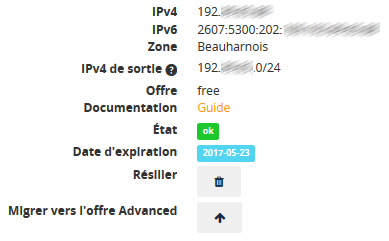

## Introduccion

### Requisitos
- [Haber contratado un servicio SSL Gateway](../contratar-un-ssl-gateway/).
- Tener acceso al [área de cliente Sunrise](https://www.ovh.com/manager/sunrise/){.external}.


## Uso
A continuación se explica cómo utilizar el servicio SSL Gateway.


### Configuracion del servicio
Conéctese al [área de cliente](https://www.ovh.com/manager){.external} y acceda a la sección `Sunrise`{.action}.


{.thumbnail}

En la columna izquierda, haga clic en `SSL Gateway`{.action}.


{.thumbnail}

Seleccione el servicio que desee configurar.


{.thumbnail}

Se mostrará la pantalla desde la que podrá gestionar el servicio.


{.thumbnail}


#### Informacion
En la página de gestión del servicio, podrá ver la siguiente información:


{.thumbnail}


|IPv4|Dirección IPv4 de la puerta de enlace OVH hacia la que debe apuntar|
|IPv6|Dirección IPv6 de la puerta de enlace OVH hacia la que debe apuntar|
|Zona|Zona geográfica de la dirección IP de su SSL Gateway|
|IPv4 de salida|Direcciones IPv4 OVH que se conectarán al servidor|
|Producto|Producto contratado|
|Documentación|Enlace hacia esta guía de uso|
|Estado|Estado del servicio SSL Gateway|
|Fecha de expiración|Fecha de expiración del servicio SSL Gateway|
|Dar de baja|Botón de solicitud de baja del servicio SSL Gateway|
|Migrar a Advanced|Botón que permite migrar de SSL Gateway Free a Advanced|


#### Configuracion
A continuación se muestran las opciones de configuración:


{.thumbnail}


|Configuración|Botón que permite modificar la configuración del servicio SSL Gateway|
|HSTS [[1]](#id5){.note-ref #id1}|Obliga al navegador a realizar sus próximas conexiones a su sitio web en HTTPS|
|Registro inverso|Permite asignar un nombre de host a su dirección IP SSL Gateway|
|Redirección HTTPS [[2]](#id6){.note-ref #id2}|Redirige al visitante hacia la versión HTTPS de su sitio web cuando hay acceso en HTTP|
|Servidor HTTPS [[3]](#id7){.note-ref #id3}|Activa el HTTPS entre el servidor de SSL Gateway y el suyo|
|Restricción de IP de origen|Si completa este campo, solo las IP o redes indicadas podrán conectarse al SSL Gateway|
|Configuración de ciphers [[4]](#id8){.note-ref #id4}|Permite elegir un nivel de seguridad para su certificado SSL/TLS|

[[1]](#){.note-ref #id5} - ([1](#id1){.fn-backref}) 
<cite>Más información sobre HSTS</cite>

[[2]](#){.note-ref #id6} - ([1](#id2){.fn-backref}) 
<cite>Una vez haya comprobado que su sitio web funciona correctamente con el protocolo HTTPS, puede redirigir todo el tráfico HTTP hacia HTTPS. No obstante, es aconsejable esperar 24 horas antes de realizar la redirección una vez haya hecho que su dominio apunte hacia el servicio SSL. De este modo, todos los visitantes de su sitio web tendrán la nueva configuración de DNS operativa.</cite>

[[3]](#){.note-ref #id7} - ([1](#id3){.fn-backref}) 
<cite>Permite securizar la conexión de extremo a extremo. El servidor de SSL Gateway se conectará a su servidor en el puerto 443 estándar de HTTPS. Es obligatorio tener un certificado SSL/TLS en su servidor para activar esta opción. De lo contrario, el sitio web no funcionará. En cambio, no es necesario renovar el certificado en el servidor.</cite>

[[4]](#){.note-ref #id8} - ([1](#id4){.fn-backref}) 
<cite>El nivel más elevado proporcionará la mejor protección, pero podría no funcionar con los navegadores más antiguos. Más información sobre los ciphers (en inglés).</cite>


### Configuracion del dominio
La siguiente zona de la pantalla tiene cuatro pestañas:

- Dominios
- Servidores
- Tareas
- Gráficas


#### Dominios
La pestaña **Dominios** permite añadir y eliminar sus dominios y subdominios en su SSL Gateway.


{.thumbnail}

Haga clic en `+ Dominios`{.action} para añadir un dominio o subdominio.

- Si tiene un **SSL Gateway Free**, solo podrá tener un único dominio, junto con el subdominio **www** correspondiente y un segundo subdominio de su elección:
|---|---|
|Dominio|example.com|
|Subdominio www|www.example.com|
|Subdominio a elegir|blog.example.com|


> [!warning]
>
> En SSL Gateway Free, solo están permitidos los dominios hasta de tercer nivel (www.example.org).
> 

Elija los dominios opcionales y haga clic en `Añadir`{.action}.

{.thumbnail}

- En **SSL Gateway Advanced**, puede añadir cualquier dominio o subdominio activo.


> [!primary]
>
> En SSL Gateway Advanced están autorizados los dominios de cuarto nivel o superior (blog.spain.example.org).
> 

Elija los dominios y haga clic en `Añadir`{.action}.

{.thumbnail}


> [!warning]
>
> Al añadir un dominio o subdominio, recibirá un mensaje de correo electrónico indicándole que dispone de 3 días para hacer que dicho dominio o subdominio apunte hacia la IP del servicio SSL Gateway. Esta operación es necesaria para validar la creación del certificado SSL/TLS.
> 


#### Servidores
La pestaña **Servidores** permite gestionar las direcciones IP del servidor o servidores en los que está alojado el sitio web.

Haga clic en `+ Servidor`{.action} para añadir la dirección IP y el puerto correspondientes al servidor en el que esté alojado su sitio web.


{.thumbnail}

- En **SSL Gateway Free** solo dispondrá de una única dirección IP y puerto.
- En **SSL Gateway Advance**, puede añadir hasta 3 direcciones IP y puertos para sus dominios y subdominios.


> [!primary]
>
> Si indica varias direcciones IP y puertos, su SSL Gateway distribuirá la carga de tráfico mediante Round Robin. Más información sobre la técnica DNS Round Robin.
> 

Introduzca las direcciones y puertos correspondientes y haga clic en `Añadir`{.action}.

{.thumbnail}


> [!warning]
>
> A día de hoy, no es posible añadir direcciones IPv6 a sus servidores. No obstante, su dominio o subdominio sí pueden apuntar hacia su SSL Gateway en IPv6, y su servicio SSL Gateway se encargará a continuación de dirigir el tráfico IPv6 hacia la dirección IPv4 de su servidor de forma transparente.
> 


#### Tareas
La pestaña **Tareas** permite ver las operaciones que se están realizando en su servicio SSL Gateway.


{.thumbnail}

Si todavía no hemos detectado que su dominio o subdominio apunta hacia la IP SSL Gateway, el certificado SSL/TLS aún no se habrá creado. No obstante, seguirá siendo posible acceder en HTTP, en cuyo caso aparecerá una etiqueta **http-only** en la pestaña **Dominios**.


{.thumbnail}


#### Graficas
La pestaña **Gráficas** permite ver el número de conexiones y de peticiones por minuto realizadas en su SSL Gateway.


{.thumbnail}

- Si tiene un **SSL Gateway Free**, podrá ver las métricas de las últimas 24 horas.
- Si tiene un **SSL Gateway Advanced**, podrá ver las métricas del último mes.


## Renovacion del certificado SSL


> [!primary]
>
> Para poder renovar el certificado Let's Encrypt, es necesario que el dominio o subdominio apunte a la IP del servicio SSL Gateway.
> Si no es el caso, y nuestros robots detectan esta situación 7 días antes de la fecha de renovación del certificado SSL, se lo notificaremos por correo electrónico, concediéndole tres días para realizar la operación.
> Si, pasados esos tres días, el dominio o subdominio siguen sin apuntar hacia la IP del servicio SSL Gateway, el certificado no se renovará y será necesario regenerarlo manualmente desde el área de cliente:
> 
> {.thumbnail}
>

## Trucos

### Correccion de la IP de origen en los logs

#### Introduccion
Cuando un cliente visita su sitio web, se conecta al SSL Gateway por HTTPS y a continuación el SSL Gateway redirige la petición a su servidor, después de descifrarla y filtrar los ataques. Así pues, todas las peticiones que recibe su servidor proceden del SSL Gateway.

Para transmitirle la dirección de su visitante, el SSL Gateway añade automáticamente las siguientes cabeceras HTTP estándar:

- X-Forwarded-For y X-Remote-Ip: Dirección del cliente vista por el SSL Gateway.
- X-Forwarded-Port y X-Remote-Port: Puerto de origen visto por el SSL Gateway.

Como estos campos pueden ser alterados por un cliente malicioso, solo deben tenerse en cuenta si provienen de una fuente de confianza como el SSL Gateway.

Para consultar la lista de direcciones IP de origen utilizadas por el SSL Gateway, acceda al área de cliente Sunrise y seleccione `SSL Gateway`{.action} en la columna izquierda. En el panel central podrá ver la **IPv4 de salida**.

En el momento de redactar esta guía, esas IP son: **213.32.4.0/24** y **144.217.9.0/24**. En un futuro podrían añadirse otras IP.

Si su servidor lo permite, puede configurarlo para que utilice automáticamente esta información en lugar de la IP del SSL Gateway.


#### Apache
Cree el archivo **/etc/apache2/conf-available/remoteip.conf**.

Inserte las siguientes líneas:


```bash
# Trust X-Forwarded-For headers from the SSL Gateway
# See https://www.ovh.com/manager/sunrise/sslGateway/index.html#/sslGateway for an up to date list
RemoteIPHeader X-Forwarded-For
RemoteIPInternalProxy 213.32.4.0/24
```

A continuación, sustituya las variables %h por %a en las directivas **LogFormat** de la configuración de Apache.

Una vez haya realizado la configuración, solo tendrá que activarla con los siguientes comandos:


```bash
# Activa el módulo y luego la configuración
a2enmod remoteip
a2enconf remoteip

# Reinicia Apache para que tenga en cuenta el módulo (reload es suficiente para la configuración)
service apache2 restart
```

En la [documentación oficial](https://httpd.apache.org/docs/current/es/mod/mod_remoteip.html){.external} (en inglés) encontrará más información sobre esta funcionalidad de Apache.


#### Nginx
Abra el archivo de configuración correspondiente al sitio web que quiera securizar. Por lo general, se encuentra en la siguiente ubicación: **/etc/nginx/sites-enabled**.

Inserte las siguientes líneas en la sección **server**:


```bash
# Trust X-Forwarded-For headers from the SSL Gateway
# See https://www.ovh.com/manager/sunrise/sslGateway/index.html#/sslGateway for an up to date list
set_real_ip_from 213.32.4.0/24;
real_ip_header X-Forwarded-For;
```

En la [documentación oficial](http://nginx.org/en/docs/http/ngx_http_realip_module.html){.external} (en inglés) encontrará más información sobre esta funcionalidad de Nginx.