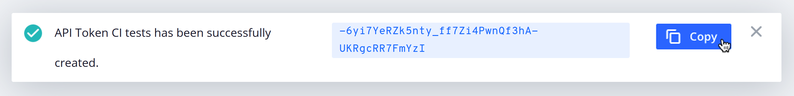

**Last updated 31st August 2023**


## Objective  

You need to set up an API token to authenticate the  CLI for any of the following tasks:
- Running automated tasks on a CI system

- Running automated tasks directly on app container, for example in a cron job


## Before you begin

You might need the [ CLI](../cli/_index.md) to perform certain tasks.
For example, you need the CLI to do the following:
- [Check the validity of an API token](#optional-check-the-validity-of-your-api-token). 

- [Load the CLI SSH certificate for non-CLI commands](#use-the-cli-ssh-certificate-for-non-cli-commands).


## 1. Create a machine user

To safely run automated tasks, first create machine users.
Each machine user has its own  account associated with a unique email address.
You can grant them restrictive [access permissions](../users.md) to handle specific automated tasks.
For security purposes, create a machine user for each type of task you want to automate.

To create a machine user, follow these steps:

> [!tabs]      


## 2. Create an API token

1\. Log in to the Console as your machine user.

2\. Open the user menu (your name or profile picture).

3\. Click **My profile**.

4\. Go to the **API tokens** tab and click **Create API token**.

5\. Enter a name for your API token and click **Create API token**.

6\. To copy the API token to your clipboard, click ** Copy**.

   
   Note that after you close the **API tokens** tab, you can't display the API token again.
7\. Store the API token somewhere secure on your computer.


### Optional: check the validity of your API token

To check that your API token is valid, run the following command:

```bash
webpaas auth:api-token-login
```

When prompted, enter your API token.
You get output similar to this:

```bash
The API token is valid.
You are logged in.
```

For security reasons, rotate your API tokens regularly.
When an API token is compromised, revoke it immediately.

## 3. Authenticate the CLI using your API token

After you create your API token, you can use it to do the following:

-  Allow a CI system to run automated tasks using the  CLI.

-  Run automated tasks on an app container using the  CLI, 

   for example in a cron job. 

Note that when running CLI commands in these cases,
some operations might take time to complete. 
To avoid waiting for an operation to complete before moving on to the next one, 
use the `--no-wait` flag.

### Authenticate in a CI system

You can allow your CI system to run automated tasks using the  CLI.
To do so, create an environment variable named `PLATFORMSH_CLI_TOKEN` with your API token as its value. 
For more information, see your CI system's official documentation.

To run SSH-based commands that aren't specific to the  CLI,
see how to [load the proper SSH certificate](#use-the-cli-ssh-certificate-for-non-cli-commands).

### Authenticate in an environment

You can run automated tasks on an app container using the  CLI.
To do so, set your API token as a [top-level environment variable](../../development/variables/_index.md#top-level-environment-variables).

> [!primary]  
> 
> Once you add the token as an environment variable,
> anyone with [SSH access](../../development/ssh/_index.md) can read its value.
> Make sure your [machine user has only the necessary permissions](#1-create-a-machine-user).
> 
> 

> [!tabs]      

Then add a build hook to your app configuration to install the CLI as part of the build process.

```yaml {configFile="app"}
hooks:
    build: |
        set -e
        echo "Installing  CLI"
        curl -fsSL https://raw.githubusercontent.com/platformsh/cli/main/installer.sh | bash

        echo "Testing  CLI"
        platform
```

You can now call the CLI from within the shell on the app container or in a cron job.

To run SSH-based commands that aren't specific to the  CLI,
see how to [load the proper SSH certificate](#use-the-cli-ssh-certificate-for-non-cli-commands).

You can set up a cron job on a specific type of environment.
For example, to run the `update` source operation on your production environment, 
use the following cron job: 

```yaml
crons:
    update:
       spec: '0 0 * * *'
        commands:
            start: |
                if [ "$PLATFORM_ENVIRONMENT_TYPE" = production ]; then
                   webpaas backup:create --yes --no-wait
                   webpaas source-operation:run update --no-wait --yes
                fi
```

## Use the CLI SSH certificate for non-CLI commands

When you set a `PLATFORMSH_CLI_TOKEN` environment variable,
the CLI authentication isn't complete until your run a CLI command 
or load the CLI SSH certificate.

For example, after setting a `PLATFORMSH_CLI_TOKEN` environment variable,
you might need to run `ssh`, `git`, `rsync`, or `scp` commands before you run any CLI commands.

In this case, to ensure all your commands work, load the CLI SSH certificate first.
To do so, run the following command:

```bash
webpaas ssh-cert:load --no-interaction
```


