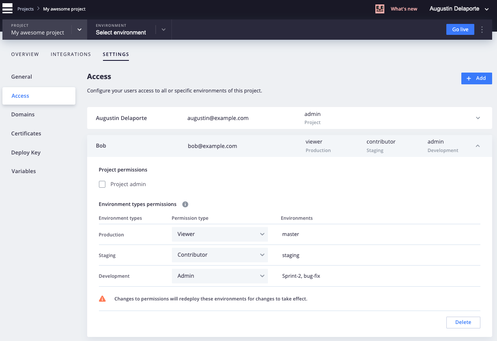

**Last updated 26th August 2021**


## Objective  

Every Web PaaS user has a role that controls their access and permission levels. Different roles allow different levels of access to your applications, environments and projects. You can manage how users interact with your project and environments at Web PaaS

Any user added to a project or an environment type on Web PaaS will need to [register for an account](https://www.ovh.com/auth/) before they can contribute. 

## Instructions

### User roles

Grant user permissions to the entire project:
* **Project Viewer** - A project viewer can view all environments of the project.
* **Project Administrator** - A project administrator can change settings, push code and execute actions on all environments of the project.

You can also define user access per environment type (Production, Staging, Development). Each permission level progressively increases access to the environments part of a given environment type:

* **Viewer** - Viewer can view all environments of this type.
* **Contributor** - Contributor can push code and branch all environments of this type.
* **Administrator** - Administrator can change settings and execute actions on all environments of this type.

> [!primary]  
> After you add or remove a user from a project or an environment type, you will need to trigger a redeploy to propagate the access changes to each environment.
> You can redeploy by using the CLI command `webpaas redeploy` or the `Redeploy` button in the management console. 
> 

If you want your contributors to be able to see everything, but only commit to environments of a certain type, set their permission as **Project Viewer** for the whole project and update their permission on that environment type to **Contributor**.

> [!primary]  
> The project owner - the person licensed to use Web PaaS - has the project administrator role. The project owner is the only user that can make changes to the project plan. 
> 

### SSH Access

By default, everyone with access equal or greater than **Contributor** can access the project through SSH. 

You can customize who can SSH, by setting the `access` key in your `.platform.app.yaml` file. [See SSH Access restrictions](../configuration-app/access).

### Manage user permissions with Console

From your list of projects, select the project where you want to view or edit user permissions. Click the Settings tab at the top of the page, then click the `Access` tab on the left to show the project-level users and their roles.



The `Access` tab shows project-level users and their roles.

Selecting a user will allow you either to edit that user's permissions or delete the user's access to the project entirely.

Add a new user by clicking on the `Add` button.

You can either grant the `Project admin` role to the user, which will give them `Admin` access to every environment in the project, or grant specific permissions on each environment type.

After inviting a new user, if the user does not have a Web PaaS account, they will receive an invitation email asking to confirm their details and register an account.

In order to push and pull code (or to SSH to one of the project's environments) the user will need to add an SSH key or use the WebPaas CLI.

If the user already has an account, they will receive an email with a link to access the project.

### Manage users permissions with the CLI

You can use the [Web PaaS CLI (Command Line Interface)](../development-cli). to fully manage your users and integrate with any automated system.

Available commands:

* `webpaas user:add`
  * Add a user to the project
* `webpaas user:delete`
  * Delete a user
* `webpaas user:list` (`users`)
  * List project users
* `webpaas user:role`
  * View or change a user's role

For example, the following command would add `alice@example.com` with **Project Admin** role in the current project.

```bash
webpaas user:add alice@example.com -r admin
```

After adding `alice@example.com`, Alice will receive an invitation email asking to confirm her details and optionally, register for a Web PaaS account.

To give Bob different levels of access depending on the environment type, in the current project:
 
-  **Viewer** role to the **Production environment**

-  **Contributor** role to **all Staging type environments**

-  **Admin** role to **all Development type environments**


You would run:

```bash
webpaas user:role bob@example.com -r production:viewer -r staging:contributor -r development:admin
```

Use `webpaas list` to get the full list of commands.

### User access and integrations

If you have setup an [external integration](../integrations-source) to GitHub, GitLab, or Bitbucket, this adds an additional layer of access control to the project that you will need to be aware of.

For example, if you invite a user with **Project Admin** role to a project on Web PaaS, but you haven't invited them to the remote repository on GitHub / GitLab, they might be [unable to clone the project](../administration-web#git) locally.

In this example, using either `webpaas get` with the CLI:

```bash
$ webpaas get <projectID>

```

or the `git clone` command visible from the "Git" dropdown in the management console

```bash
$ git clone git@github.com:user/github-repo.git Project Name
```

both would error with

```bash
Failed to connect to the Git repository: git@github.com:user/github-repo.git

Please make sure you have the correct access rights and the repository exists.
```

despite their **Project Admin** access to the project.

This enhaces consistency over your source code, as the Web PaaS project functions as a read-only mirror of your remote repository. Otherwise, changes pushed directly to the project would be overwritten or deleted when commits are pushed via the integration. Web PaaS considers your integrated remote repository to be the "source of truth" as soon as it has been configured, and this caveat ensures that all commits go through the integration.

The best course of action is to have your access updated on the integrated repository. If for some reason that is not a quick change, you can still clone through the project using the legacy pattern (which will set the *project* as its remote), but again, it is not recommended that you commit to the project once you have done so:

```bash
$ git clone <project>@git.<region>.platform.sh:<project>.git
```


