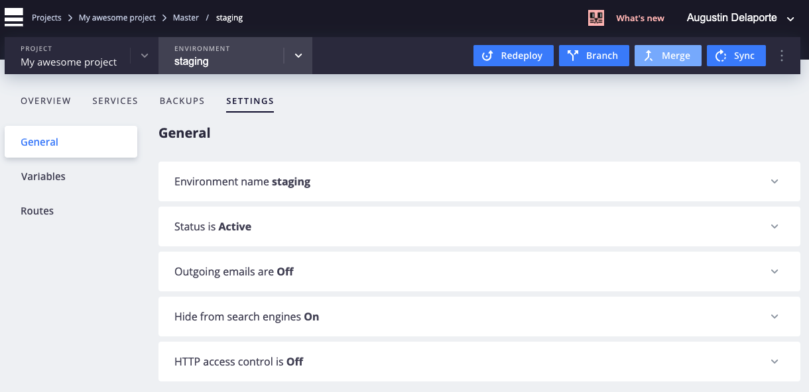
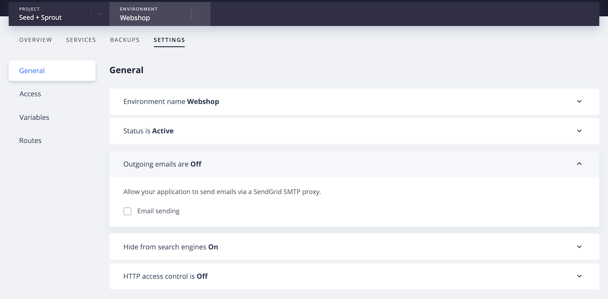
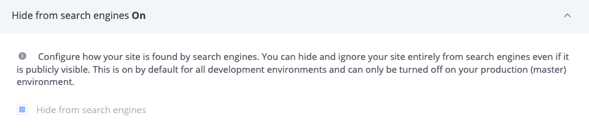
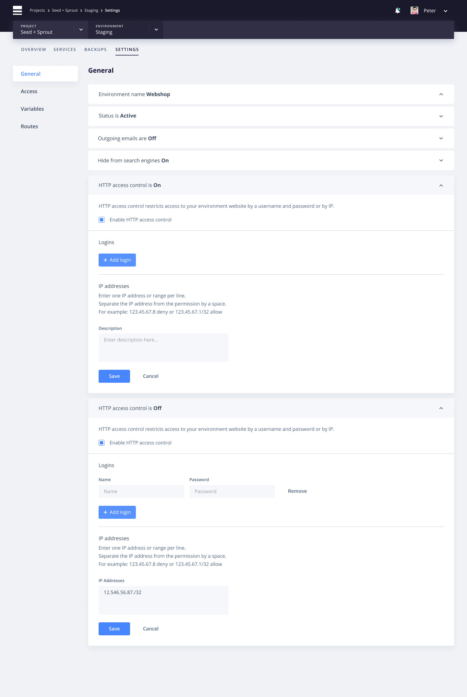
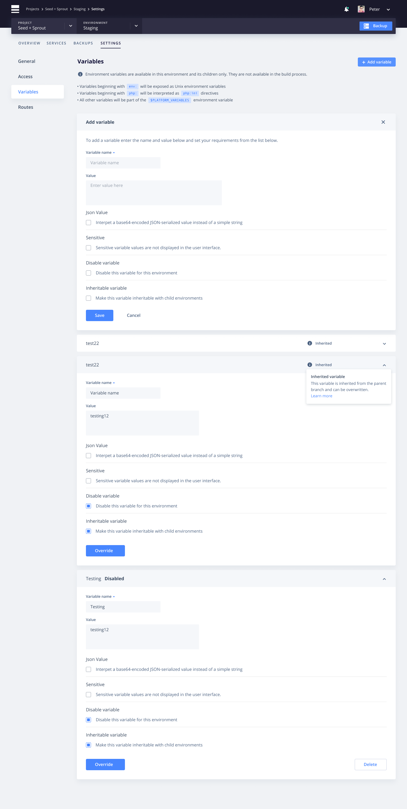
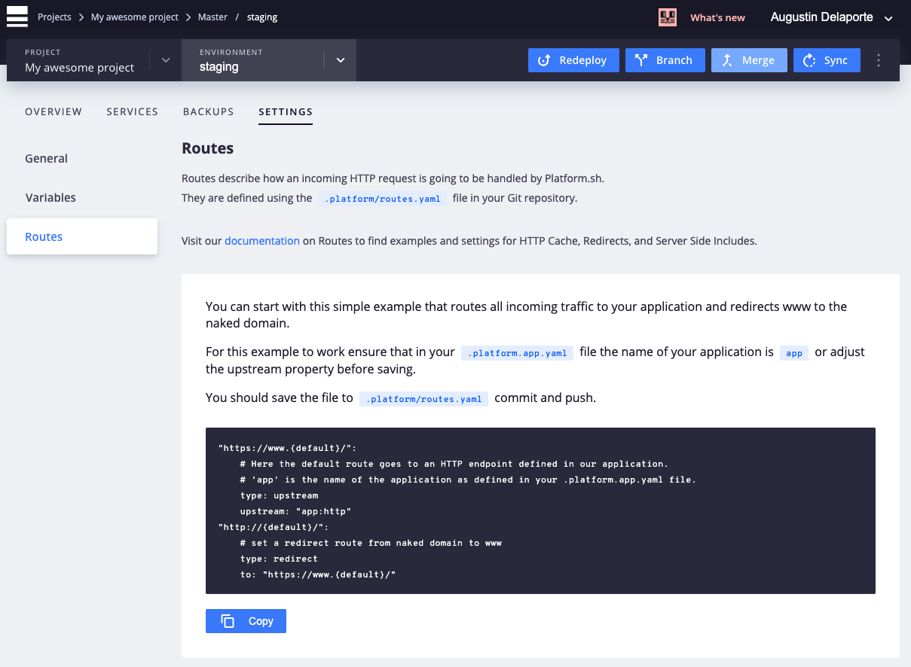

**Last updated 11th May 2021**


## Objective  

You can access an environment's settings by selecting that environment from the **Select Environments** pull-down menu at the top of the page or by clicking that environment within the Environments graphic on the right side. Click the `Settings` tab at the top of the screen.

## General

The `General` screen allows you to extend the behavior of a specific environment.



### Environment name

The first setting allows you to modify the name of the environment and view its parent environment.

### Status

From the `Status` tab, you can activate or deactivate an environment.


The `Deactivate & Delete Data` action will

* Deactivate the environment. Unless is is re-activated, it will no longer deploy and it will not be accessible from the web or via SSH.
* Destroy all services running on this environment.
* Delete all data specific to the environment. If the environment is reactivated, it will sync data from its parent environment.

Once the environment is deactivated, the Git branch will remain on Web PaaS in the inactive environment. To delete the branch as well, you need to execute the following:

```bash
git push origin :BRANCH-NAME
```

> [!primary]  
> The Master environment is protected. It cannot be deleted through the management console or the CLI, and should not be deleted through the API unless you are planning on configuring another branch to become the `default_branch` to replace it. See the [Renaming the default branch guide](../../guides-general/default-branch) for more information. 
> 

### Outgoing emails

From this tab, you can allow your application to send emails via a SendGrid SMTP proxy.



Changing this setting will temporarily list the environment's status as "Building", as the project re-builds with the new setting. Once it has re-deployed, it will appear once again as "Active" in your settings.


### Search engine visibility

From this tab, you can tell search engines to ignore the site entirely, even if it is publicly visible.




### X-Robots-Tag

By default, Web PaaS includes an additional `X-Robots-Tag` header on all non-production environments:

```bash
X-Robots-Tag: noindex, nofollow
```

That tells search engines to not index sites on non-production environments entirely nor traverse links from those sites, even if they are publicly visible.  That keeps non-production sites out of search engine indexes that would dilute the SEO of the production site, and it cannot be disabled on non-production environments.

On a production instance (the master branch, after a domain has been assigned) the search-blocker is disabled automatically and your application can serve a `robots.txt` file as normal.  However, you must ensure that the file is in your project's web root (the directory where the `/` location maps to) and your application is configured to serve it.  See [the location section in `.platform.app.yaml`](../../configuration-app/web#locations).


To enable the search-blocker `X-Robots-Tag` header on a production environment, use the [Web PaaS CLI](../../development-cli) command below:

```bash
webpaas environment:info restrict_robots true
```

### HTTP access control

You should not expose your development environments to the whole wide world. Web PaaS allows you to simply implement access control, either by login/password (the equivalent to .htaccess) or by filtering IP addresses or a network using the [CIDR format](https://en.wikipedia.org/wiki/Classless_Inter-Domain_Routing).  That is, `4.5.6.7` and `4.5.6.0/8` are both legal formats.

> [!primary]  
> Changing access control will trigger a new deploy of the current environment. However, the changes will not propagate to child environments until they are manually redeployed.
> 

These settings get inherited by branches below the one you are on. That means if you create a `staging` environment, and you create branches from this one, they will all inherit the same authentication information and you only have to set-it up once.

You can also setup authentication with the CLI using the following command `webpaas environment:http-access` which also allows you to read the current setup. This eases the integration of CI jobs with Web PaaS as you will not need to hardcode the values in the CI.

You can allow or deny access to specific IPs or IP ranges. First switch the access control section to ON. Then add one or more IPs or CIDR IP masks, followed by allow or deny. See the example below. Note that allow entries should come before deny entries in case both of them would match.



For example, the following configuration will only allow the 1.2.3.4 IP to access your website.

```bash
1.2.3.4/32 allow
0.0.0.0/0 deny
```


## Access

The `Access` screen allows you to manage the users' access on your project.

You can invite new users to a specific environment by clicking the `Add` button and entering their email address, or modify permissions of existing users by clicking the `Edit` link when hovering the user.


> [!primary]  
> Currently, permission changes that grant or revoke SSH access to an environment take effect only after the next time that environment is deployed.
> 

Selecting a user will allow you to either edit or remove access to that environment.

You can also manage access to users on multiple environments using the project configuration screen.


## Variables

The `Variables` screen allows you to define the variables that will be available on a specific environment.



## Routes

The `Routes` screen describes the configuration features that define the routes of your application. Routes cannot be edited here, but it provides a simple routes configuration example for your project's `.platform/routes.yaml` file.



Consult the documentation for more information about properly configuring [Routes](../../configuration-routes) for your project.
