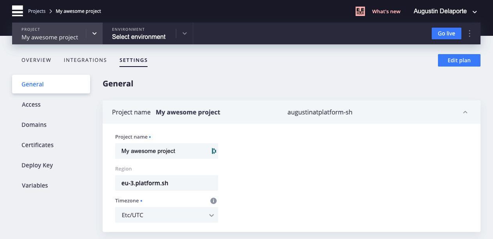
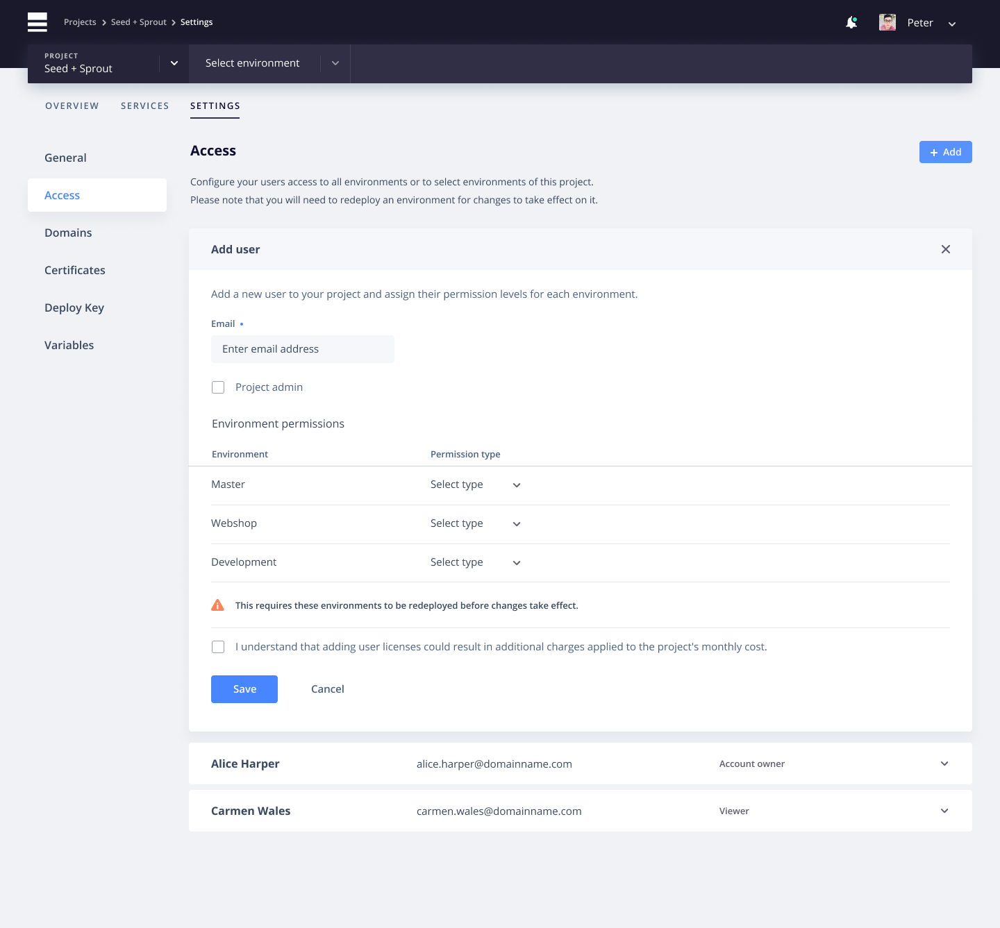
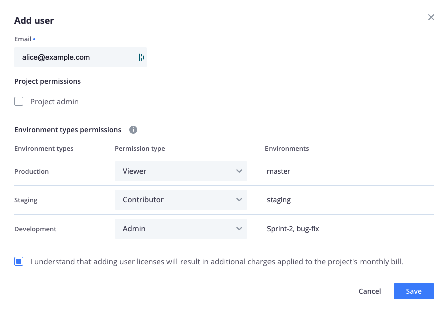
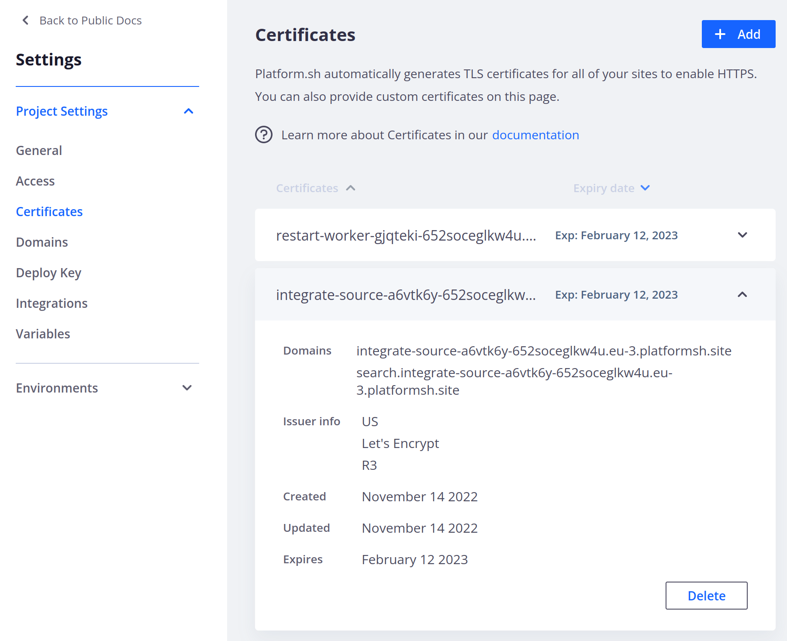
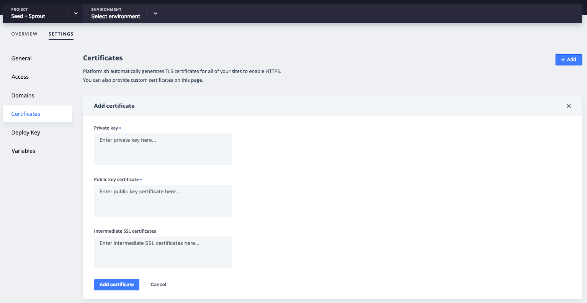
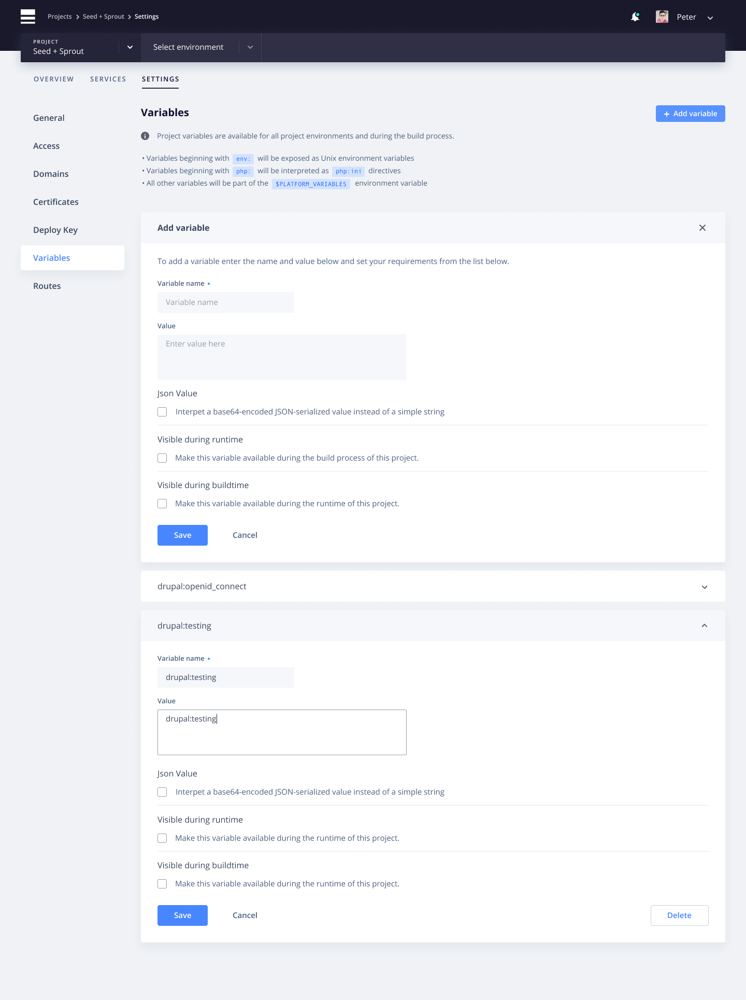

**Last updated 11th May 2021**

## Objective  

You can access the project-wide configuration settings by selecting the project from your list of projects, then click the `Settings` tab at the top of the screen.

## General

From the first page of the project settings, `General`, you can update the project name, or navigate to other project settings options on the left side of the screen.

## Access

The `Access` screen allows you to manage users' access on your project.

You can invite new users to your project by clicking the `Add` button and entering their email address, or modify permissions of existing users by clicking the `Edit` link when hovering over the user.

> [!primary]  
> Currently, permissions changes that grant or revoke SSH access to an environment take effect only after the next time that environment is deployed.
> 

Selecting a user will allow you to either edit that user's permissions or delete the user's access to the project entirely.

If you check the `Project admin` box, this user will be an administrator of the project and will have fulll access on all environments. If you uncheck the box, you'll have the option of adjusting the user's permissions on each environment.

> [!primary]  
> The `Account owner` is locked and you can't change its permissions.
> 

## Domains

> [!primary]  
>  Do not add a custom domain to your project until you are fully ready to change your DNS. Until that time, continue working with the Web PaaS generated URLs.
> 

The `Domains` screen allows you to manage your domains that your project will be accessible at.

More information on how to [setup your domain](../../domains-steps).

> [!primary]  
> Web PaaS expects an ASCII representation of the domain here. In case you want to use an internationalized domain name you can use the [conversion tool provided by Verisign](https://www.verisign.com/en_US/channel-resources/domain-registry-products/idn/idn-conversion-tool/index.xhtml) to convert your IDN domain to ASCII.
> 

## Certificates

The `Certificates` screen allows you to manage your project's TLS certificates that enable HTTPS.

You can view current certificates by hovering over one on the list and clicking the `View` link that appears, or you can add a new certificate by clicking the `Add` button a the top of the page.

All projects get TLS certificates provided by [Let's Encrypt](../../configuration-routes/https#lets-encrypt) automatically. In most cases no user action is required. You will only need to add certificates on this page if you are using TLS certificates provided by a third party.

A more in-depth guide regarding [how to set up custom certificates can be found here](../../domains-steps/tls).

## Deploy Key

The `Deploy Key` page provides the SSH key that Web PaaS will use when trying to access external private Git repository during the build process.

This is useful if you want to reuse some code components across multiple projects and manage those components as dependencies of your project.

## Variables

The `Variables` screen allows you to define the variables that will be available project-wide - that is, in each environment. It also allows you define variables that will be available during the build process.

