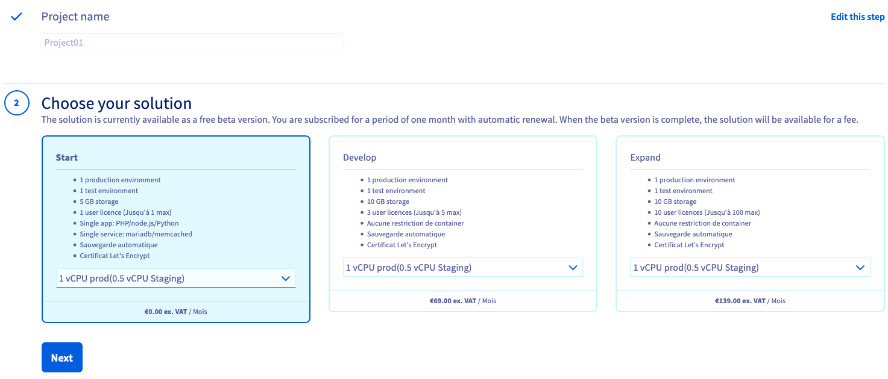
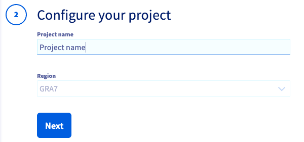
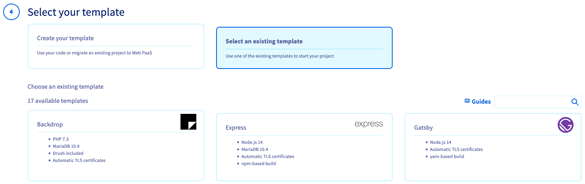
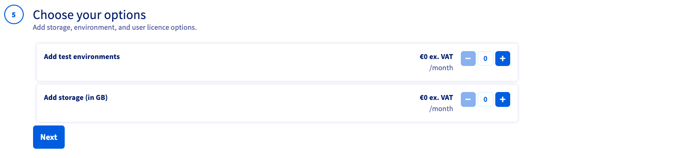
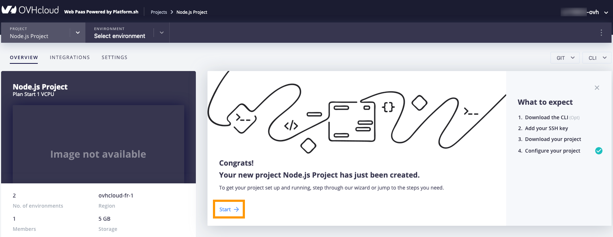
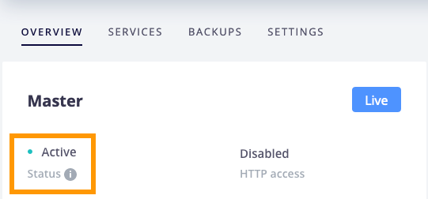

**Last updated 24th March 2021**

## Objective

OVHcloud Web PaaS powered by Platform.sh enables web developers to manage, develop and deploy applications by offering a centralised collaborative solution with numerous integrated features.

**This guide explains how to order and preconfigure your Web PaaS solution in the OVHcloud Control Panel.**

## Requirements

- access to the [OVHcloud Control Panel](https://www.ovh.com/auth/?action=gotomanager&from=https://www.ovh.co.uk/&ovhSubsidiary=GB)
- visiting the [product page](https://www.ovh.co.uk/web-paas/) to decide which plan is suitable for your project's requirements

> [!warning]
> **Beta restrictions**
>
> This service is currently in the beta phase. Some of the service options of the full Web PaaS solution mentioned below are not available:
>
> - Only one project can be created per OVHcloud customer account.
> - Only the **Start** plan is available (free of charge, not upgradeable).
> - Only one user (type admin) will be created.
> - Storage is limited to 5 GB.
> - Projects are located in a fixed region.

## Instructions

### Subscribing to the service

Log in to your [OVHcloud Control Panel](https://www.ovh.com/auth/?action=gotomanager&from=https://www.ovh.co.uk/&ovhSubsidiary=GB) and switch to `Web Cloud`{.action} in the top navigation bar.

Click on `Order`{.action} in the services bar on the left-hand side, then click on `Web PaaS`{.action}.

{.thumbnail}

#### Step 1: Choose a plan (restricted for beta)

Select a plan that best suits your needs after verifying the details on the [product page](https://www.ovh.co.uk/web-paas/). You can upgrade the project later in the Control Panel.

{.thumbnail}

#### Step 2: Enter project details (restricted for beta)

Give your project a name and choose a region near you in this step.

{.thumbnail}

#### Step 3: Select the project type

- If the project relies on your own code, you will be able to import it: click on `Create your template`{.action} in this step.

- If you click on `Select an existing template`{.action}, a list of available templates will be displayed.

{.thumbnail}

#### Step 4: Configure your project (restricted for beta)

In this step you can choose options for the project, according to the plan you have selected. Please refer to our [product page](https://www.ovh.co.uk/web-paas/) for details about the available
**Storage**, **Environments** and **User licenses** for each plan. 

{.thumbnail}

#### Step 5: Proceed to complete your order

> [!primary]
> During the beta phase, you only need to click on `Confirm`{.action} to accept the contract.
>

Finally, take note of the payment information and click on `Order`{.action} to confirm. This will start the payment process.

> [!primary]
> You can order the service from the [product page](https://www.ovh.co.uk/web-paas/) as well.
>
> Each project requires a separate service subscription. In order to add a project, simply repeat the steps above.

After the payment is completed, the project will be deployed and you will be able to log in to the Management Console from the OVHcloud Control Panel.

### Step 5: Verifying the project's deployment in the Management Console

On your project's `General information` page, click on `Access project`{.action} in the **Management interface** section. 

{.thumbnail}

You will be redirected to the `OVERVIEW` tab of the Web PaaS Management Console. Here you can follow the configuration wizard to guide you through the first steps with your project. The project is ready when the status is set to `Active` on the Master environment.

{.thumbnail}

### Managing the service in the Control Panel (restricted for beta)

Log in to your [OVHcloud Control Panel](https://www.ovh.com/auth/?action=gotomanager&from=https://www.ovh.co.uk/&ovhSubsidiary=GB) and switch to `Web Cloud`{.action} in the top navigation bar. Click on `Web PaaS`{.action} in the left-hand sidebar an select your project.

The `General information` page displays the basic configuration options of the project. Use the **Management interface** section for the following actions:

- Access project: opens the Management Console of your project.
- New project: begins the process of ordering a new project.
- Delete project: will delete the project after confirming the action in the popup window. 

To upgrade the project, click on `Upgrade`{.action} in the **General information** box.

## Go further

[Using SSH](../development-ssh/)

[Configuring the CLI](../development-cli/)

[Using YAML](../configuration-yaml/)

Join our community of users on <https://community.ovh.com/en/>.
